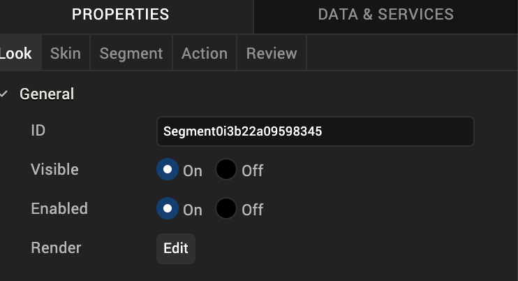
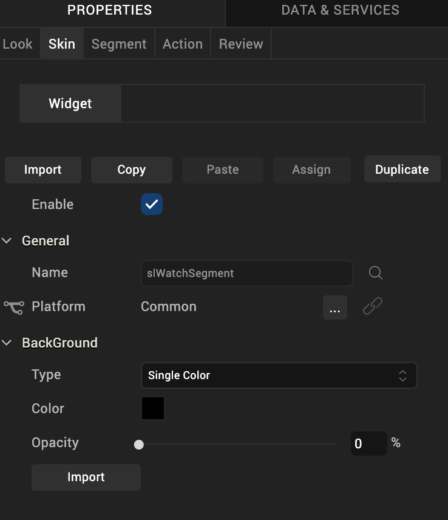
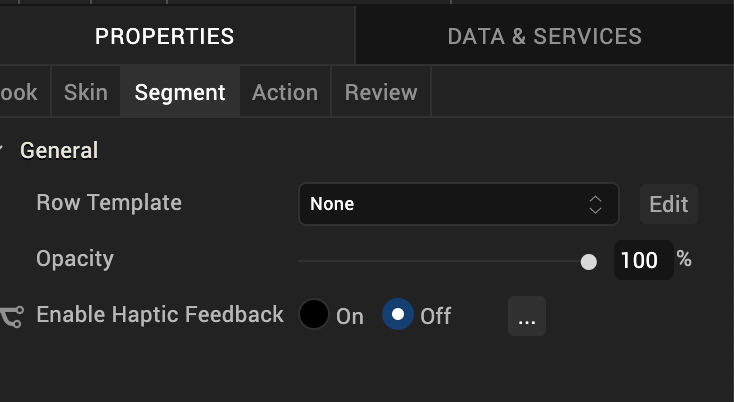

                           

Segment2 Widget for Watch
=========================

A Segment2 widget consists of multiple segments (rows or records) and each segment can have multiple child widgets.

Because the viewable area of the Watch interface is so small, to use the Segment2 widget for Watch, you first define a Segment template that serves as the pattern for how you want a row in the segment to be set up. Once you create the Segment template, you then add a Segment2 widget to a Watch form, and then select the template you created to use with the widget.

[Create a Segment2 Template](#create-a-segment2-template)

[Add a Segment2 Widget to a Watch Form](#add-a-segment2-widget-to-a-watch-form)

Click any of the following to learn about the properties found on the tabs of the Segment2 widget.

[Look Tab](#look-tab)

[Skin Tab](#skin-tab)

[Segment Tab](#segment-tab)

[Action Tab](#action-tab)

[Review Tab](#review-tab)

Create a Segment2 Template
--------------------------

To create a Segment template that contains multiple rows, you add a Group widget and configure it to be vertically oriented, and then you add a Group widget inside of it that is horizontally oriented. To this horizontal Group widget, you add the widgets that you want a row to have, such as an Image widget and a Label widget. You then duplicate that horizontal Group widget as many times as you need to create all the rows that you want, and make changes to the widgets in each row to give them their own unique characteristics. Once you have finished constructing your Segment template and saved it, you create a Watch form, add a Segment2 widget to it, and then select the template you just created as that widget's template.

To create a Segment2 template, do the following:

1.  On the Project Explorer, click the **Templates** tab.
2.  Expand the Watch channel.
3.  Click the Segments context menu arrow, and then click **New Template**. Volt MX Iris creates a new segment template, and nests a Group widget inside of it.
4.  To make the segment template easier to identify later, you may want to change its name. To do so, select the template on the **Templates** tab of the Project Explorer. Next, on the Properties Editor, click the **Look** tab, select the contents of the **ID** text box, and then type the name you want.
5.  Select the Group widget nested within the segment template. Next, on the Properties Editor, click the **Group** tab, and then from the Orientation drop-down list, click **Vertical**.
6.  Within the Group widget, add another Group widget. To do so, from the **Widget** tab of the Library Explorer, drag a Group widget into the existing Group widget on the Iris Canvas. You will see on the Project Explorer, on the **Project** tab, that the new Group widget is nested within the first Group widget. By default, this Group widget has a horizontal orientation, which is what you want.
7.  Add to the nested Group widget the other widgets that you want each segment row to have.
8.  Duplicate the completed segment row. To do so, select the nested Group widget, click its context menu arrow, and then click **Duplicate**. Repeat as many times as necessary to create the rows you want.
9.  Make whatever modifications to each nested Group widget (row) that you want to have characterize the template.
10.  Save your changes by pressing **Ctrl+S**.

Add a Segment2 Widget to a Watch Form
-------------------------------------

Now that you have created a Segment template, you can now add a Segment2 widget to your Watch form, and populate it with the template.

Add a Segment2 widget to a watch form, do the following:

1.  On the Project Explorer, expand the Watch channel, and then navigate to and select the form that you want to add a Segment2 widget to. That form becomes the form of focus on the Iris Canvas.
2.  Add a Segment2 widget to the form. To do so, from the **Widget** tab of the Library Explorer, under the Advanced Widgets section, drag a Segment2 widget onto the form. The Segment2 widget becomes the widget of focus on the Iris Canvas.
3.  Assign the template you created to the Segment2 widget. To do so, on the **Segment** tab of the Properties Editor, click the **Row Template** drop-down list, and then select the template of choice.

Look Tab
--------

On the **Look** tab, you define properties and behaviors related to a Segment2 widget's appearance and position. The following sections describe each of the properties.

### ID

Denotes the name of a widget. When a widget is added to a form, a unique name is assigned to the widget. You can rename a widget by entering a new name in the **ID** box.

> **_Note:_** You can also rename a widget from the Project Explorer by right-clicking a widget, and then clicking **Rename**.

### Visible

Controls whether or not the user of the app can see the widget.

*   To make a widget visible, click **On** .
*   To make a widget invisible, click **Off**.

### Enabled

Controls whether the widget is functional or not. You can programmatically make the widget functional or nonfunctional through an action sequence, triggered by the user.

*   To enable the widget, click **On**.
*   To disable the widget, click **Off**.

### Render

Defines whether a widget appears on a specific platform. Currently, the Watch channel supports only the Apple Watch Native and HTML5 SPA platforms. Clicking the Render property's **Edit** button opens the **Render Platforms** dialog box.

Clear the check box of the platforms for which the widget should not be rendered.

**The Difference between Visible and Render**

*   When a Widget is _not_ rendered for a platform, it implies that the widget is hidden from that specific platform.
*   Whereas, when a widget is set as invisible, it implies that the widget is available, but is invisible. This feature is useful when you wanted to display a widget based on certain conditions.

### Widget Align

The Widget Align property specifies how the edges of the Segment2 widget are aligned with respect to its parent's edges. The following alignment options are available:

<table style="margin-left: 0;margin-right: auto;"><colgroup><col style="width: 69pt;"> <col style="width: 352pt;"></colgroup><tbody><tr><td></td><td>Aligns the left edge of the widget with the left edge of its parent.</td></tr><tr><td></td><td>Aligns the horizontal center of the widget with the horizontal center of its parent.</td></tr><tr><td></td><td>Aligns the right edge of the widget with the right edge of its parent.</td></tr><tr><td></td><td>Aligns the top edge of the widget with the top edge of its parent.</td></tr><tr><td></td><td>Aligns the vertical center of the widget with the vertical center of its parent.</td></tr><tr><td></td><td>Aligns the bottom edge of the widget with the bottom edge of its parent.</td></tr></tbody></table>

Skin Tab
--------

A widget’s appearance is defined by the skin that is applied to it. Every widget has a skin, even if it’s just the Volt MX Iris default skin. Skins give you the ability to establish visual continuity in your app. On the **Skin** tab, you can select to use a specific skin for your widget. In addition, you can configure the widget's background and font.

In the Mobile, Tablet, and Desktop channels, a widget may have a number of states, such as Normal (when it's not being interacted with), Focus (e.g. when it's been tabbed to), or Pressed. However, the Watch channel has only one slider state: Normal.

### Enable

Depending on the current task at hand on the Watch screen, it may make sense for the Slider widget to be disabled, even as it's visible. A particular action taken by the user can then trigger the Slider widget to become enabled. Depending on the needs of your Watch app, you can set the Slider app to be initially enabled or not. By default, the **Enabled** checkbox is checked.

### General

Under the General section of the **Skin** tab, you can change the name of the skin currently applied (if it's not one of the default skins), or you can select from the other available slider skins by clicking the magnifying glass icon next to the **Name** text box.

#### Platform

In channels that support multiple platforms, it's possible to fork a skin by clicking the Platform ellipsis button , and then selecting the platforms that you want to fork the widget to. In the case of the Watch channel, currently the only platform available is Watch (Native). For more information, see [Forking](Forking.md).

### Background

Under the Background section of the **Skin** tab, you can set the type of background you want to use, and set the color and its opacity.

#### Type

For the Watch channel, the Slider widget is capable of a Single Color background.

#### Color

With Single Color as the background type, you can configure the hue you want by clicking the square color icon and dragging the cursor to the color of your choosing.

#### Opacity

Similarly, with Single Color as the background type, you can configure the opacity of the background color. By default, the opacity is set to 100, making the background completely opaque with no transparency. However, if you want the background to have a degree of transparency, you can decrease its opacity. To do so, type a value between 0 and 100 in the Opacity text box, or drag the opacity slider to the degree of opacity that you want.

For more information about applying skins, see [Understanding Skins and Themes](Customizing_the_Look_and_Feel_with_Skins.md).

Segment Tab
-----------

On this tab, you configure properties unique to the Segment2 widget.

### Row Template

Indicates the common template to be used for each row while creating the row and filling the data. This can be overridden at the row level when setting the data using the template key.

> **_Note:_** Only those templates that are created from **Project Explorer >Templates > Segments** are visible on the **Row Template** drop-down list.

### Opacity

Sets the degree to which the background of the Segment2 widget is transparent or opaque. By default, the opacity is set to 100, making the background completely opaque with no transparency. However, if you want the background to have a degree of transparency, you can decrease its opacity. To do so, type a value between 0 and 100 in the Opacity text box, or drag the opacity slider to the degree of opacity that you want.

Action Tab
----------

On this tab, you define the events that are executed when an action is run. On a Segment2 widget for Watch, you can run the following action:

*   **onRowClick.** This action is invoked when the user taps any row of the Segment2 widget.

For more information on using this action, see [Add Actions](working_with_Action_Editor.md).

Review Tab
----------

On this tab, you can add and review notes. With the Review Notes feature, you can capture feedback from users who are evaluating your app design. Such requirements capturing helps ensure that the design of your app successfully meets the requirements of potential users. The Review Notes feature supports rich text formatting such as font type and size, paragraph alignment, numbered and bulleted lists, block quotes, and even tables.

For more information, see [Capture Product Requirements with Review Notes](CapProdReqsWithNotes.md).

<table style="margin-left: 0;margin-right: auto;mc-table-style: url('Resources/TableStyles/RevisionTable.css');" class="TableStyle-RevisionTable" cellspacing="0" data-mc-conditions="Default.HTML5 Only"><colgroup><col class="TableStyle-RevisionTable-Column-Column1"> <col class="TableStyle-RevisionTable-Column-Column1" style="width: 63px;"> <col class="TableStyle-RevisionTable-Column-Column1"></colgroup><tbody><tr class="TableStyle-RevisionTable-Body-Body1"><td class="TableStyle-RevisionTable-BodyE-Column1-Body1">Rev</td><td class="TableStyle-RevisionTable-BodyE-Column1-Body1">Author</td><td class="TableStyle-RevisionTable-BodyD-Column1-Body1">Edits</td></tr><tr class="TableStyle-RevisionTable-Body-Body1"><td class="TableStyle-RevisionTable-BodyB-Column1-Body1">7.0</td><td class="TableStyle-RevisionTable-BodyB-Column1-Body1">RC, NMK</td><td class="TableStyle-RevisionTable-BodyA-Column1-Body1">NMK</td></tr></tbody></table>
