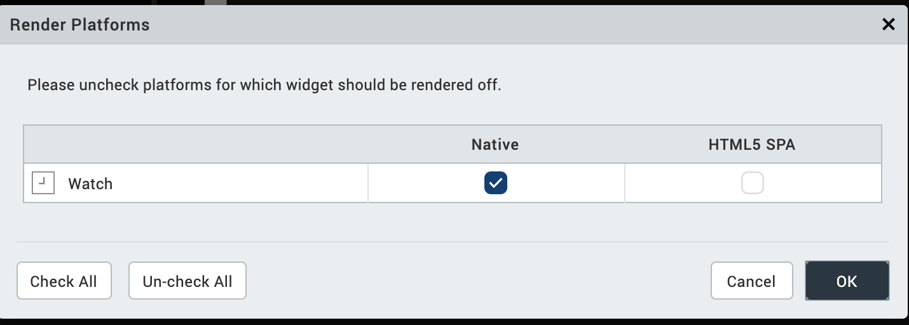
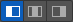

                           

Switch Widget for Watch
=======================

The Switch widget is identical to the Switch Control in iPhone (an on-off switch that is non customizable) and presents two mutually exclusive choices or states.

The Switch widget displays the value that is currently in effect. You must slide the control to select (or reveal) the other value.

Click any of the following to learn about the properties found on the tabs of the Switch widget for Watch.

[Look Tab](#look-tab)

[Skin Tab](#skin-tab)

[Switch Tab](#switch-tab)

[Action Tab](#action-tab)

[Review Tab](#review-tab)

Look Tab
--------

On the **Look** tab, you define properties and behaviors related to a Switch widget's appearance and position. The following sections describe each of the properties.

### ID

Denotes the name of a widget. When a widget is added to a form, a unique name is assigned to the widget. You can rename a widget by entering a new name in the **ID** box.

> **_Note:_** You can also rename a widget from the Project Explorer by right-clicking a widget, and then clicking **Rename**.

### Visible

Controls whether or not the user of the app can see the widget.

*   To make a widget visible, click **On** .
*   To make a widget invisible, click **Off**.

### Enabled

Controls whether the widget is functional or not. You can programmatically make the widget functional or nonfunctional through an action sequence, triggered by the user.

*   To enable the widget, click **On**.
*   To disable the widget, click **Off**.

### Render

Defines whether a widget appears on a specific platform. Currently, the Watch channel supports only the Apple Watch Native and HTML5 SPA platforms. Clicking the Render property's **Edit** button opens the **Render Platforms** dialog box.

Clear the check box of the platforms for which the widget should not be rendered.

**The Difference between Visible and Render**

*   When a Widget is _not_ rendered for a platform, it implies that the widget is hidden from that specific platform.
*   Whereas, when a widget is set as invisible, it implies that the widget is available, but is invisible. This feature is useful when you wanted to display a widget based on certain conditions.

### Widget Align

The Widget Align property specifies how the edge of the widget is aligned with respect to its parent's edge. The following alignment options are available:

<table style="margin-left: 0;margin-right: auto;"><colgroup><col style="width: 69pt;"> <col style="width: 352pt;"></colgroup><tbody><tr><td></td><td>Aligns the left edge of the widget with the left edge of its parent.</td></tr><tr><td></td><td>Aligns the horizontal center of the widget with the horizontal center of its parent.</td></tr><tr><td></td><td>Aligns the right edge of the widget with the right edge of its parent.</td></tr><tr><td></td><td>Aligns the top edge of the widget with the top edge of its parent.</td></tr><tr><td></td><td>Aligns the vertical center of the widget with the vertical center of its parent.</td></tr><tr><td></td><td>Aligns the bottom edge of the widget with the bottom edge of its parent.</td></tr></tbody></table>

### **Text**

Specifies the text that the user sees when running the app.

### Width

The Width property sets the x-axis dimension of the widget using the numeric quantity and type of unit that you specify.

You can use the following units of measure to set the width of the widget.

**%.**  Specifies the width as a percentage of the parent's dimensions.

**Dp.**  Specifies the width in terms of device independent pixels.

**Preferred Size.**  Specifies an optimal width for the widget given the size of the font and the amount of text that the widget displays. The Preferred Size can vary from one platform to another.

### Height

The Width property sets the y-axis dimension of the widget using the numeric quantity and type of unit that you specify.

You can use the following units of measure to set the height of the widget.

**%.**  Specifies the height as a percentage of the parent's dimensions.

**Dp.**  Specifies the height in terms of device independent pixels.

**Preferred Size.**  Specifies an optimal height for the widget given the size of the font and the amount of text that the widget displays. The Preferred Size can vary from one platform to another.

Skin Tab
--------

A widget’s appearance is defined by the skin that is applied to it. Every widget has a skin, even if it’s just the Volt MX Iris default skin. Skins give you the ability to establish visual continuity in your app. On the **Skin** tab, you can select to use a specific skin for your widget. In addition, you can configure the widget's background and font.

In the Mobile, Tablet, and Desktop channels, a widget may have a number of states, such as Normal (when it's not being interacted with), Focus (e.g. when it's been tabbed to), or Pressed. However, the Watch channel has only one state: Normal.

### General

Under the General section of the **Skin** tab, you can change the name of the skin currently applied (if it's not one of the default skins), or you can select from the other available switch skins by clicking the magnifying glass icon next to the **Name** text box.

#### Platform

In channels that support multiple platforms, it's possible to fork a skin by clicking the Platform ellipsis button , and then selecting the platforms that you want to fork the widget to. In the case of the Watch channel, currently the only platform available is Watch (Native). For more information, see [Forking](Forking.md).

### Background

Under the Background section of the **Skin** tab, you can set the type of background you want to use, and set the color and its opacity.

#### Type

For the Watch channel, the Switch widget is capable of two types of backgrounds:

<table style="width: 100%;mc-table-style: url('Resources/TableStyles/2015DefinitiveBasicTable.css');" class="TableStyle-2015DefinitiveBasicTable" cellspacing="0"><colgroup><col style="width: 136px;" class="TableStyle-2015DefinitiveBasicTable-Column-Column1"> <col class="TableStyle-2015DefinitiveBasicTable-Column-Column1"></colgroup><tbody><tr class="TableStyle-2015DefinitiveBasicTable-Body-Body1"><td class="TableStyle-2015DefinitiveBasicTable-BodyE-Column1-Body1"><b>Background Type</b></td><td class="TableStyle-2015DefinitiveBasicTable-BodyD-Column1-Body1"><b>Description</b></td></tr><tr class="TableStyle-2015DefinitiveBasicTable-Body-Body1"><td class="TableStyle-2015DefinitiveBasicTable-BodyE-Column1-Body1">Single Color</td><td class="TableStyle-2015DefinitiveBasicTable-BodyD-Column1-Body1">Applies a uniform, single color as the background of the skin that you choose.</td></tr><tr class="TableStyle-2015DefinitiveBasicTable-Body-Body1"><td class="TableStyle-2015DefinitiveBasicTable-BodyB-Column1-Body1">Image</td><td class="TableStyle-2015DefinitiveBasicTable-BodyA-Column1-Body1">Applies an image of your choosing as the background of the skin. The image stretches to fill the dimensions of whatever widget the skin is applied to.</td></tr></tbody></table>

#### Color

If you select Single Color as the background type, you can configure the hue you want by clicking the square color icon and dragging the cursor to the color of your choosing.

#### Opacity

Similarly, with Single Color as the background type, you can configure the opacity of the background color. By default, the opacity is set to 100, making the background completely opaque with no transparency. However, if you want the background to have a degree of transparency, you can decrease its opacity. To do so, type a value between 0 and 100 in the Opacity text box, or drag the opacity slider to the degree of opacity that you want.

### Fonts

Under the Fonts section of the **Skin** tab, you can set the following properties.

<table style="mc-table-style: url('Resources/TableStyles/2015DefinitiveBasicTable.css');margin-left: 0;margin-right: auto;" class="TableStyle-2015DefinitiveBasicTable" cellspacing="0"><colgroup><col class="TableStyle-2015DefinitiveBasicTable-Column-Column1" style="width: 85px;"> <col class="TableStyle-2015DefinitiveBasicTable-Column-Column1" style="width: 540px;"></colgroup><tbody><tr class="TableStyle-2015DefinitiveBasicTable-Body-Body1"><td class="TableStyle-2015DefinitiveBasicTable-BodyE-Column1-Body1"><b>Property</b></td><td class="TableStyle-2015DefinitiveBasicTable-BodyD-Column1-Body1"><b>Description</b></td></tr><tr class="TableStyle-2015DefinitiveBasicTable-Body-Body1"><td class="TableStyle-2015DefinitiveBasicTable-BodyE-Column1-Body1">Color</td><td class="TableStyle-2015DefinitiveBasicTable-BodyD-Column1-Body1">Sets the color that you want the font to be. You configure the hue you want by clicking the square color icon and dragging the cursor to the color of your choosing</td></tr><tr class="TableStyle-2015DefinitiveBasicTable-Body-Body1"><td class="TableStyle-2015DefinitiveBasicTable-BodyE-Column1-Body1">Opacity</td><td class="TableStyle-2015DefinitiveBasicTable-BodyD-Column1-Body1">Sets the degree to which the background color is transparent or opaque. By default, the opacity is set to 100, making the background completely opaque with no transparency. However, if you want the background to have a degree of transparency, you can decrease its opacity. To do so, type a value between 0 and 100 in the <b>Opacity</b> text box, or drag the opacity slider to the degree of opacity that you want.</td></tr><tr class="TableStyle-2015DefinitiveBasicTable-Body-Body1"><td class="TableStyle-2015DefinitiveBasicTable-BodyE-Column1-Body1">Size</td><td class="TableStyle-2015DefinitiveBasicTable-BodyD-Column1-Body1">You can set the font size by pixels (0 to 600) or as a percentage (0 to 600) of the baseline font size of 28 pixels.</td></tr><tr class="TableStyle-2015DefinitiveBasicTable-Body-Body1"><td class="TableStyle-2015DefinitiveBasicTable-BodyE-Column1-Body1">Font Family</td><td class="TableStyle-2015DefinitiveBasicTable-BodyD-Column1-Body1">Currently, the System font is the only font family supported by VoltMX Iris for the Label widget.</td></tr><tr class="TableStyle-2015DefinitiveBasicTable-Body-Body1"><td class="TableStyle-2015DefinitiveBasicTable-BodyB-Column1-Body1">Weight</td><td class="TableStyle-2015DefinitiveBasicTable-BodyA-Column1-Body1">You can set the weight of the font either to Normal, which is the default, or Bold.</td></tr></tbody></table>

For more information, see [Understanding Skins and Themes](Customizing_the_Look_and_Feel_with_Skins.md).

Switch Tab
----------

On this tab, you can assign properties that are run on any platform (which is supported by Volt MX Iris) and also, assign properties specific to a platform.

### State

Allows you to swap the colors.

### Text

Specifies the text that the user sees to identify the switch.

### Opacity

The Opacity property sets the degree to which the switch is transparent or opaque. By default, the opacity is set to 100, making the switch completely opaque with no transparency. However, if you want it to have a degree of transparency, you can decrease its opacity. To do so, type a value between 0 and 100 in the **Opacity** text box, or drag the opacity slider to the degree of opacity that you want.

Action Tab
----------

On this tab, you define the events that are executed when an action is run. On a Switch widget, you can run the following action:

*   **onStateChange.** This action is invoked when the state of the Switch widget changes from enabled to disabled, or vice versa.

For more information on using the above action, see the topic, [Add Actions](working_with_Action_Editor.md).

Review Tab
----------

On this tab, you can add and review notes. With the Review Notes feature, you can capture feedback from users who are evaluating your app design. Such requirements capturing helps ensure that the design of your app successfully meets the requirements of potential users. The Review Notes feature supports rich text formatting such as font type and size, paragraph alignment, numbered and bulleted lists, block quotes, and even tables.

For more information, see [Capture Product Requirements with Review Notes](CapProdReqsWithNotes.md).
