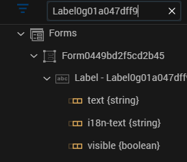
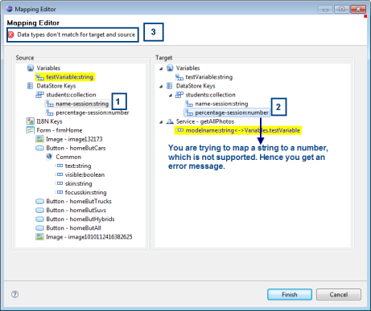
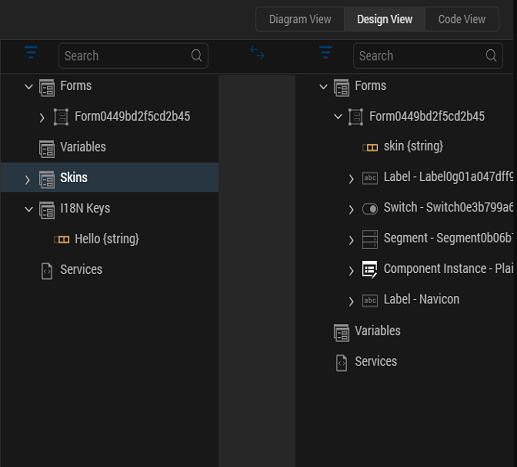

                         

Working with Mapping Editor
---------------------------

The objective of Mapping Editor is to map data across widgets and service parameters. This mapping of data reduces the effort of writing code.

Mapping Editor is made up of two major parts:

*   _Source_
    
    The source appears on the left hand side of the mapping editor window as shown in the above window. The Source consists of the following:
    
    *   Global Variables
    *   Data Store Keys
    *   i18n Keys
        
        > **_Note:_** i18n Keys appear only in the source because you cannot assign any value to them once they are defined.
        
    
    *   Skins
    *   Form from which the mapping editor was invoked
    *   All the widgets on this form.
*   _Target_
    
    The target appears on the right hand side of the mapping editor window as shown in the above window. Target consists of the following components:
    
    *   Global Variables
    *   Data Store Keys
    *   Service you are invoking
    *   Form to which you are navigating
    *   All the widgets on this form.

### Filter By and Search Functionality

The elements under Source and Target in the Mapping Editor can be sorted by two ways:

*   **Filter By**
    *   **All**
        
        displays all the elements
        
    *   **i18n**
        
        displays only the i18n keys
        
    *   **skin**
        
        displays only the skins
        
    *   **By Widget Id**
        
        displays widgets sorted by their ID
        
    *   **By Widget Category**
        
        displays widgets sorted by their categories
        
    *   **variables**
        
        displays only variables - local and global variables
        
        
        
*   **Search**
    
    displays the elements that match the search string
    
    
    

### Adding a form or a template to the tree

You can use the **Add a form/ template to the tree** button to add additional entities to the Source or Target in the Mapping Editor. You can add the following categories to the Source or Target in the Mapping Editor:

*   forms
*   popups
*   headers
*   footers

To add a category to the source or target of the Mapping Editor:

1.  Click the **Add form/template to tree** button. The **Add form/popup/header/footer** dialog appears.
2.  Select a desired category from the **Category** drop-down list.
3.  Once a category is selected, the **Select resource** field is populated.
    *   If you select the category as form, the **Select resource** field lists all the forms defined within the application. If a single form exists in the application, the **Select resource** field lists **None** as the available option.
    *   If you select the category as popup, the **Select resource** field lists all the popups defined within the application. If a single popup exists in the application, the **Select resource** field lists **None** as the available option.
    *   If you select the category as header, the **Select resource** field lists all the headers defined within the application. If a single header exists in the application, the **Select resource** field lists **Skin\_Defaults** as the available option. The **Skin\_Defaults** option is the default skin of the header.
    *   If you select the category as footer, the **Select resource** field lists all the footers defined within the application. If a single footer exists in the application, the **Select resource** field lists **Skin\_defaults** as the available option. The **Skin\_Defaults** is the default skin of the footer.
4.  Click **OK**.
5.  The additional categories added are reflected in the Mapping Editor.

### Launching the Mapping Editor

The Mapping Editor is invoked in case of the following action items in the Action Editor:

**Invoking a service (Synchronous or Asynchronous).** The form from which the service is invoked becomes the source, and the invoked service is the target. For more information, see [Network APIs Actions](ActionsNetworkAPIs.md).

**Navigating to another form.** The form or service from which you are navigating is the source, and the form to which you are navigating is the target.

**Mapping within the same form.** The source and target is the same form in this case. For more information, see [Map Widget Properties to One Another](ActionsMapping.md).

### Important Considerations while Mapping

While mapping data from source to target, you must be aware of the following:

*   Data type of the source and target should be the same.
*   When you map a collection to another collection, you must first map at the _parent-level_ (map one collection to the other collection) and then map the elements.
*   _Source_ and the _Target_ cannot be same.
*   Tabs are listed under form elements. Hence, you cannot map any data to a tab widget using the Mapping editor.
*   For service mappings, do not use structures that have more than simple key value pairs and attributes. Break out complex structures and use code to get the lost values.
    
*   VoltMXService mappings can not support dynamic associations or hierarchical structures. Use code to work around this limitation
    

> **_Note:_** The Mapping Editor supports one-to-many mapping, that is, you can map the same element in the source to multiple elements in the target.

To perform mapping in the Mapping Editor, do the following:

1.  Expand all components in the _Source_.
2.  Select a source item.
3.  Expand all components in the _Target_.
4.  Select a target item.
    
    > **_Note:_** The data type should be the same for source and target.
    
    The items that are mapped are highlighted in yellow as shown below:
    
    
    
    If you try to bind two items that do not meet the mapping criteria, for example a _string_ to a _number_, you get an error message as shown below:
    
    
    
5.  If you want to unbind the items that you have mapped earlier, right-click the mapped item in the target and select **unbind**. The binding between the two items is broken.
    
    > **_Note:_** When you unbind a collection, all the elements within the collection are unbound automatically.
    
6.  Click **Finish** when the mapping of items is complete.

#### Mapping Data with the Help of Expression

You can also map data to widgets or service parameters by creating an expression. When you write an expression to map the data, you can perform the required operations on the data before mapping it to the selected element.

To map data with the help of an expression, do the following:

1.  Go to **[Mapping Editor](#top)**.
2.  Select the element in the _Target_ to which you want to map data.
3.  Right-click this element and select **Add Expression**.
    
    > **_Note:_** You can add an expression only to the elements that have a data type associated with it. These elements can be service parameters or attributes of a widget. You cannot add an expression at the widget name or service name level.
    
    
    
    The [Expression Editor](Working_with_Expression_Editor.md) appears.
    
4.  Define the required expression and click **OK**. The data derived out of the expression is mapped to the selected element.

#### Mapping a Collection to a Widget or a Service Parameter

When you want to map elements within a collection to a widget or a service parameter, the first element in the collection gets mapped to the widget by default as shown below.

> **_Note:_** You have to explicitly edit the expression to modify the index of the collection that needs to be mapped.

To edit the collection index value, do the following:

1.  Go to [Mapping Editor](#).
2.  Select an element within the collection as the source by clicking it.
3.  Click a widget (or service parameter) that has the same data type as the collection element. The first element within the collection gets mapped to the widget you have selected as shown in the above window.
4.  Right-click the mapped widget (or service parameter) and select **Edit Expression** as shown in the above window. The **Expression Editor** appears as shown below:
    
    
    
5.  Delete the default index value in the expression and provide the required index value. For example, _students\[3\]\["name"\]_ indicates that you have mapped the value at the third index of _name_ within the _students_ collection.
6.  Click **OK**.
