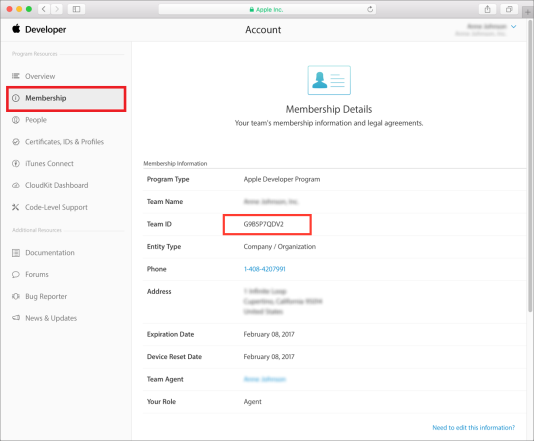
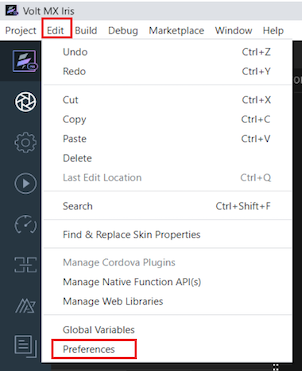
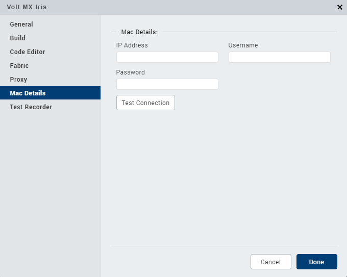

                         

Generate IPA for a Native iOS Application
=========================================

In addition to creating iPhone and iPad applications directly from source code, you can use Volt MX Iris to build an iPhone or iPad application and deploy it to a Mac automatically. You need a dedicated Mac to enable creation of iPhone and iPad application binaries.

> **_Important:_** Currently, Volt MX Iris supports XCode 12.5 and XCode 13.

Prerequisites
-------------

Before you begin, ensure that the following conditions are met:

*   XCode and command line tools are installed on the Mac.
*   XCode path is set to `/Applications/Xcode.app/Contents/Developer/`.
    
    To check the XCode path or modify the path: 
    
    1.  Open the **Terminal**.
        
        `xcode-select --print-path`
        
        Output must be: `/Applications/Xcode.app/Contents/Developer/`
        
    2.  If the path is not set, enter the following command:
        
        `sudo xcode-select --switch /Applications/Xcode.app/Contents/Developer/`
        
*   You must have a valid Apple developer account, and you must be signed in to the Accounts section of XCode Preferences.
*   You must have obtained a 10-digit development team identifier from Apple. The Team ID can be found in the Membership Details of your Apple Developer account.

IPA Generation
--------------

Building an iPhone or iPad application and deploying it to a Mac involves generating an archive file, and then exporting the archive file to an IPA file based on the specified distribution method.

To configure Volt MX Iris to build an iOS native application on a local machine, follow these steps:

1.  From the **Project** menu of Volt MX Iris, click **Settings**.  
    The **Project Settings** window appears.
2.  From the navigation pane on the left, expand **Native**, and click **iPhone/iPad.**
3.  Under the **Certificates** section, in the **Build Local** settings, specify values for the following fields:
    *   **Development Method**: The application's distribution method. The method can be one of the following:
        
        *   **development**: Signs and packages the application for development distribution outside the iOS App Store.
        *   **app-store**: Signs and packages the application for distribution in the iOS App Store.
        *   **ad-hoc**: Signs and packages the application for ad-hoc distribution outside the iOS App Store.
        *   **enterprise**: Signs and packages the application for enterprise distribution outside the iOS App Store.
        
        An archive file is always generated initially using development code signing. XCode then automatically generates the required development provisioning profiles. For development code signing, you must have a valid development certificate installed in your keychain.
        
        When exporting the archive to an IPA using the _development_ option, XCode reuses the development certificate and provisioning profile that are used for archive code signing. It is unnecessary to create profiles from the development center and install them on your system.
        
        For _app-store_, _ad-hoc_, and _enterprise_ options, make sure that you have a valid developer certificate, distribution certificate, and distribution profile installed on your system. XCode will not automatically generate these distribution profiles.
        
    *   **Development Team**: Your 10-digit development team identifier obtained from Apple. The Team ID can be found in the Membership Details of your Apple Developer account.  
          
          
        
    *   **Keychain Password**: The Keychain password for your application. On the iPhone, Keychain rights depend on the provisioning profile used to sign your application. Ensure that you consistently use the same provisioning profile across different versions of your application.
4.  Once you have configured all the required details, click **Done**.

You can now build your application for iPhone or iPad which generates the IPA file.

> **_Note:_** All errors, warnings, and confirmations can be seen on the [Console](VoltMXDefaultPerspective.md#console).

Create a remote connection to a Mac device
------------------------------------------

While making use of the **Build Native Locally** option to create an iOS native application, if you are using a Windows machine, you can configure Volt MX Iris to make a remote connection to a Mac machine.

Before you configure the **Mac Details**, ensure that you have followed the steps mentioned at [IPA Generation](#ipa-generation).

To configure Volt MX Iris to make a remote connection to a Mac machine, follow these steps:

1.  In Volt MX Iris, click **Edit** > **Preferences**. The **Iris Preferences** window appears.  
    
2.  Click the **Mac Details** tab.
3.  Under the Mac Details section, enter the following details:
    
    *   **IP Address**: The IP address or domain name of the Mac system in which you want to remotely build and view your application.
    *   **Username**: The user name of the Mac system you want to remotely access to build your application.
    *   **Password**: The password of the Mac system you want to remotely access to build your application.
    
       
    
4.  Click **Test Connection** to validate the connection to the Mac device.
5.  Click **Done**.
