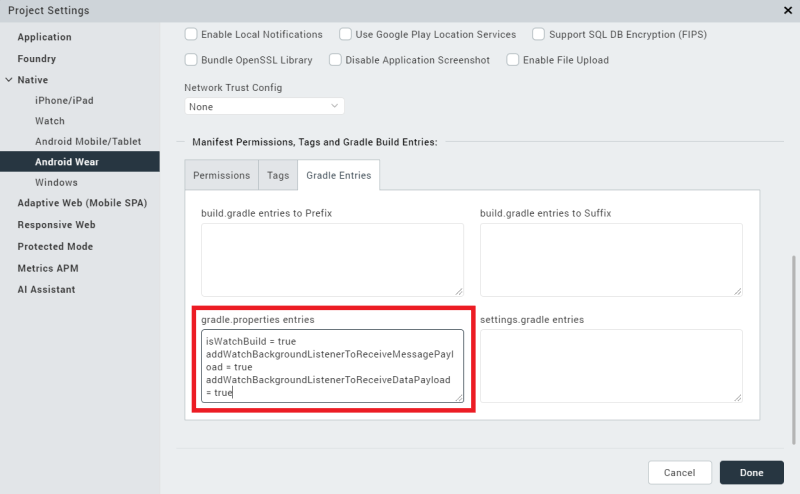

                           


Overviews
=========

This section presents overviews of creating an Android Wear watch app by using Volt MX Iris through the following topics:

*   [Designing an Android Wear App](#designing-an-android-wear-app)
*   [Pairing a Watch and a Phone](#pairing-a-watch-and-a-phone)
*   [Communication Between Paired Devices](#communication-between-paired-devices)
*   [Transmitting Data Between Paired Apps](#transmitting-data-between-paired-apps)
*   [Using Capabilities](#using-capabilities)
*   [Building an application for Android Wear](#building-an-application-for-android-wear)

Designing an Android Wear App
-----------------------------

In Android Wear 1.0, your Wear apps had to be paired via Bluetooth with an app that ran on an Android mobile device, such as an Android-based phone. Android Wear 2.0 removes this limitation. You can now develop stand-alone apps for Android Wear that let users access information and perform tasks on their watches without needing an accompanying phone. As of version 9.2, Volt MX Irisonly supports Android Wear 2.0. Your app can be wholly independent of a companion phone app, partially dependent on a phone app, or completely dependent on a phone app. For more information, please see the [Android Wear developer documentation](https://developer.android.com/training/wearables/apps/standalone-apps.md).

When designing your app for Android Wear, you must follow the [guidelines and layout styles](https://developer.android.com/training/wearables.md) given in the Android Wear developer documentation. Apps for wearable devices under Android Wear tend to be oriented toward notifications. So it is important to understand [native Android Wear notifications](https://developer.android.com/training/wearables/notifications/index.md) before proceeding. Once you have a background in native Android Wear notifications, using the [VoltMX Notifications API](../../../Iris/iris_api_dev_guide/content/notifications.md) in your Wearables app should be straightforward.

However, please be aware that watch apps do not have to be all about notifications. Android Wear 2.0 and later gives your app direct access to hardware features on the watch, such as sensors and the GPU. You can now add widgets to your watch app, write functions to process input, and so forth.

For the most part, you design and build your Android Wear apps in Iris just like any other app. That is, you create a project for your phone app and another one for your watch app. Design and build your phone app in Volt MX Iris as you would any phone app. To design and build your watch app, drag widgets onto the design pallet and add functionality to them by writing JavaScript code. You can also access native Android APIs by using the Volt MX Iris Native Function API. For details, please see the [VoltMX Iris Native Functions API Developer's Guide](../../../Iris/iris_nf_api_dev_guide/content/native_function_api_developers__guide.md). Other native functionality can also be accessed through the Volt MX Iris Native Function API. In particular, if your app needs access to Android Wear-specific views such as the `cardFragment`, you can build that into your app with the Native Functions API.

The following widgets are not available for use in Android Wear apps.

*   Cordova Browser
*   Browser
*   Camera

Keep in mind when designing your user interface that there are behaviors of Android Wear apps that should govern how users interact with your app. Specifically, a user can exit a form in a Wear app by swiping from left to right. If the app has horizontal scrolling (e.g., the type of scrolling available in an app containing maps), the user exits by navigating to the edge of the content and then swiping from left to right.

To dismiss a form that has a child which occupies full screen content, such as a `Map` widget , edge swiping should be enabled on the form to dismiss it. Edge swiping enables the user to dismiss the form by swiping from the leftmost side of the screen (currently set to 10% of the screen width) and not just anywhere on the form.

Your app can enable the edge swipe gesture by using the form's `swipeFromLeftEdgeForWatchFormDismiss` property, as shown in the following code snippet.

myForm.swipeFromLeftEdgeForWatchFormDismiss = true ;

One impact of using the horizontal swipe gesture to dismiss forms is that you should not use it for other things. In general, horizontal gestures should not be used in Volt MX Wearables apps for Android Wear because it conflicts with the horizontal swipe dismissal gesture and may cause undefined behavior in your app.

Pairing a Watch and a Phone
---------------------------

Watch apps can operate independently or paired together with a phone app. To pair a watch and a phone, please use the [instructions in the Android Wear documentation](https://developer.android.com/training/wearables/apps/creating.md#setting-up-a-phone). If you have any trouble, try the [troubleshooting tips in the Android Wear help](https://support.google.com/androidwear/answer/6057772).

Pairing occurs over Bluetooth. It is possible to pair a phone with multiple watches. The paired devices form a network. Each device in the network is referred to as a _node_. Every node has a unique ID.

Communication Between Paired Devices
------------------------------------

Once users pair their watches to their phones and your companion apps are installed on both devices, the two apps can communicate with each other and work together to accomplish tasks. However, there are some restrictions. First, both apps must be part of the same package. That is, you must build them together as companion apps.

Second, both apps must be signed with the same key store in order for them to communicate and operate together.

Third, your companion apps must be properly configured in Volt MX Iris, as discussed in the next topic.

Transmitting Data Between Paired Apps
-------------------------------------

To enable paired watch and mobile device apps to transmit between each other, you must configure Volt MX Iris before your build your watch and phone apps. To do so, use the following steps.

1.  From the **Project Properties** pane of the watch project, select **Native**.
2.  Click the **Android** tab.
3.  Select the **Gradle Entries** tab.
4.  In the **gradle.properties entries** box, add the following items.
    
    `isWatchBuild = true  
    addWatchBackgroundListenerToReceiveMessagePayload = true  
    addWatchBackgroundListenerToReceiveDataPayload = true`
    

The illustration below shows the result of adding these items.



Adding the first configuration setting into your watch project lets Volt MX Iris know that the project is targeted to Android Wear. Without the isWatchBuild entry, Volt MX Iris won't compile the project for Android Wear.

Adding the other two entries lets your watch app listen for data items and messages even when the app is not running or is running in the background. Please note that adding background listening capabilities consumes more power from the battery.

To enable your phone app to communicate with the watch using the Volt MX Wearables functions in the voltmx.wearable namespace, You must also add gradle property entries to the phone app's configuration. To do so, use the following steps.

1.  From the **Project Properties** pane of the watch project, select **Native**.
2.  Click the **Android** tab.
3.  Select the **Gradle Entries** tab.
4.  In the **gradle.properties entries** box, add the following items.
    
    `useWatchCommunicationApis = true  
    addWatchBackgroundListenerToReceiveMessagePayload = true  
    addWatchBackgroundListenerToReceiveDataPayload = true`
    

Using Capabilities
------------------

You can package your apps with specific capabilities, such as the ability to accept voice commands. Both Android Wear and Android phone or tablet apps can have capabilities. To add capabilities to your apps, you must define them first. Then, when your apps start, Android Wear can advertise their capabilities to the devices they are paired with. An app's advertized capabilities are visible to all nodes in the current device's network of paired devices.

To advertise the capabilities of your Android Wear app, do the following.

1.  Starting from your Volt MX Iris workspace folder, navigate to the `resources/mobile/native/android/values/` folder.
2.  Create a text file and name it `wear.xml`.
3.  Add a resource named `android_wear_capabilities` to `wear.xml`.
4.  Define the capabilities that the app provides.

To advertise the capabilities of your Android phone or tablet app, use the following steps.

1.  Starting from your Volt MX Iris workspace folder, navigate to the `resources/<Device>/native/androidtab/values/` folder, where `<Device>` is either `tablet` or `phone`.
2.  Create a text file and name it `wear.xml`.
3.  Add a resource named `android_wear_capabilities` to `wear.xml`.
4.  Define the capabilities that the app provides.

You must define your capabilities according to the XML schema defined by Android. For detailed information, see the Android developer documentation on [sending and receiving messages](https://developer.android.com/training/wearables/data-layer/messages.md).

One of the primary uses of capabilities is for Android Wear apps that are paired with Android device apps. In such a case, your Android Wear app can advertise its presence on its network of paired devices by using XML such as the following example.

```
<resources>
    <string-array name="android_wear_capabilities">
        <item> wear_app_voltmx </item>
    </string-array>
</resources>
```

The example XML defines an array of strings that contains resource names. The item in the array is a string that uniquely identifies the Volt MX Wearables app for Android Wear on the network of paired devices. For specific information on the XML your app uses to advertise capabilities, please see the [Android Developer documentation](https://developer.android.com/training/wearables/apps/standalone-apps.md#detecting-your-app).

To advertise the companion app on the Android device, you use XML similar to the following.

```
<resources>
    <string-array name="android_wear_capabilities">
        <item> handheld_app_voltmx </item>
    </string-array>
</resources>
```

Again, the string in the `<item>` take must be a string that uniquely identifies the companion app on the Android device.

Building an Application for Android Wear
----------------------------------------

On Volt MX Iris, while building an Android Wear application, you must perform certain custom tasks before compilation. To perform these tasks, create the file `androidprecompiltask.xml`file in your project workspace.

**Follow these steps to add custom tasks for building Android Wear applications on Volt MX Iris:**

1.  Navigate to the following location :<worskapce>/appname>
2.  Create a file named `androidprecompiletask.xml`. The tasks provided in the `androidprecompiletask.xml` file are performed before compiling.
3.  Open this file in a text editor and add the following content in the file.

```
<project name="PreCompile" default="PreCompileSetup">
	<!--
	${basedir} points to the current dir in which this xml is   
present{voltmxapp.dir} points to Volt MX application base directory
	${app.dir} points to Native android application directory   
created for the current Volt MX app
	${packagepath} contains the package name folder path relative   
to src folder
	${build.option} indicates current build is "debug" or   
"release" mode
	${supportx86} is set to "true" if x86 flag is ticked in IDE  
 build options. 
	${isUniversalApp} is set to "true" for universal build , where both mobile and tablet assets and js files are contained in single apk 
	${isMobileBuild} is set to "true" if current build is invoked   
for Mobile and  is set to "false" if current build is invoked for Tablet.
	1) Copy this xml to project workspace base directory (using Navigator view in voltmx Studio){basedir} var then points to project workspace base directory
	2) This xml can be used to perform task such as 
	==> Copy Modified Build xml file to native android folder
	==> Any other custom libs,assets,res files to be copied in to native android hierarchy
	==> Copy any x86 .so files from any libs only when variable {supportx86} is set to true
	==> Changing or appending some custom paths to   
project.properties or local.properties etc..
	==> Custom code can be written under {isMobileBuild}  
 check if there are custom tasks to be performed differently for $Mobile and Tablet
	-->
	<target name="PreCompileSetup" >
<echo message="basedir = ${basedir} ,voltmxapp.dir = ${voltmxapp.dir}, appdir = ${app.dir} , isUniversalApp = ${isUniversalApp} ,isMobileBuild = ${isMobileBuild}"/>
<echo message="Build mode = ${build.option} , Packagepath = ${packagepath} , x86 Support = ${supportx86}" />		
<echo>Java/JVM version: ${ant.java.version}</echo> 
<echo>Java/JVM detail version: ${java.version}</echo>
<copy file="${basedir}/resources/customlibs/lib/android/voltmxlogger.jar " todir="${app.dir}/libs"/>
	</target>
</project>	
```

If you already have `androidprecompiletask.xml`file in your workspace, add the following line to it.

```
<copy file="${basedir}/resources/customlibs/lib/android/voltmxlogger.jar"  todir="${app.dir}/libs"/>   
```

4\. Build the application in Volt MX Iris.
