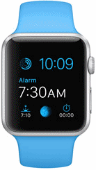
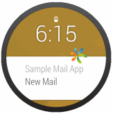

                            

You are here: Wearables

Wearables
=========

Wearables are body-borne miniature electronic devices such as an Apple Watch or Android Wear. Using an Apple Watch or Android Wear, you can access information quickly without pulling out your phone. When you pair a watch with your phone, you can keep track of calendar appointments, notifications, and more from your watch. Based on the actions associated with the notification, you can interact with a companion app on your phone.

The benefits of wearables include the ability to access information on the go, increasing productivity with convenient payment processing and so on. Notifications can alert a user to an event that might interest the user.

For example, you receive a notification from an existing messaging app with action buttons such as "reply," "delete," and "ignore." When you click "delete," the delete message is deleted. If you click "reply," the app opens on your watch, and you can reply to the message. The watch acts as an extension of your phone.

             
