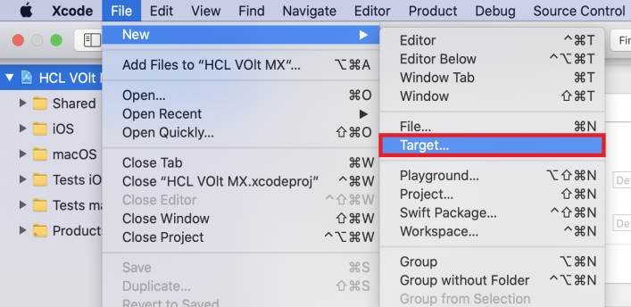
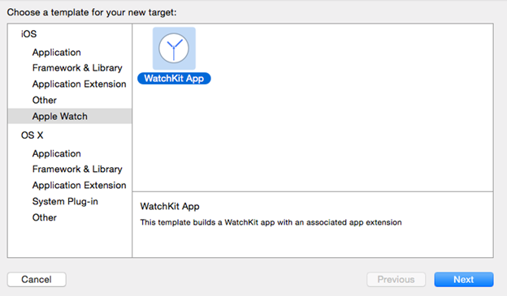
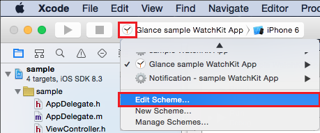
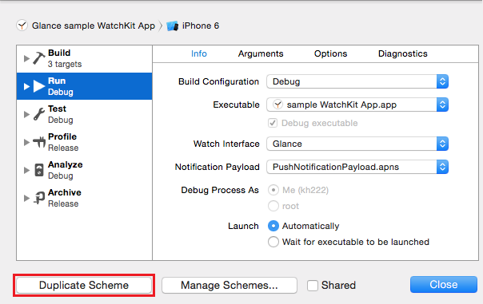

                            

Configuring Your Xcode Project
------------------------------

You must have an existing voltmxiOS plug-in for a WatchKit App. You can download the plug-in from the Volt MX update site or pick it from Volt MX Iris that is installed on your machine. Open your iOS plug-in in the Xcode project and add a new WatchKit App target. Once you add the WatchKit App target, the target configures and adds resources for your WatchKit App and WatchKit Extension.

### Adding WatchKit App to Your Project

To add a WatchKit App to your iOS project, follow these steps:

1.  Install the latest Volt MX Iris 6.5, and navigate to <Drive:>\\VoltMX\\Plugins folder.
2.  Locate <com.voltmx.ios\_version>.jar plug-in, and copy it to a different location on your machine.
3.  Rename the file to <com.voltmx.ios\_version>.zip, and extract the .zip anywhere on your machine.
4.  From the extracted folder, navigate to luavmiphone > VMAppWithVoltMXlib and open VMAppWithVoltMXlib.xcodeproj project.
5.  Select File > New > Target, and navigate to the **Apple Watch** section.
    
    
    
6.  Select WatchKit App and click **Next**.
    
    
    
7.  To include notifications in your app, select the **Include Notification Scene** check box.
8.  To include glance in your app, select the **Include Glance** check box.
    
    > **_Note:_** Even if you are not planning to implement notifications in your app now, it is recommended to select the Include Notification Scene check box. It helps in debugging your notification interfaces.
    
9.  Click **Finish**. The Xcode configures your project and creates two new targets as WatchKit App and WatchKit Extension.

### Designing and Writing Your App

You can design the user interface of your watch application directly in Volt MX Integrated Iris directly on your design canvas. As with apps for other platforms, you can add widgets, configure their properties, and so forth.

Volt MX  Integrated Iris generates your user interface as JSON statements, which must then be converted into something that Xcode can use to build your WatchKit app. Fortunately, Volt MX Integrated Iris provides a tool that translates the JSON user interface of your app into XML that Xcode can use. And it does this automatically during the build process, so you don't need to worry about it. You simply add the resulting XML to your Xcode project and Xcode will be able to build your Volt MX Integrated Iris application.

### To Build, Run, and Debug

When you create your WatchKit App target, the Xcode automatically configures a build scheme to run and debug your WatchKit App. Use that scheme to launch and run your app in iOS Simulator or on a device.

For apps that include glance or custom notification interfaces, you must configure additional build schemes to test those interfaces. Use the glance scheme to debug your glance interface in the simulator, and use the notification scheme to test your dynamic and static notification interfaces.

To configure custom build schemes for the glances and notifications, follow these  steps:

1.  In your Xcode, from the scheme menu, click on existing WatchKit App scheme and select **Edit Scheme**.  
      
    
    
    
2.  Duplicate your existing WatchKit App scheme, and name it appropriately. For example, choose a name like “Glance - sample WatchKit App” to indicate that the scheme is specifically for running and debugging your glance.  
      
    
    
    
    > **_Note:_** You have to create a separate schema for Glance, Dynamic Notification, and Static Notification.
    
3.  Select **Run** in the left column of the scheme editor.
4.  On the **Info** tab, select the appropriate executable for the new scheme.
5.  Click on **Close** button.
