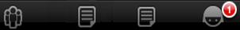

                                


AppMenu Methods
===============

The namespace for the App Menu widget is **voltmx.application**. It has the following methods associated with it:

* * *


<details close markdown="block"><summary>addAppMenuItemAt Method</summary>

* * *

This method adds an App Menu item at the given index.

### Syntax

```

voltmx.application.addAppMenuItemAt(appMenuId,index,appMenuItem)
```

### Parameters

**_appMenuId_**

Id of the appmenu to which the menu item is to be added. This is the ID used while creating the app menu.

**_index_**

The index at which the menu item must be added. The index value lies between 0 and n-1. If the index is beyond the current length of the app menu items then item is added to the end.

**_appmenuItem_**

*   menuitemId: ID of the menu item.
*   menuitemName: Name of the menu item.
*   menuitemImage: The image to be used for the menu item.
*   menuitemClosure: onclick event to be executed for the menu item.

### Exceptions

  
| Error Code | Description |
| --- | --- |
| Error | If the input is invalid or does not follow the structure as expected. |

### Remarks

On iOS platform, menuitemId and menuItemClosure are mandatory parameters and the menuItemClosure should end with form.show() call.

The index value starts from 0. For example, to insert a menu item at the 4th position specify the index value as 3.

For SPA, the addAppMenuItemAt method updates the currently set App Menu irrespective of given appMenuId.

### Example

```

/*The below function is the callback function for onClickClosure event 
of app menu item with id "appmenuitemid3". */
function onClickClosure3() {
    //your code here
}

//Defining app menu item.
var appMenuItem3 = [
    "appmenuitemid3",
    "Rewards",
    "reward.png",
    onClickClosure3, {
        startupForm: "someform",
        selectedImage: "someimage"
    }
];

//Adding the above app menu item at the index 4
voltmx.application.addAppMenuItemAt("accountMenu", 3, appMenuItem3);
```

### Platform Availability

Available on all platforms

* * *

</details>
<details close markdown="block"><summary>animate Method</summary>

* * *

Applies an animation to the widget.

### Syntax

```

animate (animationObj, animateConfig, animationCallbacks)
```

### Parameters

**_animationObj_**

An `animation` object created using [voltmx.ui.createAnimation] function.

**_animationConfig_**

As defined in widget level animation section.

**_animationCallbacks_**

A JavaScript dictionary that contains key-value pairs. The following keys are supported.

| Key | Description |
| --- | --- |
| animationEnd | A JavaScript function that is invoked with the animation ends. For more information, see the **Remarks** section below. |
| animationStart | A JavaScript function that is invoked with the animation starts. For more information, see the **Remarks** section below. |

### Return Values

Returns a platform-specific handle to the animation. This handle currently not used, but is returned for possible future requirements use.

### Remarks

The callback for the `animationStart` key in the JavaScript object passed in this method's _animationCallbacks_ parameter has the following signature.

animationStart(source, animationHandle, elapsedTime);

where `source` is the widget being animated, `animationHandle` is the handle returned by the `applyAnimation` method, and `elapsedTime` is the amount of time the animation has been running in seconds, when this event is fired..

This event occurs at the start of the animation. If there is 'animation-delay' configured then this event will fire only after the delay period. This event gets called asynchronously.

The callback for the `animationEnd` key in the JavaScript object passed in this method's _animationCallbacks_ parameter has the following signature.

animationEnd(source, animationHandle, elapsedTime);

where source is the widget being animated, animationHandle is the handle returned by the applyAnimation method, and elapsedTime is the amount of time the animation has been running in seconds, when this event is fired.

This event occurs at the end of the animation. This event gets called asynchronously.

The `animate` method throws an Invalid Animation Definition Exception if animation definition, does not follow the dictionary structure expected. This method is ignored if it is called on a widget whose immediate parent is not FlexContainer or a FlexScrollContainer.

If the widget is not part of the currently visible view hierarchy, calling this method does nothing. Because this method is asynchronous and immediately returns, it does not wait for the animation to start or complete.

### Example

```

//Sample code of animation
function AnimateBoth() {
    var getFuncName = frm1.listbox18.selectedKey;
    if (getFuncName == "BothLT") {
        frm1.textbox26.animate(myAnimDefinition(),
            animConfiguration(), {});
    } else if (getFuncName == "BothTBL") {
        frm1.textbox26.animate(myAnimDefinitionsc1(),
            animConfiguration(), {});
    }
}
```

### Platform Availability

*   iOS, Android, Windows, and SPA

* * *

</details>
<details close markdown="block"><summary>addGestureRecognizer Method</summary>

* * *

This API allows you to set a gesture recognizer for a specified gesture for a specified widget.

### Syntax

```

addGestureRecognizer(gestureType, gestureConfigParams, onGestureClosure)
```

### Parameters

**_gestureType_**

\[Number\] - Mandatory

Indicates the type of gesture to be detected on the widget.

See Remarks for possible values.

**_gestureConfigParams_**

\[object\] - Mandatory

The parameter specifies a table that has the required configuration parameters to setup a gesture recognizer.

The configuration parameters vary based on the type of the gesture.

See Remarks for possible values.

**_onGestureClosure_**

\[function\] - Mandatory

Specifies the function that needs to be executed when a gesture is recognized.

This function will be raised asynchronously

See Remarks for the syntax of this function.

### Return Values

String - Reference to the gesture is returned.

### Remarks

The values for the _gestureType_parameter are:

\[Number\] - Mandatory

Indicates the type of gesture to be detected on the widget. The following are possible values:

*   1 – constants.GESTURE\_TYPE\_TAP
*   2 - constants.GESTURE\_TYPE\_SWIPE
*   3 – constants.GESTURE\_TYPE\_LONGPRESS
*   4 – constants.GESTURE\_TYPE\_PAN
*   5 – constants.GESTURE\_TYPE\_ROTATION
*   6 - constants.GESTURE\_TYPE\_PINCH
*   7 - constants.GESTURE\_TYPE\_RIGHTTAP

The values for the _gestureConfigParams_parameter are:

\[object\] - Mandatory

The parameter specifies a table that has the required configuration parameters to setup a gesture recognizer. The configuration parameters vary based on the type of the gesture.

This parameter supports the following key-value pairs:

Gesture Type:TAP

*   fingers \[Number\] - specifies the maximum number of fingers that must be respected for a gesture. Possible values are: 1. Default value is 1.
*   taps \[Number\] - specifies the maximum number of taps that must be respected for a gesture. Possible values are: 1 or 2. Default value is 1.

### For example:  

```

{fingers:1,taps:1}
```

Gesture Type:SWIPE

*   fingers \[Number\] - specifies the maximum number of fingers that must be respected for a gesture. Possible values are: 1. Default value is 1.

### For example:

```

{fingers: 1}
```

Gesture Type:LONGPRESS

*   pressDuration \[Number\] - specifies the minimum time interval (in seconds) after which the gesture is recognized as a LONGPRESS. For example, if pressDuration is 2 seconds, any continued press is recognized as LONGPRESS only if it lasts for at least 2 seconds. Default value is 1. This is not applicable to Windows.

For example:

```

{pressDuration=1}.
```

**Gesture Type: PAN**

*   fingers \[number\] specifies the minimum number of fingers needed to recognize this gesture. Default value is 1.
*   continuousEvents \[Boolean\] indicates if callback should be called continuously for every change beginning from the time the gesture is recognized to the time it ends.

**Gesture Type: ROTATION**

*   Rotation gesture involves only two fingers.
*   continuousEvents \[Boolean\] indicates if callback must be called continuously for every change beginning from the time the gesture is recognized to the time it ends.

**Gesture Type:PINCH**

*   Pinch gesture invloves two fingures.
*   continuousEvents \[Boolean\] indicates if callback should be called continuously every change beginning from the time the gesture is recognized to the time it ends.

The syntax for the _onGestureClosure_callback function are:

\[function\] - Mandatory

Specifies the function that needs to be executed when a gesture is recognized.

This function will be raised asynchronously and has the following Syntax:

```

onGestureClosure(widgetRef, gestureInfo, context)
```

*   widgetRef - specifies the handle to the widget on which the gesture was recognized.
*   gestureInfo - Table with information about the gesture. The contents of this table vary based on the gesture type.
*   context - Table with SegmentedUI row details.

gestureInfo table has the following key-value pairs:

*   gestureType \[number\] – indicates the gesture type; 1 for TAP, 2 for SWIPE, and 3 for LONGPRESS,4 for PAN, 5 for ROTATION, 6 for PINCH and 7 for RIGHTTAP
*   gesturesetUpParams \[object\] – specifies the set up parameters passed while adding the gesture recognizer
*   gesturePosition \[number\] – indicates the position where the gesture was recognized. Possible values are: 1 for TOPLEFT, 2 for TOPCENTER, 3 for TOPRIGHT, 4 for MIDDLELEFT, 5 for MIDDLECENTER, 6 for MIDDLERIGHT, 7 for BOTTOMLEFT, 8 for BOTTOMCENTER, 9 for BOTTOMRIGHT, 10 for CENTER
*   swipeDirection \[number\] –indicates the direction of swipe. This parameter is applicable only if the gesture type is SWIPE. Possible values are: 1 for LEFT, 2 for RIGHT, 3 for TOP, 4 for BOTTOM. Direction is w.r.t the view and not device orientation.
*   gestureX \[number\] – specifies the X coordinate of the point (in pixels) where the gesture has occurred. The coordinate is relative to the widget coordinate system.
*   gestureY \[number\] – specifies the Y coordinate of the point (in pixels) where the gesture has occurred. The coordinate is relative to the widget coordinate system.
*   widgetWidth \[number\] – specifies the width of the widget (in pixels)
*   widgetHeight \[number\] – specifies the height of the widget (in pixels)
*   gestureState\[number\] – indicates the gesture state as below
    *   1 – gesture state begin
    *   2 - gesture state changed
    *   3 – gesture state ended.
*   \* gestureState is applicable only for continuous gestures like PAN, ROTATION and PINCH.
*   rotation \[number\] rotation of the gesture in degrees since its last change.( Applicable only when gesture type is ROTATION
*   velocityX and velocityY : horizontal and vertical component of velocity expressed in points per second. (Applicable only for PAN gesture type)
*   velocity \[number\]: velocity of pinch in scale per second (Applicable for Pinch gesture)
*   scale \[number\]:scale factor relative to the points of the two touches in screen coordinates
*   touchType\[number\]:(windows only)
    *   0 - constants.TOUCHTYPE\_FINGER
    *   1 - constants.TOUCHTYPE\_PEN
    *   2 - constants.TOUCHTYPE\_MOUSE
*   translationX and translationY \[number\] : cumulative distance as number. (Applicable only for PAN gesture type)

context table has the following key-value pairs:

*   rowIndex \[number\] : row index of the segui where gesture was recognised. (Applicable to gestures added to segUI rows)
*   sectionIndex \[number\] : section index of the segui where gesture was recognised. (Applicable to gestures added to segUI rows)

It is not recommend to define gestures for widgets that have a default behavior associated with it.

If you click (tap) a button (any clickable widget), the default behavior is to trigger an onClick event. If you define a Tap gesture on such widgets, the gesture closure is executed in addition to the onClick event.

If you swipe a larger form, the default behavior is to scroll up and down depending on the direction in which you swipe. If you define a SWIPE gesture on such forms, the gesture closure gets executed in addition to scrolling the form.

If you swipe a Segmented UI with huge number of rows, the default behavior is to scroll the Segmented UI. If you define a SWIPE gesture on such segments, the gesture closure gets executed in addition to scrolling the form.

Gestures can be added only for the following widgets:

*   Flex Container
*   Flex Scroll Container.
    

In the android platform, the top and bottom gestures work only when the scrolling is disabled for Form and parent scrolling containers. By default, the scrolling is enabled for the Form and scrolling containers.

*   RIGHTTAP applicable only to Windows 10
*   ROTATION is not supported on android.

### Example

```
 
//Sample code to add Gestures to the frmGestures FlexForm.
//Code to add DOUBLE TAP gesture to the frmGestures, FlexForm.
var doubletp = {
 fingers: 1,
 taps: 2
};
frmGestures.addGestureRecognizer(1, doubletp, onGestureFunction);
//Code to add SINGLE TAP gesture to the frmGestures FlexForm.
var singleTp = {
 fingers: 1,
 taps: 1
};
frmGestures.addGestureRecognizer(1, singleTp, onGestureFunction);
//Code to add SWIPE gesture to the frmGestures FlexForm.
var swipeForm = {
 fingers: 1,
 swipedistance: 50,
 swipevelocity: 75
};
frmGestures.addGestureRecognizer(2, swipeForm, onGestureFunction);
//Code to add LONGPRESS gesture to the frmGestures FlexForm.
var longPressForm = {
 pressDuration: 2
};
frmGestures.addGestureRecognizer(3, longPressForm, onGestureFunction);

function onGestureFunction(commonWidget, gestureInfo) {
 voltmx.print("The Gesture type is:" + gestureInfo.gestureType);

}
```

### Platform Availability

*   iOS, Windows

* * *

</details>
<details close markdown="block"><summary>convertPointFromWidget Method</summary>

* * *

This method allows you to convert the coordinate system from a widget to a point (receiver's coordinate system).

### Syntax

```

convertPointFromWidget(point, fromWidget)
```

### Parameters

**_point_**

\[JSObject\]- Mandatory

You can specify an object with keys as x and y. You can specify the values in all (dp, px and %) units of measurement.

**_fromWidget_**

\[widgetref\]- Mandatory

This parameter is the handle to the widget instance. Based on this parameter, the coordinate system is converted from the widget to a point (receiver's coordinate system).

### Example

```

Form1.widget1.convertPointFromWidget({
    x: "10dp",
    y: "20dp"
}, widget2);
```

### Platform Availability

*   iOS, Android, Windows, and SPA

* * *

</details>
<details close markdown="block"><summary>convertPointToWidget Method</summary>

* * *

Using the convertPointToWidget method, you can modify the co-ordinate system. You can convert the receiver's co-ordinate system from a **point** to a **Widget**.

### Syntax

```

convertPointToWidget(point, toWidget)
```

### Parameters

**_point_**

\[JSObject\]- Mandatory. You can specify an object with keys as x and y. You can specify the values in all (dp, px and %) units of measurement.

**_toWidget_**

\[widgetref\] - Mandatory. This parameter is the handle to the widget instance. Based on this parameter, the coordinate system is converted from a point to a widget.

### Example

```

Form1.widget2.convertPointToWidget({
    x: "20dp",
    y: "30dp"
}, widget1);
```

### Platform Availability

*   iOS, Android, Windows, and SPA

* * *

</details>
<details close markdown="block"><summary>createAppMenu Method</summary>

* * *

This method allows you to create App Menu dynamically through code.

### Syntax

```

voltmx.application.createAppMenu (appMenuId,appMenu,skinID,onFocusSkinID);
```

### Parameters

**_appMenuId_**

Id of the menu item.

**_appMenu_**

   *   menuitemId: ID of the menu item.
   *   menuitemName: Name of the menu item.
   *   menuitemImage: The image to be used for the menu item.
   *   menuitemClosure: _onclick_ event to be executed for the menu item.

**_skinID_**

Optional. The normal skin to be set for the menu.

**_onFocusSkinID_**

Optional. The focus skin to be set for the menu.

### Return Values

None

### Exceptions

  
| Error Code | Description |
| --- | --- |
| SkinError | If the skin is not defined with the specified skin identifier. |
| Error | If the input is invalid or does not follow the structure as expected. |

### Remarks

On iOS platform, menuitemId and menuItemClosure are mandatory parameters and the menuItemClosure should end with form.show() call.

If the app menu is already created with the identifier passed, a new app menu will be created and the old app menu will be replaced with the new one.

At least one app menu item is must in the created app menu. App menu with zero number of app menu items is invalid.

You must set this method in _pre-appinit_ property. You can set this method only once. For more information about the _pre-appint_ property, see _Configuring Project Properties_, _Application Properties_ in the _VoltMX IrisUser Guide_.

On _Android_ platform, if you add more than six App Menu items, the menu items beyond the fifth App Menu item are grouped under the Menu item _More_ (added automatically by the Android platform) and if you select _More_, the rest of the Menu items are displayed in a list without any icons (even if the icons are set through code). This is an Android platform limitation.

### Example

To create an App Menu for a banking application with Accounts and Payments enter the following:

```

//The below two functions are callback functions for onClickClosure events for menu items.
function onClickClosure1() {
    //add your code here
}

function onClickClosure2() {
    //proceed with the logic
}

//Defining appmenu items (Atleast one item should be defined)
var appMenuItem1 = ["appmenuitemid1",
    "Accounts",
    "icon1.png",
    onClickClosure1, {
        startupForm: "someform",
        selectedImage: "someimage"
    }
];

var appMenuItem2 = ["appmenuitemid2",
    "Payments",
    "icon2.png",
    onClickClosure2
];

//defining appMenu parameter with the above menu items.
var appMenu = [appMenuItem1,
    appMenuItem2
];

//Creating App menu.
voltmx.application.createAppMenu("myappmenu", appMenu, "skn1", "fcskn1");
```

### Platform Availability

Available on all platforms

* * *

</details>
<details close markdown="block"><summary>getAppMenuBadgeValue Method</summary>

* * *

This method enables you to read the badge value (if any) attached to the given Appmenu item.

### Syntax

```

voltmx.application.getAppMenuBadgeValue(appMenuId,menuItemId)
```

### Parameters

**_appMenuId_**

If you are setting the badge for an app menu item that was created dynamically, use the same ID that was used to create the app menu item. If you are setting the badge for an app menu item that was created from the IDE, use the ID available in the generated script file.

**_menuItemId_**

Id of the app menu item from which the badge value is to be read.

### Return Values

String - returns the badge value.

### Example

```

//Get the AppMenuBadgeValue for the menu item with id ::"appmenuitemid3".
voltmx.application.getAppMenuBadgeValue("accountMenu", "appmenuitemid3");
```

For more information about the Badge APIs refer the _API Reference Document_.

### Platform Availability

Available on iPhone/iPad

* * *

</details>
<details close markdown="block"><summary>getBadge Method</summary>

* * *

This API enables you to read the badge value (if any) attached to the specified widget. If the specified widget does not have a badge attached to it, it returns an empty string.

### Syntax

```

getBadge()
```

### Optional Parameter

**_uniqueIdentifier_**

Unique identifier of a widget which is a handle to the widget.

### Return Values

Returns a string containing the badge value applied to the specified widget. If the specified widget has no badge value attached to it, it returns an empty string.

### Remarks

When a badge is removed, the widgets are re-formatted to accommodate the cleared badge values.

On the iOS platform, this method is applicable on Label, Button, Image, TextBox, and TextArea widgets only.

### Example

```

//This is a generic method that is applicable for various widgets.
//Here, we have shown how to use the getBadge Method for button widget.
//You need to make a corresponding call of the getBadge method for other applicable widgets.
function getBadge() {
    //To get a badge value on a Button with ID btn1 placed on a form frm1, use the following snippet:
    var badgeVal = frm1.btn1.getBadge();
    alert("badge value is::" + badgeVal);

    //For instance, the corresponding getBadge method call on the Label widget is as follows:
    frm1.lbl1.getBadge();
}
```

### Platform Availability

*   iOS

* * *

</details>
<details close markdown="block"><summary>getCurrentAppMenu Method</summary>

* * *

This method returns the unique identifier of the current app menu that is set through setCurrentAppMenu.

### Syntax

```

voltmx.application.getCurrentAppMenu()
```

### Return Values

This method returns appMenuId as _string_. In case of app menu is not set, _null_ is returned.

### Example

```

//Get the Current app menu
var currAppMenuId = voltmx.application.getCurrentAppMenu();

//Alert the Current app menu
alert("Current app menu id is::" + currAppMenuId);
```

### Platform Availability

Available on all platforms

* * *

</details>
<details close markdown="block"><summary>registerForPeekandPop Method</summary>

* * *

This method registers a widget to enable 3D Touch peek and pop gestures.

### Syntax

```

registerForPeekandPop(onPeekCallback, onPopCallback)
```

### Parameters

**_onPeekCallback_**

A callback function that is invoked when the user slightly presses (soft press) the widget.

Callback Syntax

```

onPeekCallback(widget)
```

Callback Input Parameters

**_widget_**

A widget reference that is registered for peek and pop.

Callback Return Values

  A PreviewInfoTable. See the Remarks section for a description of this table.

Callback Example

```

function onPeekCallback(widget) {
    var previewInfoTable = {
        "peekForm": frmSecond,
        "focusRect": [0, 0, 200, 200],
        "contentSize": [320, 480]
    };
    return previewInfoTable;
}
```

**_onPopCallback (Optional)_**

A callback function that is invoked when the user further presses (hard press) the preview that is displayed for the widget.

Callback Syntax

```

onPopCallback(widget,peekForm)
```

Callback Input Parameters

**_widget_**

A widget reference that is registered for peek and pop.

**_peekForm_**

A form reference that is displayed as preview/peek.

Callback Return Values

  A form reference.

Callback Remarks

Use this callback to set the content for pop. The form handle returned by this callback is used for pop content. In general, the form that is used for preview is used for pop content also. If the pop callback is not implemented, peek disappears and the app returns to its previous state.

Callback Example

```

function onPopCallback(widget, peekForm) {
    // preview form used for pop also
    return peekForm;
}
```

### Remarks

A PreviewInfoTable has the following format.

**Name:** peekForm

**Description:** The form reference that will be displayed as preview. If an invalid form reference is given, the preview will not be shown.

**Type:** form reference

**Name:** focusRect (Optional)

**Description:** An array representing a rectangle in widgets view coordinates. If provided, this rectangle will be focused while its surrounding area will be blurred, indicating a preview is available for the widget. If not provided, entire view area of the widget will be focused. If either the width or height is zero, the widget's view width/height is used. The values are supported in percentage(with regard to widget bounds), dp, or pixels. The values are strings. If a string value is given without any format specifier, it defaults to dp. If an array of numbers is given, it is assumed they are dp values.

**Type:** Array \[x, y, width, height\]

Example: \[“0dp”, “0dp”, “200dp”, “300dp”\], \[“10%”, “10%”, “75%”, “50%”\], \[“10px”, “10px”, “200px”, “480px”\]

**Name:** contentSize (Optional)

**Description:** An array representing the preferred content size of the preview. This allows the user to adjust the preferred width/height dimensions of the preview. If not provided, the preview is shown with default values. If either the width or height is zero, the default preview width/height is used. It is recommended that one of the width/height values be zero for proper adjustment of the other value. For example, if width = 0, the height is adjustable and vice versa. Providing positive values simultaneously for both width and height will result in distorted appearance of preview. The values are supported in dp, pixels, and percentage(with regard to screen bounds). The actual width/height of the preview may vary slightly due to resizing per aspect ratio. The values are strings. If a string value is given without any format specifier, it defaults to dp. If array of numbers is given, it is assumed they are dp values.

**Type:** Array \[width, height\]

Example: \[“0dp”, “100dp”\], \[“100%”, “0%”\], \[“0px”, “240px”\]

Example of a PreviewInfoTable:

```

var previewInfoTable = {
    "peekForm": frmSecond,
    "focusRect": [0, 0, 200, 200],
    "contentSize": [320, 480]
};
```

### Return Values

None.

### Platform Availability

*   iOS 9.0 and later

* * *

</details>
<details close markdown="block"><summary>removeAppMenuItemAt Method</summary>

* * *

This method removes the specified App Menu item.

### Syntax

```

voltmx.application.removeAppMenuItemAt(appMenuId,index)
```

### Parameters

**_appMenuId_**

Id of the appmenu to which the menu item is to be removed. This is the ID used while creating the app menu.

**_Index_**

The index at which the menu item must be removed.

### Exceptions

  
| Error Code | Description |
| --- | --- |
| Error | If the input is invalid or does not follow the structure as expected. |

### Remarks

If current focus menu item is removed then the first menu item of the app menu will be focused by default as its associated function will be selected.

At least one app menu item must be present in the app menu. App menu with zero number of app menu items is invalid state of the app menu.

For SPA, the removeAppMenuItemAt method updates the currently set App Menu irrespective of given appMenuId.

### Example

```

var appMenuId = "accountMenu";

//Removing the app menu item at index 2.
voltmx.application.removeAppMenuItemAt(appMenuId, 2);
```

### Platform Availability

Available on all platforms

* * *

</details>
<details close markdown="block"><summary>removeFromParent Method</summary>

* * *

This method allows you to remove a child widget from a parent widget.

### Syntax

```

removeFromParent()
```

### Read/Write

Yes - (Read and Write)

### Example

```

//This is a generic method that is applicable for various widgets.
//Here, we have shown how to use the removeFromParent Method for a Calendar widget.
//You need to make a corresponding call of the removeFromParent method for other applicable widgets.

Form1.calendar.removeFromParent();

```

### Platform Availability

*   iOS, Android , Windows, SPA, and Desktop Web

* * *

</details>
<details close markdown="block"><summary>removeGestureRecognizer Method</summary>

* * *

This method allows you to remove the specified gesture recognizer for the specified widget.

### Syntax

```

removeGestureRecognizer(gestureHandle)
```

### Parameters

gestureHandle - Mandatory

    Specifies the handle to the gesture returned by addGestureRecognizer call.

### Example

```
 
//Sample code to remove Double tap gesture from frmGestures FlexForm.  
frmGestures.removeGestureRecognizer(doubletp);  

```

### Platform Availability

*   Available on all platforms except Desktop Web and Android.

* * *

</details>
<details close markdown="block"><summary>setAppMenuBadgeValue Method</summary>

* * *

This method allows you to set a badge value to the given app menu item at the upper, right corner of the menu item.

### Syntax

```

voltmx.application.setAppMenuBadgeValue(appMenuId,menuItemId,badgeValue)
```

### Parameters

**_appMenuId_**

If you are setting the badge for an app menu item that was created dynamically, use the same ID that was used to create the app menu item. If you are setting the badge for an app menu item that was created from the IDE, use the ID available in the generated script file.

**_menuItemId_**

Id of the app menu item to which the badge value is to be set.

**_badgeValue_**

Value of the badge. The value you specify in the badge value appears within the badge. If the length of the badge value is greater than 1 the badge is a rounded rectangle. For example, if you specify the value of the badge as 88, the number appears in a rounded rectangular badge. If the length of the badge value is 1, the badge is always a circle. The maximum number of characters that can be specified in a badge value is 9. If the badge value id beyond 9 only the first 9 characters are displayed.

### Example

```

/*Set the AppMenuBadgeValue for the menu item with id ::"appmenuitemid3" , 
here the badge value is "3". */
voltmx.application.setAppMenuBadgeValue("accountMenu", "appmenuitemid3", "3");
```

### Remarks

Passing an empty string " " as a parameter, removes the badge off the appmenu item. This method is applicable only for iPhone. The figure below depicts a badge applied on an appmenu item.

For more information about the Badge APIs refer the _API Reference Document_.



### Platform Availability

Available on iPhone/iPad

* * *

</details>
<details close markdown="block"><summary>setAppMenuFocusByID Method</summary>

* * *

This method takes ID (which is set using createAppMenu) instead of index and sets the focus on the menu item of the current app menu.

### Syntax

```

voltmx.application.setAppMenuFocusByID(appMenuitemId)
```

### Parameters

**_appMenuItemId_**

ID of the app menu item.

### Exceptions

  
| Error Code | Description |
| --- | --- |
| Error | If the input is invalid or does not follow the structure as expected. |

### Remarks

At any given point of time, one of the app menu items in the current app menu is mandatory to be focused app menu item.

While using this method, ensure that the current menu item is in focus before showing the form.

For iOS platform, closure associated with the focus id will get executed along with setting the focus to the given id.

### Example

To set focus on the App Menu items 2, enter the following:

```

//Set the menu item with the identifier "appmenuitemid2" as the focused menu item.
voltmx.application.setAppMenuFocusByID("appmenuitemid2");
```

### Platform Availability

Available on all platforms except on Android and Windows platforms

* * *

</details>
<details close markdown="block"><summary>setBadge Method</summary>

* * *

This method enables you to set the badge value to the given widget at the upper, right corner of the widget.

### Syntax

```

setBadge(badgeText)
```

### Parameters

badgeText \[String\] - Mandatory

Specifies the Text value that appears within the badge. If the length of the badgeText is greater than 1, the badge is a rounded rectangle. For example, if you specify the text of the badge as 88, the number appears in a rounded rectangular badge. If the length of the badge text is 1, the badge is always a circle. The badge can occupy up to 70% of the width of the parent widget. For example, on a button with a width of 100 pixels, a badge with about 100 characters will occupy only 70 pixels of the button width. The badge text is truncated and shows about 30 characters followed by three dots.

skin \[String\] - Optional

The parameter specifies the background color for the badge. The default color is red.

### Return Values

None

### Exceptions

Error

### Remarks

The color for the badge can be defined using a skin. The default color for the badge is red with white lettering.

If you pass an empty string as a parameter, the badge applied to the widget is cleared.

A Badge can be applied only to the FlexContainer Widget. To apply badge to other widgets, place the corresponding widget inside the FlexContainer, then apply Badge to the FlexContainer Widget. Also make sure that the clipBounds property of the FlexContainer are set to false.

If the badge value is a single character (a character or a number), the badge shape is a circle.


If the badge value contains multiple characters, the badge shape is a rectangle with rounded corners and borders.

The badge can occupy a maximum of 70% width of the parent widget (widget on which badge is applied). For example, on a button with a width of 100 pixels, a badge with about 100 characters will occupy only 70 pixels of the button width. The badge value is truncated and about 30 characters followed by three dots.

When a badge is set, the widgets are re-arranged to accommodate the badge.

For iOS platform, this method is applicable on Box, Label, and Image widgets only.

For Android platform, this method is applicable on Button and Image widgets only.

### Example

```

//This is a generic method that is applicable for various widgets.
//Here, we have shown how to use the setBadge Method for button widget.
//You need to make a corresponding call of the setBadge method for other applicable widgets.
function setBadge() {
    /*To set a badge value with skin "badgeSkin" on a button btn1
placed on a form frm1, use the following code: */
    frm1.btn1.setBadge("2", "badgeSkin");
}
//For instance, the corresponding setEnabled method call on the Label widget is as follows:
form.lbl1.setBadge("4", "badgeSkin");
```

### Platform Availability

*   iOS

For more information about the badge APIs refer the _API Reference Document_.

* * *

</details>
<details close markdown="block"><summary>setCurrentAppMenu Method</summary>

* * *

This method uses the unique identifier which represents the App Menu and sets it as current app menu.

### Syntax

```

voltmx.application.setCurrentAppMenu(appMenuId)
```

### Parameters

**_appMenuId_**

ID of the menu item.

### Return Values

None

### Exceptions

  
| Error Code | Description |
| --- | --- |
| Error | If the input is invalid or does not follow the structure as expected. |

### Remarks

There can be only one current app menu that can be set any time. If you call this method multiple times, will replace the current app menu.

For iPhone, this method is one way of showing the form as well as focusing on a specific menu item.

When an app menu is set as current app menu item, by default the first app menu item of the app menu is selected and the function associated with the first app menu item gets executed.

### Example

```

//After creating appMenu with the unique identifier "myappmenu", 
//set it as current app menu.
voltmx.application.setCurrentAppMenu("myappmenu");
```

### Platform Availability

Available on all platforms

* * *

</details>
<details close markdown="block"><summary>setEnabled Method</summary>

* * *

This method specifies the widget that must be enabled or disabled.

### Syntax

```

setEnabled(enabled)
```

### Parameters

**_enabled_**

\[Boolean\] - Mandatory

true -Indicates widget is enabled.

false - Indicates widget is disabled.

### Return Values

None

### Exceptions

Error

### Remarks

Browser widget does not support this method in SPA.

This method is not applicable in Map widget.

### Example

```

//This is a generic method that is applicable for various widgets.
//Here, we have shown how to use the setEnabled Method for button widget.
//You need to make a corresponding call of the setEnabled method for other applicable widgets.

form1.myButton.setEnabled(false);
```

### Platform Availability

Available on all platforms except SPA.

* * *

</details>
<details close markdown="block"><summary>setFocus Method</summary>

* * *

This method specifies the widget on which there must be focus.

**Default :** true

### Syntax

```

setFocus(focus)
```

### Parameters

**_focus_** \[Boolean\]- Mandatory

true -Indicates focus is set on a widget.

false - Indicates focus is not set on a widget.

### Return Values

None

### Exceptions

Error

### Remarks

You should not call this method in **preShow** of a form as it is not respected by all platforms. In android platform, this method is not respected in **preShow** of a form. You can give focus to a particular widget only after it is rendered on the screen, hence it should be called in postShow of a form.

This method is not applicable in Form widget.

### Example

```

//This is a generic method that is applicable for various widgets.
//Here, we have shown how to use the setFocus Method for button widget.
//You need to make a corresponding call of the setFocus method for other applicable widgets.

form1.myButton.setFocus(true);
```

### Platform Availability

Available on all platforms.

* * *

</details>
<details close markdown="block"><summary>setGestureRecognizer Method</summary>

* * *

This method allows you to set a gesture recognizer for a specified gesture for a specified widget. You can set a Gesture recognizer only for a FlexForm, a FlexContainer, and a FlexScrollContainer. The setGestureRecognizer method is deprecated and should not be used in new software. However, Swipe Distance and Swipe Velocity parameters are not deprecated. So if you want to use the Swipe Distance and Swipe velocity parameters, use the setGestureRecognizer method. To use all other parameters, you must use the addGestureRecognizer method.

### Syntax

```

setGestureRecognizer (gestureType,setupParams,gestureHandler)
```

### Parameters

**_gestureType_**

\[Number\] - Mandatory

Specifies the type of gesture that needs to be detected on the widget. The following are possible values:

*   1 for TAP
*   2 for SWIPE
*   3 for LONGPRESS

**_setupParams_**

\[array of arrays\] - Mandatory

The parameter specifies an object that has the configuration parameters to setup a gesture recognizer. See Remarks for the values for this parameter.

**_gestureHandler_**

\[function\] - Mandatory

The parameter specifies the function that needs to be executed when a gesture is recognized. See Remarks for the functions syntax.

onGesturefunction(widgetRef,gestureInfo)

*   **_widgetRef_** - This parameter specifies the handle to the widget on which the gesture was recognized.
*   **_gestureInfo_** - This parameter specifies an array that provides information about the gesture. The contents of this array vary based on the gesture type.

Volt MX Iris populates the details in the _gestureInfo_ array. This array has the following key-value pairs:

*   **_gestureType_** \[number\] - indicates the gesture type; **1** for TAP, **2** for SWIPE, and **3** for LONGPRESS.
*   **_gesturesetUpParams_** \[object\] - this array is the set up parameters passed while adding the gesture recognizer.
*   **_gesturePosition_** \[number\] - indicates the position where the gesture was recognized. Possible values are: **1** for TOPLEFT, **2** for TOPCENTER, **3** for TOPRIGHT, **4** for MIDDLELEFT, **5** for MIDDLECENTER, **6** for MIDDLERIGHT, **7** for BOTTOMLEFT, **8** for BOTTOMCENTER, **9** for BOTTOMRIGHT, **10** for CENTER. This parameter is applicable only on iPhone.

*   **_swipeDirection_** \[number\] -indicates the direction of swipe. This parameter is applicable only if the gesture type is SWIPE. Possible values are: **1** for LEFT, **2** for RIGHT, **3** for TOP, **4** for BOTTOM.
*   **_gestureX_** \[number\] - specifies the X coordinate of the point (in pixels) where the gesture has occurred. The coordinate is relative to the widget coordinate system. This parameter is applicable only on iPhone.
*   **_gestureY_** \[number\] - specifies the Y coordinate of the point (in pixels) where the gesture has occurred. The coordinate is relative to the widget coordinate system. This parameter is applicable only on iPhone.
*   **_widgetWidth_** \[number\] - specifies the width of the widget (in pixels). This parameter is applicable only on iPhone.
*   **_widgetHeight_** \[number\] - specifies the height of the widget (in pixels). This parameter is applicable only on iPhone.

### Return Values

String - Reference(uniqueidentifier) to the gesture is returned.

### Exceptions

Error

### Remarks

This method is applicable on Form, Box, and ScrollBox widgets only.

Configuration of setupParams

The configuration parameters vary based on the type of the gesture.

### Gesture Type:TAP

*   fingers \[number\] - This parameter specifies the maximum number of fingers that must be respected for a gesture. Possible values are: 1. Default value is 1.
*   taps \[number\] - This parameter specifies the maximum number of taps that must be respected for a gesture. Possible values are: 1 or 2. Default value is 1.

### For example:

{fingers:1,taps:1}

### Gesture Type:SWIPE

*   fingers \[number\] - This parameter specifies the maximum number of fingers that must be respected for a gesture. Possible values are: 1. Default value is 1.
*   swipedistance \[number\] - This parameter specifies the distance between the pixel from where the swipe started to the pixel where the swipe stopped (finger is moved up or removed). The default value is 50 pixels. This parameter is applicable only on android. This parameter is applicable only if the gesture type is SWIPE.
*   swipevelocity \[number\] - This parameter specifies the velocity of the swipe measured in pixels per second. The default value is 75. This parameter is applicable only on android. This parameter is applicable only if the gesture type is SWIPE.

### For example:

```

{fingers:1,swipedistance:50,swipevelocity:75}
```

### Gesture Type:LONGPRESS

*   pressDuration \[number\] - This parameter specifies the minimum time interval (in seconds) after which the gesture is recognized as a LONGPRESS. For example, if the _pressDuration_ is 2 seconds, any continued press is recognized as LONGPRESS only if it lasts for at least 2 seconds. Default value is 1. This parameter is not customizable on android platform. The default value on android platform is 500 ms. Any value you pass to this parameter is ignored and the default value is used.

### For example:

```

{pressDuration:1}
```

Function syntax for the _GestureHandler_ parameter

The parameter specifies the function that needs to be executed when a gesture is recognized. This function has the following Syntax:

```

onGesturefunction(widgetRef,gestureInfo)
```

*   **_widgetRef_** - This parameter specifies the handle to the widget on which the gesture was recognized.
*   **_gestureInfo_** - This parameter specifies an array that provides information about the gesture. The contents of this array vary based on the gesture type.

Volt MX Iris populates the details in the _gestureInfo_ array. This array has the following key-value pairs:

*   **_gestureType_** \[number\] - indicates the gesture type; **1** for TAP, **2** for SWIPE, and **3** for LONGPRESS.
*   **_gesturesetUpParams_** \[object\] - this array is the set up parameters passed while adding the gesture recognizer.
*   **_gesturePosition_** \[number\] - indicates the position where the gesture was recognized. Possible values are: **1** for TOPLEFT, **2** for TOPCENTER, **3** for TOPRIGHT, **4** for MIDDLELEFT, **5** for MIDDLECENTER, **6** for MIDDLERIGHT, **7** for BOTTOMLEFT, **8** for BOTTOMCENTER, **9** for BOTTOMRIGHT, **10** for CENTER. This parameter is applicable only on iPhone.

*   **_swipeDirection_** \[number\] -indicates the direction of swipe. This parameter is applicable only if the gesture type is SWIPE. Possible values are: **1** for LEFT, **2** for RIGHT, **3** for TOP, **4** for BOTTOM.
*   **_gestureX_** \[number\] - specifies the X coordinate of the point (in pixels) where the gesture has occurred. The coordinate is relative to the widget coordinate system. This parameter is applicable only on iPhone.
*   **_gestureY_** \[number\] - specifies the Y coordinate of the point (in pixels) where the gesture has occurred. The coordinate is relative to the widget coordinate system. This parameter is applicable only on iPhone.
*   **_widgetWidth_** \[number\] - specifies the width of the widget (in pixels). This parameter is applicable only on iPhone.
*   **_widgetHeight_** \[number\] - specifies the height of the widget (in pixels). This parameter is applicable only on iPhone.

### Example

```

//The below function will get invoked  when a gesture is recognized. 
function myTap(myWidget, gestureInfo) {
    alert(" Tap Gesture detected");
    alert("gestureType :" + gestureInfo.gestureType);
    alert("gesturePosition :" + gestureInfo.gesturePosition);
    //write any further logic here
}

//Setting Gesture configuration.
var setupTblTap = {
    fingers: 1,
    taps: 2
}; //double tap gesture

//To add a TAP gesture recognizer on a hbox with ID hbx1 placed on a form frm1
var tapGesture = frm1.hbx1.setGgestureRecognizer(1, setupTblTap, myTap);
```

### Platform Availability

*   iOS, Windows, and SPA

* * *

</details>
<details close markdown="block"><summary>setOnPeek Method</summary>

* * *

This method sets and overrides the existing onPeekCallback for the widget.

### Syntax

```

setOnPeek(onPeekCallback)
```

### Parameters

**_onPeekCallback_**

A callback function that is invoked when the user slightly presses (soft press) the widget.

Callback Syntax

```

onPeekCallback(widget)
```

Callback Parameters

**_widget_**

A widget reference that is registered for peek and pop.

Callback Return Values

PreviewInfoTable. See the Remarks section for a description of this table.

Callback Example

```

function onPeekCallback(widget, contextInfo) {
    var previewInfoTable = {
        "peekForm": frmSecond,
        "focusRect": [0, 0, 200, 200],
        "contentSize": [320, 480]
    };
    return previewInfoTable;
}
```

### Return Values

None.

### Remarks

A PreviewInfoTable has the following format.

**Name:** peekForm

**Description:** The form reference that will be displayed as preview. If an invalid form reference is given, the preview will not be shown.

**Type:** form reference

**Name:** focusRect (Optional)

**Description:** An array representing a rectangle in widgets view coordinates. If provided, this rectangle will be focused while its surrounding area will be blurred, indicating a preview is available for the widget. If not provided, entire view area of the widget will be focused. If either the width or height is zero, the widget's view width/height is used. The values are supported in percentage(with regard to widget bounds), dp, or pixels. The values are strings. If a string value is given without any format specifier, it defaults to dp. If an array of numbers is given, it is assumed they are dp values.

**Type:**Array \[x, y, width, height\]

Example: \[“0dp”, “0dp”, “200dp”, “300dp”\], \[“10%”, “10%”, “75%”, “50%”\], \[“10px”, “10px”, “200px”, “480px”\]

**Name:**contentSize (Optional)

**Description:**An array representing the preferred content size of the preview. This allows the user to adjust the preferred width/height dimensions of the preview. If not provided, the preview is shown with default values. If either the width or height is zero, the default preview width/height is used. It is recommended that one of the width/height values be zero for proper adjustment of the other value. For example, if width = 0, the height is adjustable and vice versa. Providing positive values simultaneously for both width and height will result in distorted appearance of preview. The values are supported in dp, pixels, and percentage(with regard to screen bounds). The actual width/height of the preview may vary slightly due to resizing per aspect ratio. The values are strings. If a string value is given without any format specifier, it defaults to dp. If array of numbers is given, it is assumed they are dp values.

**Type:**Array \[width, height\]

Example: \[“0dp”, “100dp”\], \[“100%”, “0%”\], \[“0px”, “240px”\]

### Example of a PreviewInfoTable:

```

var previewInfoTable = {
    "peekForm": frmSecond,
    "focusRect": [0, 0, 200, 200],
    "contentSize": [320, 480]
};
```

### Example

```

function settingPeek() {
    Form1.setOnPeek(onMyPeekcallback);
}

function onMyPeekcallback(widgetref, contextInfo) {
    if (typeof(contextInfo) === undefined) {
        return null;
    }

    var previewInfoTable = {
        "peekForm": frmSecond,
        "focusRect": [0, 0, 200, 200],
        "contentSize": [320, 480]
    };
    return previewInfoTable;

}
```

### Platform Availability

*   iOS 9.0 and later

* * *

</details>
<details close markdown="block"><summary>setOnPop Method</summary>

* * *

This method overrides the existing onPopCallback for the widget.

### Syntax

```

setOnPop(onPopCallback)
```

### Parameters

**_onPopCallback_**

A callback function that is invoked when the user slightly presses (soft press) the widget.

### Callback Syntax

```

onPopCallback(widget,peekForm)
```

Callback Parameters

**_widget_**

 A widget reference that is registered for peek and pop.

**_peekForm_**

 A form reference that is displayed as preview/peek.

Callback Return Values

 A form reference.

Callback Remarks

 Use this callback to set the content for pop. The form handle returned by this callback is used for pop content. In general, the form that is used for preview is used for pop content also. If the pop callback is not implemented, peek disappears and the app returns to its previous state.

Callback Example

```

function onPopCallback(widget, peekForm) {
    // preview form used for pop also
    return peekForm;
}
```

### Return Values

None.

### Example

```

function settingPop() {
    Form1.setOnPop(myonPopcallback);
}

function myonPopcallback(widgetref, peekForm) {
    // preview form used for pop also
    return peekForm;
}
```

### Platform Availability

*   iOS 9.0 and later

* * *

</details>
<details close markdown="block"><summary>setVisibility Method</summary>

* * *

Use this method to set the visibility of the widget.

**Default :** true

### Syntax

```

setVisibility(visible)
```

### Parameters

**_visible_**

\[Boolean\] - Mandatory

true -Indicates visibility is true.

false - Indicates visibility is false.

**_animationConfig_**

\[JSObject\] - Optional. The parameter specifies the animation configuration of the object. This is not supported in SPA and Desktop Web platforms.

Following are the parameters of the JSObject:

**_animEffect_**

Optional. The parameter specifies the animation effect. Following are the available options of animation effect:

*   constants.ANIMATION\_EFFECT\_EXPAND: This is applicable when the visibility is turned on. Specifies the widget must expand gradually by increasing the height of the widget.
*   constants.ANIMATION\_EFFECT\_COLLAPSE: This is applicable when the visibility is turned off. Specifies the widget must collapse gradually by decreasing the height of the widget.
*   constants.ANIMATION\_EFFECT\_REVEAL: This is applicable when the visibility is turned on. Specifies the widget must appear gradually by decreasing the transparency of the widget.
*   constants.ANIMATION\_EFFECT\_FADE: This is applicable when the visibility is turned off. Specifies the widget must disappear gradually by increasing the transparency of the widget.
*   constants.ANIMATION\_EFFECT\_NONE: This is the default option. Specifies animation should not be applied to the widget. However the layout animations are applied on the Form.

**_animDuration_**

Optional. The parameter specifies the duration of the animation effect in seconds. The default value is 1 second. The negative values are ignored and defaulted to 1 second.

**_animDelay_**

Optional. This parameter specifies the delay of the animation effect in seconds. The default value is 0 second. The negative values are ignored and defaulted to 0 second.

**_animCurve_**

Optional. The parameter specifies the animation curve to be applied while playing the animation. An animation curve defines the speed of the animations at different intervals of the animation duration. Following are the available options of animation curve:

*   constants.ANIMATION\_CURVE\_EASEIN: Specifies the animation effect to start slow in the beginning.
*   constants.ANIMATION\_CURVE\_EASEOUT: Specifies the animation effect to slowdown towards the end.
*   constants.ANIMATION\_CURVE\_EASEINOUT: Specifies the animation effect to start slow and slowdown towards the end.
*   constants.ANIMATION\_CURVE\_LINEAR: This is the default value. Specifies the animation effect to continue with the same speed from start to end.


animCallBacks - Optional

It is a JS dictionary containing the events invoked by the platform during the animation life cycle. Following are the available events:

*   **animStarted**: Invoked at the beginning of the animation without any parameters. Following is the Syntax of the event: function animStarted()
*   **animEnded**: Invoked at the end of the animation without any parameters. Following is the Syntax of the event: function animEnded()

### Return Values

None

### Exceptions

Error

### Remarks

This method is not applicable on Form, Popup, and Alert. It is also not applicable if the widget is placed in a [Segment](Segment.md). When the widget is placed in a Segment, the default _Visibility_ is set to _true_. If you want to change the value to _false_, you can do so by using [Segment](Segment_Methods.md#segmentedui-methods) methods.

Passing an invalid type other than the above events lead to run time exceptions/ crashes.

This method is not supported on the widgets FlexForm, FlexContainer, and FlexScrollContainer.

### Example

```

//This is a generic method that is applicable for various widgets.
//Here, we have shown how to invoke the setVisibility Method for a button widget with animation.
//You need to make a corresponding call of the setVisibility method for other applicable widgets.

form1.myButton.setVisibility(
    false, {
        "animEffect": constants.ANIMATION_EFFECT_COLLAPSE,
        "animDuration": 1,
        "animDelay": 0,
        "animCurve": constants.ANIMATION_CURVE_LINEAR,
        "animCallBacks": {
            "animStarted": startCallBackFunc,
            "animEnded": endCallBackFunc
        }
    });
//Sample code to invoke setVisibility Method for button widget without animation.
form1.myButton.setVisibility(false);
```

### Platform Availability

Available on all platforms.

* * *

</details>
<details close markdown="block"><summary>unregisterForPeekandPop Method</summary>

* * *

This method unregisters a widget from 3D Touch peek and pop gestures.

### Syntax

```

unregisterForPeekandPop()
```

### Parameters

None.

### Return Values

None.

### Example

```
Form1.unregisterForPeekAndPop();
```

### Platform Availability

*   iOS 9.0 and later

* * *

