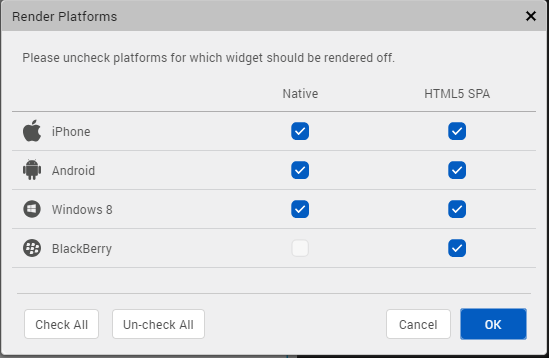

App Menu Properties
===================

The properties for the App Menu are:

* * *

<details close markdown="block"><summary>Appbar Button Style Property</summary>

* * *

Specifies the button style for application bar.

### Syntax

```

style
```

### Remarks

Styles include play button style and pause button style.

### Platform Availability

*   Available in the IDE
*   Windows

* * *

</details>
<details close markdown="block"><summary>enable Property</summary>

* * *

The `enable` property is used to control the actionability of the widgets. In a scenario where you want to display a widget but not invoke any action on the widget, configure the `enable` property to false to achieve it.

This is a constructor level property and applicable for all widgets in Volt MX Iris.

### Syntax

```

enable
```

### Type

Boolean

### Read/Write

Read + Write

### Remarks

The default value of this property is true.

When `enable` property is configured to true, the action associated with a widget can be invoked by the user in the application.

When `enable` property is configured to false, the action associated with a widget cannot be invoked by the user in the application.

### Example

```

//This is a generic property and is applicable for many widgets.  
  
/*The example provided is for the Button widget. Make the changes required in the example while using other widgets.*/
  
frmButton.myBtn.enable= true;
```

### Platform Availability

*   Android, iOS, Windows, SPA, and Desktop web

* * *

</details>
<details close markdown="block"><summary>Event Property</summary>

* * *

Specifies the event for the App Menu item. For more information, see _Volt MX Iris User Guide_.

### Platform Availability

*   Available in the IDE
*   Available on all platforms

* * *

</details>
<details close markdown="block"><summary>focusSkin Property</summary>

* * *

Specifies the look and feel when there is focus on the App Menu.

**Syntax**

```

focusSkin
```

### Type

String

### Read/Write

No

### Remarks

For iPhone and Android, you cannot set a focus skin for the default App Menu items.

### Example

```

frm1.appMenu1.focusSkin=skin1;
```

### Platform Availability

*   Available in the IDE

* * *

</details>
<details close markdown="block"><summary>i18n Key Property</summary>

* * *

Specifies the i18n Key to be used for internationalization.

### Type

String

### Read/Write

No

### Remarks

When an application supports more than one locale and you require different text for a different locale, you have to destroy the form before locale change. Even if the forms are destroyed, the App Menu still remains in the old locale. To overcome this behavior, you have to re-create the App menu every time locale is changed. To recreate the App menu, use the createAppMenu method.

### Platform Availability

*   Available in the IDE
*   Available on all platforms

* * *

</details>
<details close markdown="block"><summary>Icon Property</summary>

* * *

Specifies the image to be displayed for the App Menu item.

### Type

String

### Read/Write

No

### Platform Availability

Available in the IDE

Available on all platforms

* * *

</details>
<details close markdown="block"><summary>id Property</summary>

* * *

A unique identifier of App Menu consisting of alpha numeric characters.

### Platform Availability

*   Available in the IDE
*   Available on all platforms

* * *

</details>
<details close markdown="block"><summary>Position Property</summary>

* * *

Specifies the position of the button for application bar.

### Remarks

Following are the available options:

*   BOTTOM\_LEFT
*   BOTTOM\_RIGHT
*   TOP\_LEFT
*   TOP\_RIGHT

### Platform Availability

*   Available in the IDE
*   Windows

* * *

</details>
<details close markdown="block"><summary>Render Property</summary>

* * *

Specifies if the widget code must be included in the platform when the code is generated.

### Type

String

### Read/Write

No

### Remarks

You can use the _Render_ property to specify the platforms on which the widget will not be available.

By default, the _Render_ property includes all the platforms. You must explicitly clear the check box against the platforms that you want to exclude.

The following illustration shows the render option:  
  


Unlike the _Visible_ property, the _Render_ property does not include the widget in the code generated for the excluded platforms and so the generated code results in an optimized application for the excluded platforms.

When two widgets are placed side by side in an HBox, and you exclude one widget from code generation, the widget which is rendered respects its container weight and does not expand. However, on _Mobile Web advanced platform_, due to the browser behavior, the widget which is rendered does not respect the container weight and expands to occupy the available width.

### Platform Availability

*   Available in the IDE
*   Available on all platforms

* * *

</details>
<details close markdown="block"><summary>retainContentAlignment Property</summary>

* * *

This property is used to retain the content alignment property value, as it was defined.

> **_Note:_** Locale-level configurations take priority when invalid values are given to this property, or if it is not defined.

### The mirroring widget layout properties should be defined as follows.

```

function getIsFlexPositionalShouldMirror(widgetRetainFlexPositionPropertiesValue) {
    return (isI18nLayoutConfigEnabled &&
    localeLayoutConfig[defaultLocale]
    ["mirrorFlexPositionalProperties"] == true &&
    !widgetRetainFlexPositionPropertiesValue);
}
```

### The following table illustrates how widgets consider Local flag and Widget flag values.

  
| Properties | Local Flag Value | Widget Flag Value | Action |
| --- | --- | --- | --- |
| Mirror/retain FlexPositionProperties | true | true | Use the designed layout from widget for all locales. Widget layout overrides everything else. |
| Mirror/retain FlexPositionProperties | true | false | Use Mirror FlexPositionProperties since locale-level Mirror is true. |
| Mirror/retain FlexPositionProperties | true | not specified | Use Mirror FlexPositionProperties since locale-level Mirror is true. |
| Mirror/retain FlexPositionProperties | false | true | Use the designed layout from widget for all locales. Widget layout overrides everything else. |
| Mirror/retain FlexPositionProperties | false | false | Use the Design/Model-specific default layout. |
| Mirror/retain FlexPositionProperties | false | not specified | Use the Design/Model-specific default layout. |
| Mirror/retain FlexPositionProperties | not specified | true | Use the designed layout from widget for all locales. Widget layout overrides everything else. |
| Mirror/retain FlexPositionProperties | not specified | false | Use the Design/Model-specific default layout. |
| Mirror/retain FlexPositionProperties | not specified | not specified | Use the Design/Model-specific default layout. |

### Syntax

```

retainContentAlignment
```

### Type

Boolean

### Read/Write

No (only during widget-construction time)

### Example

```

//This is a generic property that is applicable for various widgets.
//Here, we have shown how to use the retainContentAlignment property for Button widget.
/*You need to make a corresponding use of the 
retainContentAlignment property for other applicable widgets.*/
var btn = new voltmx.ui.Button({
    "focusSkin": "defBtnFocus",
    "height": "50dp",
    "id": "myButton",
    "isVisible": true,
    "left": "0dp",
    "skin": "defBtnNormal",
    "text": "text always from top left",
    "top": "0dp",
    "width": "260dp",
    "zIndex": 1
}, {
    "contentAlignment": constants.CONTENT_ALIGN_TOP_LEFT,
    "displayText": true,
    "padding": [0, 0, 0, 0],
    "paddingInPixel": false,
    "retainFlexPositionProperties": false,
    "retainContentAlignment": true
}, {});
```

### Platform Availability

*   Available in IDE
*   Windows, iOS, Android, and SPA

* * *

</details>
<details close markdown="block"><summary>retainFlexPositionProperties Property</summary>

* * *

This property is used to retain flex positional property values as they were defined. The flex positional properties are left, right, and padding.

> **_Note:_** Locale-level configurations take priority when invalid values are given to this property, or if it is not defined.

### The mirroring widget layout properties should be defined as follows.

```

function getIsFlexPositionalShouldMirror(widgetRetainFlexPositionPropertiesValue) {
    return (isI18nLayoutConfigEnabled &&
    localeLayoutConfig[defaultLocale]
    ["mirrorFlexPositionalProperties"] == true &&
    !widgetRetainFlexPositionPropertiesValue);
}
```

### The following table illustrates how widgets consider Local flag and Widget flag values.

  
| Properties | Local Flag Value | Widget Flag Value | Action |
| --- | --- | --- | --- |
| Mirror/retain FlexPositionProperties | true | true | Use the designed layout from widget for all locales. Widget layout overrides everything else. |
| Mirror/retain FlexPositionProperties | true | false | Use Mirror FlexPositionProperties since locale-level Mirror is true. |
| Mirror/retain FlexPositionProperties | true | not specified | Use Mirror FlexPositionProperties since locale-level Mirror is true. |
| Mirror/retain FlexPositionProperties | false | true | Use the designed layout from widget for all locales. Widget layout overrides everything else. |
| Mirror/retain FlexPositionProperties | false | false | Use the Design/Model-specific default layout. |
| Mirror/retain FlexPositionProperties | false | not specified | Use the Design/Model-specific default layout. |
| Mirror/retain FlexPositionProperties | not specified | true | Use the designed layout from widget for all locales. Widget layout overrides everything else. |
| Mirror/retain FlexPositionProperties | not specified | false | Use the Design/Model-specific default layout. |
| Mirror/retain FlexPositionProperties | not specified | not specified | Use the Design/Model-specific default layout. |

### Syntax

```

retainFlexPositionProperties
```

### Type

Boolean

### Read/Write

No (only during widget-construction time)

### Example

```

//This is a generic property that is applicable for various widgets.
//Here, we have shown how to use the retainFlexPositionProperties property for Button widget.
/*You need to make a corresponding use of the 
retainFlexPositionProperties property for other applicable widgets.*/
var btn = new voltmx.ui.Button({
    "focusSkin": "defBtnFocus",
    "height": "50dp",
    "id": "myButton",
    "isVisible": true,
    "left": "0dp",
    "skin": "defBtnNormal",
    "text": "always left",
    "top": "0dp",
    "width": "260dp",
    "zIndex": 1
}, {
    "contentAlignment": constants.CONTENT_ALIGN_CENTER,
    "displayText": true,
    "padding": [0, 0, 0, 0],
    "paddingInPixel": false,
    "retainFlexPositionProperties": true,
    "retainContentAlignment": false
}, {});
```

### Platform Availability

*   Available in IDE
*   Windows, iOS, Android, and SPA

* * *

</details>
<details close markdown="block"><summary>retainFlowHorizontalAlignment Property</summary>

* * *

This property is used to convert Flow Horizontal Left to Flow Horizontal Right.

> **_Note:_** Locale-level configurations take priority when invalid values are given to this property, or if it is not defined.

### The mirroring widget layout properties should be defined as follows.

```

function getIsFlexPositionalShouldMirror(widgetRetainFlexPositionPropertiesValue) {
    return (isI18nLayoutConfigEnabled &&
    localeLayoutConfig[defaultLocale]
    ["mirrorFlexPositionalProperties"] == true &&
    !widgetRetainFlexPositionPropertiesValue);
}
```

### The following table illustrates how widgets consider Local flag and Widget flag values.

  
| Properties | Local Flag Value | Widget Flag Value | Action |
| --- | --- | --- | --- |
| Mirror/retain FlexPositionProperties | true | true | Use the designed layout from widget for all locales. Widget layout overrides everything else. |
| Mirror/retain FlexPositionProperties | true | false | Use Mirror FlexPositionProperties since locale-level Mirror is true. |
| Mirror/retain FlexPositionProperties | true | not specified | Use Mirror FlexPositionProperties since locale-level Mirror is true. |
| Mirror/retain FlexPositionProperties | false | true | Use the designed layout from widget for all locales. Widget layout overrides everything else. |
| Mirror/retain FlexPositionProperties | false | false | Use the Design/Model-specific default layout. |
| Mirror/retain FlexPositionProperties | false | not specified | Use the Design/Model-specific default layout. |
| Mirror/retain FlexPositionProperties | not specified | true | Use the designed layout from widget for all locales. Widget layout overrides everything else. |
| Mirror/retain FlexPositionProperties | not specified | false | Use the Design/Model-specific default layout. |
| Mirror/retain FlexPositionProperties | not specified | not specified | Use the Design/Model-specific default layout. |

### Syntax

```

retainFlowHorizontalAlignment
```

### Type

Boolean

### Read/Write

No (only during widget-construction time)

### Example

```

//This is a generic property that is applicable for various widgets.
//Here, we have shown how to use the retainFlowHorizontalAlignment property for Button widget.
/*You need to make a corresponding use of the 
retainFlowHorizontalAlignment property for other applicable widgets. */
var btn = new voltmx.ui.Button({
 "focusSkin": "defBtnFocus",
 "height": "50dp",
 "id": "myButton",
 "isVisible": true,
 "left": "0dp",
 "skin": "defBtnNormal",
 "text": "always left",
 "top": "0dp",
 "width": "260dp",
 "zIndex": 1
}, {
 "contentAlignment": constants.CONTENT_ALIGN_CENTER,
 "displayText": true,
 "padding": [0, 0, 0, 0],
 "paddingInPixel": false,
 "retainFlexPositionProperties": true,
 "retainContentAlignment": false,
 "retainFlowHorizontalAlignment ": false
}, {});
```

### Platform Availability

*   Available in IDE
*   Windows, iOS, Android, and SPA

* * *

</details>
<details close markdown="block"><summary>skin Property</summary>

* * *

Specifies the look and feel of the App Menu.

### Type

String

### Read/Write

No

### Remarks

For iPhone and Android, you cannot set a skin for the default App Menu items.

In iOS 7 and 7.1, App Menu supports only single color. If the color is not specified, by default, native color (transparent) is applied to iOS 7 and cyan color is applied to iOS 7.1.

### Platform Availability

*   Available in the IDE

* * *

</details>
<details close markdown="block"><summary>title Property</summary>

* * *

Specifies a general or descriptive text for App Menu.

### Type

String

### Read/Write

No

### Platform Availability

*   Available in the IDE
*   Available on all platforms

* * *
</details>

