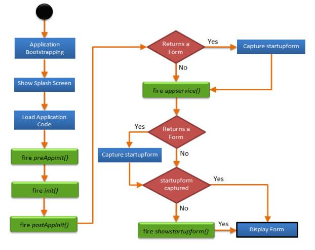

                               

Application Initialization Events
=================================

During the lifecycle of an application, the mobile device usually triggers several events. The APIs in this chapter allow you to listen to these events and override them with application specific functionality.

You should register for application events during the application load event of the project or _masterdataload_ event of the startup form. This chapter consists of the APIs with the namespace **voltmx.application**.

This API is used by the developer to invoke all initialization events such as preappinit, postappinit, init, appservice, showstartupform etc.

The application lifecycle is follows:

Parameters
----------

*   **preappinit**\[params\]:This is an existing event that the developer registers in the IDE per application basis. This event consists of any logic that needs to be executed before the initialization of forms, skins, and any other application initialization activities. For e.g loading the i18n resource bundles dynamically etc.
*   **init**\[params\]: init is generated by the code and consists of the form and skin initialization data.
*   **postappinit**\[params\]: Is an existing event that the developer registers in the IDE per application basis. Developers use this function to define logic that needs to be executed before the first form is shown and after the application is initialized.
    
    postappinit can return a form handle. If postappinit returns a form handle, then the platform shows the form returned from the postappinit callback, otherwise the platform invokes the showstartupform function.
    

*   **appservice**\[params\]:The closure provided against appservice will be invoked by the platform in a sequence. This function also returns the form handle.
    
    appservice can return a form handle. If appservice returns a form handle, then the platform shows the form returned from the appservice callback. If appservice does not return a form handle, the platform invokes the showstartupform function.
    
    If both postappinit and appservice return the form handle then, the form returned by app service is given priority by the platforms.
    

*   **showstartupform**\[params\]: This is a method invoked by the platform to show the startup form, as indicated in the IDE.
    
    This event is invoked only when postappinit returns a nil. If appservice returns a form handle, showstartupform is not invoked.
    

