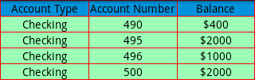

                                  


DataGrid Properties
===================

The configuration properties for the DataGrid widget are:

* * *


<details close markdown="block"><summary>accessibilityConfig Property</summary>

* * *

Enables you to control accessibility behavior and alternative text for the widget.

For more information on using accessibility features in your app, see the [Accessibility](../../../Iris/app_design_dev/Content/Accessibility_Overview.md) appendix in the Volt MX IrisUser Guide.

### Syntax

```

accessibilityConfig
```

### Type

Object

### Read/Write

Read + Write

### Remarks

*   The accessibilityConfig property is enabled for all the widgets which are supported under the Flex Layout.

> **_Note:_** From Volt MX Iris V9 SP2 GA version, you can provide i18n keys as values to all the attributes used inside the `accessibilityConfig` property. Values provided in the i18n keys take precedence over values provided in `a11yLabel`, `a11yValue`, and `a11yHint` fields.

The accessibilityConfig property is a JavaScript object which can contain the following key-value pairs.

  
| Key | Type | Description | ARIA Equivalent |
| --- | --- | --- | --- |
| a11yIndex | Integer with no floating or decimal number. | This is an optional parameter. Specifies the order in which the widgets are focused on a screen. | For all widgets, this parameter maps to the `aria-index`, `index`, or `taborder` properties. |
| a11yLabel | String | This is an optional parameter. Specifies alternate text to identify the widget. Generally the label should be the text that is displayed on the screen. | For all widgets, this parameter maps to the `aria-labelledby` property of ARIA in HTML. > **_Note:_** For the Image widget, this parameter maps to the **alt** attribute of ARIA in HTML. |
| a11yValue | String | This is an optional parameter. Specifies the descriptive text that explains the action associated with the widget. On the Android platform, the text specified for a11yValue is prefixed to the a11yHint. | This parameter is similar to the a11yLabel parameter. If the a11yValue is defined, the value of a11yValue is appended to the value of a11yLabel. These values are separated by a space. |
| a11yHint | String | This is an optional parameter. Specifies the descriptive text that explains the action associated with the widget. On the Android platform, the text specified for a11yValue is prefixed to the a11yHint. | For all widgets, this parameter maps to the `aria-describedby` property of ARIA in HTML. |
| a11yHidden | Boolean | This is an optional parameter. Specifies if the widget should be ignored by assistive technology. The default option is set to _false_. This option is supported on iOS 5.0 and above, Android 4.1 and above, and SPA | For all widgets, this parameter maps to the `aria-hidden` property of ARIA in HTML. |
| a11yARIA | Object | This is an optional parameter. For each widget, the key and value provided in this object are added as the attribute and value of the HTML tags respectively. Any values provided for attributes such as `aria-labelledby` and `aria-describedby` using this attribute, takes precedence over values given in `a11yLabel` and `a11yHint` fields. When a widget is provided with the following key value pair or attribute using the a11yARIA object, the tabIndex of the widget is automatically appended as zero.`{"role": "main"}``aria-label` | This parameter is only available on the Desktop Web platform. |

### Android limitations

*   If the results of the concatenation of a11y fields result in an empty string, then `accessibilityConfig` is ignored and the text that is on widget is read out.
*   The soft keypad does not gain accessibility focus during the right/left swipe gesture when the keypad appears.

SPA/Desktop Web limitations

*   When `accessibilityConfig` property is configured for any widget, the `tabIndex` attribute is added automatically to the `accessibilityConfig` property.
*   The behavior of accessibility depends on the Web browser, Web browser version, Voice Over Assistant, and Voice Over Assistant version.
*   Currently SPA/Desktop web applications support only a few ARIA tags. To achieve more accessibility features, use the attribute a11yARIA. The corresponding tags will be added to the DOM as per these configurations.

### Example 1

This example uses the button widget, but the principle remains the same for all widgets that have an accessibilityConfig property.

```
//This is a generic property that is applicable for various widgets.
//Here, we have shown how to use the accessibilityConfig Property for button widget.
/* You need to make a corresponding use of the accessibilityConfig property for other applicable widgets. */

Form1.myButton.accessibilityConfig = {
    "a11yLabel": "Label",
    "a11yValue": "Value",
    "a11yHint": "Hint"    
};
```

### Example 2

This example uses the button widget to implement internationalization in `accessibilityConfig` property, but the principle remains the same for all widgets.

```
/* Sample code to implement internationalization in accessibilityConfig property in Native platform. */

Form1.myButton.accessibilityConfig = {
    "a11yLabel": voltmx.i18n.getLocalizedString("key1")     
};  
/* Sample code to implement internationalization in accessibilityConfig property in Desktop Web platform.*/

Form1.myButton.accessibilityConfig = {
    "a11yLabel": "voltmx.i18n.getLocalizedString("key3")"
};
```

### Platform Availability

*   Available in the IDE
*   iOS, Android, SPA, and Desktop Web

* * *

</details>
<details close markdown="block"><summary>anchorPoint Property</summary>

* * *

Specifies the anchor point of the widget bounds rectangle using the widget's coordinate space.

### Syntax

```

anchorPoint
```

### Type

JSObject

### Read/Write

Read + Write

### Remarks

The value for this property is a JavaScript dictionary object with the keys "x" and "y". The values for the "x" and "y" keys are floating-point numbers ranging from 0 to 1. All geometric manipulations to the widget occur about the specified point. For example, applying a rotation transform to a widget with the default anchor point causes the widget to rotate around its center.

The default value for this property is center ( {"x":0.5, "y":0.5} ), that represents the center of the widgets bounds rectangle. The behavior is undefined if the values are outside the range zero (0) to one (1).

### Example

```

Form1.widget1.anchorPoint = {
    "x": 0.5,
    "y": 0.5
};
```

### Platform Availability

*   iOS, Android, Windows, and SPA

* * *

</details>
<details close markdown="block"><summary>bottom Property</summary>

* * *

This property determines the bottom edge of the widget and is measured from the bottom bounds of the parent container.

The bottom property determines the position of the bottom edge of the widget’s bounding box. The value may be set using DP (Device Independent Pixels), Percentage, or Pixels. In freeform layout, the distance is measured from the bottom edge of the parent container. In flow-vertical layout, the value is ignored. In flow-horizontal layout, the value is ignored.

The bottom property is used only if the Height property is not provided.

### Syntax

```

bottom
```

### Type

String

### Read/Write

Read + Write

### Remarks

The property determines the bottom edge of the widget and is measured from the bottom bounds of the parent container.

If the layoutType is set as voltmx.flex.FLOW\_VERTICAL, the bottom property is measured from the top edge of bottom sibling widget. The vertical space between two widgets is measured from bottom of the top sibling widget and the top of the bottom sibling widget.

### Example

```
//Sample code to set the bottom property for widgets by using DP, Percentage and Pixels.
frmHome.widgetID.bottom = "50dp";

frmHome.widgetID.bottom = "10%";

frmHome.widgetID.bottom = "10px";
```

### Platform Availability

*   Available in the IDE
*   iOS, Android, Windows, SPA , and Desktop Web

* * *

</details>
<details close markdown="block"><summary>centerX Property</summary>

* * *

This property determines the center of a widget measured from the left bounds of the parent container.

The centerX property determines the horizontal center of the widget’s bounding box. The value may be set using DP (Device Independent Pixels), Percentage, or Pixels. In freeform layout, the distance is measured from the left edge of the parent container. In flow-vertical layout, the distance is measured from the left edge of the parent container. In flow-horizontal layout, the distance is measured from the right edge of the previous sibling widget in the hierarchy.

### Syntax

```

centerX
```

### Type

String

### Read/Write

Read + Write

### Remarks

If the layoutType is set as voltmx.flex.FLOW\_HORIZONTAL, the centerX property is measured from right edge of the left sibling widget.

### Example

```
 //Sample code to set the centerX property for widgets by using DP, Percentage and Pixels.
frmHome.widgetID.centerX = "50dp";

frmHome.widgetID.centerX = "10%";

frmHome.widgetID.centerX = "10px";
```

### Platform Availability

*   Available in the IDE
*   iOS, Android, Windows, SPA, and Desktop Web

* * *

</details>
<details close markdown="block"><summary>centerY Property</summary>

* * *

This property determines the center of a widget measured from the top bounds of the parent container.

The centerY property determines the vertical center of the widget’s bounding box. The value may be set using DP (Device Independent Pixels), Percentage, or Pixels. In freeform layout, the distance is measured from the top edge of the parent container. In flow-horizontal layout, the distance is measured from the top edge of the parent container. In flow-vertical layout, the distance is measured from the bottom edge of the previous sibling widget in the hierarchy.

### Syntax

```

centerY
```

### Type

String

### Read/Write

Read + Write

### Remarks

If the layoutType is set as voltmx.flex.FLOW\_VERTICAL, the centerY property is measured from bottom edge of the top sibling widget.

### Example

```
//Sample code to set the centerY property for widgets by using DP, Percentage and Pixels.
frmHome.widgetID.centerY = "50dp";

frmHome.widgetID.centerY = "10%";

frmHome.widgetID.centerY = "10px";
```

### Platform Availability

*   Available in the IDE
*   iOS, Android, Windows, SPA, and Desktop Web

</details>
<details close markdown="block"><summary>columnHeadersConfig Property</summary>

* * *

It is a property to define the number of columns and the type of each column and their meta properties. The number of elements in the Array defines the number of columns.

### Syntax

```

columnHeadersConfig
```

### Type

Array of Objects

### Read/Write

No

### Remarks

The column JSObject must contain the properties from following column details properties.

* **columnID** \[Mandatory\] - A unique string identifier to represent a column.
* **columnType**\[Mandatory\] - Specifies the type of the column. Following are the available options:   
    *   DATAGRID\_COLUMN\_TYPE\_TEXT (default)
    *   DATAGRID\_COLUMN\_TYPE\_IMAGE
    *   DATAGRID\_COLUMN\_TYPE\_TEMPLATE (supported on desktop web only)
* **columnHeaderText** \[Mandatory\] - The text string that is displayed as header of column.
* **columnHeaderTemplate** \[Mandatory\] - The template box reference (a composition of widgets in a HBox or VBox) to be set as header. This property overrides columnHeaderText (supported on desktop web only.)
* **columnDataTemplate** \[Mandatory\]- The template box reference to be used to create a row cell for this column (supported on desktop web only.)
* **columnWidthInPercentage** \[Mandatory\] - The amount of width in percentage to be occupied from the widget space. The sum of all the values in each column should be exactly 100% otherwise the behavior is undefined.
* **isColumnSortable** \[Optional\]- A Boolean property to specify whether the column must be sorted. If set to _true_, the rows are reordered as per the sorting order.
* **columnOnClick** \[Optional\]- The event callback is invoked by the platform when a column is clicked.
* **columnContentAlignment** \[Optional\]- Specifies the alignment of the text or image within a column.  
      
    The available options are:
    *   CONTENT\_ALIGN\_TOP\_LEFT
    *   CONTENT\_ALIGN\_TOP\_CENTER
    *   CONTENT\_ALIGN\_TOP\_RIGHT
    *   CONTENT\_ALIGN\_MIDDLE\_LEFT
    *   CONTENT\_ALIGN\_CENTER (default)
    *   CONTENT\_ALIGN\_MIDDLE\_RIGHT
    *   CONTENT\_ALIGN\_BOTTOM\_LEFT
    *   CONTENT\_ALIGN\_BOTTOM\_CENTER
    *   CONTENT\_ALIGN\_BOTTOM\_RIGHT

### Example

```
 //Sample code to set the columnHeadersConfig property for a DataGrid widget.

var dgridBasic = {
    id: "dgrid",
    info: {
        key: "This is datagrid"
    },
    isVisible: true,
    headerSkin: "hSkin",
    rowNormalSkin: "rNSkin",
    rowFocusSkin: "rFSkin",
    rowAlternateSkin: "rASkin",
    showColumnHeaders: true,
    columnHeadersConfig: [{
        columnID: "col1",
        columnType: constants.DATAGRID_COLUMN_TYPE_TEXT,
        columnHeaderText: "Account Type",
        columnWidthInPercentage: 40
    }, {
        columnID: "col2",
        columnType: constants.DATAGRID_COLUMN_TYPE_TEXT,
        columnHeaderText: "Account Number",
        columnWidthInPercentage: 30
    }, {
        columnID: "col3",
        columnType: constants.DATAGRID_COLUMN_TYPE_TEXT,
        columnHeaderText: "Balance",
        columnWidthInPercentage: 30
    }],
    isMultiSelect: true,
    data: [{
        col1: "Checking",
        col2: "490",
        col3: "$400",
        metainfo: {
            skin: "rowskin1",
            col1_skin: "colskin1"
        }
    }, {
        col1: "Checking",
        col2: "494",
        col3: "$2000.34"
    }, {
        col1: "Savings",
        col2: "567",
        col3: "$4000"
    }]
};

var dgridLayout = {
    widgetAlignment: constants.WIDGET_ALIGN_TOP_LEFT,
    contentAlignment: constants.CONTENT_ALIGN_CENTER,
    containerWeight: 99,
    padding: [5, 5, 5, 5],
    margin: [5, 5, 5, 5]
};

var dgridPSP = {};

//Creating the dataGrid.	
var dgrid = new voltmx.ui.DataGrid(dgridBasic, dgridLayout, dgridPSP);
```

### Platform Availability

Available in the IDE.

Available on all platforms.

* * *

</details>
<details close markdown="block"><summary>containerHeight Property</summary>

* * *

Specifies the container height of the datagrid in percentage (%). Height is calculated with respect to the width of the datagrid.

### Syntax

```

containerHeight
```

### Type

Number

### Read/Write

Read only

### Example

```
//Sample code to read the containerHeight property for a DataGrid Widget.
var contHeight=frmDataGrid.myDataGrid.containerHeight;  
voltmx.print("The height of the container of the DataGrid widget is:"+contHeight);  

```

### Platform Availability

Available in the IDE.

This property is available on Desktop Web.

* * *

</details>
<details close markdown="block"><summary>containerHeightInPixel Property</summary>

* * *

Specifies the container height of the datagrid in pixels.

### Syntax

```

containerHeightInPixel
```

### Type

Number

### Read/Write

Read only

### Example

```
//Sample code to read the containerHeightInPixel eight property for a DataGrid Widget.
var contHeight = frmDataGrid.myDataGrid.containerHeightInPixel;
voltmx.print("The height of the container in Pixels of the DataGrid widget is:" + contHeight);  

```

### Platform Availability

Available in the IDE.

This property is available on Desktop Web.

* * *

</details>
<details close markdown="block"><summary>cursorType Property</summary>

* * *

In Desktop Web applications, when you hover the mouse over any widget, a mouse pointer appears. Using the cursorType property in Iris, you can specify the type of the mouse pointer.

### Syntax

```

cursorType
```

### Type

String.

You must provide valid CSS cursor value such as wait, grab, help, etc. to the cursorType property.

### Read/Write

Read + Write

### Remarks

To add the `cursorType` property using Volt MX Iris in a Desktop Web application, follow these steps.

1.  In Volt MX Iris, open the Desktop Web application. From the **Project** explorer, expand **Responsive Web/ Desktop**\> **Forms** and select the form to which you need to make the changes.
2.  On the canvas, select the widget for which you want to specify the cursor type. For example, button.
3.  From the **Properties** panel, navigate to the **Skin** tab > **Hover Skin** tab.  
    You will find that the details of the hover skin is not enabled here.
4.  Check the **Enable** option to add a hover skin to your widget.  
    The details and configurations of the hover skin is enabled.
5.  Under the **General** section, for the Platform option, click the ellipsis icon.  
    The **Fork Skin** window appears.
6.  In the **Fork Skin** window, for **Desktop**, check under **HTML5 SPA**.
7.  Click **Ok**. You have successfully forked your hover skin for Desktop Web application.  
    You can see that the **Cursor Type** property has been added under the **General** section.
8.  Select a value from the drop-down list to set the **Cursor Type** for the widget.

### Example

```
 //This is a generic property and is applicable for many widgets.  
  
/* The example provided is for the Button widget. Make the required changes in the example while using other widgets. */
  
frmButton.myButton.cursorType = "wait";

```

### Platform Availability

*   Available in IDE
*   Desktop Web

* * *

</details>
<details close markdown="block"><summary>data Property</summary>

* * *

Array of JSObjects which represents the actual data to be rendered in each row. Each element in array represents one row data.

### Syntax

```

data
```

### Type

Array

### Read/Write

Read + Write

### Remarks

The row data should be represented as a pair of "columnID" defined from [columnHeaderConfig](#columnHeadersConfig) and its value as per the type of the column.

*   If column type is DATAGRID\_COLUMN\_TYPE\_TEXT, the value should be of String datatype.
*   If column type is DATAGRID\_COLUMN\_TYPE\_IMAGE, the value should be of String datatype representing the image filename or url.
*   If column type is DATAGRID\_COLUMN\_TYPE\_TEMPLATE, the value should be a JSObject with values assigning to each widgetid.

```
/*Example data for three column datagrid with 3 columns as 
columnid1 (TEXT type), columnid2(IMAGE type), columnid3(TEXT type): */
data = [{
    columnid1: "mytext",
    columnid2: "myimage.png",
    columnid3: "row one"
}, {
    columnid1: "mytext2",
    columnid2: "myimage2.png",
    columnid3: "row two"
}, {
    columnid1: "mytext3",
    columnid2: "myimage.png",
    columnid3: "row three"
}];
//adding 3 rows
}
```
```

/* Example for column with type template: 
columnid1 (TEXT type), columnid2(IMAGE type), columnid3(TEMPLATE type) 
Assuming the template has one label widget with id "labelwidgetid" 
and one image widget with id "imagewidgetid", 
the data construct should be as follows: */
data = [{
    columnid1: "mytext",
    columnid2: "myimage.png",
    columnid3: {
        labelwidgetid: {
            text: "labeltext",
            skin: "blueskin"
        },
        imagewidgetid: {
            src: "image.png"
        }
    }
}, {
    columnid1: "mytext2",
    columnid2: "myimage2.png",
    columnid3: {
        labelwidgetid: {
            text: "labeltext",
            skin: "blueskin"
        },
        imagewidgetid: {
            src: "image.png"
        }
    }
}]; //adding 2 rows
```

> **_Note:_** DATAGRID\_COLUMN\_TYPE\_TEMPLATE is supported only in desktop web.

To specify the data within the columns and rows,

1.  Click the Ellipsis () button against the Master Data property.The Data Grid Editor window appears.

> **_Note:_** You cannot specify data in the Rows tab unless you specify the data in the Column tab.

1.  In the Column tab you can specify the following for each column:  
      
    1.  ID: This is the unique identifier of a column.
    2.  Header Type: Specifies the header type as grid template or text for a column.
    3.  Header: Specifies the template name for a column
    4.  Header Data: Specifies the property values for the widgets defined in the template. For example, if your template has a Label widget and an Image widget, then you can update Text and Text i18n Key properties for Label widget and Source property for Image Widget.
    5.  Column Type: Specifies the column to display a template or text.
    6.  Column: Specifies the template name for a column.
    7.  Width in percentage: Specifies the width of the column in percentage.
    8.  Sort: Specifies if sorting is allowed for the column.
    9.  Column alignment: Specifies the alignment of the content in each column. The content can be aligned as, top-left, top-center, top-right, middle-left, middle-center, middle-right, bottom-left, bottom-center, or bottom-right.
    10.  OnClick event: Specifies the event that takes place when you click on the header of a column. To specify an Onclick event for a column, click the ellipses button for that subsequent column.
2.  In the Rows tab, all the column headers that you specify in the Column tab appear as the headers for rows. You can enter the required data for each row.  
    

> **_Note:_** After specifying the columns and rows, you can alternatively choose to specify the data from the code using the [DataGrid Methods](DataGrid_Methods.md) instead of the data property.

### Example

```
//Sample code to set the data property for a DataGrid widget.

frmDataGrid.myDataGrid.data = [{
 col1: "Checking",
 col2: "490",
 col3: "$400",
 metainfo: {
  skin: "rowskin1",
  col1_skin: "colskin1"
 }
}, {
 col1: "Checking",
 col2: "494",
 col3: "$2000.34"
}, {
 col1: "Savings",
 col2: "567",
 col3: "$4000"
}];
```

### Platform Availability

Available in the IDE.

Available on all platforms.

* * *

</details>
<details close markdown="block"><summary>dockingHeader Property</summary>

* * *

Specifies if headers are to be docked in the datagrid.

### Syntax

```

dockingHeader
```

### Type

Boolean

### Read/Write

Read only

### Remarks

The default for this property is false. If set to _true,_ the headers are docked in the datagrid. If set to _false,_ the headers are not docked in the datagrid.

### Example

```
//Sample code to set the dockingHeader property for a DataGrid Widget.
 frmDataGrid.myDataGrid.dockingHeader=true;

```

### Platform Availability

Available in the IDE.

This property is available on Desktop Web.

* * *

</details>
<details close markdown="block"><summary>enable Property</summary>

* * *

The `enable` property is used to control the actionability of the widgets. In a scenario where you want to display a widget but not invoke any action on the widget, configure the `enable` property to false to achieve it.

This is a constructor level property and applicable for all widgets in Volt MX Iris.

### Syntax

```

enable
```

### Type

Boolean

### Read/Write

Read + Write

### Remarks

The default value of this property is true.

When `enable` property is configured to true, the action associated with a widget can be invoked by the user in the application.

When `enable` property is configured to false, the action associated with a widget cannot be invoked by the user in the application.

### Example

```
//This is a generic property and is applicable for many widgets.  
  
/* The example provided is for the Button widget. Make the changes required in the example while using other widgets. */
  
frmButton.myBtn.enable= true;
```

### Platform Availability

*   Android, iOS, Windows, SPA, and Desktop web

 

* * *

</details>
<details close markdown="block"><summary>enableCache Property</summary>

* * *

The property enables you to improve the performance of Positional Dimension Animations.

### Syntax

```

enableCache
```

### Type

Boolean

### Read/Write

Read + Write

### Remarks

The default value for this property is true.

> **_Note:_** When the property is used, application consumes more memory. The usage of the property enables tradeoff between performance and visual quality of the content. Use the property cautiously.

### Example

```

Form1.widgetID.enableCache = true;
```

### Platform Availability

*   Available in the IDE.
*   Windows

* * *

</details>
<details close markdown="block"><summary>enableScrollBar Property</summary>

* * *

Specifies if the scrollbars on the datagrid is to be displayed vertically or the default option is to be retained.

### Syntax

```

enableScrollBar
```

### Type

Number

### Read/Write

Read only

### Remarks

The available options are:

*   DATAGRID\_SCROLLBAR\_NONE:  This is the default option. It specifies that no scrollbars are to be applied to datagrid.
*   DATAGRID\_SCROLLBAR\_VERTICAL: Specifies that the scrollbars are to be displayed vertically.

### Example

```
//Sample code to set the enableScrollBar property for a DataGrid Widget.
 frmDataGrid.myDataGrid.enableScrollBar=constants.DATAGRID_SCROLLBAR_VERTICAL;
  

```

### Platform Availability

Available in the IDE.

This property is available on Desktop Web.

* * *

</details>
<details close markdown="block"><summary>gridHeight Property</summary>

* * *

Specifies the height of the DataGrid based in percentage or in pixel. The percentage is calculated based on the height of the form.

### Syntax

```

gridHeight
```

### Type

Number

### Read/Write

No

### Remarks

There is not default value for this property.

### Example

```
 //Sample code to set the gridHeight property for a DataGrid Widget as eight.
 frmDataGrid.myDataGrid.gridHeight=8;

```

### Platform Availability

Not available in the IDE.

Available on Desktop Web platform only.

* * *

</details>
<details close markdown="block"><summary>gridlineColor Property</summary>

* * *

Specifies the color of the grid line of the DataGrid. The color should be specified in the format of "RGBA" in hex. For example "FF224400".

### Syntax

```

gridlineColor
```

### Type

String

### Read/Write

Write only

### Remarks

The following image illustrates the Gridline color applied to the DataGrid:



### Example

```
//Sample code to set the gridlineColor property for a DataGrid Widget to Red.
 frmDataGrid.myDataGrid.gridlineColor="FF0044";  

```

### Platform Availability

Available in the IDE.

*   Android
*   Windows

* * *

</details>
<details close markdown="block"><summary>headerSkin Property</summary>

* * *

This is a skin property. This property specifies the skin that must be applied to the Header row.

### Syntax

```

headerSkin
```

### Type

String

### Read/Write

Read + Write

### Example

```
//Sample code to set the headerSkin property for a DataGrid Widget.
 frmDataGrid.myDataGrid.headerSkin="hSkin";

```

### Platform Availability

Available in the IDE.

Available on all platforms.

* * *

</details>
<details close markdown="block"><summary>height Property</summary>

* * *

It determines the height of the widget and measured along the y-axis.

The height property determines the height of the widget’s bounding box. The value may be set using DP (Device Independent Pixels), Percentage, or Pixels. For supported widgets, the height may be derived from either the widget or container’s contents by setting the height to “preferred”.

### Syntax

```

height
```

### Type

Number, String, and Constant

### Read/Write

Read + Write

### Remarks

Following are the available measurement options:

*   %: Specifies the values in percentage relative to the parent dimensions.
*   px: Specifies the values in terms of device hardware pixels.
*   dp: Specifies the values in terms of device independent pixels.
*   default: Specifies the default value of the widget.
*   voltmx.flex.USE\_PREFERED\_SIZE: When this option is specified, the layout uses preferred height of the widget as height and preferred size of the widget is determined by the widget and may varies between platforms.

### Example

```
/*Sample code to set the height property for a datagrid widget by using DP, Percentage and Pixels.*/
frmHome.datagrid1.height="50dp";

frmHome.datagrid1. height="10%";

frmHome.datagrid1. height="10px";
```

### Platform Availability

*   Available in the IDE
*   iOS
*   Android
*   Windows
*   SPA

* * *

</details>
<details close markdown="block"><summary>hoverSkin Property</summary>

* * *

Specifies the look and feel of a widget when the cursor hovers on the widget.

### Syntax

```

hoverSkin
```

### Type

String

### Read/Write

Read + Write

### Example

```
//Sample code to set the hoverSkin property for a DataGrid Widget.
 frmDataGrid.myDataGrid.hoverSkin="hoSkin";

```

### Platform Availability

*   Available in the IDE.
*   Windows

* * *

</details>
<details close markdown="block"><summary>id Property</summary>

* * *

id is a unique identifier of a DataGrid consisting of alpha numeric characters. Every DataGrid widget should have a unique id within a Form.

### Syntax

```

id
```

### Type

String - \[Mandatory\]

### Read/Write

Read only

### Example

```
//Defining the properties for dataGrid with ID :"dgrid".
var dgridBasic = {
    id: "dgrid",
    info: {
        key: "This is datagrid"
    },
    isVisible: true,
    headerSkin: "hSkin",
    rowNormalSkin: "rNSkin",
    rowFocusSkin: "rFSkin",
    rowAlternateSkin: "rASkin",
    showColumnHeaders: true,
    columnHeadersConfig: [{
        columnID: "col1",
        columnType: constants.DATAGRID_COLUMN_TYPE_TEXT,
        columnHeaderText: "Account Type",
        columnWidthInPercentage: 40
    }, {
        columnID: "col2",
        columnType: constants.DATAGRID_COLUMN_TYPE_TEXT,
        columnHeaderText: "Account Number",
        columnWidthInPercentage: 30
    }, {
        columnID: "col3",
        columnType: constants.DATAGRID_COLUMN_TYPE_TEXT,
        columnHeaderText: "Balance",
        columnWidthInPercentage: 30
    }],
    isMultiSelect: true,
    data: [{
        col1: "Checking",
        col2: "490",
        col3: "$400",
        metainfo: {
            skin: "rowskin1",
            col1_skin: "colskin1"
        }
    }, {
        col1: "Checking",
        col2: "494",
        col3: "$2000.34"
    }, {
        col1: "Savings",
        col2: "567",
        col3: "$4000"
    }]
};

var dgridLayout = {
    widgetAlignment: constants.WIDGET_ALIGN_TOP_LEFT,
    contentAlignment: constants.CONTENT_ALIGN_CENTER,
    containerWeight: 99,
    padding: [5, 5, 5, 5],
    margin: [5, 5, 5, 5]
};

var dgridPSP = {};

//Creating the dataGrid.	
var dgrid = new voltmx.ui.DataGrid(dgridBasic, dgridLayout, dgridPSP);
```

### Platform Availability

Available in the IDE.

Available on all platforms.

</details>
<details close markdown="block"><summary>info Property</summary>

* * *

A custom JSObject with the key value pairs that a developer can use to store the context with the widget. This will help in avoiding the globals to most part of the programming.

### Syntax

```

info
```

### Type

JSObject

### Read/Write

Read + Write

### Remarks

This is a **non-Constructor** property. You cannot set this property through widget constructor. But you can read and write data to it.

Info property can hold any JSObject. After assigning the JSObject to info property, the JSObject should not be modified. For example,

```
var inf = {
    a: 'hello'
};
widget.info = inf; //works
widget.info.a = 'hello world';
/* This will not update the widget info a property to Hello world. 
widget.info.a will have old value as hello.*/
```

### Example

```
//Sample code to set info property for a DataGrid widget.

frmDataGrid.myDataGrid.info = {
    key: "This is datagrid"
};

//Reading the info of the Camera widget.
voltmx.print("DataGrid widget info ::" +frmDataGrid.myDataGrid.info);
```

### Platform Availability

Not available in the IDE.

Available on all platforms.

</details>
<details close markdown="block"><summary>isMultiSelect Property</summary>

* * *

An option to make the datagrid as multi selectable row. The selected rows are indicated by highlighting the rows by focus skin.

### Syntax

```

isMultiSelect
```

### Type

Boolean

### Read/Write

Read + Write

### Remarks

The default value for this property is false. If set to _true_, multiple rows are selected. If set to _false_, multiple rows are not selected.

> **_Note:_** Ensure to specify [rowFocusSkin](#rowFocusSkin), otherwise the user won't be able to visually identify the selected rows.

### Example

```
//Sample code to enable isMultiSelect property for a DataGrid Widget.
 frmDataGrid.myDataGrid.isMultiSelect=true;

```

### Platform Availability

Available in the IDE.

Available on all platforms.

</details>
<details close markdown="block"><summary>isVisible Property</summary>

* * *

This property controls the visibility of a widget on the form.

### Syntax

```

isVisible
```

### Type

Boolean

### Read/Write

Read + Write

### Remarks

The default value for this property is true. If set to _false,_ the widget is not displayed. If set to _true,_ the widget is displayed.

> **_Note:_** You can set the visibility of a widget dynamically from code using the setVisibility method.

### Example

```
//Sample code to enable isVisible property for a DataGrid Widget.
 frmDataGrid.myDataGrid.isVisible=true;

```

### Platform Availability

Available in the IDE.

Available on all platforms.

</details>
<details close markdown="block"><summary>left Property</summary>

* * *

This property determines the lower left corner edge of the widget and is measured from the left bounds of the parent container.

The left property determines the position of the left edge of the widget’s bounding box. The value may be set using DP (Device Independent Pixels), Percentage, or Pixels. In freeform layout, the distance is measured from the left edge of the parent container. In flow-vertical layout, the distance is measured from the left edge of the parent container. In flow-horizontal layout, the distance is measured from the right edge of the previous sibling widget in the hierarchy.

### Syntax

```

left
```

### Type

String

### Read/Write

Read + Write

### Remarks

If the layoutType is set as voltmx.flex.FLOW\_HORIZONTAL, the left property is measured from right edge of the left sibling widget.

### Example

```
//Sample code to set the left property for widgets by using DP, Percentage and Pixels.
frmHome.widgetID.left = "50dp";

frmHome.widgetID.left = "10%";

frmHome.widgetID.left = "10px";
```

### Platform Availability

*   Available in the IDE
*   iOS, Android, Windows, SPA, and Desktop Web

</details>
<details close markdown="block"><summary>maxHeight Property</summary>

* * *

This property specifies the maximum height of the widget and is applicable only when the height property is not specified.

The maxHeight property determines the maximum height of the widget’s bounding box. The value may be set using DP (Device Independent Pixels), Percentage, or Pixels. The maxHeight value overrides the preferred, or “autogrow” height, if the maxHeight is less than the derived content height of the widget.

### Syntax

```

maxHeight
```

### Type

```

Number
```

### Read/Write

Read + Write

### Example

```
//Sample code to set the maxHeight property for widgets by using DP, Percentage and Pixels.
frmHome.widgetID.maxHeight = "50dp";

frmHome.widgetID.maxHeight = "10%";

frmHome.widgetID.maxHeight = "10px";
```

### Platform Availability

*   Available in the IDE
*   iOS, Android, Windows, SPA, and Desktop Web

</details>
<details close markdown="block"><summary>maxWidth Property</summary>

* * *

This property specifies the maximum width of the widget and is applicable only when the width property is not specified.

The Width property determines the maximum width of the widget’s bounding box. The value may be set using DP (Device Independent Pixels), Percentage, or Pixels. The maxWidth value overrides the preferred, or “autogrow” width, if the maxWidth is less than the derived content width of the widget.

### Syntax

```

maxWidth
```

### Type

Number

### Read/Write

Read + Write

### Example
 
```
//Sample code to set the maxWidth property for widgets by using DP, Percentage and Pixels.
frmHome.widgetID.maxWidth = "50dp";

frmHome.widgetID.maxWidth = "10%";

frmHome.widgetID.maxWidth = "10px";
```

### Platform Availability

*   Available in the IDE
*   iOS, Android, Windows, SPA, and Desktop Web

</details>
<details close markdown="block"><summary>minHeight Property</summary>

* * *

This property specifies the minimum height of the widget and is applicable only when the height property is not specified.

The minHeight property determines the minimum height of the widget’s bounding box. The value may be set using DP (Device Independent Pixels), Percentage, or Pixels. The minHeight value overrides the preferred, or “autogrow” height, if the minHeight is larger than the derived content height of the widget.

### Syntax

```

minHeight
```

### Type

Number

### Read/Write

Read + Write

### Example

```
//Sample code to set the minHeight property for widgets by using DP, Percentage and Pixels.
frmHome.widgetID.minHeight = "50dp";

frmHome.widgetID.minHeight = "10%";

frmHome.widgetID.minHeight = "10px";
```

### Platform Availability

*   Available in the IDE
*   iOS, Android, Windows, SPA, and Desktop Web

</details>
<details close markdown="block"><summary>minWidth Property</summary>

* * *

This property specifies the minimum width of the widget and is applicable only when the width property is not specified.

The minWidth property determines the minimum width of the widget’s bounding box. The value may be set using DP (Device Independent Pixels), Percentage, or Pixels. The minWidth value overrides the preferred, or “autogrow” width, if the minWidth is larger than the derived content width of the widget.

### Syntax

```

minWidth
```

### Type

Number

### Read/Write

Read only

### Example

```
//Sample code to set the minWidth property for widgets by using DP, Percentage and Pixels.
frmHome.widgetID.minWidth = "50dp";

frmHome.widgetID.minWidth = "10%";

frmHome.widgetID.minWidth = "10px";
```

### Platform Availability

*   Available in the IDE
*   iOS, Android, Windows, SPA, and Desktop Web

</details>
<details close markdown="block"><summary>opacity Property</summary>

* * *

Specifies the opacity of the widget. The value of this property must be in the range 0.0 (transparent) to 1.0 (opaque). Any values outside this range are fixed to the nearest minimum or maximum value.

Specifies the opacity of the widget. Valid opacity values range from 0.0 (transparent), to 1.0 (opaque). Values set to less than zero will default to zero. Values more than 1.0 will default to 1. Interaction events set on a transparent widget will still be fired. To disable the events, also set the “isVisible” property to “false”.

### Syntax

```

opacity
```

### Type

Number

### Read/Write

Read + Write

Remarks

> **_Note:_** This property has more priority compared to the values coming from the configured skin.

### Example

```
//Sample code to make the widget transparent by using the opacity property.
frmHome.widgetID.opacity = 0;

//Sample code to make the widget opaque by using the opacity property.
frmHome.widgetID.opacity = 1;
```

### Platform Availability

*   Not available in the IDE.
*   iOS, Android, Windows, SPA, and Desktop Web

</details>
<details close markdown="block"><summary>parent Property</summary>

* * *

Helps you access the parent of the widget. If the widget is not part of the widget hierarchy, the parent property returns null.

### Syntax

```

parent
```

### Read/Write

Read only

### Remarks

> **_Note:_** The property works for all the widgets inside a FlexForm, FlexContainer or FlexScrollContainer.

### Example

```
function func() {

    voltmx.print("The parent of the widget" + JSON.stringify(Form1.widgetID.parent));

}
```

### Platform Availability

*   Not available in the IDE
*   iOS, Android, Windows, SPA, and Desktop Web

* * *

</details>
<details close markdown="block"><summary>retainContentAlignment Property</summary>

* * *

This property is used to retain the content alignment property value, as it was defined.

> **_Note:_** Locale-level configurations take priority when invalid values are given to this property, or if it is not defined.

The mirroring widget layout properties should be defined as follows.

```
function getIsFlexPositionalShouldMirror(widgetRetainFlexPositionPropertiesValue) {
    return (isI18nLayoutConfigEnabled &&
    localeLayoutConfig[defaultLocale]
    ["mirrorFlexPositionalProperties"] == true &&
    !widgetRetainFlexPositionPropertiesValue);
}
```

The following table illustrates how widgets consider Local flag and Widget flag values.

  
| Properties | Local Flag Value | Widget Flag Value | Action |
| --- | --- | --- | --- |
| Mirror/retain FlexPositionProperties | true | true | Use the designed layout from widget for all locales. Widget layout overrides everything else. |
| Mirror/retain FlexPositionProperties | true | false | Use Mirror FlexPositionProperties since locale-level Mirror is true. |
| Mirror/retain FlexPositionProperties | true | not specified | Use Mirror FlexPositionProperties since locale-level Mirror is true. |
| Mirror/retain FlexPositionProperties | false | true | Use the designed layout from widget for all locales. Widget layout overrides everything else. |
| Mirror/retain FlexPositionProperties | false | false | Use the Design/Model-specific default layout. |
| Mirror/retain FlexPositionProperties | false | not specified | Use the Design/Model-specific default layout. |
| Mirror/retain FlexPositionProperties | not specified | true | Use the designed layout from widget for all locales. Widget layout overrides everything else. |
| Mirror/retain FlexPositionProperties | not specified | false | Use the Design/Model-specific default layout. |
| Mirror/retain FlexPositionProperties | not specified | not specified | Use the Design/Model-specific default layout. |

### Syntax

```

retainContentAlignment
```

### Type

Boolean

### Read/Write

No (only during widget-construction time)

### Example

```
//This is a generic property that is applicable for various widgets.
//Here, we have shown how to use the retainContentAlignment property for Button widget.
/*You need to make a corresponding use of the 
retainContentAlignment property for other applicable widgets.*/
var btn = new voltmx.ui.Button({
    "focusSkin": "defBtnFocus",
    "height": "50dp",
    "id": "myButton",
    "isVisible": true,
    "left": "0dp",
    "skin": "defBtnNormal",
    "text": "text always from top left",
    "top": "0dp",
    "width": "260dp",
    "zIndex": 1
}, {
    "contentAlignment": constants.CONTENT_ALIGN_TOP_LEFT,
    "displayText": true,
    "padding": [0, 0, 0, 0],
    "paddingInPixel": false,
    "retainFlexPositionProperties": false,
    "retainContentAlignment": true
}, {});
```

### Platform Availability

*   Available in IDE
*   Windows, iOS, Android, and SPA

* * *

</details>
<details close markdown="block"><summary>retainFlexPositionProperties Property</summary>

* * *

This property is used to retain flex positional property values as they were defined. The flex positional properties are left, right, and padding.

> **_Note:_** Locale-level configurations take priority when invalid values are given to this property, or if it is not defined.

The mirroring widget layout properties should be defined as follows.

```
function getIsFlexPositionalShouldMirror(widgetRetainFlexPositionPropertiesValue) {
    return (isI18nLayoutConfigEnabled &&
    localeLayoutConfig[defaultLocale]
    ["mirrorFlexPositionalProperties"] == true &&
    !widgetRetainFlexPositionPropertiesValue);
}
```

The following table illustrates how widgets consider Local flag and Widget flag values.

  
| Properties | Local Flag Value | Widget Flag Value | Action |
| --- | --- | --- | --- |
| Mirror/retain FlexPositionProperties | true | true | Use the designed layout from widget for all locales. Widget layout overrides everything else. |
| Mirror/retain FlexPositionProperties | true | false | Use Mirror FlexPositionProperties since locale-level Mirror is true. |
| Mirror/retain FlexPositionProperties | true | not specified | Use Mirror FlexPositionProperties since locale-level Mirror is true. |
| Mirror/retain FlexPositionProperties | false | true | Use the designed layout from widget for all locales. Widget layout overrides everything else. |
| Mirror/retain FlexPositionProperties | false | false | Use the Design/Model-specific default layout. |
| Mirror/retain FlexPositionProperties | false | not specified | Use the Design/Model-specific default layout. |
| Mirror/retain FlexPositionProperties | not specified | true | Use the designed layout from widget for all locales. Widget layout overrides everything else. |
| Mirror/retain FlexPositionProperties | not specified | false | Use the Design/Model-specific default layout. |
| Mirror/retain FlexPositionProperties | not specified | not specified | Use the Design/Model-specific default layout. |

### Syntax

```

retainFlexPositionProperties
```

### Type

Boolean

### Read/Write

No (only during widget-construction time)

### Example

```
//This is a generic property that is applicable for various widgets.
//Here, we have shown how to use the retainFlexPositionProperties property for Button widget.
/*You need to make a corresponding use of the 
retainFlexPositionProperties property for other applicable widgets.*/
var btn = new voltmx.ui.Button({
    "focusSkin": "defBtnFocus",
    "height": "50dp",
    "id": "myButton",
    "isVisible": true,
    "left": "0dp",
    "skin": "defBtnNormal",
    "text": "always left",
    "top": "0dp",
    "width": "260dp",
    "zIndex": 1
}, {
    "contentAlignment": constants.CONTENT_ALIGN_CENTER,
    "displayText": true,
    "padding": [0, 0, 0, 0],
    "paddingInPixel": false,
    "retainFlexPositionProperties": true,
    "retainContentAlignment": false
}, {});
```

### Platform Availability

*   Available in IDE
*   Windows, iOS, Android, and SPA

* * *

</details>
<details close markdown="block"><summary>retainFlowHorizontalAlignment Property</summary>

* * *

This property is used to convert Flow Horizontal Left to Flow Horizontal Right.

> **_Note:_** Locale-level configurations take priority when invalid values are given to this property, or if it is not defined.

The mirroring widget layout properties should be defined as follows.

```
function getIsFlexPositionalShouldMirror(widgetRetainFlexPositionPropertiesValue) {
    return (isI18nLayoutConfigEnabled &&
    localeLayoutConfig[defaultLocale]
    ["mirrorFlexPositionalProperties"] == true &&
    !widgetRetainFlexPositionPropertiesValue);
}
```

The following table illustrates how widgets consider Local flag and Widget flag values.

  
| Properties | Local Flag Value | Widget Flag Value | Action |
| --- | --- | --- | --- |
| Mirror/retain FlexPositionProperties | true | true | Use the designed layout from widget for all locales. Widget layout overrides everything else. |
| Mirror/retain FlexPositionProperties | true | false | Use Mirror FlexPositionProperties since locale-level Mirror is true. |
| Mirror/retain FlexPositionProperties | true | not specified | Use Mirror FlexPositionProperties since locale-level Mirror is true. |
| Mirror/retain FlexPositionProperties | false | true | Use the designed layout from widget for all locales. Widget layout overrides everything else. |
| Mirror/retain FlexPositionProperties | false | false | Use the Design/Model-specific default layout. |
| Mirror/retain FlexPositionProperties | false | not specified | Use the Design/Model-specific default layout. |
| Mirror/retain FlexPositionProperties | not specified | true | Use the designed layout from widget for all locales. Widget layout overrides everything else. |
| Mirror/retain FlexPositionProperties | not specified | false | Use the Design/Model-specific default layout. |
| Mirror/retain FlexPositionProperties | not specified | not specified | Use the Design/Model-specific default layout. |

### Syntax

```

retainFlowHorizontalAlignment
```

### Type

Boolean

### Read/Write

No (only during widget-construction time)

### Example

```
//This is a generic property that is applicable for various widgets.
//Here, we have shown how to use the retainFlowHorizontalAlignment property for Button widget.
/*You need to make a corresponding use of the 
retainFlowHorizontalAlignment property for other applicable widgets. */
var btn = new voltmx.ui.Button({
 "focusSkin": "defBtnFocus",
 "height": "50dp",
 "id": "myButton",
 "isVisible": true,
 "left": "0dp",
 "skin": "defBtnNormal",
 "text": "always left",
 "top": "0dp",
 "width": "260dp",
 "zIndex": 1
}, {
 "contentAlignment": constants.CONTENT_ALIGN_CENTER,
 "displayText": true,
 "padding": [0, 0, 0, 0],
 "paddingInPixel": false,
 "retainFlexPositionProperties": true,
 "retainContentAlignment": false,
 "retainFlowHorizontalAlignment ": false
}, {});
```

### Platform Availability

*   Available in IDE
*   Windows, iOS, Android, and SPA

* * *

</details>
<details close markdown="block"><summary>right Property</summary>

* * *

This property determines the lower right corner of the widget and is measured from the right bounds of the parent container.

The right property determines the position of the right edge of the widget’s bounding box. The value may be set using DP (Device Independent Pixels), Percentage, or Pixels. In freeform layout, the distance is measured from the left edge of the parent container. In flow-vertical layout, value is ignored. In flow-horizontal layout, the value is ignored.

The right property is used only if the width property is not provided.

### Syntax

```

right
```

### Type

String

### Read/Write

Read + Write

Remarks

If the layoutType is set as voltmx.flex.FLOW\_HORIZONTAL, the right property is measured from left edge of the right sibling widget. The horizontal space between two widgets is measured from right of the left sibling widget and left of the right sibling widget.

### Example

```
//Sample code to set the right property for widgets by using DP, Percentage and Pixels.
frmHome.widgetID.right = "50dp";

frmHome.widgetID.right = "10%";

frmHome.widgetID.right = "10px";
```

### Platform Availability

*   Available in the IDE
*   iOS, Android, Windows, SPA, and Desktop Web

</details>
<details close markdown="block"><summary>rowAlternateSkin Property</summary>

* * *

The row normal skin which is applied to the alternate rows.

### Syntax

```

rowAlternateSkin
```

### Type

String

### Read/Write

Read + Write

### Example

```
//Sample code to set rowAlternateSkin property for a DataGrid Widget as rASkin.
 frmDataGrid.myDataGrid.rowAlternateSkin="rASkin";

```

### Platform Availability

Available in the IDE.

Available on all platforms

</details>
<details close markdown="block"><summary>rowCount Property</summary>

* * *

Returns the number of rows in the DataGrid.

### Syntax

```

rowCount
```

### Type

Number

### Read/Write

Read only

### Example

```
//Sample code to read the rowCount property for a DataGrid Widget as rASkin.
 var rowNumber=frmDataGrid.myDataGrid.rowCount;  
voltmx.print("The number of rows in myDataGrid DataGrid widget is:"+rowNumber);

```

### Platform Availability

Not available in the IDE.

Available on all platforms.

</details>
<details close markdown="block"><summary>rowFocusSkin Property</summary>

* * *

This is a skin property. This property specifies the skin that must be applied when the row is in focus.

### Syntax

```

rowFocusSkin
```

### Type

String

### Read/Write

Read + Write

### Example

```
//Sample code to set rowFocusSkin property for a DataGrid Widget as rFSkin.
 frmDataGrid.myDataGrid.rowAlternateSkin="rFSkin";

```

### Platform Availability

Available in the IDE

Available on all platforms

</details>
<details close markdown="block"><summary>rowNormalSkin Property</summary>

* * *

This is a skin property. This property specifies the skin that must be applied when the row is not in focus.

### Syntax

```

rowNormalSkin
```

### Type

String

### Read/Write

Read + Write

### Example

```
//Sample code to set rowNormalSkin property for a DataGrid Widget as rNSkin.
 frmDataGrid.myDataGrid.rowNormalSkin="rNSkin";

```

### Platform Availability

Available in the IDE.

Available on all platforms.

</details>
<details close markdown="block"><summary>scrollable Property</summary>

* * *

Specifies if the DataGrid must have scrollbars.

### Syntax

```

scrollable
```

### Type

Boolean

### Read/Write

No

Remarks

The default value for this property is false. If set to _true_, the scrollbars are displayed. If set to _false_, the scrollbars are not displayed.

### Example

```
//Defining the properties for dataGrid with scrollable:true
var dgridBasic = {
    id: "dgrid",
    info: {
        key: "This is datagrid"
    },
    isVisible: true,
    scrollable: true,
    rowNormalSkin: "rNSkin",
    rowFocusSkin: "rFSkin",
    rowAlternateSkin: "rASkin",
    showColumnHeaders: true,
    columnHeadersConfig: [{
        columnID: "col1",
        columnType: constants.DATAGRID_COLUMN_TYPE_TEXT,
        columnHeaderText: "Account Type",
        columnWidthInPercentage: 40
    }, {
        columnID: "col2",
        columnType: constants.DATAGRID_COLUMN_TYPE_TEXT,
        columnHeaderText: "Account Number",
        columnWidthInPercentage: 30
    }, {
        columnID: "col3",
        columnType: constants.DATAGRID_COLUMN_TYPE_TEXT,
        columnHeaderText: "Balance",
        columnWidthInPercentage: 30
    }],
    isMultiSelect: true,
    data: [{
        col1: "Checking",
        col2: "490",
        col3: "$400",
        metainfo: {
            skin: "rowskin1",
            col1_skin: "colskin1"
        }
    }, {
        col1: "Checking",
        col2: "494",
        col3: "$2000.34"
    }, {
        col1: "Savings",
        col2: "567",
        col3: "$4000"
    }]
};

var dgridLayout = {
    widgetAlignment: constants.WIDGET_ALIGN_TOP_LEFT,
    contentAlignment: constants.CONTENT_ALIGN_CENTER,
    containerWeight: 99,
    padding: [5, 5, 5, 5],
    margin: [5, 5, 5, 5]
};

var dgridPSP = {};

//Creating the dataGrid.	
var dgrid = new voltmx.ui.DataGrid(dgridBasic, dgridLayout, dgridPSP);
```

### Platform Availability

Not available in the IDE.

Available on Desktop Web platform only.

</details>
<details close markdown="block"><summary>selectedIndex Property</summary>

* * *

This property returns the user selected row index.

### Syntax

```

selectedIndex
```

### Type

Number

### Read/Write

Read only

Remarks

This property is applicable only if the [isMultiSelect](#isMultiSelect) property is set to _false_.

### Example

```
//Sample code to read selectedIndex property for a DataGrid Widget.
 var sIndex=frmDataGrid.myDataGrid.selectedIndex;  
voltmx.print("The index of the selected Item is:"+sIndex);  

```

### Platform Availability

Not available in the IDE.

Available on all platforms.

</details>
<details close markdown="block"><summary>selectedIndices Property</summary>

* * *

This property returns the list of user selected row object indexes. If "isMultiSelect" is set to _false_, the list will contain only one entry.

### Syntax

```

selectedIndices
```

### Type

Array of Numbers

### Read/Write

Read only

Remarks

This property is applicable only if the [isMultiSelect](#isMultiSelect) property is set to _true_.

### Example

```
//Sample code to read selectedIndices property for a DataGrid Widget.
 var sIndices=frmDataGrid.myDataGrid.selectedIndices;  
voltmx.print("The indices of the selected Items are:"+sIndices);  

```

### Platform Availability

Not available in the IDE.

Available on all platforms.

</details>
<details close markdown="block"><summary>selectedItem Property</summary>

* * *

Returns the data in the selected rows of the DataGrid.

### Syntax

```

selectedItem
```

### Type

JSObject

### Read/Write

Read only

Remarks

This property is applicable only if the [isMultiSelect](#isMultiSelect) property is set to _false_.

### Example

```
//Sample code to read selectedItem property for a DataGrid Widget.
 var sItem=frmDataGrid.myDataGrid.selectedItem;  
voltmx.print("The selected Item is:"+sItem);  

```

### Platform Availability

Not available in the IDE.

Available on all platforms.

</details>
<details close markdown="block"><summary>selectedItems Property</summary>

* * *

This property returns the list of user selected row objects. If "isMultiSelect" is set to false, the list will contain only one entry.

### Syntax

```

selectedItems
```

### Type

JSObject

### Read/Write

Read only

Remarks

This property is applicable only if the [isMultiSelect](#Multi) property is set to _true_.

### Example

```
//Sample code to read selectedItems property for a DataGrid Widget.
 var sItems=frmDataGrid.myDataGrid.selectedItems;  
voltmx.print("The selected Items are:"+sItems);  

```

### Platform Availability

Not available in the IDE.

Available on all platforms.

</details>
<details close markdown="block"><summary>showColumnHeaders Property</summary>

* * *

This property controls the visibility of the column headers of the DataGrid.

### Syntax

```

showColumnHeaders
```

### Type

Boolean

### Read/Write

Read + Write

Remarks

The default value for this option is true. If set to _false,_ the column headers are not displayed. If set to _true,_ the column headers are displayed.

### Example

```
//Sample code to enable showColumnHeaders property for a DataGrid Widget.
 frmDataGrid.myDataGrid.showColumnHeaders=true;  

```

### Platform Availability

Available in the IDE.

Available on all platforms.

</details>
<details close markdown="block"><summary>toolTip Property</summary>

* * *

Specifies the hint text when the cursor hovers over a widget, without clicking it. The text entered in the tooltip appears as a small box when the cursor hovers over a widget.

### Syntax

```

toolTip
```

### Type

String

### Read/Write

Read + Write

### Example

```
//Sample code to set toolTip property for a DataGrid Widget.
 frmDataGrid.myDataGrid.toolTip="Click Here";  

```

### Platform Availability

*   Available in the IDE
*   Windows

</details>
<details close markdown="block"><summary>top Property</summary>

* * *

This property determines the top edge of the widget and measured from the top bounds of the parent container.

The top property determines the position of the top edge of the widget’s bounding box. The value may be set using DP (Device Independent Pixels), Percentage, or Pixels. In freeform layout, the distance is measured from the top edge of the parent container. In flow-vertical layout, the distance is measured from the bottom edge of the previous sibling widget in the hierarchy. In flow-horizontal layout, the distance is measured from the left edge of the parent container.

### Syntax

```

top
```

### Type

String

### Read/Write

Read + Write

Remarks

If the layoutType is set as voltmx.flex.FLOW\_VERTICAL, the top property is measured from the bottom edge of the top sibling widget. The vertical space between two widgets is measured from bottom of the top sibling widget and top of the bottom sibling widget.

### Example

```
//Sample code to set the top property for widgets by using DP, Percentage and Pixels.
frmHome.widgetID.top = "50dp";

frmHome.widgetID.top = "10%";

frmHome.widgetID.top = "10px";
```

### Platform Availability

*   Available in the IDE
*   iOS, Android, Windows, SPA, and Desktop Web

</details>
<details close markdown="block"><summary>transform Property</summary>

* * *

Contains an animation transformation that can be used to animate the widget.

### Syntax

```

transform
```

### Type

JSObject

### Read/Write

Read + Write

Remarks

This property is set to the identify transform by default. Any transformations applied to the widget occur relative to the widget's anchor point. The transformation contained in this property must be created using the [voltmx.ui.makeAffineTransform](../../../Iris/iris_api_dev_guide/content/voltmx.ui_functions.md#makeAffi) function.

### Example

This example uses the button widget, but the principle remains the same for all widgets that have a transform property.

```
//Animation sample
var newTransform = voltmx.ui.makeAffineTransform();
newTransform.translate3D(223, 12, 56);

//translates by 223 xAxis,12 in yAxis,56 in zAxis
widget.transform = newTransform;
```

### Platform Availability

*   iOS, Android, Windows, and SPA

* * *

</details>
<details close markdown="block"><summary>widgetSwipeMove Property</summary>

* * *

This property is used to enable and configure left or right swipe actions for a widget. The widgetSwipeMove Property can be used for all widgets . The most common use case is for implementing swipe action for individual rows in Segment.

### Syntax

```

widgetSwipeMove
```

### Type

String

### Read/Write

Read + Write

Input Parameters

<table style="width: 100%;margin-left: 0;margin-right: auto;mc-table-style: url('Resources/TableStyles/2015DefinitiveBasicTable.css');" class="TableStyle-2015DefinitiveBasicTable" cellspacing="0"><colgroup><col class="TableStyle-2015DefinitiveBasicTable-Column-Column1" style="width: 80px;"> <col class="TableStyle-2015DefinitiveBasicTable-Column-Column1" style="width: 80px;"> <col class="TableStyle-2015DefinitiveBasicTable-Column-Column1" style="width: 184px;"> <col class="TableStyle-2015DefinitiveBasicTable-Column-Column1" style="width: 300px;"></colgroup><tbody><tr class="TableStyle-2015DefinitiveBasicTable-Body-Body1"><td class="TableStyle-2015DefinitiveBasicTable-BodyE-Column1-Body1" style="text-align: center;">Parameter Name</td><td class="TableStyle-2015DefinitiveBasicTable-BodyE-Column1-Body1">Type</td><td class="TableStyle-2015DefinitiveBasicTable-BodyE-Column1-Body1" style="text-align: center;">Default Value</td><td class="TableStyle-2015DefinitiveBasicTable-BodyD-Column1-Body1" style="text-align: center;">Description</td></tr><tr class="TableStyle-2015DefinitiveBasicTable-Body-Body1"><td class="TableStyle-2015DefinitiveBasicTable-BodyE-Column1-Body1">translate</td><td class="TableStyle-2015DefinitiveBasicTable-BodyE-Column1-Body1">Boolean</td><td class="TableStyle-2015DefinitiveBasicTable-BodyE-Column1-Body1">true</td><td class="TableStyle-2015DefinitiveBasicTable-BodyD-Column1-Body1">This is an optional parameter. When the value of this parameter is set as true, the widget moves along with the swipe in the same direction.</td></tr><tr class="TableStyle-2015DefinitiveBasicTable-Body-Body1"><td class="TableStyle-2015DefinitiveBasicTable-BodyE-Column1-Body1">Xboundaries</td><td class="TableStyle-2015DefinitiveBasicTable-BodyE-Column1-Body1">Array</td><td class="TableStyle-2015DefinitiveBasicTable-BodyE-Column1-Body1">Size of the current widget</td><td class="TableStyle-2015DefinitiveBasicTable-BodyD-Column1-Body1">This is an optional parameter and it defines the boundaries of the swipe in the X-axis.</td></tr><tr class="TableStyle-2015DefinitiveBasicTable-Body-Body1"><td class="TableStyle-2015DefinitiveBasicTable-BodyE-Column1-Body1">swipeLeft/swipeRight</td><td class="TableStyle-2015DefinitiveBasicTable-BodyE-Column1-Body1">JS Object</td><td class="TableStyle-2015DefinitiveBasicTable-BodyE-Column1-Body1">&nbsp;</td><td class="TableStyle-2015DefinitiveBasicTable-BodyD-Column1-Body1">This is an optional parameter and it is used to define the configuration of the widget while swiping to the left/ right. Each <i>swipeLeft</i> or <i>swipeRight</i>parameter is an array of configuration attributes containing <i>translateRange</i> , <i>callback</i> , <i>translatePos</i> , and <i>translate</i>. This JS&nbsp;Object defines the behavior of the widget during the swipe action.</td></tr><tr class="TableStyle-2015DefinitiveBasicTable-Body-Body1"><td class="TableStyle-2015DefinitiveBasicTable-BodyE-Column1-Body1">translateRange</td><td class="TableStyle-2015DefinitiveBasicTable-BodyE-Column1-Body1">Array</td><td class="TableStyle-2015DefinitiveBasicTable-BodyE-Column1-Body1">Size of the current widget</td><td class="TableStyle-2015DefinitiveBasicTable-BodyD-Column1-Body1">This is an optional parameter and it defines the sub-boundaries for the action when the swipe action ends.</td></tr><tr class="TableStyle-2015DefinitiveBasicTable-Body-Body1"><td class="TableStyle-2015DefinitiveBasicTable-BodyE-Column1-Body1">translatePos</td><td class="TableStyle-2015DefinitiveBasicTable-BodyE-Column1-Body1">Array</td><td class="TableStyle-2015DefinitiveBasicTable-BodyE-Column1-Body1">Previous position of the widget</td><td class="TableStyle-2015DefinitiveBasicTable-BodyD-Column1-Body1">This is an optional parameter and it determines the final translation position to be applied to the widget when the widget swipe reaches the <i>translateRange</i> value.</td></tr><tr class="TableStyle-2015DefinitiveBasicTable-Body-Body1"><td class="TableStyle-2015DefinitiveBasicTable-BodyB-Column1-Body1">callback</td><td class="TableStyle-2015DefinitiveBasicTable-BodyB-Column1-Body1">JS Object</td><td class="TableStyle-2015DefinitiveBasicTable-BodyB-Column1-Body1">null</td><td class="TableStyle-2015DefinitiveBasicTable-BodyA-Column1-Body1">This is an optional parameter and it defines the callback which needs to be triggered when the finger swipe reaches the sub boundary defined in <i>translateRange</i>. The attributes inside this parameter are described in the following table.</td></tr></tbody></table>

The following table consists of the parameters of the _callback_ parameter:

<table style="width: 100%;margin-left: 0;margin-right: auto;mc-table-style: url('Resources/TableStyles/2015DefinitiveBasicTable.css');" class="TableStyle-2015DefinitiveBasicTable" cellspacing="0"><colgroup><col class="TableStyle-2015DefinitiveBasicTable-Column-Column1" style="width: 111px;"> <col class="TableStyle-2015DefinitiveBasicTable-Column-Column1" style="width: 93px;"> <col class="TableStyle-2015DefinitiveBasicTable-Column-Column1"></colgroup><tbody><tr class="TableStyle-2015DefinitiveBasicTable-Body-Body1"><td class="TableStyle-2015DefinitiveBasicTable-BodyE-Column1-Body1" style="text-align: center;">Parameter Name</td><td class="TableStyle-2015DefinitiveBasicTable-BodyE-Column1-Body1">Type</td><td class="TableStyle-2015DefinitiveBasicTable-BodyD-Column1-Body1" style="text-align: center;">Description</td></tr><tr class="TableStyle-2015DefinitiveBasicTable-Body-Body1"><td class="TableStyle-2015DefinitiveBasicTable-BodyE-Column1-Body1">widgetHandle</td><td class="TableStyle-2015DefinitiveBasicTable-BodyE-Column1-Body1">&nbsp;</td><td class="TableStyle-2015DefinitiveBasicTable-BodyD-Column1-Body1">This parameter consists of the widget handle or ID of the widget on which the swipe action has been performed.</td></tr><tr class="TableStyle-2015DefinitiveBasicTable-Body-Body1"><td class="TableStyle-2015DefinitiveBasicTable-BodyE-Column1-Body1">context</td><td class="TableStyle-2015DefinitiveBasicTable-BodyE-Column1-Body1">JS Object</td><td class="TableStyle-2015DefinitiveBasicTable-BodyD-Column1-Body1">This is applicable only for widgets inside the Segment with row templates. Each context parameter consists of <i>rowIndex</i>, <i>sectionIndex</i> and <i>widgetref</i></td></tr><tr class="TableStyle-2015DefinitiveBasicTable-Body-Body1"><td class="TableStyle-2015DefinitiveBasicTable-BodyE-Column1-Body1">rowIndex</td><td class="TableStyle-2015DefinitiveBasicTable-BodyE-Column1-Body1">Number</td><td class="TableStyle-2015DefinitiveBasicTable-BodyD-Column1-Body1">This parameter stores the row index of the Segment containing the swiped widget.</td></tr><tr class="TableStyle-2015DefinitiveBasicTable-Body-Body1"><td class="TableStyle-2015DefinitiveBasicTable-BodyE-Column1-Body1">sectionIndex</td><td class="TableStyle-2015DefinitiveBasicTable-BodyE-Column1-Body1">Number</td><td class="TableStyle-2015DefinitiveBasicTable-BodyD-Column1-Body1">This parameter stores the section index of the Segment containing the swiped widget.</td></tr><tr class="TableStyle-2015DefinitiveBasicTable-Body-Body1"><td class="TableStyle-2015DefinitiveBasicTable-BodyB-Column1-Body1">widgetref</td><td class="TableStyle-2015DefinitiveBasicTable-BodyB-Column1-Body1">widgetHandle</td><td class="TableStyle-2015DefinitiveBasicTable-BodyA-Column1-Body1">This parameter stores the handle of the Segment containing the swiped widget.</td></tr></tbody></table>

Remarks

*   For a Segment, the **widgetSwipeMove** Property is configured while setting the data of the Segment.

> **_Note:_** It is not recommended to assign the widgetSwipeMove property on a top Flex container of the segment template widget.

Limitations

*   When a translation animation is applied to the same widget that has **widgetSwipeMove** already configured, the action which has been performed last takes precedence. For example, if you have set a translation animation on a FlexContainer and then set the _widgetSwipeMove_ property, the actions set in _widgetSwipeMove_ take precedence over the translation animation.
*   The state of the swipe transition of the widget is not retained.
*   In a Segment, the _widgetSwipeMove_ Property must be configured for the rows so that they reset to the previous position.

*   If the widgetSwipeMove property is configured on a top level Flex container of a segment template, the onRowClick event will not be triggered. - Applicable on iOS, Android, and SPA.
*   Android limitation: On Android devices, when the user lifts their finger, the transition occurs immediately.

### Example

Following is a code snippet for a mail app. Here we have used a Segment for listing the mail and the _widgetSwipeMove_ Property has been configured for the _SwipeFlex_ FlexContainer.

```
//This is a generic property that is applicable for various widgets.  
//Here, we have shown how to use the widetSwipeMove property for Button widget.
/*You need to make a corresponding use of the 
widgetSwipeMove property for other applicable widgets.*/  
//Example of a swipe move configuration.  
var swipeMoveConfig = {
 "translate": true,
 "Xboundaries": ["-60%", "60%"],
 "swipeLeft": [{
  "translateRange": ["-60%", "0%"],
  "callback": null,
  "translatePos": "-60%",
  "translate": true
 }, {
  "translateRange": ["0%", "60%"],
  "callback": null,
  "translatePos": "0%",
  "translate": true
 }],
 "swipeRight": [{
  "translateRange": ["-60%", "0%"],
  "callback": null,
  "translatePos": "0%",
  "translate": true
 }, {
  "translateRange": ["0%", "60%"],
  "callback": this.onCallback1,
  "translatePos": "60%",
  "translate": true
 }]
};  
  
this.view.myButton.widgetSwipeMove=swipeMoveConfig;  

```

### Platform Availability

*   Android, iOS, and SPA

* * *

</details>
<details close markdown="block"><summary>width Property</summary>

* * *

This property determines the width of the widget and is measured along the x-axis.

The width property determines the width of the widget’s bounding box. The value may be set using DP (Device Independent Pixels), Percentage, or Pixels. For supported widgets, the width may be derived from either the widget or container’s contents by setting the width to “preferred”.

### Syntax

```

width
```

### Type

Number, String, and Constant

### Read/Write

Read + Write

Remarks

Following are the options that can be used as units of width:

*   %: Specifies the values in percentage relative to the parent dimensions.
*   px: Specifies the values in terms of device hardware pixels.
*   dp: Specifies the values in terms of device independent pixels.
*   default: Specifies the default value of the widget.
*   voltmx.flex.USE\_PREFERED\_SIZE: When this option is specified, the layout uses preferred width of the widget as width and preferred size of the widget is determined by the widget and may varies between platforms.

### Example

```
//Sample code to set the width property for widgets by using DP, Percentage and Pixels.
frmHome.widgetID.width = "50dp";

frmHome.widgetID.width = "10%";

frmHome.widgetID.width = "10px";
```

### Platform Availability

*   Available in the IDE
*   iOS, Android, Windows, SPA, and Desktop Web

</details>
<details close markdown="block"><summary>zIndex Property</summary>

* * *

This property specifies the stack order of a widget. A widget with a higher zIndex is always in front of a widget with a lower zIndex.

The zIndex property is used to set the stack, or layer order of a widget. Widgets with higher values will appear “over”, or “on top of” widgets with lower values. Widgets layered over other widgets will override any interaction events tied to widgets beneath. Modifying the zIndex does not modify the order of the widgets in the Volt MX Iris hierarchy, inside of a flexContainer or form. The zIndex property accepts only positive values.

### Syntax

```

zIndex
```

### Type

Number

### Read/Write

Read + Write

Remarks

The default value for this property is 1.

> **_Note:_** Modifying the zIndex does not modify the order of the widgets inside the FlexContainer. If zIndex is same for group of overlapping widgets then widget order decides the order of overlapping. The last added widget is displayed on top.

From Volt MX Iris V9 SP2 FP7, developers can configure the Z Index value for a Responsive Web app as **Auto** or **Custom**. When the selected Z Index value is **Auto**, the default Z Index value of 1 is applied. When the selected Z Index value is **Custom**, developers can specify a desired numeric value.

Prior to the V9 SP2 FP7 release, the default value for the Z Index was **1**. When developers imported any third-party libraries with the Z index set as **Auto**, content overflow was disabled as the value of Auto is less than 1.

> **_Note:_** The Z Index value Auto is supported only when the Enable JS Library mode is configured as unchecked.

For existing components, the value of the Z Index is configured as **1** for the Native channel. For the Responsive Web channel, the Z Index will be set as **Custom** with **1** as the value.

For new components, the value of the Z Index is configured as **1** for the Native channel. For the Responsive Web channel, the Z Index will be set as **Auto** or **1** based on the project level settings.

> **_Note:_** If ModalContainer property is set to true in any of the FlexContainer widget, the Z Index value of that container and all of its parent containers should be set to **Custom**.

**voltmx.flex.ZINDEX\_AUTO** : Constant to configure the Z Index value as **auto** programmatically.

//Sample code to set the ZIndex value to Auto  
 var flx = new voltmx.ui.FlexContainer({ 
  "id": "flx"
  "zIndex": voltmx.flex.ZINDEX_AUTO
});

```
```

//Sample code to set the ZIndex value to Auto
flx.zIndex = voltmx.flex.ZINDEX\_AUTO;
```

### Example

```
//Sample code to set the zIndex property for widgets.  
frmHome.widgetID.zIndex = 300;
```

### Platform Availability

*   Available in the IDE
*   iOS, Android, Windows, SPA, and Desktop Web

</details>