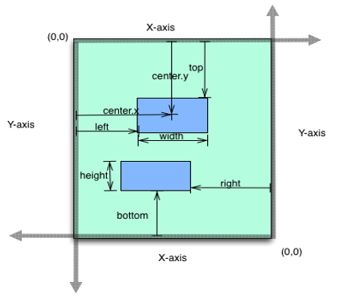

                                

You are here: Creating a FlexContainer Using a Constructor: voltmx.ui.FlexContainer

FlexContainer Widget
====================

The FlexContainer widget is a container that can provide a unique UI/UX property to a collection of widgets. For example, consider a scenario where you have a Login form in your app. In this Login form, you can have a header, footer, and a body content containing the text boxes for entering the user ID and password. You can use three FlexContainers here: one for the header, a second one for the footer, and the third one for the body content with the text boxes. You can specify separate backgrounds, layouts, and other features to these containers.

Here are a few features of the FlexContainer widget:

**Layout:** You can specify the layout of a FlexContainer and its child widgets by using different positional properties. You can also specify if you want the widgets to be placed vertically, horizontally, or without any positional restrictions. These layout features help you to design a form and ascertain how it will look in a device.

**Skin:** FlexContainer helps you to define a background for your widgets. You can blur your container, provide a shadow effect to your FlexContainer, and even make the FlexContainer transparent.

**Templates and Components:** When you have a UI/UX design in an application that must be reused in multiple areas, you need to create it as a template or as a component. A FlexContainer is created by default for both templates and components.

**Animations:** You can make your FlexContainer move, rotate, and more by using the animation options. An example for this is the sliding menu/hamburger menu, which can be designed to slide from left to right or right to left as per your specification.

**Using it as an Overlay:** Another important feature of FlexContainer is that it can be used as an overlay to other forms. You can give it a higher z-index so that it appears as if it is on top of other widgets. This feature is very useful when you want to give a tour of your application or when you want to display a popup.

**Haptic Feedback:** If you want to enable Haptic feedback for a certain area in your form, you can make use of a FlexContainer in this scenario. This is useful when you want the user to get the haptic feedback for a group of widgets rather than one widget.

A FlexContainer widget allows you to arrange widgets in the orientation you specify. It can hold any number of widgets.

You can add the FlexContainer Widget only to the FlexForm. This widget will be available in the Widgets palette when the FlexForm is selected in the app canvas.

Widgets are normally added to your application using Volt MX Iris, but can also be added from code. For general information on using widgets in Volt MX Iris, see [Designing an Application](../../../Iris/iris_user_guide/Content/Part_II_CreatingAnApplication.md) in the [Iris User Guide](../../../Iris/iris_user_guide/Content/Introduction.md).

For general information on the FlexContainer widget see the [](../../../Iris/iris_user_guide/Content/Button.md)[FlexContainer](../../../Iris/iris_user_guide/Content/Flex_Container.md) topic in the Volt MX Iris User Guide.

Components in Volt MX Iris provide ways of reusing code, and are based on special cases of the FlexContainer.

For a more hands-on approach on the functionality of FlexContainer widget, import and preview the **Pop-up using FlexContainer Feature** sample app by using Volt MX Iris.

[](https://support.hcltechsw.com/csm?id=kb_article&sysparm_article=KB0083869)

The FlexContainer widget capabilities can be broadly categorized into the following:

*   [Layout](#layout)
*   [Animations](#animations)
*   [Data Management](#data-management)
*   [3D Touch](#3d-touch)
*   [Gestures](#gestures)
*   [Life Cycle Events](#life-cycle-events)
*   [UI Appearance](#ui-appearance)
*   [Enabling RTL](#enabling-rtl)
*   [Miscellaneous](#miscellaneous)
*   [Common configurations to all widgets](#configurations-common-to-all-widgets)

#### Layout

  
| Events | Description |
| --- | --- |
| [doLayout](FlexContainer_Events.md#doLayout) | This event is invoked for every widget when the widget position and dimensions are computed. |

 

| Properties | Description |
| --- | --- |
| [anchorPoint](FlexContainer_Properties.md#anchorPo) | Specifies the anchor point of the widget bounds rectangle using the widget's coordinate space. |
| [bottom](FlexContainer_Properties.md#bottom) | Determines the bottom edge of the widget and is measured from the bottom bounds of the parent container. |
| [centerX](FlexContainer_Properties.md#centerX) | Determines the center of a widget measured from the left bounds of the parent container. |
| [centerY](FlexContainer_Properties.md#centerY) | Determines the center of a widget measured from the top bounds of the parent container. |
| [height](FlexContainer_Properties.md#height) | Determines the height of the widget and measured along the y-axis. |
| l[ayoutType](FlexContainer_Properties.md#layoutTy) | Specifies if the arrangement of the widgets either in free form or horizontal or vertical direction. |
| [left](FlexContainer_Properties.md#left) | Determines the lower left corner edge of the widget and is measured from the left bounds of the parent container. |
| [maxHeight](FlexContainer_Properties.md#maxHeigh) | Specifies the maximum height of the widget and is applicable only when the height property is not specified. |
| [maxWidth](FlexContainer_Properties.md#maxWidth) | Specifies the maximum width of the widget and is applicable only when the width property is not specified. |
| [minHeight](FlexContainer_Properties.md#minHeigh) | Specifies the minimum height of the widget and is applicable only when the height property is not specified. |
| [minWidth](FlexContainer_Properties.md#minWidth) | Specifies the minimum width of the widget and is applicable only when the width property is not specified. |
| [responsiveConfig](FlexContainer_Properties.md#responsiveConfig) | Determines the various width and space between FlexContainer widgets for different breakpoints. |
| [reverseLayoutDirection](FlexContainer_Properties.md#reverselayoutdirection) | Decides the stacking direction of a FlexContainer's child widgets. |
| [right](FlexContainer_Properties.md#right) | Determines the lower right corner of the widget and is measured from the right bounds of the parent container. |
| [top](FlexContainer_Properties.md#top) | Determines the top edge of the widget and measured from the top bounds of the parent container. |
| [width](FlexContainer_Properties.md#width) | Determines the width of the widget and is measured along the x-axis. |
| [zIndex](FlexContainer_Properties.md#zIndex) | Specifies the stack order of a widget. |

 

| Methods | Description |
| --- | --- |
| [forceLayout](FlexContainer_Methods.md#forceLay) | When this method is called, underlying OS layout cycle is forced to layout the widgets of the FlexContainer. |

 

#### Animations

| Methods | Description |
| --- | --- |
| [animate](FlexContainer_Methods.md#animate) | Applies an animation to the widget. |

 

| Properties | Description |
| --- | --- |
| [transform](FlexContainer_Properties.md#transfor) | Contains an animation transformation that can be used to animate the widget. |
| [widgetSwipeMove](FlexContainer_Properties.md#widgetSwipeMove) | Used to enable and configure the left or right swipe actions for a widget. |

 

#### Data Management

| Methods | Description |
| --- | --- |
| [add](FlexContainer_Methods.md#add) | Used to add widgets to the FlexContainer. |
| [addAt](FlexContainer_Methods.md#addAt) | Used to add widgets to the FlexContainer at the specified index. |
| [clone](FlexContainer_Methods.md#clone) | When this method is used on a container widget, then all the widgets inside the container are cloned. |
| [remove](FlexContainer_Methods.md#form.get2) | Removes a widget from the form container. |
| [removeAt](FlexContainer_Methods.md#removeAt) | Removes a widget at the given index from the Form container. |
| [removeAll](FlexContainer_Methods.md#removeAl) | Removes all the widget on the container. |

| Events | Description |
| --- | --- |
| [addWidgets](FlexContainer_Events.md#addWidge) | An event callback invoked by the platform when the FlexContianer or FlexScrollContianer widget is accessed for the first time after its construction. |

#### 3D Touch

| Methods | Description |
| --- | --- |
| [registerForPeekandPop](FlexContainer_Methods.md#register) | Registers a widget to enable 3D Touch peek and pop gestures. |
| [setOnPeek](FlexContainer_Methods.md#setOnPek) | Sets and overrides the existing onPeekCallback for the widget. |
| [setOnPop](FlexContainer_Methods.md#setOnPop) | Overrides the existing onPopCallback for the widget. |
| [unregisterForPeekandPop](FlexContainer_Methods.md#unregist) | Unregisters a widget from 3D Touch peek and pop gestures. |

#### Gestures

| Events | Description |
| --- | --- |
| [onClick](FlexContainer_Events.md#onClick) | A callback event is invoked by the platform when the user performs a click action on the FlexContainer widget. |
| [onHover](FlexContainer_Events.md#onHover) | An event callback is invoked by the platform when the mouse enters into, moves within, or leaves from the widget region. |
| [onScrollWidgetPosition](FlexContainer_Events.md#onScrollWidgetPosition) | This event callback is invoked by the platform when the widget location position gets changed on scrolling. |
| [onTouchEnd](FlexContainer_Events.md#onTouchEnd) | An event callback is invoked by the platform when the user touch is released from the touch surface. |
| [onTouchMove](FlexContainer_Events.md#onTouchEnd) | An event callback is invoked by the platform when the touch moves on the touch surface continuously until movement ends. |
| [onTouchStart](FlexContainer_Events.md#onTouchStart) | An event callback is invoked by the platform when the user touches the touch surface. |

 

| Methods | Description |
| --- | --- |
| [addGestureRecognizer](FlexContainer_Methods.md#addGestureRecognizer) | Allows you to set a gesture recognizer for a specified gesture for a specified widget. |
| [removeGestureRecognizer](FlexContainer_Methods.md#removeGestureRecognizer) | Allows you to remove the specified gesture recognizer for the specified widget. |
| [setGestureRecognizer](FlexContainer_Methods.md#setGestureRecognizer) | Allows you to set a gesture recognizer for a specified gesture for a specified widget. |

 

#### Life cycle Events

| Events | Description |
| --- | --- |
| [init](FlexContainer_Events.md#init) | Invoked only once in widgets life cycle that is when the FlexContainer or FlexScrollContainer is ready with its widget hierarchy. |

#### UI Appearance

| Properties | Description |
| --- | --- |
| [backgroundColor](FlexContainer_Properties.md#backgrou) | Specifies the background color of the widget in hex format. |
| [backgroundColorMultiStepGradient](FlexContainer_Properties.md#backgroundColorMultiStepGradient) | Specifies the multi-step gradient color for the background of the widget. |
| [backgroundColorTwoStepGradient](FlexContainer_Properties.md#backgroundColorTwoStepGradient) | Specifies the two-step gradient color for the background of the widget. |
| [backgroundImage](FlexContainer_Properties.md#backgroundImage) | Sets the image for the background of the widget. |
| [borderColor](FlexContainer_Properties.md#borderColor) | Specifies the border color of the widget. |
| [borderColorGradient](FlexContainer_Properties.md#borderColorGradient) | Specifies the multi-step gradient color for the border of the widget. |
| [borderStyle](FlexContainer_Properties.md#borderStyle) | Specifies the border style for the widget. |
| [borderWidth](FlexContainer_Properties.md#borderWidth) | Specifies the width of the border for the widget in pixels. |
| [cornerRadius](FlexContainer_Properties.md#cornerRadius) | Specifies the radius of the border for the widget. |
| [disabledStateSkinProperties](FlexContainer_Properties.md#disabledStateSkinProperties) | Specifies the skin properties that define the look and feel of the widget, when the widget is disabled or blocked. |
| [focusStateSkinProperties](FlexContainer_Properties.md#focusStateSkinProperties) | Specifies the skin properties that define the look and feel of the widget, when the widget is in focus. |
| [fontColor](FlexContainer_Properties.md#fontColor) | Specifies the font color of the widget. |
| [fontFamily](FlexContainer_Properties.md#fontFamily) | Specifies the font family for the font of the widget. |
| [fontSize](FlexContainer_Properties.md#fontSize) | Specifies the font size for the widget in percentage (%) units. |
| [fontStyle](FlexContainer_Properties.md#fontStyle) | Specifies the font style for the widget. |
| [fontWeight](FlexContainer_Properties.md#fontWeight) | Specifies the weight for the font of the widget. |
| [hoverStateSkinProperties](FlexContainer_Properties.md#hoverStateSkinProperties) | Specifies the skin properties that define the look and feel of the widget, when the cursor hovers on the widget. |
| [pressedStateSkinProperties](FlexContainer_Properties.md#pressedStateSkinProperties) | Specifies the skin properties that define the look and feel of the widget, when the widget is pressed or clicked. |
| [shadowColor](FlexContainer_Properties.md#shadowColor) | Specifies the color for the shadow of the widget. |
| [shadowOffset](FlexContainer_Properties.md#shadowOffset) | This property specifies the current coordinates of the shadow region in the widget. |
| [shadowRadius](FlexContainer_Properties.md#shadowRadius) | Specifies the radius for the blur value of the shadow. |
| [textShadowColor](FlexContainer_Properties.md#textShadowColor) | Specifies the color for the text shadow of the widget. |
| [textShadowOffset](FlexContainer_Properties.md#textShadowOffset) | This property specifies the current coordinates of the text shadow region in the widget. |
| [textShadowRadius](FlexContainer_Properties.md#textShadowRadius) | Specifies the radius for the blur value of the text shadow. |
| [clipBounds](FlexContainer_Properties.md#clipBoun) | Specifies whether to clip the child widgets when they go out of boundaries. |
| [clipView](FlexContainer_Properties.md#clipView) | Defines a shape to clip the widget view. |
| [frame](FlexContainer_Properties.md#frame) | Reflects the calculated flex layout properties derived at application runtime. |
| [opacity](FlexContainer_Properties.md#opacity) | Specifies the opacity of the widget. |
| [rippleBackground](FlexContainer_Properties.md#rippleBackground) | Defines the ripple background for a FlexContainer Widget. |
| [shadowDepth](FlexContainer_Properties.md#shadowDepth) | Defines the depth of the shadow effect applied to the FlexContainer Widget. |
| [shadowType](FlexContainer_Properties.md#shadowType) | Sets a type of the shadow effect to apply to the FlexContainer Widget. |

#### Enabling RTL

| Properties | Description |
| --- | --- |
| [retainContentAlignment](FlexContainer_Properties.md#retainContentAlignment) | Helps to retain the content alignment of the widget while applying RTL. |
| [retainFlexPositionProperties](FlexContainer_Properties.md#retainFlexPositionProperties) | Helps to retain the left, right and padding properties while applying RTL. |
| [retainFlowHorizontalAlignment](FlexContainer_Properties.md#retainFlowHorizontalAlignment) | Enables you to change the horizontal flow of the widget from left to right. |

#### Miscellaneous

| Methods | Description |
| --- | --- |
| [getBadge](FlexContainer_Methods.md#getBadge) | Enables you to read the badge value (if any) attached to the specified widget. |
| [setBadge](FlexContainer_Methods.md#setBadge) | Enables you to set the badge value to the given widget at the upper, right corner of the widget. |
| [setDefaultUnit](FlexContainer_Methods.md#setDefau) | Specifies the default unit to be used for interpretation of numbers with no qualifiers when passed to layout properties. |
| [widgets](FlexContainer_Methods.md#widgets) | Returns an array of the widget references which are direct children of the FlexContainer. |

| Properties | Description |
| --- | --- |
| [autogrowMode (Deprecated)](FlexContainer_Properties.md#autogrow) | Enables you to grow the height of the FlexContainer when child widgets or content is added on the FlexContainer. |
| [a11yNavigationMode](FlexContainer_Properties.md#a11yNavigationMode) | Helps to specify the type of navigation order that should be used in the FlexContainer. |
| [cursorType](FlexContainer_Properties.md#cursorType) | Specifies the type of the mouse pointer used. |
| [enableHapticFeedback](FlexContainer_Properties.md#enableHapticFeedback) | Allows you to enable or disable haptic feedback on the FlexContainer widget. |
| [isMaster](FlexContainer_Properties.md#isMaster) | Specifies whether the container is a master container. |
| [isModalContainer](FlexContainer_Properties.md#isModalContainer) | When you use the FlexContainer as a popup, this property helps to prevent user interaction beyond the edges of the FlexContainer. |

#### Configurations common to all widgets

| Methods | Description |
| --- | --- |
| [blur](FlexContainer_Properties.md#blur) | Enables you to make the widget look unfocused. |
| [convertPointFromWidget](FlexContainer_Methods.md#convertPointFromWidget) | Allows you to convert the coordinate system from a widget to a point (receiver's coordinate system). |
| [convertPointToWidget](FlexContainer_Methods.md#convertPointToWidget) | Allows you to convert the coordinate system from a point (receiver's coordinate system) to a widget. |
| [removeFromParent](FlexContainer_Methods.md#removeFromParent) | Allows you to remove a child widget from a parent widget. |
| [setEnabled](FlexContainer_Methods.md#setEnabled) | Specifies the widget that must be enabled or disabled. |
| [setFocus](FlexContainer_Methods.md#setFocus) | Specifies the widget on which there must be focus. |
| [setVisibility](FlexContainer_Methods.md#setVisibility) | Use this method to set the visibility of the widget. |

| Properties | Description |
| --- | --- |
| [accessibilityConfig](FlexContainer_Properties.md#accessibilityConfig) | Enables you to control accessibility behavior and alternative text for the widget. |
| [enable](FlexContainer_Properties.md#enable) | Allows you to make a widget visible but not actionable. |
| [enableCache](FlexContainer_Properties.md#enableCa) | Enables you to improve the performance of Positional Dimension Animations. |
| [id](FlexContainer_Properties.md#id) | id is a unique identifier of FlexContainer consisting of alpha numeric characters. |
| [info](FlexContainer_Properties.md#info) | A custom JSObject with the key value pairs that a developer can use to store the context with the widget. |
| [isVisible](FlexContainer_Properties.md#isVisibl) | Controls the visibility of a widget on the FlexContainer. |
| [parent](FlexContainer_Properties.md#parent) | Helps you access the parent of the widget. |

FlexContainer Widget Basics
---------------------------

### Creating a FlexContainer Using a Constructor: voltmx.ui.FlexContainer

```

var myFlex = new voltmx.ui.FlexContainer(basicConf, layoutConf, pspConf);
```

*   **basicConf** is an object with configuration properties.
*   **layoutConf** is an object with layout specific configuration properties.
*   **pspConf** is an object with platform specific configuration properties.

> **_Note:_** An empty constructor leads to all defaults values. Optionally all writable properties can be passed as a dictionary to the constructor.

Example

```
//Defining properties for FlexContainer
function testfrm_flexContainer1_onTouchStart_seq0(eventobject, x, y) {
    //Write your logic here.
};

function testfrm_flexContainer1_onTouchEnd_seq0(eventobject, x, y) {
    //Write your logic here.
};

function testfrm_flexContainer1_onTouchMove_seq0(eventobject, x, y) {
    //Write your logic here.
};

function addWidgetstestfrm() {
    var flexContainer1 = new voltmx.ui.FlexContainer({
        "id": "flexContainer1",
        "top": "19dp",
        "left": "43dp",
        "width": "304dp",
        "height": "251dp",
        "zIndex": 1,
        "isVisible": true,
        "onTouchStart": testfrm_flexcontainer1_onTouchStart_seq0,
        "onTouchEnd": testfrm_flexcontainer1_onTouchEnd_seq0,
        "onTouchMove": testfrm_flexcontainer1_onTouchMove_seq0 "clipBounds": true,
        "layoutType": voltmx.flex.FREE_FORM
    }, {
        "padding": [0, 0, 0, 0]
    }, {});;

    flexContainer1.setDefaultUnit(voltmx.flex.DP)
    flexContainer1.add();
    testfrm.add(flexContainer1);
};
```

### Flex Layout Properties

The below image represents the flex layout properties:



