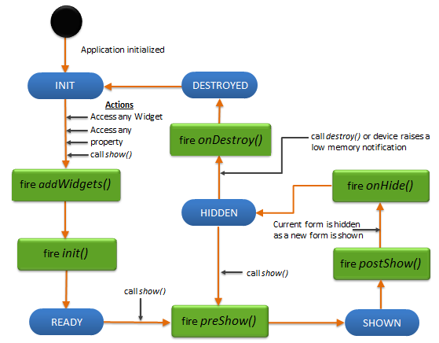

                                

You are here: Using the Navigation Drawer

FlexForm Widget
===============

A FlexForm is the top most container widget, and is usually the first widget you add to an application. It serves as a container for all other widgets on the screen. Your app can support multiple screens by supporting multiple FlexForms and allowing a user to navigate between these screens.

FlexForm widget is not listed in the Default library. To create a new FlexForm widget, go to the Project explorer, expand any channel such as Mobile, Tablet, and Responsive web. Then, right-click on the Forms and select New Form.

Following are a few actions that you can perform on a FlexForm:

*   **Animations**: You can add animations such as move, rotate, and more to the widgets in the FlexForm. An example for this is the sliding menu/hamburger menu, which can be designed to slide from left to right or right to left as per your specification.
*   **Layout**: You can specify the layout of a FlexContainer and its child widgets in the FlexForm by using different positional properties. You can also specify if you want the widgets to be placed vertically, horizontally, or without any positional restrictions. These layout features help you to design a form and ascertain how it will look in a device.
*   **Skin**: You can define the background by setting a skin to the FlexContainer in the FlexForm. You can blur your container, provide a shadow effect to your FlexContainer, and even make the FlexContainer transparent.

The FlexForm widget capabilities can be broadly categorized into the following:

*   [Layout](#layout)
*   [Animations](#animations)
*   [Form Lifecycle](#form-lifecycle)
*   [Drawer Features](#drawer-features)
*   [Scrolling functionalities](#scrolling-functionalities)
*   [Data Management](#data-management)
*   [3D Touch](#3d-touch)
*   [User Input Handling](#user-input-handling)
*   [UI Appearance](#ui-appearance)
*   [Enabling RTL](#enabling-rtl)
*   [Miscellaneous](#miscellaneous)
*   [Configurations Common To All Widgets](#configurations-common-to-all-widgets)

#### Layout

  
| Properties | Description |
| --- | --- |
| [anchorPoint](FlexForm_Properties.md#anchorPo) | Specifies the anchor point of the widget bound rectangle using the widget's coordinate space. |
| [contentOffset](FlexForm_Properties.md#contentO) | Specifies the x and y coordinates of the top-left of the scrollable region. |
| [contentSize](FlexForm_Properties.md#contentS) | Specifies the width and height of the container to accommodate all the widgets placed in it. |
| [layout](FlexForm_Properties.md#layout) | Specifies if the arrangement of the widgets either in horizontal or vertical direction. |
| [layoutType](FlexForm_Properties.md#layoutTy) | Specifies if the arrangement of the widgets either in free form or vertical direction. |
| [requiresBottomSafeAreaInset](../../../Iris/iris_widget_prog_guide/Content/FlexForm_Properties.md#requiresBottomSafeAreaInset) | Implements the Safe Area Layout for iOS devices, specifically the iPhone X series. Content of the flex form occupies the full screen at the bottom and overlaps the virtual home indicator. |
| [requiresLeftSafeAreaInset](../../../Iris/iris_widget_prog_guide/Content/FlexForm_Properties.md#requiresLeftSafeAreaInset) | Implements the Safe Area Layout for iOS devices, specifically iPhone X series. Content of the flex form starts from (0,0) pixel. |
| [requiresRightSafeAreaInset](../../../Iris/iris_widget_prog_guide/Content/FlexForm_Properties.md#requiresRightSafeAreaInset) | Implements the Safe Area Layout for iOS devices, specifically iPhone X series. Flex form widget occupies full screen at left/ right part of the screen. |
| [requiresTopSafeAreaInset](../../../Iris/iris_widget_prog_guide/Content/FlexForm_Properties.md#requiresTopSafeAreaInset) | Implements the Safe Area Layout for iOS devices, specifically the iPhone X series. Content of the flex form starts from (0,0) pixel. |
| [zIndex](FlexForm_Properties.md#zIndex) | Specifies the stack order of a widget. |

  

| Methods | Description |
| --- | --- |
| [forceLayout](FlexForm_Methods.md#forceLay) | When this method is called, underlying OS layout cycle is forced to layout the widgets of the FlexForm. |

| Events | Description |
| --- | --- |
| [doLayout](FlexForm_Events.md#doLayout) | This event is invoked for every widget when the widget position and dimensions are computed. |
| [onBreakpointChange](FlexForm_Events.md#onBr) | This event defines a callback that is executed when there is a change in the breakpoint. |
| [onResize](FlexForm_Events.md#onResize) | This event defines a callback that is executed when there is a change in the width of the browser. This event has been deprecated since V8 SP2. |

 

#### Animations

 

| Properties | Description |
| --- | --- |
| [transform](FlexForm_Properties.md#transfor) | Contains an animation transformation that can be used to animate the widget. |
| [inTransitionConfig](FlexForm_Properties.md#inTransitionConfig) | Specifies the configuration to be used when the user arrives on this form. |
| [outTransitionConfig](FlexForm_Properties.md#outTransitionConfig) | Specifies the type of transition effect to be applied when the Form is going out of view. |

 

#### Form Lifecycle

| Events | Description |
| --- | --- |
| [init](FlexForm_Events.md#init) | Gets called only once in form life cycle that is when the form is ready with its widget hierarchy. |
| [onDestroy](FlexForm_Events.md#ondestroy) | Specifies an event which is triggered when the FlexForm is destroyed. |
| [onHide](FlexForm_Events.md#onHide) | Specifies an Event which is triggered when a form goes completely out of view. |
| [postShow](FlexForm_Events.md#postshow) | postShow is invoked after a form is displayed. |
| [preShow](FlexForm_Events.md#preShow) | preShow is executed every time a form is to be displayed. |

 

#### Drawer Features

| Events | Description |
| --- | --- |
| [onDrawerClosed](FlexForm_Events.md#onDrawerClosed) | Called when a Navigation Drawer has finished closing. |
| [onDrawerOpened](FlexForm_Events.md#onDrawerOpened) | Called when a Navigation Drawer has finished opening. |
| [onDrawerSlide](FlexForm_Events.md#onDrawerSlide) | Sent when the position of a NavigationDrawer changes. |
| [onDrawerStateChanged](FlexForm_Events.md#onDrawerStateChanged) | Called when the NavigationDrawer motion state changes. |

 

| Methods | Description |
| --- | --- |
| [closeNavigationDrawer](FlexForm_Methods.md#closeNavigationDrawer) | Close the NavigationDrawer on forms that have been created using a template that supports the NavigationDrawer. |
| [openNavigationDrawer](FlexForm_Methods.md#openNavigationDrawer) | Open the NavigationDrawer on forms that have been created using a template that supports the NavigationDrawer. |

 

| Properties | Description |
| --- | --- |
| [drawerLayout](FlexForm_Properties.md#drawerLayout) | Gets and sets the FlexContainer that contains the elements of the NavigationDrawer, which is named drawerLayout. |
| [drawerWidth](FlexForm_Properties.md#drawerWidth) | Gets and sets the width of the Navigation Drawer. |
| [drawerShadowColor](FlexForm_Properties.md#drawerShadowColor) | Sets or gets the shadow color that covers the form when the NavigationDrawer is open, indicating that the controls on the form are not available for interaction. |
| [drawerOpenIcon](FlexForm_Properties.md#drawerOpenIcon) | The icon to be displayed when Navigation bar is open. |
| [drawerClosedIcon](FlexForm_Properties.md#drawerClosedIcon) | The icon to be displayed when Navigation bar is closed. |
| [drawerOpena11yHint](FlexForm_Properties.md#drawerOpena11yHint) | Specifies the descriptive text that explains the action of the widget. |
| [drawerCloseda11yHint](FlexForm_Properties.md#drawerCloseda11yHint) | Specifies the descriptive text that explains the action of the widget. |
| [navigationDrawerListeners](FlexForm_Properties.md#navigationDrawerListeners) | Maps Navigation Drawer events to user defined handler functions. |

 

#### Scrolling functionalities

| Properties | Description |
| --- | --- |
| [allowHorizontalBounce](FlexForm_Properties.md#allowHor) | Specifies whether the scroll bounce is enabled or disabled in the horizontal direction. |
| [allowVerticalBounce](FlexForm_Properties.md#allowVer) | Specifies whether the scroll bounce is enabled or disabled in the vertical direction. |
| [bounces](FlexForm_Properties.md#bounces) | Specifies whether the scroll bounce is enabled or disabled. |
| [enableOnScrollWidgetPositionForSubwidgets](FlexForm_Properties.md#enableOnScrollWidgetPositionForSubwidgets) | Enables the FlexForm widget to iterate into all the widgets that make use of the onScrollWidgetPosition event. |
| [enableScrolling](FlexForm_Properties.md#enableSc) | Specifies whether the scrolling is enabled on the container or not. |
| [retainScrollPosition](FlexForm_Properties.md#retainSc) | Specifies if the Form must remember the scroll position when the user revisits the Form. |
| [scrollDirection](FlexForm_Properties.md#scrollDi) | Specifies the direction in which the widget should scroll. |
| [verticalScrollIndicator](FlexForm_Properties.md#vertical) | Specifies whether the scroll indicator must be shown or not in the vertical direction. |

 

| Methods | Description |
| --- | --- |
| [scrollToBeginning](FlexForm_Methods.md#scrolltowidget) | Gives you the control to scroll to the beginning of the form. |
| [scrollToEnd](FlexForm_Methods.md#scrolltobeginning) | Gives you the control to scroll to the end of the FlexForm. |
| [scrollToWidget](FlexForm_Methods.md#scrolltoend) | Gives you the control to scroll the FlexForm up to the position of selected widget. |

 

| Events | Description |
| --- | --- |
| [onDecelerationStarted](FlexForm_Events.md#onDecele) | An event callback is invoked by the platform when the user stops scrolling but the content still moves before the content actually stops. |
| [onScrollEnd](FlexForm_Events.md#onScroll3) | An event callback is invoked by the platform when the scrolling is ended. |
| [onScrollWidgetPosition](FlexForm_Events.md#onScrollWidgetPosition) | This event callback is invoked by the platform when the widget location position gets changed on scrolling. |
| [onScrolling](FlexForm_Events.md#onScroll2) | An event callback is invoked by the platform when the scrolling is in progress. |
| [onScrollStart](FlexForm_Events.md#onScroll) | An event callback is invoked by the platform when the user starts scrolling the content. |
| [onScrollTouchReleased](FlexForm_Events.md#onScroll4) | An event callback is invoked by the platform when the user touch is released from the touch surface. |

 

#### Data Management

| Methods | Description |
| --- | --- |
| [add](FlexForm_Methods.md#add) | Used to add widgets to the FlexForm |
| [addAt](FlexForm_Methods.md#addAt) | Used to add widgets to the Form container at the specified index. |
| [clone](FlexForm_Methods.md#clone) | When this method is used on a container widget, then all the widgets inside the container are cloned. |
| [remove](FlexForm_Methods.md#remove) | Removes a widget from the FlexForm. |
| [removeAt](FlexForm_Methods.md#removeat) | Removes a widget at the given index from the FlexForm. |
| [removeAll](FlexForm_Methods.md#removeAl) | Removes all the widget on the FlexForm. |

 

#### 3D Touch

| Methods | Description |
| --- | --- |
| [registerForPeekandPop](FlexForm_Methods.md#register) | Registers a widget to enable 3D Touch peek and pop gestures. |
| [setOnPeek](FlexForm_Methods.md#setOnPek) | Sets and overrides the existing onPeekCallback for the widget. |
| [setOnPop](FlexForm_Methods.md#setOnPop) | Overrides the existing onPopCallback for the widget. |
| [unregisterForPeekandPop](FlexForm_Methods.md#unregist) | Unregisters a widget from 3D Touch peek and pop gestures. |

#### User Input Handling

| Events | Description |
| --- | --- |
| [onZoomEnd](FlexForm_Events.md#onZoomEn) | An event callback is invoked by the platform when the zooming has ended. |
| [onZooming](FlexForm_Events.md#onZoomin) | An event callback is invoked by the platform when the container is zooming. |
| [onZoomStart](FlexForm_Events.md#onZoomSt) | An event callback is invoked by the platform when the container is about to zoom. |
| [widgetToZoom](FlexForm_Events.md#widgetTo) | An event callback is invoked by the platform to return one of the child widgets of source to zoom. |

 

| Methods | Description |
| --- | --- |
| [setZoomScale](FlexForm_Methods.md#setZoomS) | Allows you the zoom the widgets with an option to animate. |

 

| Properties | Description |
| --- | --- |
| [disableZoom](FlexForm_Properties.md#disableZoom) | Allows you to enable or disable zooming the FlexForm. |
| [maxZoomScale](FlexForm_Properties.md#maxZoomS) | Specifies the maximum zoom scale factor that can be applied to the form. |
| [minZoomScale](FlexForm_Properties.md#minZoomS) | Specifies the minimum zoom scale factor that can be applied to the form. |
| [zoomScale](FlexForm_Properties.md#zoomScal) | Specifies the current scale factor applied to the form content. |

#### UI Appearance

| Properties | Description |
| --- | --- |
| [backgroundColor](FlexForm_Properties.md#backgrou) | Specifies the background color of the widget in hex format. The background can be a single color or a gradient of several colors. |
| [configureExtendBottom](FlexForm_Properties.md#configur2) | Enables you to configure extendBottom property. |
| [configureExtendTop](FlexForm_Properties.md#configur) | Enables you to configure extendTop property. |
| [configureStatusBarStyle](FlexForm_Properties.md#configur3) | Enables you to configure statusBarStyle property. |
| [defaultIndicatorColor](FlexForm_Properties.md#defaultI) | Enables you to set color to the progress indicator when it is show on the form. |
| [extendBottom](FlexForm_Properties.md#extendBo) | Helps in extending the bottom of the form. |
| [extendTop](FlexForm_Properties.md#extendTo) | Helps in extending the top of the form. |
| [footerOverlap](FlexForm_Properties.md#footerOv) | Specifies if the footer must overlap the form. |
| [formTransparencyDuringPostShow](FlexForm_Properties.md#formTran) | Specifies the transparency in percentage when a form is loaded. |
| [headerOverlap](FlexForm_Properties.md#headerOv) | Specifies if the header must overlap the form |
| [inputAccessoryViewType](FlexForm_Properties.md#inputAcc) | The extra buttons (or controls) allow specific operations needed by your application, such as moving to the next or previous text field, making the keyboard disappear and so on. The area above the keyboard is known as Input Accessory View. |
| [menuFocusSkin](FlexForm_Properties.md#menuFocu) | skin property of a form level menu and it determines the look and feel of the Menu Item when focused. |
| [menuNormalSkin](FlexForm_Properties.md#menuNorm) | skin property and it determines the look and feel of a menu items when not in focus. |
| [menuPosition](FlexForm_Properties.md#menuPosi) | Specifies if the application menu is shown or hidden in the application. |
| [navigationBarColor](FlexForm_Properties.md#navigationBarColor) | Helps you set the color for a device's navigation bar. |
| [needAppMenu](FlexForm_Properties.md#needAppM) | Specifies if the application menu items should be displayed as a part of the menu controls on the form. |
| [needsIndicatorDuringPostShow](FlexForm_Properties.md#needsInd) | Specifies if there must be an indication to the user that the form content is being loaded. |
| [opacity](FlexForm_Properties.md#opacity) | Specifies the opacity of the widget. |
| [pagingEnabled](FlexForm_Properties.md#pagingEn) | Specifies the whether the paging is enabled for the container. |
| [prefersStatusBarHidden](FlexForm_Properties.md#prefersS) | Specifies whether the status bar must be shown or not. |
| [setContentOffset](FlexForm_Methods.md#setConte) | Gives you the control to offset a portion of the content in a Form to bring the widgets in invisible area to visible area. |
| [showActionBar](FlexForm_Properties.md#showActi) | Specifies if the action bar should be displayed. |
| [showActionBarIcon](FlexForm_Properties.md#showActi2) | Specifies the icon to be displayed for the action bar. |
| [showMiniAppMenu](FlexForm_Properties.md#showMiniAppMenu) | Specifies if the application menu is shown or hidden in the application. |
| [statusBarColor](FlexForm_Properties.md#statusBarColor) | Helps you set the color for a device's status bar. |
| [statusBarForegroundColor](FlexForm_Properties.md#statusBarForegroundColor) | Helps you set the foreground color of the status bar, such as color for any text or icon on the status bar. |
| [statusBarHidden](FlexForm_Properties.md#statusBa2) | Lets you show or hide the status bar. |
| [statusBarStyle](FlexForm_Properties.md#statusBa) | Helps you set a style for the status bar. |
| [systmeUiConfig](FlexForm_Properties.md#systemUiConfig) | Controls the behavior of the status and navigation bars. |
| [titleBar](FlexForm_Properties.md#titleBar) | Specifies the title bar must be displayed on the form. |
| [titleBarAttributes](FlexForm_Properties.md#titleBarAttributes) | Contains data that supports Application bar functionality in iOS. |
| [titleBarConfig](FlexForm_Properties.md#titleBarConfig) | Specifies the position of the title bar of the form. |
| [titleBarSkin](FlexForm_Properties.md#titleBar3) | Specifies the skin to be applied to the title Bar of the form. |
| [viewConfig](FlexForm_Properties.md#viewConfig) | Helps to give reference height and reference width to a container when it is in grid layout. |
| [windowSoftInputMode](FlexForm_Properties.md#windowSo) | Defines how the main Form interacts with the window containing the on-screen soft keyboard. |

| Methods | Description |
| --- | --- |
| [setBackgroundImageForNavbar](FlexForm_Methods.md#setBackgroundImageForNavbar) | Helps to set the background image for the title bar for iOS specific applications. |
| [setTitleBarLeftSideButtonSkin](FlexForm_Methods.md#settitlebarleftsidebuttonskin) | Enables you to set the properties for a left-side button of a titlebar. |
| [setTitleBarRightSideButtonSkin](FlexForm_Methods.md#settitlebarrightsidebuttonskin) | Enables you to set the properties for a right-side button of a titlebar. |
| [show](FlexForm_Methods.md#show) | Used to display the FlexForm. |

#### Enabling RTL

| Properties | Description |
| --- | --- |
| [retainContentAlignment](FlexForm_Properties.md#retainContentAlignment) | Helps to retain the content alignment of the widget while applying RTL. |
| [retainFlexPositionProperties](FlexForm_Properties.md#retainFlexPositionProperties) | Helps to retain the left, right and padding properties while applying RTL. |
| [retainFlowHorizontalAlignment](FlexForm_Properties.md#retainFlowHorizontalAlignment) | Enables you to change the horizontal flow of the widget from left to right. |

#### Miscellaneous

| Properties | Description |
| --- | --- |
| [captureGPS](FlexForm_Properties.md#captureG) | Specifies if the Form must display a popup seeking permission from the user to access the location details. |
| [enabledForIdleTimeout](FlexForm_Properties.md#enabledF) | Idle time indicates the amount of time that a user has not interacted with the application. |
| [maxAppMenuButtons](FlexForm_Properties.md#maxAppMe) | Specifies the number of appmenu buttons should be displayed on the screen. |
| [noCache](FlexForm_Properties.md#noCache) | Indicates that if the form is enabled for caching on the device browser. |
| [secureData](FlexForm_Properties.md#secureDa) | Specifies if the browser must retain and use the information that you have filled in a form |
| [submitSecure](FlexForm_Properties.md#submitSe) | Specifies if the information must be sent using secure connection (https) or insecure connection (http). |
| [windowSoftInputMode](FlexForm_Properties.md#windowSo) | Defines how the main Form interacts with the window containing the on-screen soft keyboard. |

| Methods | Description |
| --- | --- |
| [getTitleVerticalPositionAdjustment](FlexForm_Methods.md#getTitleVerticalPositionAdjustment) | Gets the position of the title vertically on the navigation bar. |
| [hideTitleBar](FlexForm_Methods.md#hidetitlebar) | Gives you the control to hide a titlebar within a form. |
| [setHidesBackButton](FlexForm_Methods.md#setHidesBackButton) | Hides or shows the back button in the title bar |
| [setLeftBarButtonItems](FlexForm_Methods.md#setLeftBarButtonItems) | Allows you to add BarButtonItems to the left side of the NavigationBar |
| [setDefaultUnit](FlexForm_Methods.md#setDefau) | Specifies the default unit to be used for interpretation of numbers with no qualifiers when passed to layout properties. |
| [setPreviewActionItems](FlexForm_Methods.md#setPrevi) | Sets the preview actions for a form to be displayed when the user swipes up the preview/peek of a form. |
| [setRightBarButtonItems](FlexForm_Methods.md#setRightBarButtonItems) | Sets the preview actions for a form to be displayed when the user swipes up the preview/peek of a form. |
| [setTitleVerticalPositionAdjustment](FlexForm_Methods.md#setTitleVerticalPositionAdjustment) | Set position of the title vertically on the navigation bar. |
| [showTitleBar](FlexForm_Methods.md#showtitlebar) | Gives you the control to show a titlebar to a FlexForm. |
| [widgets](FlexForm_Methods.md#widgets) | Returns an array of the widget references which are direct children of Form. |

| Events | Description |
| --- | --- |
| [onKeyBoardDidHide](FlexForm_Events.md#KeyboardDidHide) | This is an event callback that is invoked by iOS when the keyboard has been hidden. |
| [onKeyBoardDidShow](FlexForm_Events.md#KeyboardDidShow) | This is an event callback that is invoked by iOS when the keyboard has just been shown. |
| [onKeyBoardWillHide](FlexForm_Events.md#KeyboardWillHide) | This is an event callback that is invoked by iOS when the keyboard is about to be hidden. |
| [onKeyBoardWillShow](FlexForm_Events.md#KeyboardWillShow) | This is an event callback that is invoked by iOS when the keyboard is about to be shown. |
| [onActionBarBack](FlexForm_Events.md#onactionbarback-event) | An event callback that is invoked by the platform when the back button is pressed on an action bar. |
| [onDeviceBack](FlexForm_Events.md#ondeviceback) | Specifies an event which is triggered when the user uses the back button on the device. |
| [onDeviceMenu](FlexForm_Events.md#ondevicemenu) | Specifies an event which is triggered when the user access the device menu. |
| [onLocaleChanged](FlexForm_Events.md#onLocale) | An event callback invoked by the platform when the locale changes. |
| [onMapping](FlexForm_Events.md#onMapping) | An event created by Volt MX Iris when you drag and drop a service. |
| [onNavigate](FlexForm_Events.md#onNavigate) | An event callback invoked when you navigate from one form to another. |
| [onOrientationChange](FlexForm_Events.md#onorientationchange) | Specifies an Event which is triggered when there is a change in orientation of the form from portrait to landscape or vice versa. |
| [onSizeChanged](FlexForm_Events.md#onSizeCh) | Specifies the event that is triggered when the app window is resized. |

#### Configurations Common To All Widgets

| Properties | Description |
| --- | --- |
| [accessibilityConfig](FlexForm_Properties.md#accessibilityConfig) | Enables you to control accessibility behavior and alternative text for the widget. |
| [enableCache](FlexForm_Properties.md#enableCa) | Enables you to improve the performance of Positional Dimension Animations. |
| [id](FlexForm_Properties.md#id) | id is a unique identifier of form consisting of alpha numeric characters. |
| [info](FlexForm_Properties.md#info) | A custom JSObject with the key value pairs that a developer can use to store the context with the widget. |
| [parent](FlexForm_Properties.md#parent) | Helps you access the parent of the widget. |

Programming FlexForms
---------------------

In earlier versions of Volt MX Iris you used BoxForm, horizontal (HBox) and vertical (VBox) boxes as containers to align widgets. These widgets are now obsolete and are listed in the [Deprecated section](Deprecated.md) of this reference. They still work, so older applications will continue to function, but should not be used in current versions of Iris.

*   A FlexForm allows you to place and size widgets anywhere and you can place any number of widgets on it. It gives you absolute position and dimension of the widgets.
*   A FlexForm has two layout types: Free Form Layout and Flow Vertical Layout. In the Free Form Layout, widgets can overlap with other widgets. In Flow Vertical Layout, widgets are placed one below the other.
*   A FlexForm fills the entire device screen with the exception of the OS header and footer. A FlexForm can also display a title bar (or application bar as it is known in iOS). This bar will be displayed at the top of the form.
*   [FlexContainers](FlexContainer.md) are often used to add another level of organization within a FlexForm.

### Form stacking

Typically a form is displayed in response to a user action on another form. That means the navigation between forms happen by the events on another form. All the navigation actions should be pushed into a stack to track the navigation path, so that the user can navigate back to the previous forms in the exact reverse order of its forward navigation. When navigating to a form that is already in the stack, the target form is brought back to the top of the stack by popping all the above forms out of the stack.

### FlexForm Lifecycle

A FlexForm lets you add other container and widgets to create a widget hierarchy.

Lifecycle Methods:

A form is defined to have a lifecycle method that gets called at appropriate events. These events allow you to manage the application for better resource handling.

The following are the lifecycle methods of a form:

**addWidgets** - called when the form is used for first time either

*   for accessing its widgets,
*   accessing its properties,
*   for showing the form through the show method,
*   for any other method that invokes the form.

For example, any of the following can trigger the addWidgets method of form1 if form1 is not yet initialized:

*   form1.label1
*   form1.title
*   form1.show()

**init** - called immediately after an _addWidgets_ event for any initializations required for the form. Init initializes the form and any widgets.

In case of Server side Mobile Web and SPA, _addWidgets_ preserve">var var _init_ events gets called as soon as the form is created. In case of native platforms, as an optimization, these events are deferred until the first access.

**preShow** - called just before a form is visible on the screen. A form can be made visible by explicitly calling the show method of the form.

**postShow** - called immediately after the form is visible on the screen. A form is made visible by explicitly calling the show method of the form.

**onHide** - called when the form goes out of the screen. A form can go out of the screen when another form is to be shown.

**onDestroy** - called when a form is destroyed. A form is destroyed when the developer explicitly calls destroy and this event gets called before destroying the form.

The following image illustrates the lifecycle of a form:



Click here to view the [Application Life Cycle](Application_Events.md) events.

### Creating a Form using a constructor: voltmx.ui.Form2

```

var form1 = new voltmx.ui.Form2(basicConf, layoutConf, pspConf);
```

*   **basicConf** is an object with basic properties.
*   **layoutConf** is an object with layout properties.
*   **pspConf** is an object with platform specific properties.

> **_Note:_** The configuration properties should be passed only in the respective configuration objects otherwise they are ignored.

Example

```
//Defining the properties of FlexForm testfrm preserve"&gt;var
var a FlexScrollContainer flexScrollContainer1

    function addWidgetstestfrm() {
        var flexScrollContainer1 = new voltmx.ui.FlexScrollContainer({
            "id": "flexScrollContainer1",
            "top": "5dp",
            "left": "6dp",
            "width": "97.15%",
            "height": "271dp",
            "isVisible": true,
            "bouncesZoom": true,
            "zoomScale": 1.0,
            "layoutType": voltmx.flex.FREE_FORM
        }, {});
        flexScrollContainer1.setDefaultUnit(voltmx.flex.DP);
        flexScrollContainer1.add();
        testfrm.add(flexScrollContainer1);
    };

function testfrmGlobals() {
    var MenuId = [];
    testfrm = new voltmx.ui.Form2({
        "id": "testfrm",
        "contentOffset": {
            "x": "3dp",
            "y": "4dp"
        },
        "contentSize": {
            "width": "5dp",
            "height": "6dp"
        },
        "enableScrolling": true,
        "bounces": true,
        "allowHorizontalBounce": true,
        "allowVerticalBounce": false,
        "pagingEnabled": true,
        "title": "myfrmt",
        "needAppMenu": true,
        "enabledForIdleTimeout": true,
        "skin": "frm",
        "zoomScale": 22,
        "minZoomScale": 1.0,
        "maxZoomScale": 1.0,
        "layoutType": voltmx.flex.FREE_FORM,
        "addWidgets": addWidgetstestfrm
    }, {
        "displayOrientation": constants.FORM_DISPLAY_ORIENTATION_PORTRAIT,
    }, {
        "retainScrollPosition": true,
        "needsIndicatorDuringPostShow": true,
        "formTransparencyDuringPostShow": "100",
        "inputAccessoryViewType": constants.FORM_INPUTACCESSORYVIEW_DEFAULT,
        "bouncesZoom": false,
        "configureExtendTop": true,
        "configureExtendBottom": false,
        "configureStatusBarStyle": false,
        "extendTop": false,
        "titleBar": true,
        "footerOverlap": false,
        "headerOverlap": false,
        "inTransitionConfig": {
            "transitionDirection": "fromLeft",
            "transitionEffect": "none"
        },
        "outTransitionConfig": {
            "transitionDirection": "fromRight",
            "transitionEffect": "none"
        }
    });
    testfrm.setDefaultUnit(voltmx.flex.PX);
};
```

> **_Note:_** For a form, there is no limit set on the vertical height and hence a form never declines the child widgets request for preferred height.

### Using the Navigation Drawer

The Navigation Drawer, or "Hamburger menu" is a native feature of the Android platform, and is supported in Iris using the Navigation Drawer property of the FlexForm. This feature applies to Android only, so if you intend to support other platforms it may be better to implement your own version of this control using cross platform features.

The Navigation Drawer is selected in Iris using templates. There is no way to add it programmatically. See the Iris Users Guide for more information on adding this feature to your application.

