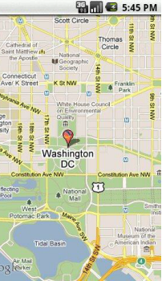
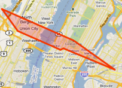
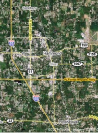
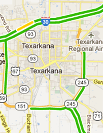
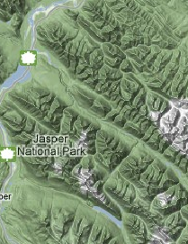

                                  
Map Properties
==============

The Map widget has the following properties:

* * *

<details close markdown="block"><summary>accessibilityConfig Property</summary>

* * *

Enables you to control accessibility behavior and alternative text for the widget.

For more information on using accessibility features in your app, see the [Accessibility](../../../Iris/app_design_dev/Content/Accessibility_Overview.md) appendix in the Volt MX IrisUser Guide.

### Syntax

```

accessibilityConfig
```

### Type

Object

### Read/Write

Read + Write

### Remarks

*   The accessibilityConfig property is enabled for all the widgets which are supported under the Flex Layout.

> **_Note:_** From Volt MX Iris V9 SP2 GA version, you can provide i18n keys as values to all the attributes used inside the `accessibilityConfig` property. Values provided in the i18n keys take precedence over values provided in `a11yLabel`, `a11yValue`, and `a11yHint` fields.

### The accessibilityConfig property is a JavaScript object which can contain the following key-value pairs.

  
| Key | Type | Description | ARIA Equivalent |
| --- | --- | --- | --- |
| a11yIndex | Integer with no floating or decimal number. | This is an optional parameter. Specifies the order in which the widgets are focused on a screen. | For all widgets, this parameter maps to the `aria-index`, `index`, or `taborder` properties. |
| a11yLabel | String | This is an optional parameter. Specifies alternate text to identify the widget. Generally the label should be the text that is displayed on the screen. | For all widgets, this parameter maps to the `aria-labelledby` property of ARIA in HTML. > **_Note:_** For the Image widget, this parameter maps to the **alt** attribute of ARIA in HTML. |
| a11yValue | String | This is an optional parameter. Specifies the descriptive text that explains the action associated with the widget. On the Android platform, the text specified for a11yValue is prefixed to the a11yHint. | This parameter is similar to the a11yLabel parameter. If the a11yValue is defined, the value of a11yValue is appended to the value of a11yLabel. These values are separated by a space. |
| a11yHint | String | This is an optional parameter. Specifies the descriptive text that explains the action associated with the widget. On the Android platform, the text specified for a11yValue is prefixed to the a11yHint. | For all widgets, this parameter maps to the `aria-describedby` property of ARIA in HTML. |
| a11yHidden | Boolean | This is an optional parameter. Specifies if the widget should be ignored by assistive technology. The default option is set to _false_. This option is supported on iOS 5.0 and above, Android 4.1 and above, and SPA | For all widgets, this parameter maps to the `aria-hidden` property of ARIA in HTML. |
| a11yARIA | Object | This is an optional parameter. For each widget, the key and value provided in this object are added as the attribute and value of the HTML tags respectively. Any values provided for attributes such as `aria-labelledby` and `aria-describedby` using this attribute, takes precedence over values given in `a11yLabel` and `a11yHint` fields. When a widget is provided with the following key value pair or attribute using the a11yARIA object, the tabIndex of the widget is automatically appended as zero.`{"role": "main"}``aria-label` | This parameter is only available on the Desktop Web platform. |

### Android limitations

*   If the results of the concatenation of a11y fields result in an empty string, then `accessibilityConfig` is ignored and the text that is on widget is read out.
*   The soft keypad does not gain accessibility focus during the right/left swipe gesture when the keypad appears.

### SPA/Desktop Web limitations

*   When `accessibilityConfig` property is configured for any widget, the `tabIndex` attribute is added automatically to the `accessibilityConfig` property.
*   The behavior of accessibility depends on the Web browser, Web browser version, Voice Over Assistant, and Voice Over Assistant version.
*   Currently SPA/Desktop web applications support only a few ARIA tags. To achieve more accessibility features, use the attribute a11yARIA. The corresponding tags will be added to the DOM as per these configurations.

### Example 1

This example uses the button widget, but the principle remains the same for all widgets that have an accessibilityConfig property.

```

//This is a generic property that is applicable for various widgets.
//Here, we have shown how to use the accessibilityConfig Property for button widget.
/*You need to make a corresponding use of the accessibilityConfig property for other applicable widgets.*/

Form1.myButton.accessibilityConfig = {
    "a11yLabel": "Label",
    "a11yValue": "Value",
    "a11yHint": "Hint"    
};
```

### Example 2

This example uses the button widget to implement internationalization in `accessibilityConfig` property, but the principle remains the same for all widgets.

```

/*Sample code to implement internationalization in accessibilityConfig property in Native platform.*/

Form1.myButton.accessibilityConfig = {
    "a11yLabel": voltmx.i18n.getLocalizedString("key1")     
};  
/*Sample code to implement internationalization in accessibilityConfig property in Desktop Web platform.*/

Form1.myButton.accessibilityConfig = {
    "a11yLabel": "voltmx.i18n.getLocalizedString(\"key3\")"
};
```

### Platform Availability

*   Available in the IDE
*   iOS, Android, SPA, and Desktop Web

* * *

</details>
<details close markdown="block"><summary>address Property</summary>

* * *

Enables you to navigate to the specified address.

### Syntax

```

address
```

### Type

JSObject

### Read/Write

Read + Write

### Remarks

This is a **non-constructor** property. You cannot set the property through a widget constructor. But you can read and write data to it.

### Example

```

//Sample code to set the address property of a Map widget.  
  
frmMap.myMap.address = {
    "location": "test, test"
};
```

### Platform Availability

*   Android
*   SPA

* * *

</details>
<details close markdown="block"><summary>anchor Property</summary>

Specifies the anchor position of a map's pin image.

### Syntax

```

anchor
```

### Type

Number

### Read/Write

Read + Write

### Remarks

The anchor property is an optional property that your app can set to one of the Pin Image Anchor Constants defined in the voltmx.map namespace. Refer to [Iris API Guide](../../../Iris/iris_api_dev_guide/content/introduction.md).

### Platform Availability

*   Available in the IDE
*   Available on all platforms

* * *

</details>
<details close markdown="block"><summary>anchorPoint Property</summary>

* * *

Specifies the anchor point of the widget bounds rectangle using the widget's coordinate space.

### Syntax

```

anchorPoint
```

### Type

JSObject

### Read/Write

Read + Write

### Remarks

The value for this property is a JavaScript dictionary object with the keys "x" and "y". The values for the "x" and "y" keys are floating-point numbers ranging from 0 to 1. All geometric manipulations to the widget occur about the specified point. For example, applying a rotation transform to a widget with the default anchor point causes the widget to rotate around its center.

The default value for this property is center ( {"x":0.5, "y":0.5} ), that represents the center of the widgets bounds rectangle. The behavior is undefined if the values are outside the range zero (0) to one (1).

### Example

```

Form1.widget1.anchorPoint = {
    "x": 0.5,
    "y": 0.5
};
```

### Platform Availability

*   iOS, Android, Windows, and SPA

* * *

</details>
<details close markdown="block"><summary>autoCenterPinOnClick Property</summary>

* * *

This property helps you to control the placement of the pins of the Map widget to the center, when it is clicked.

### Syntax

```

autoCenterPinOnClick
```

### Type

Boolean

### Read/Write

Read + Write

### Remarks

The default value of the autoCenterPinOnClick Property is false in all platforms, except for Android.

> **_Note:_** For 3D maps in iOS, if _autoCenterPinOnClick_ Property is false and the custom callout is clipped to the borders, the map gets re-centered.

### Example

```

//Sample code to enable the autoCenterPinOnClick property of a Map widget.  
  
frmMap.myMap.autoCenterPinOnClick=true;
```

### Platform Availability

*   Android
*   Windows
*   SPA
*   Desktop Web

* * *

</details>
<details close markdown="block"><summary>bottom Property</summary>

* * *

This property determines the bottom edge of the widget and is measured from the bottom bounds of the parent container.

The bottom property determines the position of the bottom edge of the widget’s bounding box. The value may be set using DP (Device Independent Pixels), Percentage, or Pixels. In freeform layout, the distance is measured from the bottom edge of the parent container. In flow-vertical layout, the value is ignored. In flow-horizontal layout, the value is ignored.

The bottom property is used only if the Height property is not provided.

### Syntax

```

bottom
```

### Type

String

### Read/Write

Read + Write

### Remarks

The property determines the bottom edge of the widget and is measured from the bottom bounds of the parent container.

If the layoutType is set as voltmx.flex.FLOW\_VERTICAL, the bottom property is measured from the top edge of bottom sibling widget. The vertical space between two widgets is measured from bottom of the top sibling widget and the top of the bottom sibling widget.

### Example

```

//Sample code to set the bottom property for widgets by using DP, Percentage and Pixels.
frmHome.widgetID.bottom = "50dp";

frmHome.widgetID.bottom = "10%";

frmHome.widgetID.bottom = "10px";
```

### Platform Availability

*   Available in the IDE
*   iOS, Android, Windows, SPA , and Desktop Web

* * *

</details>
<details close markdown="block"><summary>calloutTemplate Property</summary>

* * *

Accepts a reference to a Box Widget which represents a UI template for a custom callout.

### Syntax

```

calloutTemplate
```

### Type

voltmx.ui.Box

### Read/Write

Read + Write

### Remarks

The box template can only have Label, Link, RichText, Button and Image widgets.

If template is not provided, it will fallback to the platform specific default callout for backward compatibility. On iOS platform, onSelection event will not get fired for custom callout.

### Platform Availability

*   Available in the IDE
*   Available on all platforms

* * *

</details>
<details close markdown="block"><summary>calloutWidth Property</summary>

* * *

Specifies the width of the callout on the map.

### Syntax

```

calloutWidth
```

### Type

Number

### Read/Write

Read + Write

### Remarks

The default value for this property is _80 percent_.

When the Map Widget is inside a FlexContainer, the calloutWidth property of a Map Widget is ignored when using a Flex callout template because the Flex container has the width and height properties.

The property accepts a number between 1 to 100 in percentage relative to the Map Widget width. For example, 100 percent means the callout width should fill its Map Widget width. If the value specified is less than 1 or more than 100, the value of the property should fallback to 80 percent.

The calloutWidth property is applicable only for Box container templates. The calloutWidth property is not applicable for the FlexContainer templates.

### Example

```

//Sample code to set the calloutWidth property of a Map widget.  
  
frmMap.myMap.calloutWidth=80;
```

### Platform Availability

*   Available in the IDE
*   Available on all platforms

* * *

</details>
<details close markdown="block"><summary>centerX Property</summary>

* * *

This property determines the center of a widget measured from the left bounds of the parent container.

The centerX property determines the horizontal center of the widget’s bounding box. The value may be set using DP (Device Independent Pixels), Percentage, or Pixels. In freeform layout, the distance is measured from the left edge of the parent container. In flow-vertical layout, the distance is measured from the left edge of the parent container. In flow-horizontal layout, the distance is measured from the right edge of the previous sibling widget in the hierarchy.

### Syntax

```

centerX
```

### Type

String

### Read/Write

Read + Write

### Remarks

If the layoutType is set as voltmx.flex.FLOW\_HORIZONTAL, the centerX property is measured from right edge of the left sibling widget.

### Example

```

//Sample code to set the centerX property for widgets by using DP, Percentage and Pixels.
frmHome.widgetID.centerX = "50dp";

frmHome.widgetID.centerX = "10%";

frmHome.widgetID.centerX = "10px";
```

### Platform Availability

*   Available in the IDE
*   iOS, Android, Windows, SPA, and Desktop Web

* * *

</details>
<details close markdown="block"><summary>centerY Property</summary>

* * *

This property determines the center of a widget measured from the top bounds of the parent container.

The centerY property determines the vertical center of the widget’s bounding box. The value may be set using DP (Device Independent Pixels), Percentage, or Pixels. In freeform layout, the distance is measured from the top edge of the parent container. In flow-horizontal layout, the distance is measured from the top edge of the parent container. In flow-vertical layout, the distance is measured from the bottom edge of the previous sibling widget in the hierarchy.

### Syntax

```

centerY
```

### Type

String

### Read/Write

Read + Write

### Remarks

If the layoutType is set as voltmx.flex.FLOW\_VERTICAL, the centerY property is measured from bottom edge of the top sibling widget.

### Example

```

//Sample code to set the centerY property for widgets by using DP, Percentage and Pixels.
frmHome.widgetID.centerY = "50dp";

frmHome.widgetID.centerY = "10%";

frmHome.widgetID.centerY = "10px";
```

### Platform Availability

*   Available in the IDE
*   iOS, Android, Windows, SPA, and Desktop Web

* * *

</details>
<details close markdown="block"><summary>containerHeight Property</summary>

* * *

Specifies the available height of the container in terms of percentage. The percentage is based on the value of the containerHeightReference property.

> **_Note:_** In the Windows platform, when the value changed from positive to negative, there is no change. But when the value changed from 0 to negative, the property takes default height (500 px).

If not configured, the value may vary depending on the platforms.

### Syntax

```

containerHeight
```

### Type

Number

### Read/Write

Yes- (Read and Write)

### Example

```

//Sample code to set the containerHeight property of a Map widget.  
  
frmMap.myMap.containerHeight=80;
```

### Accessible form IDE

Yes

### Platform Availability

Available on all platforms except server-side Mobile Web platforms.

* * *

</details>
<details close markdown="block"><summary>containerHeightReference Property</summary>

* * *

This property is enabled when you set the [containerHeight](#containe3). The widget height percentage is calculated based on the following options.

**Default:** CONTAINER\_HEIGHT\_BY\_FORM\_REFERENCE

The container height percentage is calculated based on the below options.

*   CONTAINER\_HEIGHT\_BY\_FORM\_REFERENCE: The Map Widget's height is calculated based on the height of the Form excluding headers and footers. This property does not have any effect if the Map Widget is placed inside a pop-up or headers/footers.
*   CONTAINER\_HEIGHT\_BY\_PARENT\_WIDTH: Use this option if the Map Widget is placed inside a Box Widget. The width is calculated based on the width of the Box Widget.

> **_Note:_** To set the value through code, prefix the option with _constants._ such as _**constants.<option>**_.

### Syntax

```

containerHeightReference
```

### Type

Number

### Read/Write

Yes - (Read and Write)

### Example

```

//Sample code to set the containerHeightReference property of a Map widget.  
  
frmMap.myMap.containerHeightReference=constants.CONTAINER_HEIGHT_BY_PARENT_WIDTH;
```

### Accessible from IDE

Yes

### Platform Availability

Available on all platforms except server-side Mobile Web platforms.

* * *

</details>
<details close markdown="block"><summary>containerWeight Property</summary>

* * *

Specifies percentage of weight to be allocated by its parent widget. The parent widget space is distributed to its child widgets based on this weight factor. The child widgets of the parent widget should sum up to 100% of weight except when placed in _voltmx.ui.ScrollBox_.

### Syntax

```

containerWeight
```

### Type

Number (less than or equal to 100)

### Read/Write

Yes - (Read and Write)

### Example

```

//Sample code to set the containerWeight property of a Map widget.  
  
frmMap.myMap.containerWeight=80;
```

### Accessible from IDE

No

### Platform Availability

    Available on all platforms

* * *

</details>
<details close markdown="block"><summary>cursorType Property</summary>

* * *

In Desktop Web applications, when you hover the mouse over any widget, a mouse pointer appears. Using the cursorType property in Iris, you can specify the type of the mouse pointer.

### Syntax

```

cursorType
```

### Type

String.

You must provide valid CSS cursor value such as wait, grab, help, etc. to the cursorType property.

### Read/Write

Read + Write

### Remarks

To add the `cursorType` property using Volt MX Iris in a Desktop Web application, follow these steps.

1.  In Volt MX Iris, open the Desktop Web application. From the **Project** explorer, expand **Responsive Web/ Desktop**\> **Forms** and select the form to which you need to make the changes.
2.  On the canvas, select the widget for which you want to specify the cursor type. For example, button.
3.  From the **Properties** panel, navigate to the **Skin** tab > **Hover Skin** tab.  
    You will find that the details of the hover skin is not enabled here.
4.  Check the **Enable** option to add a hover skin to your widget.  
    The details and configurations of the hover skin is enabled.
5.  Under the **General** section, for the Platform option, click the ellipsis icon.  
    The **Fork Skin** window appears.
6.  In the **Fork Skin** window, for **Desktop**, check under **HTML5 SPA**.
7.  Click **Ok**. You have successfully forked your hover skin for Desktop Web application.  
    You can see that the **Cursor Type** property has been added under the **General** section.
8.  Select a value from the drop-down list to set the **Cursor Type** for the widget.

### Example

```

//This is a generic property and is applicable for many widgets.  
  
/*The example provided is for the Button widget. Make the required changes in the example while using other widgets.*/
  
frmButton.myButton.cursorType = "wait";

```

### Platform Availability

*   Available in IDE
*   Desktop Web

* * *

</details>
<details close markdown="block"><summary>defaultPinImage Property</summary>

* * *

The default map pin image used to indicate a location on map.

### Syntax

```

defaultPinImage
```

### Type

String or Image Object

### Read/Write

Read + Write

### Remarks

The defaultPinImage property can accept the pin image as a name string or as a JavaScript pin object. The pin object contains the following keys.

  
| Key | Description |
| --- | --- |
| source | Specifies the source of the image. The source could be an image name, an image path, or a URL. |
| sourceType | Contains a value from the [Pin Image Type Constants](../../../Iris/iris_api_dev_guide/content/introduction.md). If a value is not given for the sourceType, the default value of PIN\_IMG\_SRC\_TYPE\_RESOURCES is used. |
| anchor | Optional. A constant that defines how the pin image should be anchored to the location point. Its value should be one of the [Pin Image Anchor Constants](../../../Iris/iris_api_dev_guide/content/introduction.md). |

### Example

```

//Sample code to set the defaultPinImage property of a Map widget.  
  
frmMap.myMap.defaultPinImage="kmpin.png";
```

Setting the pin image using an image object.

```

frm1.map1.defaultPinImage = {
    source: "ZA8976AG..", //base64 string
    sourceType: voltmx.map.PIN_IMG_SRC_TYPE_BASE64,
    anchor: voltmx.map.PIN_IMG_ANCHOR_BOTTOM_CENTER
};
```

### Platform Availability

*   Available in the IDE
*   Available on all platforms

* * *

</details>
<details close markdown="block"><summary>enable Property</summary>

* * *

The `enable` property is used to control the actionability of the widgets. In a scenario where you want to display a widget but not invoke any action on the widget, configure the `enable` property to false to achieve it.

This is a constructor level property and applicable for all widgets in Volt MX Iris.

### Syntax

```

enable
```

### Type

Boolean

### Read/Write

Read + Write

### Remarks

The default value of this property is true.

When `enable` property is configured to true, the action associated with a widget can be invoked by the user in the application.

When `enable` property is configured to false, the action associated with a widget cannot be invoked by the user in the application.

### Example

```

//This is a generic property and is applicable for many widgets.  
  
/*The example provided is for the Button widget. Make the changes required in the example while using other widgets.*/
  
frmButton.myBtn.enable= true;
```

### Platform Availability

*   Android, iOS, Windows, SPA, and Desktop web

* * *

</details>
<details close markdown="block"><summary>enableCache Property</summary>

* * *

The property enables you to improve the performance of Positional Dimension Animations.

### Syntax

```

enableCache
```

### Type

Boolean

### Read/Write

Read + Write

### Remarks

The default value for this property is true.

> **_Note:_** When the property is used, application consumes more memory. The usage of the property enables tradeoff between performance and visual quality of the content. Use the property cautiously.

### Example

```

Form1.widgetID.enableCache = true;
```

### Platform Availability

*   Available in the IDE.
*   Windows

* * *

</details>
<details close markdown="block"><summary>enableMultipleCallouts Property</summary>

* * *

The property helps you define index to a Map Widget added in any container such as FlexForm, FlexContainer.

### Syntax

```

enableMultipleCallouts
```

### Type

Boolean

### Read/Write

Read + Write

### Remarks

If set to false then the default behavior of the map is shown

If set to true then callout’s visibility is controlled with setCalloutVisibility method.

When enableMultipleCallouts is set to TRUE, default callouts will not be supported.

### Example

```

//Sample code to set the enableMultipleCallouts property of a Map widget.
Form1.map.enableMultipleCallouts = true;
```

### Availability

*   iOS
*   Android
*   Windows

* * *

</details>
<details close markdown="block"><summary>enableToolBar Property</summary>

* * *

This property helps you to either enable or disable toolbar of a Map widget.

### Syntax

```

enableToolBar
```

### Type

Boolean

### Read/Write

Read + Write

### Remarks

The default value of this property is true.

> **_Note:_** The _enableToolBar_ property is introduced for the Android platform in the V8 SP4 release.

### Example

```

//Sample code to set the enableToolBar property of a Map widget.  
  
frmMap.myMap.enableToolBar=true;
```

### Availability

*   Android

* * *

</details>
<details close markdown="block"><summary>height Property</summary>

* * *

It determines the height of the widget and measured along the y-axis.

The height property determines the height of the widget’s bounding box. The value may be set using DP (Device Independent Pixels), Percentage, or Pixels. For supported widgets, the height may be derived from either the widget or container’s contents by setting the height to “preferred”.

### Syntax

```

height
```

### Type

Number, String, and Constant

### Read/Write

Read + Write

### Remarks

Following are the available measurement options:

*   %: Specifies the values in percentage relative to the parent dimensions.
*   px: Specifies the values in terms of device hardware pixels.
*   dp: Specifies the values in terms of device independent pixels.
*   default: Specifies the default value of the widget.
*   voltmx.flex.USE\_PREFERED\_SIZE: When this option is specified, the layout uses preferred height of the widget as height and preferred size of the widget is determined by the widget and may varies between platforms.

### Example

```

/*Sample code to set the height property for a Map widget by using DP, Percentage and Pixels.*/
frmMap.myMap.height="50dp";

frmMap.myMap.height="10%";

frmMap.myMap.height="10px";

```

### Platform Availability

*   Available in the IDE
*   iOS
*   Android
*   Windows
*   SPA

* * *

</details>
<details close markdown="block"><summary>id Property</summary>

* * *

The id property is a unique identifier of the Map Widget consisting of alphanumeric characters. Every Map Widget should have a unique id within a Form.

### Syntax

```

id
```

### Type

String

### Read/Write

Read only

### Example

```

//Defining the properties for Map with the id: "map1"
var mapBasicConf = {
    id: "map1",
    provider: constants.MAP_PROVIDER_GOOGLE,
    mapKey: "0z5UtaSPUYj42f5qX0VAwmDGLX39Qxgbtcra0TA",
    defaultPinImage: "kmpin.png",
    isVisible: true,
    screenLevelWidget: false
};
var mapLayoutConf = {
    margin: [20, 40, 50, 20],
    containerWeight: 100
};
var mapPSPConf = {};
//Creating the Map
var map = new voltmx.ui.Map(mapBasicConf, mapLayoutConf, mapPSPConf);
//Reading the id of the Map
alert("Map ID is :" + map.id);
```

### Platform Availability

*   Available in the IDE
*   Available on all platforms

* * *

</details>
<details close markdown="block"><summary>imageSourceType Property</summary>

* * *

Specifies the source of the image for pins on the map.

### Syntax

```

imageSourceType
```

### Type

Constant

### Read/Write

Read only

### Remarks

This property can be set to one of the following values.

| Constant | Description |
| --- | --- |
| voltmx.map.PIN\_IMG\_SRC\_TYPE\_BASE64 | Indicates the pin image should be created out of a given base64 string. |
| voltmx.map.PIN\_IMG\_SRC\_TYPE\_FILE\_PATH | Indicates the pin image is available in the internal file system. Specified value can be either absolute path or File object. |
| voltmx.map.PIN\_IMG\_SRC\_TYPE\_IMAGE | Indicates pin image is an Image object. |
| voltmx.map.PIN\_IMG\_SRC\_TYPE\_RAWBYTES | Indicates the pin image needs to be created from the RawBytes object. |
| voltmx.map.PIN\_IMG\_SRC\_TYPE\_RESOURCES | Default. Indicates the pin image is available in the bundled resources. |
| voltmx.map.PIN\_IMG\_SRC\_TYPE\_URL | Indicates the pin image is available in the remote server. |

If the imageSourceType property is not set, the Map Widget uses the default value of **voltmx.map.PIN\_IMG\_SRC\_TYPE\_RESOURCES**.

Additional pin image constants are available to anchor the pin image. These constants are found in the [API Developer's Guide](../../../Iris/iris_api_dev_guide/content/introduction.md).

### Example

```

voltmx.print("The imageSource type is:" + FormMap.map1.imageSourceType);
```

### Platform Availability

*   Available in the IDE
*   Available on all platforms

* * *

</details>
<details close markdown="block"><summary>info Property</summary>

* * *

A custom JSObject with the key value pairs that a developer can use to store the context with the Map Widget.

### Syntax

```

info
```

### Type

JSObject

### Read/Write

Read + Write

### Remarks

The info property will help in avoiding the globals to most part of the programming.

The info property is a **non-constructor** property. You cannot set this property through a widget constructor. You can read and write data to it.

The info property can hold any JSObject. After assigning the JSObject to the info property, the JSObject should not be modified. For example:

```

var inf = {
    a: "hello"
};
widget.info = inf;
widget.info.a = "hello world";
//This will not update the widget info a property to hello world. 
//widget.info.a will have the old value as hello.
```

### Example

```

//Sample code to set info property for a Map widget.

frmMap.myMap.info = {
    key: "My location"
};

//Reading the info of the Map widget.
voltmx.print("Map widget info:" +frmMap.myMap.info);

```

### Platform Availability

*   Available in the IDE
*   Available on all platforms

* * *

</details>
<details close markdown="block"><summary>isVisible Property</summary>

* * *

The isVisible property controls the visibility of a widget on the form.

### Syntax

```

isVisible
```

### Type

Boolean

### Read/Write

Read + Write

### Remarks

The default value for the isVisible property is true.

If set to _false,_ the widget is not displayed.

If set to _true,_ the widget is displayed.

### Example

```

//Sample code to set the isVisible property of a Map widget.
frmMap.myMap.isVisible=true;

```

> **_Note:_** You can set the visibility of a widget dynamically from code using the setVisibility method.

### Platform Availability

*   Available in the IDE
*   Available on all platforms

* * *

</details>
<details close markdown="block"><summary>left Property</summary>

* * *

This property determines the lower left corner edge of the widget and is measured from the left bounds of the parent container.

The left property determines the position of the left edge of the widget’s bounding box. The value may be set using DP (Device Independent Pixels), Percentage, or Pixels. In freeform layout, the distance is measured from the left edge of the parent container. In flow-vertical layout, the distance is measured from the left edge of the parent container. In flow-horizontal layout, the distance is measured from the right edge of the previous sibling widget in the hierarchy.

### Syntax

```

left
```

### Type

String

### Read/Write

Read + Write

### Remarks

If the layoutType is set as voltmx.flex.FLOW\_HORIZONTAL, the left property is measured from right edge of the left sibling widget.

### Example

```

//Sample code to set the left property for widgets by using DP, Percentage and Pixels.
frmHome.widgetID.left = "50dp";

frmHome.widgetID.left = "10%";

frmHome.widgetID.left = "10px";
```

### Platform Availability

*   Available in the IDE
*   iOS, Android, Windows, SPA, and Desktop Web

* * *

</details>
<details close markdown="block"><summary>locationData Property</summary>

* * *

The locationData property helps you specify the data of the location highlighted on the Map Widget.

### Syntax

```

locationData
```

### Type

Array.

### Read/Write

Read + Write

### Remarks

The following keys required in the location JSObject:

*   lat \[String\] \[Mandatory\]: Specifies the latitude of the location.
*   lon \[String\] \[Mandatory\]: Specifies the longitude of the location.
*   name \[String\] \[Mandatory\]: Specifies a short description for the location.
*   desc \[String\] \[Mandatory\]: Specifies a long description for the location.
*   image \[String or Image Object\] \[Mandatory\]: Specifies the map pin image that overrides the [defaultPinImage](#defaultP).
*   navigateAndZoom \[Boolean\] \[Optional\]: Decides whether the navigation to first pin should take place. It is available on Android, Windows, and iOS.  
    Default value: true for all platforms.  
    Example:  
    locationData:\[{lat:"17.445775", lon:"78.3731",name: "Campus 1", desc: "My Office Campus" ,navigateAndZoom:true }\]};  
    
*   showcallout \[Boolean\] \[Optional\]: Shows the callout pop-up. The default value is _true_.
*   calloutData \[JSObject\] \[Optional\]: Specifies the widget data for a given template for a particular location. The value should be a map of key-value pairs. The data can have one of the standard keys called "template" that accepts a box reference, to provide location-specific template, which overrides the widget level "calloutTemplate." The sample format of the data is follows: {dataId1:"", dataId2:"" ,dataId3:"", template:boxRef2}.

> **_Note:_** The widget-data map for a template must be provided in the "[widgetDataMapForCallout](#widgetDa)" property.

*   meta \[JSObject\] \[Optional\]: Specifies the platform-specific metadata.
    *   color\[String\] \[Optional\]: Specifies the color for the pop-up. (Supported on Mobile Web and SPA.)
    *   label \[String\] \[Optional\]: Specifies the text for the pop-up. (Supported on Mobile Web and SPA.)
*   **zIndex**\[Number\] \[Optional\]: Applicable for Android platform only.  
    Specifies the stack order of pins in the Map widget. You can set a Double or Integer value (including negative value) as `zIndex`. When a pin is added to the Map widget with a higher `zIndex`, it will be placed in front of other pins with lower zIndices. If multiple pins are placed at the same co-ordinates, then the [onPinClick](Map_Events.md#onPinCli) event is first triggered for the pin with a higher `zIndex`. The `onPinClick` event is then triggered for the rest of the pins in a descending order of `zIndex` on consecutive clicks. The default value of this parameter is zero.
    
    > **_Note:_** In Android platform, in a map the z-index value stack of the pins are different from the z-index stack of the shapes. The pins are drawn on top of the shapes based on their z-index values. Also, when the pins and shapes (such as circle and polyline) are placed on the map on top of each other, the click event of the pins have a higher priority than the click events of the shapes.
    

The image property of the locationData property can accept the pin image as a name string or as a JavaScript pin object. The pin object contains the following keys.

  
| Key | Description |
| --- | --- |
| source | Specifies the source of the image. The source could be an image name, an image path, a URL. |
| sourceType | Contains a value from the [Pin Image Type Constants](../../../Iris/iris_api_dev_guide/content/voltmx_map_constants.md). If a value is not given for the sourceType, the default value PIN\_IMG\_SRC\_TYPE\_RESOURCES is used. |
| anchor | Optional. A constant that defines how the pin image should be anchored to the location point. The constant's value should be one of the [Pin Image Anchor Constants](../../../Iris/iris_api_dev_guide/content/voltmx_map_constants.md). If a value is not specified, the value PIN\_IMG\_ANCHOR\_BOTTOM\_CENTER is used. |

### Examples

Creating a map.

```

//Sample code to set the locationData property of a Map widget.
frmMap.myMap.locationData = [{
 lat: "17.445775",
 lon: "78.3731",
 name: "Campus 1",
 desc: "My Office Campus"
}];
//Sample code to set the meta property for Mobile Web and SPA platforms./*This property is mandatory while setting the locationData property in Mobile Web and SPA platforms.*/  
frmMap.myMap.meta={
color: "green",
 label: "C"
};  

```

Specifying the pin image as a string.

```

locationData = {
	…
	Image = "mypinimage.png";
	….
}
```

Specifying the pin image using file path.

```

locationData = {
	….
	image = {
	source:voltmx.io. getDataDirectoryPath()+"/mappin.png",
	sourceType:voltmx.map.PIN_IMG_SRC_TYPE_FILE_PATH,
	anchor:voltmx.map.PIN_IMG_ANCHOR_BOTTOM_RIGHT
   };
	….
}

```

Specifying the location data with custom pin images and flex callout template. This example is applicable to Android and iOS.

```

var imgConfigfilePath;

var base64StringImage;

/* Store the images in the file path */
function storeImageinFilePath() {
    var url = "https://cdn3.iconfinder.com/data/icons/free-social-icons/67/facebook_circle_color-32.png";
    var httpReq = new voltmx.net.HttpRequest();
    httpReq.open(constants.HTTP_METHOD_GET, url, false);
    httpReq.send();
    if (httpReq.responseType == constants.HTTP_RESPONSE_TYPE_RAWDATA) {
        var file = new voltmx.io.File(voltmx.io.FileSystem.getDataDirectoryPath() + "/" + "ratingstar.png");
        file.createFile();
        file.write(httpReq.response);
        var fullPath = file.fullPath;
        imgConfigfilePath = {
            source: fullPath,
            sourceType: voltmx.map.PIN_IMG_SRC_TYPE_FILE_PATH
        };
    }
}

/* Getting image from base64 string */
function getImageFrombase64String() {
    var base64String1 = "iVBORw0KGgoAAAANSUhEUgAAACAAAAAgCAYAAABzenr0AAAGCklEQVRYhe2WW2xcRxmAvzln5lx2vfbasQOJQ4hSEiraUNE2BR4IL4hrJaoWJKTmgVYFisQDogUkkMoDoki8AOUmUUGrhkiQBAm1VVSpLtASmSQNaW40DSS2k9T1ddd7dr275zYzPOy6Mk1CHCuIF37p18wczfn/7//n8g/8X/7HIq42ofHpn6zVi/EdWTvZnKZpOcuSVpZl/zDajLz7zI9a/xWA9rd/X9Dt7AHi7PMmar3PVBbRzZgsTUnynCxJSLO0qbX+xrazP/v5dQVo/+C5L6Gc79t6uz8/X8HW2xBn2DhFxzlZnpBkOXmSkmQJCLa/57XHjqwWQC518l8dULnWe0QpvMv8cwoz38BxBDb0sEKAsLhCQHv575bYtZ8FVg3gLHW0FE+568t3mckqNtM4oYcIPESguuojAokbKpT08aXE6y0S6+xTq3X+JoDedXC7O9DzORZaCEHXubqiuoFEFUKaOsUE8qaX3/XgmtUCdJbAchupxhqDE6hOygEM/75LbFd9RWVqiumzExTesTbDEas+DRJAT9WOiuEyjnCwvuo6sx1lqQWkQ+paLh57lcrE6ziuJJ6u/nTH9K72FexfVRwA75sfP5wcGa8yUEQM9UF/EVEKO9obInoDtDHUxiaZPHCM1nQVhMC64oS19uurdf4mAIB5o7ZfT9cQmwdxbxqGtb3oOCMbnyM5PEF8dIJsJkK6LtKV2J4A/4Z18sMzv9HXBcAN1CN6OpqytSZ2poG5UMHO1RFJjnAFrpK4rksjT7jYrqLznGKhcONftz6orgtA8akHxlV/zxYWWl/Rc/WTouBBfxFbDjGhxDiCKGkRJS0wFp1mIITTqEWH9/fdvfu58j33PV/+jH+tAJe9iuv3/vJD3h2bX1K3byI//QbZkXHyiQqVmTkmF2aoRAu4FtbfvJWZcxdYbDfxraAg1KSD+OhHantfveYMLJfe3V/8Sz4x+xqA6A1xSiFOIAk8D18FSCnR1hBXI4JyCeOKztG1dtiBXdeSgcsCtB75w+1CqX5TXcQpBVAOEaGH5/uESqGkhwXiWgPrCPq9IkN+CeVInMC7dXTj/RtWDZD8+Plb3OHyi6IveJs+X4FigNvfgwg9pO8RKA9fqc4xzA1DmWJd2IevPJRUeKUirpR3rhpA9BV+i+sUaKWY6To4nWUQJR8n9Ag8n4IfsHFoPVuHN1H0QzzloaSksKaPYN0AQskV1we5fKCfHP2g6Q1uNBcqOL7CxBnZoTGEcsF1EaGktKZMqa8Pk2ZkadrZxcYgevqoNGp4aY7T49+wKgCE8LEWx3OxgYdjLXqugY1TbDtF+B5uL9h2hsCCsVjHQZdDxibOkdYa9GtL8PaBA6sCyC9UR8WmgVgUgsDmGmsVYqkmGNstDQZhLCgXp9fQmq9w7sxZosU6viupR1H0bOPMd1cKcMk90Ljv188EOz9wp9MbYmYb2PkGutqEdoptJNh2imm0ac8sUH99hnpUp9qqE8UtDKbxaPPgPa/ks6N0ni7magCXbEJbbT6bjpzGLiY4W9bi3jyMu64MSqIbbfKLFfKxOfLZOkJbPCkJpMccrRNfq//pE6/ks6eAIhBcLsC3inzrB0fJ3abW+padX9woQg9bbaKnapjZOiQ5OAIhOwXJcyWTJrnwWO3QL/Y1T++h+1oAdNe5281EvuIM9Oz78qLXX9xuovYTItMttxggy0WkL1G+QvkerZKTnNqg+eHg+As7zj3+yX3N008DHqC6QXlAAejrtivPAID/6N2zwP1PPPS9Lzy+f+/7i653i4gzf2GxHp2Znzy/5dZtOx5+6OHvOH9LbmOEoBvh0nqbZboUpOhm5xK56hoBQ8CmZZFYz/OCkZEXnvnjn1/09u753Vf/furkaNfBkuMcSIEGUAWSKxl3VwBgulGo7nxHa63fu23blsHBwXfGcSJOnjj+0jKAFGgCEVDrjq8oKwHIuwYbQAuIgXatVtP37tz5sWp1YcOhg6NPaq2ngQU6EdeARTqb8T/KSgCgE1nSNRoBtUKhMNVutZLjx48d1Vq/HEXRmLW22Z234mfavwBmFcbGcon1XwAAAABJRU5ErkJggg==";
    var base64StringImage = {
        source: base64String1,
        sourceType: voltmx.map.PIN_IMG_SRC_TYPE_BASE64
    };
}

function SetLocationData() {
    storeImageinFilePath();
    getImageFrombase64String();
    //Flextemp is a flex template.
    frmMap11.Map0620ca100759c4c.calloutTemplate = Flextemp;
    frmMap11.Map0620ca100759c4c.widgetDataMapForCallout = {
        "lbl1": "lbl1"
    };
    rmMap11.Map0620ca100759c4c.locationData = [{
        lat: "17.447326",
        lon: "78.371358",
        name: "HCL",
        desc: "Phoenix infocity, Gachibowli",
        image: {
            source: "pin1.png",
            sourceType: voltmx.map.PIN_IMG_SRC_TYPE_RESOURCES,
            anchor: voltmx.map.PIN_IMG_ANCHOR_TOP_LEFT
        },
        showCallout: true,
        calloutData: {
            lbl1: {
                text: "hcl.com(new)"
            }
        }
    }, {
        lat: "17.445252",
        lon: "78.378271",
        name: "tcs",
        desc: "Phoenix infocity, Gachibowli",
        image: imgConfigfilePath,
        showCallout: true,
        calloutData: {
            lbl1: {
                text: "TCS"
            }
        }
    }, {
        lat: "17.450368",
        lon: "78.381052",
        name: "Cyber Towers",
        desc: "Phoenix infocity, Gachibowli",
        image: base64StringImage,
        showCallout: true,
        calloutData: {
            lbl1: {
                text: "CyberTowers"
            }
        }
    }];
}
```

### Platform Availability

*   Available in the IDE
*   Available on all platforms

* * *

</details>
<details close markdown="block"><summary>mapHeight Property</summary>

* * *

Specifies the height of the map. Accepts the values based on 320 screen height.

**Default:** (No skin is applied)

To specify a skin, select a skin from the list.

> **_Note:_** For the skin to be available in the list, you must add a skin for BlockedUI under Widget Skins.

### Syntax

```

mapHeight
```

### Type

JSObject

### Read/Write

No

### Example

```

//Defining the properties for Map with mapHeight:100
var mapBasicConf = {
    id: "map1",
    provider: constants.MAP_PROVIDER_GOOGLE,
    mapKey: "0z5UtaSPUYj42f5qX0VAwmDGLX39Qxgbtcra0TA",
    defaultPinImage: "kmpin.png",
    isVisible: true
};
var mapLayoutConf = {
    margin: [20, 40, 50, 20],
    containerWeight: 100
};
var mapPSPConf = {
    mapHeight: 100
};
//Creating the Map
var map = new voltmx.ui.Map(mapBasicConf, mapLayoutConf, mapPSPConf);
```

### Platform Availability

*   Available in the IDE
*   Server-side Mobile Web (basic)
*   Server-side Mobile Web (BJS)

* * *

</details>
<details close markdown="block"><summary>mapKey Property</summary>

* * *

The map key required to connect to the map provider service. Since Iris only supports Google maps, the mapKey property accepts the Google map key.

### Syntax

```

mapKey
```

### Type

String

### Read/Write

No

### Remarks

A separate map key is needed for the Android platform based on the Android SDK map key requirements, which is different from the map key requirements for static/ dynamic JavaScript based on the Google map key.

For more information on configuring the map keys, refer to [Generating and Configuring Map API Keys](../../../Iris/iris_user_guide/Content/Generating_Map_Keys.md).

### Example

```

/* Defining the properties for Map with mapKey:"0z5UtaSPUYj42f5qX0VAwmDGLX39Qxgbtcra0TA"*/
var mapBasicConf = {
    id: "map1",
    provider: constants.MAP_PROVIDER_GOOGLE,
    mapKey: "0z5UtaSPUYj42f5qX0VAwmDGLX39Qxgbtcra0TA",
    defaultPinImage: "kmpin.png",
    isVisible: true,
    screenLevelWidget: false
};
var mapLayoutConf = {
    margin: [20, 40, 50, 20],
    containerWeight: 100
};
var mapPSPConf = {};
//Creating the Map
var map = new voltmx.ui.Map(mapBasicConf, mapLayoutConf, mapPSPConf);
```

### Platform Availability

*   Available in the IDE
*   Available on all platforms

* * *

</details>
<details close markdown="block"><summary>mapSource Property</summary>

* * *

Specifies the source of a map.

### Syntax

```

mapSource
```

### Type

Number

### Read/Write

No

### Remarks

You can choose one of the following sources:

**Default:** (No skin is applied)

MAP\_SOURCE\_NATIVE: If you select the option, the application uses the [mapKey](#mapKey) and [provider](#provider) details to fetch the map. The fetched map is _interactive_ with zoom and pan features.

> **_Note:_** The polygon view on advanced Mobile Web platform is available only when the source is set to non-native.  

*   MAP\_SOURCE\_NON\_NATIVE:If you select the option, the application uses the map that is on the device.
*   MAP\_SOURCE\_STATIC:If you select the option, the application uses the [mapKey](#mapKey) and [provider](#provider) properties to fetch the maps.
    
    The fetched map is _non-interactive_. However, you can zoom and pan across the map.
    
    > **_Note:_** MAP\_SOURCE\_STATIC is only applicable to HTML5 Mobile Web platform.
    

> **_Note:_** Mobile Web (basic), and Mobile Web (BJS) support only Google Static Maps as a source. Static maps are directly requested from Google for a given latitude and longitude. Volt MX Iris does not support any other option because the size of the get request URL can be bigger than 256 characters, leading to the request not being served.

### Platform Availability

*   Available in the IDE
*   Server-side Mobile Web (basic)
*   Server-side Mobile Web (BJS)
*   Server-side Mobile Web (Advanced)
*   SPA

* * *

</details>
<details close markdown="block"><summary>mapWidth Property</summary>

* * *

Specifies the width of the map. Accepts the values based on 320 screen width.

### Syntax

```

mapWidth
```

### Type

Number

### Read/Write

No

### Example

```

//Defining the properties for Map with mapWidth:100
var mapBasicConf = {
    id: "map1",
    provider: constants.MAP_PROVIDER_GOOGLE,
    mapKey: "0z5UtaSPUYj42f5qX0VAwmDGLX39Qxgbtcra0TA",
    defaultPinImage: "kmpin.png",
    isVisible: true
};
var mapLayoutConf = {
    margin: [20, 40, 50, 20],
    containerWeight: 100
};
var mapPSPConf = {
    mapWidth: 100
};
//Creating the Map
var map = new voltmx.ui.Map(mapBasicConf, mapLayoutConf, mapPSPConf);
```

### Platform Availability

*   Available in the IDE
*   Server-side Mobile Web (basic)
*   Server-side Mobile Web (BJS)

* * *

</details>
<details close markdown="block"><summary>margin Property</summary>

* * *

Defines the space around a widget. You can use the option to define the left, top, right, and bottom distance between the widget and the next element.

To define the margin values for a platform, click the Click to Editbutton against the property to open the _Margin_ screen. Select the checkbox against the platform for which you want to define the margins, and enter the top, left, right, and bottom margin values.

If you want to use the margin values set for a platform across other platforms, you can click the _Apply To_ button, and select the platforms on which you want the margin values to be applied.

The following image illustrates the window to define the margins for platforms:


The following image illustrates a widget with a defined margin:


### Syntax

```

margin
```

### Type

Array of numbers

### Read/Write

Yes - (Read and Write)

### Example

```

//Sample code to set the margin property of a Map widget.
frmMap.myMap.margin= [20, 40, 50, 20];   

```

### Accessible from IDE

Yes

### Platform Availability

### Available on all platforms

* * *

</details>
<details close markdown="block"><summary>marginInPixel Property</summary>

* * *

Indicates if the margin is to be applied in pixels or in percentage.

**Default:** _false_

If set to _true,_ the margin is applied in pixels.

If set to _false,_ the margin is applied as set in the [margin](#margin) property.

### Syntax

```

marginInPixel
```

### Type

Boolean

### Read/Write

No

### Example

```

//Sample code to set the marginInPixel property of a Map widget.
frmMap.myMap.marginInPixel=true;  

```

### Accessible from IDE

Yes

### Platform Availability

*   iPhone
*   iPad
*   Android
*   Windows

* * *

</details>
<details close markdown="block"><summary>maxHeight Property</summary>

* * *

This property specifies the maximum height of the widget and is applicable only when the height property is not specified.

The maxHeight property determines the maximum height of the widget’s bounding box. The value may be set using DP (Device Independent Pixels), Percentage, or Pixels. The maxHeight value overrides the preferred, or “autogrow” height, if the maxHeight is less than the derived content height of the widget.

### Syntax

```

maxHeight
```

### Type

Number

### Read/Write

Read + Write

### Example

```

//Sample code to set the maxHeight property for widgets by using DP, Percentage and Pixels.
frmHome.widgetID.maxHeight = "50dp";

frmHome.widgetID.maxHeight = "10%";

frmHome.widgetID.maxHeight = "10px";
```

### Platform Availability

*   Available in the IDE
*   iOS, Android, Windows, SPA, and Desktop Web

* * *

</details>
<details close markdown="block"><summary>maxWidth Property</summary>

* * *

This property specifies the maximum width of the widget and is applicable only when the width property is not specified.

The Width property determines the maximum width of the widget’s bounding box. The value may be set using DP (Device Independent Pixels), Percentage, or Pixels. The maxWidth value overrides the preferred, or “autogrow” width, if the maxWidth is less than the derived content width of the widget.

### Syntax

```

maxWidth
```

### Type

Number

### Read/Write

Read + Write

### Example

```

//Sample code to set the maxWidth property for widgets by using DP, Percentage and Pixels.
frmHome.widgetID.maxWidth = "50dp";

frmHome.widgetID.maxWidth = "10%";

frmHome.widgetID.maxWidth = "10px";
```

### Platform Availability

*   Available in the IDE
*   iOS, Android, Windows, SPA, and Desktop Web

* * *

</details>
<details close markdown="block"><summary>minHeight Property</summary>

* * *

This property specifies the minimum height of the widget and is applicable only when the height property is not specified.

The minHeight property determines the minimum height of the widget’s bounding box. The value may be set using DP (Device Independent Pixels), Percentage, or Pixels. The minHeight value overrides the preferred, or “autogrow” height, if the minHeight is larger than the derived content height of the widget.

### Syntax

```

minHeight
```

### Type

Number

### Read/Write

Read + Write

### Example

```

//Sample code to set the minHeight property for widgets by using DP, Percentage and Pixels.
frmHome.widgetID.minHeight = "50dp";

frmHome.widgetID.minHeight = "10%";

frmHome.widgetID.minHeight = "10px";
```

### Platform Availability

*   Available in the IDE
*   iOS, Android, Windows, SPA, and Desktop Web

* * *

</details>
<details close markdown="block"><summary>minWidth Property</summary>

* * *

This property specifies the minimum width of the widget and is applicable only when the width property is not specified.

The minWidth property determines the minimum width of the widget’s bounding box. The value may be set using DP (Device Independent Pixels), Percentage, or Pixels. The minWidth value overrides the preferred, or “autogrow” width, if the minWidth is larger than the derived content width of the widget.

### Syntax

```

minWidth
```

### Type

Number

### Read/Write

Read only

### Example

```

//Sample code to set the minWidth property for widgets by using DP, Percentage and Pixels.
frmHome.widgetID.minWidth = "50dp";

frmHome.widgetID.minWidth = "10%";

frmHome.widgetID.minWidth = "10px";
```

### Platform Availability

*   Available in the IDE
*   iOS, Android, Windows, SPA, and Desktop Web

* * *

</details>
<details close markdown="block"><summary>mode Property</summary>

* * *

Specifies the view mode to view the map.

### Syntax

```

mode
```

### Type

Number

### Read/Write

Read + Write

### Remarks

> **_Note:_** From Volt MX Iris V8 SP4 FP 43, when a user changes the map mode by using the native UI, the mode property returns the latest modified value. This value does not change even when the user navigates to another form, and then, returns to the form with the map. The map will open in the mode set by the user.  
For example, the user changes the mode of the map from normal to satellite. Then the user navigates to another form and returns to the form with the map. The map will open in the satellite mode.  
This behavior is applicable only for Desktop Web and SPA applications.

The default value for the property is MAP\_VIEW\_MODE\_NORMAL.

The mode options are:

_MAP\_VIEW\_MODE\_NORMAL_:Traditional depiction of roads, parks and borders.

_MAP\_VIEW\_MODE\_SATELLITE_: Map showing aerial imagery.

_MAP\_VIEW\_MODE\_STREET_: Navigate within street-level imagery.

_MAP\_VIEW\_MODE\_HYBRID_: _Street_ map superimposed on _Satellite_ map.

_MAP\_VIEW\_MODE\_POLYGON_: Map showing the polygonal area as specified in locationdata property.

_MAP\_VIEW\_MODE\_TRAFFIC_: Specifies the streets with different colors to indicate traffic information on the map. The color green indicates low traffic, orange indicates medium traffic and red indicates heavy traffic.

_MAP\_VIEW\_MODE\_TERRAIN_: Map showing the surface of the land in 3D view.

> **_Note:_** Traffic mode works only in North America and Europe.

### The following images illustrate **Normal Mode**, **Satellite Mode**, and **Street Mode**.

  
| Normal Mode | Satellite Mode | Street Mode |
| --- | --- | --- |
|  |  |  |

### The following images illustrate the **Polygon Mode**, **Hybrid Mode**, and **Traffic Mode**.

  
| Polygon Mode | Hybrid Mode | Traffic Mode |
| --- | --- | --- |
|  |  |  |

### The following image illustrates the **Terrain Mode**

| Terrain Mode |
| --- |
|  |

  
### The following table shows the list of map modes and their availability in respective platforms:

  
| Modes | Normal | Satellite | Hybrid | Street | Polygon | Traffic | Terrain |
| --- | --- | --- | --- | --- | --- | --- | --- |
| IOS | Yes | Yes | Yes | No | No | No | No |
| Windows | Yes | Yes | Yes | No | No | No | No |
| Android | Yes | Yes | No | No | No | Yes | No |
| SPA | Yes | Yes | Yes | No | Yes | No | Yes |
| Mobile Web (basic) | Yes | Yes | Yes | No | No | No | Yes |
| Mobile Web (BJS) | Yes | Yes | Yes | No | No | No | Yes |
| Mobile Web (Advanced) | Yes | Yes | Yes | No | Yes | No | Yes |
| DesktopWeb | Yes | Yes | Yes | No | Yes | No | Yes |

If you select the mode as polygon for Mobile Web, the location coordinates specified in the [locationData](#location) property are plotted as the vertices of a polygon and the area is shaded.

> **_Note:_** The polygon mode is applicable only if the _[mapSource](#mapSourc)_ is MAP\_SOURCE\_NON\_NATIVE.

### Example

```

//Sample code to set the mode property of a Map widget.  
  
frmMap.myMap.mode=constants.MAP_VIEW_MODE_HYBRID;  

```

### Platform Availability

*   Available in the IDE
*   iPhone
*   iPad
*   Android
*   SPA
*   Server side MobileWeb (basic, BJS, Advanced)
*   Windows

* * *

</details>
<details close markdown="block"><summary>navControlsImageConfig Property</summary>

* * *

The images required to configure the zoom (in and out) and navigation ( left, right, top, and bottom) controls on the static map view.

### Syntax

```

navControlsImageConfig
```

### Type

JSObject

### Read/Write

No

### Remarks

The property accepts key values for image names for the following.

*   zoomIn
*   zoomOut
*   navLeft
*   navRight
*   navTop
*   navBottom

### Example

```

//Sample code to set the navControlsImageConfig property of a Map widget.  
  
frmMap.myMap.navControlsImageConfig = {
 zoomIn: "a.png",
 zoomOut: "b.png",
 navLeft: "c.png",
 navRight: "d.png",
 navTop: "e.png",
 navBottom: "f.png"
};  

```

### Platform Availability

*   Available in the IDE
*   Server-side Mobile Web (Advanced)
*   SPA

* * *

</details>
<details close markdown="block"><summary>opacity Property</summary> 

* * *

Specifies the opacity of the widget. The value of this property must be in the range 0.0 (transparent) to 1.0 (opaque). Any values outside this range are fixed to the nearest minimum or maximum value.

Specifies the opacity of the widget. Valid opacity values range from 0.0 (transparent), to 1.0 (opaque). Values set to less than zero will default to zero. Values more than 1.0 will default to 1. Interaction events set on a transparent widget will still be fired. To disable the events, also set the “isVisible” property to “false”.

### Syntax

```

opacity
```

### Type

Number

### Read/Write

Read + Write

### Remarks

> **_Note:_** This property has more priority compared to the values coming from the configured skin.

### Example

```

//Sample code to make the widget transparent by using the opacity property.
frmHome.widgetID.opacity = 0;

//Sample code to make the widget opaque by using the opacity property.
frmHome.widgetID.opacity = 1;
```

### Platform Availability

*   Not available in the IDE.
*   iOS, Android, Windows, SPA, and Desktop Web

* * *

</details>
<details close markdown="block"><summary>parent Property</summary>

* * *

Helps you access the parent of the widget. If the widget is not part of the widget hierarchy, the parent property returns null.

### Syntax

```

parent
```

### Read/Write

Read only

### Remarks

> **_Note:_** The property works for all the widgets inside a FlexForm, FlexContainer or FlexScrollContainer.

### Example

```

function func() {

    voltmx.print("The parent of the widget" + JSON.stringify(Form1.widgetID.parent));

}
```

### Platform Availability

*   Not available in the IDE
*   iOS, Android, Windows, SPA, and Desktop Web

* * *

</details>
<details close markdown="block"><summary>provider Property</summary>

* * *

Specifies the map data provider.

### Syntax

```

provider
```

### Type

Number

### Read/Write

No

### Remarks

The default value for the provider property is MAP\_PROVIDER\_GOOGLE.

### Example

For example, you can set the map provider as Google or Bing based on your location and requirement.

```

//Defining the properties for Map with provider:constants.MAP_PROVIDER_GOOGLE
var mapBasicConf = {
    id: "map1",
    provider: constants.MAP_PROVIDER_GOOGLE,
    mapKey: "0z5UtaSPUYj42f5qX0VAwmDGLX39Qxgbtcra0TA",
    defaultPinImage: "kmpin.png",
    isVisible: true,
    screenLevelWidget: false
};
var mapLayoutConf = {
    margin: [20, 40, 50, 20],
    containerWeight: 100
};
var mapPSPConf = {};
//Creating the Map
var map = new voltmx.ui.Map(mapBasicConf, mapLayoutConf, mapPSPConf);
```

### Platform Availability

*   Available in the IDE
*   Available on all platforms

* * *

</details>
<details close markdown="block"><summary>retainContentAlignment Property</summary>

* * *

This property is used to retain the content alignment property value, as it was defined.

> **_Note:_** Locale-level configurations take priority when invalid values are given to this property, or if it is not defined.

### The mirroring widget layout properties should be defined as follows.

```

function getIsFlexPositionalShouldMirror(widgetRetainFlexPositionPropertiesValue) {
    return (isI18nLayoutConfigEnabled &&
    localeLayoutConfig[defaultLocale]
    ["mirrorFlexPositionalProperties"] == true &&
    !widgetRetainFlexPositionPropertiesValue);
}
```

### The following table illustrates how widgets consider Local flag and Widget flag values.

  
| Properties | Local Flag Value | Widget Flag Value | Action |
| --- | --- | --- | --- |
| Mirror/retain FlexPositionProperties | true | true | Use the designed layout from widget for all locales. Widget layout overrides everything else. |
| Mirror/retain FlexPositionProperties | true | false | Use Mirror FlexPositionProperties since locale-level Mirror is true. |
| Mirror/retain FlexPositionProperties | true | not specified | Use Mirror FlexPositionProperties since locale-level Mirror is true. |
| Mirror/retain FlexPositionProperties | false | true | Use the designed layout from widget for all locales. Widget layout overrides everything else. |
| Mirror/retain FlexPositionProperties | false | false | Use the Design/Model-specific default layout. |
| Mirror/retain FlexPositionProperties | false | not specified | Use the Design/Model-specific default layout. |
| Mirror/retain FlexPositionProperties | not specified | true | Use the designed layout from widget for all locales. Widget layout overrides everything else. |
| Mirror/retain FlexPositionProperties | not specified | false | Use the Design/Model-specific default layout. |
| Mirror/retain FlexPositionProperties | not specified | not specified | Use the Design/Model-specific default layout. |

### Syntax

```

retainContentAlignment
```

### Type

Boolean

### Read/Write

No (only during widget-construction time)

### Example

```

//This is a generic property that is applicable for various widgets.
//Here, we have shown how to use the retainContentAlignment property for Button widget.
/*You need to make a corresponding use of the 
retainContentAlignment property for other applicable widgets.*/
var btn = new voltmx.ui.Button({
    "focusSkin": "defBtnFocus",
    "height": "50dp",
    "id": "myButton",
    "isVisible": true,
    "left": "0dp",
    "skin": "defBtnNormal",
    "text": "text always from top left",
    "top": "0dp",
    "width": "260dp",
    "zIndex": 1
}, {
    "contentAlignment": constants.CONTENT_ALIGN_TOP_LEFT,
    "displayText": true,
    "padding": [0, 0, 0, 0],
    "paddingInPixel": false,
    "retainFlexPositionProperties": false,
    "retainContentAlignment": true
}, {});
```

### Platform Availability

*   Available in IDE
*   Windows, iOS, Android, and SPA

* * *

</details>
<details close markdown="block"><summary>retainFlexPositionProperties Property</summary>

* * *

This property is used to retain flex positional property values as they were defined. The flex positional properties are left, right, and padding.

> **_Note:_** Locale-level configurations take priority when invalid values are given to this property, or if it is not defined.

### The mirroring widget layout properties should be defined as follows.

```

function getIsFlexPositionalShouldMirror(widgetRetainFlexPositionPropertiesValue) {
    return (isI18nLayoutConfigEnabled &&
    localeLayoutConfig[defaultLocale]
    ["mirrorFlexPositionalProperties"] == true &&
    !widgetRetainFlexPositionPropertiesValue);
}
```

### The following table illustrates how widgets consider Local flag and Widget flag values.

  
| Properties | Local Flag Value | Widget Flag Value | Action |
| --- | --- | --- | --- |
| Mirror/retain FlexPositionProperties | true | true | Use the designed layout from widget for all locales. Widget layout overrides everything else. |
| Mirror/retain FlexPositionProperties | true | false | Use Mirror FlexPositionProperties since locale-level Mirror is true. |
| Mirror/retain FlexPositionProperties | true | not specified | Use Mirror FlexPositionProperties since locale-level Mirror is true. |
| Mirror/retain FlexPositionProperties | false | true | Use the designed layout from widget for all locales. Widget layout overrides everything else. |
| Mirror/retain FlexPositionProperties | false | false | Use the Design/Model-specific default layout. |
| Mirror/retain FlexPositionProperties | false | not specified | Use the Design/Model-specific default layout. |
| Mirror/retain FlexPositionProperties | not specified | true | Use the designed layout from widget for all locales. Widget layout overrides everything else. |
| Mirror/retain FlexPositionProperties | not specified | false | Use the Design/Model-specific default layout. |
| Mirror/retain FlexPositionProperties | not specified | not specified | Use the Design/Model-specific default layout. |

### Syntax

```

retainFlexPositionProperties
```

### Type

Boolean

### Read/Write

No (only during widget-construction time)

### Example

```

//This is a generic property that is applicable for various widgets.
//Here, we have shown how to use the retainFlexPositionProperties property for Button widget.
/*You need to make a corresponding use of the 
retainFlexPositionProperties property for other applicable widgets.*/
var btn = new voltmx.ui.Button({
    "focusSkin": "defBtnFocus",
    "height": "50dp",
    "id": "myButton",
    "isVisible": true,
    "left": "0dp",
    "skin": "defBtnNormal",
    "text": "always left",
    "top": "0dp",
    "width": "260dp",
    "zIndex": 1
}, {
    "contentAlignment": constants.CONTENT_ALIGN_CENTER,
    "displayText": true,
    "padding": [0, 0, 0, 0],
    "paddingInPixel": false,
    "retainFlexPositionProperties": true,
    "retainContentAlignment": false
}, {});
```

### Platform Availability

*   Available in IDE
*   Windows, iOS, Android, and SPA

* * *

</details>
<details close markdown="block"><summary>retainFlowHorizontalAlignment Property</summary>

* * *

### This property is used to convert Flow Horizontal Left to Flow Horizontal Right.

> **_Note:_** Locale-level configurations take priority when invalid values are given to this property, or if it is not defined.

### The mirroring widget layout properties should be defined as follows.

```

function getIsFlexPositionalShouldMirror(widgetRetainFlexPositionPropertiesValue) {
    return (isI18nLayoutConfigEnabled &&
    localeLayoutConfig[defaultLocale]
    ["mirrorFlexPositionalProperties"] == true &&
    !widgetRetainFlexPositionPropertiesValue);
}
```

### The following table illustrates how widgets consider Local flag and Widget flag values.

  
| Properties | Local Flag Value | Widget Flag Value | Action |
| --- | --- | --- | --- |
| Mirror/retain FlexPositionProperties | true | true | Use the designed layout from widget for all locales. Widget layout overrides everything else. |
| Mirror/retain FlexPositionProperties | true | false | Use Mirror FlexPositionProperties since locale-level Mirror is true. |
| Mirror/retain FlexPositionProperties | true | not specified | Use Mirror FlexPositionProperties since locale-level Mirror is true. |
| Mirror/retain FlexPositionProperties | false | true | Use the designed layout from widget for all locales. Widget layout overrides everything else. |
| Mirror/retain FlexPositionProperties | false | false | Use the Design/Model-specific default layout. |
| Mirror/retain FlexPositionProperties | false | not specified | Use the Design/Model-specific default layout. |
| Mirror/retain FlexPositionProperties | not specified | true | Use the designed layout from widget for all locales. Widget layout overrides everything else. |
| Mirror/retain FlexPositionProperties | not specified | false | Use the Design/Model-specific default layout. |
| Mirror/retain FlexPositionProperties | not specified | not specified | Use the Design/Model-specific default layout. |

### Syntax

```

retainFlowHorizontalAlignment
```

### Type

Boolean

### Read/Write

No (only during widget-construction time)

### Example

```

//This is a generic property that is applicable for various widgets.
//Here, we have shown how to use the retainFlowHorizontalAlignment property for Button widget.
/*You need to make a corresponding use of the 
retainFlowHorizontalAlignment property for other applicable widgets. */
var btn = new voltmx.ui.Button({
 "focusSkin": "defBtnFocus",
 "height": "50dp",
 "id": "myButton",
 "isVisible": true,
 "left": "0dp",
 "skin": "defBtnNormal",
 "text": "always left",
 "top": "0dp",
 "width": "260dp",
 "zIndex": 1
}, {
 "contentAlignment": constants.CONTENT_ALIGN_CENTER,
 "displayText": true,
 "padding": [0, 0, 0, 0],
 "paddingInPixel": false,
 "retainFlexPositionProperties": true,
 "retainContentAlignment": false,
 "retainFlowHorizontalAlignment ": false
}, {});
```

### Platform Availability

*   Available in IDE
*   Windows, iOS, Android, and SPA

* * *

</details>
<details close markdown="block"><summary>retainMapPositionOnRestore Property</summary>

* * *

This flag indicates whether to retain mapPosition or bounds on map restore. This means that when retainMapPositionOnRestore is true, the last viewed map position/bounds (which is the map postion/bounds before navigating away from the form that contains the map) stays intact when you revisit the form that contains the map widget.

### Example

retainMapPositionOnRestore

### Default Value

false (for Android)

### Read/Write

Read + Write

### Example

```

Form2.map1.retainMapPositionOnRestore = true;
```

### Platform Availability

*   Android

* * *

</details>
<details close markdown="block"><summary>right Property</summary>

* * *

This property determines the lower right corner of the widget and is measured from the right bounds of the parent container.

The right property determines the position of the right edge of the widget’s bounding box. The value may be set using DP (Device Independent Pixels), Percentage, or Pixels. In freeform layout, the distance is measured from the left edge of the parent container. In flow-vertical layout, value is ignored. In flow-horizontal layout, the value is ignored.

The right property is used only if the width property is not provided.

### Syntax

```

right
```

### Type

String

### Read/Write

Read + Write

### Remarks

If the layoutType is set as voltmx.flex.FLOW\_HORIZONTAL, the right property is measured from left edge of the right sibling widget. The horizontal space between two widgets is measured from right of the left sibling widget and left of the right sibling widget.

### Example

```

//Sample code to set the right property for widgets by using DP, Percentage and Pixels.
frmHome.widgetID.right = "50dp";

frmHome.widgetID.right = "10%";

frmHome.widgetID.right = "10px";
```

### Platform Availability

*   Available in the IDE
*   iOS, Android, Windows, SPA, and Desktop Web

* * *

</details>
<details close markdown="block"><summary>screenLevelWidget Property</summary>

* * *

Specifies whether the widget should occupy the whole container excluding space for headers and footers, if any.

### Syntax

```

screenLevelWidget
```

### Type

Boolean

### Read/Write

No

### Remarks

If set to _false,_ the map occupies the space as set in the IDE or layout properties.

If set to _true,_ the map occupies the whole space on the container.

### Example

```

//Sample code to set the screenLevelWidget property of a Map widget.  
frmMap.myMap.screenLevelWidget=true;  

```

### Platform Availability

*   Available in the IDE
*   Available on all platforms except SPA.

* * *

</details>
<details close markdown="block"><summary>showCurrentLocation Property</summary>

* * *

Indicates the current location on a map as a pin, circle, or none.

### Syntax

```

showCurrentLocation
```

### Type

Number

### Read/Write

Yes

### Remarks

### Following are the options available for iOS:

*   MAP\_VIEW\_SHOW\_CURRENT\_LOCATION\_NONE. This is the default value.
*   MAP\_VIEW\_SHOW\_CURRENT\_LOCATION\_AS\_PIN
*   MAP\_VIEW\_SHOW\_CURRENT\_LOCATION\_AS\_CIRCLE

### For Android, the showCurrentLocation property accepts only Boolean values.

*   _true_: the current location is shown on the map with blue circle and a camera handle on top of the map.
*   _false_: the current location is not indicated on the map. This is the default value.

> **_Note:_** The property is supported only from the Google Maps V2 version.

### For Android, make sure that the following are defined under the Manifest Properties.

1.  Open the application, and click **Project Settings** icon. The **Project Settings** window opens.
2.  Click the **Native** tab, and then click **Android** sub-tab.
3.  Under the **Manifest Properties**, click the **Permissions** tab.
4.  Select the following options from the left pane and click **Add**. Make sure that the selected options are moved to the right pane.

*   ACCESS\_COARSE\_LOCATION
*   ACCESS\_FINE\_LOCATION
*   WRITE\_EXTERNAL\_STORAGE

6.  Under the **Manifest Properties**, click the **Tags** tab.
7.  In the **Child tab entries under <application > tag** box, add the following tag.

<meta-data Android:name="com.google.Android.gms.version" Android:value="@integer/google\_play\_services\_version" />

9.  Click **Finish**.

### Example for iOS

```

//Sample code to set the showCurrentLocation property of a Map widget.  
  
frmMap.myMap.showCurrentLocation=constants.MAP_VIEW_SHOW_CURRENT_LOCATION_AS_PIN;  

```

### Example for Android

```

//Sample code to set the showCurrentLocation property of a Map widget.  
  
frmMap.myMap.showCurrentLocation=true;  

```

### Platform Availability

*   Available in the IDE only for iOS
*   iOS
*   Android

* * *

</details>
<details close markdown="block"><summary>showZoomControl Property</summary>

* * *

Indicates if the zoom control is to be displayed on the map.

### Syntax

```

showZoomControl
```

### Type

Boolean

### Read/Write

Read + Write

### Remarks

The default value for the showZoomControl property is true.

If set to _false,_ the zoom control is displayed.

If set to _true,_ the zoom control is not displayed.

### Example

```

//Sample code to set the showZoomControl property of a Map widget.  
  
frmMap.myMap.showZoomControl=true;  

```

### Platform Availability

*   Available in the IDE
*   Android
*   Desktop Web
*   SPA

* * *

</details>
<details close markdown="block"><summary>top Property</summary>

* * *

### This property determines the top edge of the widget and measured from the top bounds of the parent container.

The top property determines the position of the top edge of the widget’s bounding box. The value may be set using DP (Device Independent Pixels), Percentage, or Pixels. In freeform layout, the distance is measured from the top edge of the parent container. In flow-vertical layout, the distance is measured from the bottom edge of the previous sibling widget in the hierarchy. In flow-horizontal layout, the distance is measured from the left edge of the parent container.

### Syntax

```

top
```

### Type

String

### Read/Write

Read + Write

### Remarks

If the layoutType is set as voltmx.flex.FLOW\_VERTICAL, the top property is measured from the bottom edge of the top sibling widget. The vertical space between two widgets is measured from bottom of the top sibling widget and top of the bottom sibling widget.

### Example

```

//Sample code to set the top property for widgets by using DP, Percentage and Pixels.
frmHome.widgetID.top = "50dp";

frmHome.widgetID.top = "10%";

frmHome.widgetID.top = "10px";
```

### Platform Availability

*   Available in the IDE
*   iOS, Android, Windows, SPA, and Desktop Web

* * *

</details>
<details close markdown="block"><summary>transform Property</summary>

* * *

Contains an animation transformation that can be used to animate the widget.

### Syntax

```

transform
```

### Type

JSObject

### Read/Write

Read + Write

### Remarks

This property is set to the identify transform by default. Any transformations applied to the widget occur relative to the widget's anchor point. The transformation contained in this property must be created using the [voltmx.ui.makeAffineTransform](../../../Iris/iris_api_dev_guide/content/voltmx.ui_functions.md#makeAffi) function.

### Example

This example uses the button widget, but the principle remains the same for all widgets that have a transform property.

```

//Animation sample
var newTransform = voltmx.ui.makeAffineTransform();
newTransform.translate3D(223, 12, 56);

//translates by 223 xAxis,12 in yAxis,56 in zAxis
widget.transform = newTransform;
```

### Platform Availability

*   iOS, Android, Windows, and SPA

* * *

</details>
<details close markdown="block"><summary>widgetDataMapForCallout Property</summary>

* * *

Specifies the mapping between the widget identifiers and data identifiers.

### Syntax

```

widgetDataMapForCallout
```

### Type

JSObject

### Read/Write

Read + Write

### Remarks

The map must contain all widget data maps referred across multiple templates, including the dynamic templates for each map location, if any. The map accepts the data as key-value pairs, where **key** is the widget identifier and **value** is the data identifier.

On the iOS platform, the onSelection event is triggered for a custom callout.

### Example

```

//Sample code to set the widgetDataMapForCallout property of a Map widget.  
  
frmMap.myMap.widgetDataMapForCallout = {
 "flxMap": "flxMap",
 "lbl1": "lbl1"
};  

```

### Platform Availability

*   Available in the IDE
*   Available on all platforms except on Windows10

* * *

</details>
<details close markdown="block"><summary>width Property</summary>

* * *

This property determines the width of the widget and is measured along the x-axis.

The width property determines the width of the widget’s bounding box. The value may be set using DP (Device Independent Pixels), Percentage, or Pixels. For supported widgets, the width may be derived from either the widget or container’s contents by setting the width to “preferred”.

### Syntax

```

width
```

### Type

Number, String, and Constant

### Read/Write

Read + Write

### Remarks

Following are the options that can be used as units of width:

*   %: Specifies the values in percentage relative to the parent dimensions.
*   px: Specifies the values in terms of device hardware pixels.
*   dp: Specifies the values in terms of device independent pixels.
*   default: Specifies the default value of the widget.
*   voltmx.flex.USE\_PREFERED\_SIZE: When this option is specified, the layout uses preferred width of the widget as width and preferred size of the widget is determined by the widget and may varies between platforms.

### Example

```

//Sample code to set the width property for widgets by using DP, Percentage and Pixels.
frmHome.widgetID.width = "50dp";

frmHome.widgetID.width = "10%";

frmHome.widgetID.width = "10px";
```

### Platform Availability

*   Available in the IDE
*   iOS, Android, Windows, SPA, and Desktop Web

* * *

</details>
<details close markdown="block"><summary>zIndex Property</summary>

* * *

This property specifies the stack order of a widget. A widget with a higher zIndex is always in front of a widget with a lower zIndex.

The zIndex property is used to set the stack, or layer order of a widget. Widgets with higher values will appear “over”, or “on top of” widgets with lower values. Widgets layered over other widgets will override any interaction events tied to widgets beneath. Modifying the zIndex does not modify the order of the widgets in the Volt MX Iris hierarchy, inside of a flexContainer or form. The zIndex property accepts only positive values.

### Syntax

```

zIndex
```

### Type

Number

### Read/Write

Read + Write

### Remarks

The default value for this property is 1.

> **_Note:_** Modifying the zIndex does not modify the order of the widgets inside the FlexContainer. If zIndex is same for group of overlapping widgets then widget order decides the order of overlapping. The last added widget is displayed on top.

From Volt MX Iris V9 SP2 FP7, developers can configure the Z Index value for a Responsive Web app as **Auto** or **Custom**. When the selected Z Index value is **Auto**, the default Z Index value of 1 is applied. When the selected Z Index value is **Custom**, developers can specify a desired numeric value.

Prior to the V9 SP2 FP7 release, the default value for the Z Index was **1**. When developers imported any third-party libraries with the Z index set as **Auto**, content overflow was disabled as the value of Auto is less than 1.

> **_Note:_** The Z Index value Auto is supported only when the Enable JS Library mode is configured as unchecked.

For existing components, the value of the Z Index is configured as **1** for the Native channel. For the Responsive Web channel, the Z Index will be set as **Custom** with **1** as the value.

For new components, the value of the Z Index is configured as **1** for the Native channel. For the Responsive Web channel, the Z Index will be set as **Auto** or **1** based on the project level settings.

> **_Note:_** If ModalContainer property is set to true in any of the FlexContainer widget, the Z Index value of that container and all of its parent containers should be set to **Custom**.

**voltmx.flex.ZINDEX\_AUTO** : Constant to configure the Z Index value as **auto** programmatically.

```

//Sample code to set the ZIndex value to Auto  
 var flx = new voltmx.ui.FlexContainer({ 
  "id": "flx"
  "zIndex": voltmx.flex.ZINDEX_AUTO
});

```

```

//Sample code to set the ZIndex value to Auto
flx.zIndex = voltmx.flex.ZINDEX\_AUTO;

```

### Example

```

//Sample code to set the zIndex property for widgets.  
frmHome.widgetID.zIndex = 300;
```

### Platform Availability

*   Available in the IDE
*   iOS, Android, Windows, SPA, and Desktop Web

* * *

</details>
<details close markdown="block"><summary>zoomLevel Property</summary>

* * *

Sets the zoom level for the current map view. The range varies from platform to platform.

zoomLevel accepts floating values to improve precision.

### Syntax

```

zoomLevel
```

### Type

Number

### Read/Write

Read + Write

### Remarks

Following are the range and default values on different platforms:

*   iPhone: \[0-28\], the default is 14.
*   Android: \[1-21\], the default is 15.
*   Windows: 1.0 to 20.0.
*   Desktop Web/ SPA: 0-22, the default value is 15.

### Example

```

//Sample code to set the zoomLevel property of a Map widget.  
  
frmMap.myMap.zoomLevel=10.5;
```

### Platform Availability

*   Available in the IDE
*   Android
*   iPhone/ iPad
*   Windows
*   Desktop Web
*   SPA

* * *
</details>

