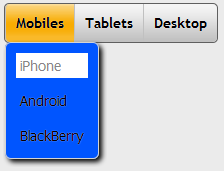
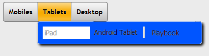

                               

MenuContainer Properties
========================

The basic properties for MenuContainer widget are:

* * *


<details close markdown="block"><summary>activeSkin Property</summary>

* * *

Specifies the skin for a menu item that is currently selected.

### Syntax
```

activeSkin
```

### Type

String

### Read/Write

Yes - (Read and Write)

### Example

```

//Sample code to set the activeSkin property of a MenuContainer widget.  
frmMenuC.myMenuC.activeSkin="mnuactSkin";
```

### Accessible from IDE

Yes

### Platform Availability

Available on Desktop Web platform only.

* * *

</details>
<details close markdown="block"><summary>collapsedImage Property</summary>

* * *

> **_Note:_** This property is displayed only when the [viewType](#viewType) is selected as MENU\_CONTAINER\_VIEW\_TYPE\_TREEVIEW.

Specifies the image to collapse an extended menu.

### Syntax

collapsedImage

### Type

String

### Read/Write

Yes - (Read and Write)

### Example

```

/*Sample code to set the collapsedImage property of a MenuContainer widget where collapsedimage.png is available in the resources folder.*/  
frmMenuC.myMenuC.collapsedImage="collapseimage.png";
```

### Accessible from IDE

Yes

### Platform Availability

Available on Desktop Web platform only.

* * *

</details>
<details close markdown="block"><summary>containerWeight Property</summary>

* * *

Specifies percentage of width to be allocated by its parent widget. The parent widget space is distributed to its child widgets based on this weight factor. All its child widgets should sum up to 100% of weight except when placed in _voltmx.ui.ScrollBox_.

### Syntax
```

containerWeight
```

### Type

Number

### Read/Write

Yes - (Read and Write)

### Example

```

//Sample code to set the containerWeight property of a MenuContainer widget.  
frmMenuC.myMenuC.containerWeight=100;
```

### Accessible from IDE

No

### Platform Availability

Available on Desktop Web platform only.

* * *

</details>
<details close markdown="block"><summary>contextMenu Property</summary>

* * *

The context specific menu will be displayed with the array of menu items (appropriate to the widget in focus) on right-click mouse.

Default: None

A series of steps to be followed to use contextMenu:

1.  Define a menutemplate under project > templates >menus.
    1.  Go to Applications View.
    2.  Expand the application for which you want to create a menu template.
    3.  Navigate to templates and expand menus, right-click desktop and select New Menu Template. The Create a New Menu window appears.
    4.  Enter a Name for the template and click Finish.
    5.  A new form is created. Drag-drop an HBox and then a VBox within an HBox. You can add other widgets within these widgets.
2.  Define a contextmenu template under project > templates >menus.
    1.  Go to Applications View.
    2.  Expand the application for which you want to create a contextmenu template.
    3.  Navigate to templates and expand contextmenus, right-click desktop and select New ContextMenu Template. The Create a New ContextMenu window appears.
    4.  Enter a Name for the template and click Finish. A new form is created
    5.  Drag-drop a menucontainer.
    6.  (optional) Select menuItemTemplate from the drop down.
    7.  Define data using the data property.
3.  Go to your project and then to desired form and drag-drop a hbox and navigate to Desktop Web properties in Widget Properties window.
4.  Select the contextmenu template from the dropdown.

### Syntax
```

contextMenu
```

### Type

Array (voltmx.ui.Menuitem)

### Read/Write

Yes - (Read and Write)

### Example

```

//Defining contextMenu template.
function initializeaddtoabc() {
    menucontainer12068 = new voltmx.ui.MenuContainer({
        "id": "menucontainer12068",
        "isVisible": true,
        "data": [{
            template: hbox12068,
            "label12068": {
                "text": "India"
            },
            children: [{
                template: hbox12068,
                "label12068": {
                    "text": "Mumbai"
                },
                "image212068": {},
                children: []
            }]
        }, {
            template: hbox120685810729885,
            "label12068": {
                "text": "Srilanka"
            },
            "image212068": {}
        }],
        "widgetDataMap": {
            "label12068": "label12068",
            "image212068": "image212068"
        },
        "menuItemTemplate": hbox12068
    }, {
        "widgetAlignment": constants.WIDGET_ALIGN_CENTER,
        "containerWeight": "50",
        "margin": [0, 0, 0, 0],
        "padding": [0, 0, 0, 0],
        "marginInPixel": false,
        "paddingInPixel": false
    }, {
        "viewType": constants.MENU_CONTAINER_VIEW_TYPE_CONTEXTVIEW
    });
}

//Defining the box with contextMenu:menucontainer12068.
var basicConfBox = {
    id: "boxBorderCollapse",
    isVisible: true,
    orientation: constants.BOX_LAYOUT_HORIZONTAL
};

var layoutConfBox = {
    contentAlignment: constants.CONTENT_ALIGN_TOP_CENTER,
    containerWeight: 100,
    vExpand: true
};

var PSPConfBox = {
    contextMenu: menucontainer12068
};

//Creating the box.
var boxBorderCollapse = new voltmx.ui.Box(basicConfBox, layoutConfBox, PSPConfBox);
```

  
### Accessible from IDE

Yes

### Platform Availability

Available on Desktop Web platform only.

* * *

</details>
<details close markdown="block"><summary>data Property</summary>

* * *

Specifies the menu items that must be displayed in the Menu.

> **_Note:_**  
**Template** is the standard key which can be used optionally to override the common menuItemTemplate provided with a specific template for the row. For template, always the value has to be valid box reference, if not it falls back to common menuItemTemplate.  
**metaInfo** is another standard key which can be used to specify some meta information about the row. For example clickable and skin.  
All write properties of the widget are allowed to be set as a part of the widget data while programming for the menu items.

### To add menu and sub menu items to the menu container, follow these steps:

Before proceeding, ensure that you have already created [menu templates](Menuitem_Templates.md) to be used in the _data_ property.

1.  To specify the values, click the Ellipsis button against the property to open the screen _Master data for MenuBar_.
2.  Right-click on _MenuBar Data_ preserve">var var select **Add MenuItem**. A Menu item is added.
3.  Assign the **Template Id** and click Template Data to update the values for the properties displayed.
4.  To add sub menu items, set the **subMenu**column **false/true** to the respective menu item. If the menu item is set to _true_ you can add sub menu items. Right-click on the menu item and select **Add MenuItem** and update the data accordingly.
5.  Once you are done, click **OK**.

> **_Note:_** When you change a submenu to menu or viceversa, the data that is set will be lost and templateID gets reset to default template.

### Syntax
```

data
```

### Type

JSObject

### Read/Write

Yes - (Read and Write)

### Example

```

//Sample code to set the data property of a MenuContainer widget.  
frmMenuC.myMenuC.data = [{
  template: hbox2,
  label2: {
   text: "Four"
  },
  image2: "btn.png",
  children: []
 }],
 isVisible: true,
 menuItemTemplate: hbox2,
 skin: "mnuSkin",
 widgetDataMap: {
  label2: "label2",
  image2: "image2"
 }
}, ];
```

### Accessible from IDE

Yes

### Platform Availability

Available on Desktop Web platform only

* * *

</details>
<details close markdown="block"><summary>expandedImage Property</summary>

* * *

> **_Note:_** This property is displayed only when the [viewType](#viewType) is selected as MENU\_CONTAINER\_VIEW\_TYPE\_TREEVIEW.

Specifies the image to expand a collapsed menu.

### Syntax
```

expandedImage
```

### Type

String

### Read/Write

Yes - (Read and Write)

### Example

```

/*Sample code to set the expandedImage property of a MenuContainer widget where expandimage.png is an image file in the resources folder.*/  
frmMenuC.myMenuC.expandedImage="expandimage.png";
```

Yes

### Platform Availability

Available on Desktop Web platform only.

* * *

</details>
<details close markdown="block"><summary>hoverSkin Property</summary>

* * *

Specifies the look and feel of a widget when the cursor hovers on the widget.

### Syntax
```

hoverSkin
```

### Type

String

### Read/Write

Yes - (Read and Write)

### Example

```

//Sample code to set the hoverSkin property of a MenuContainer widget.  
  
frmMenuC.myMenuC.hoverSkin ="mnuhovSkin";
```

### Accessible from IDE

Yes

### Platform Availability

Available on Desktop Web platform only.

* * *

</details>
<details close markdown="block"><summary>id Property</summary>

* * *

id is a unique identifier of MenuContainer consisting of alpha numeric characters. Every MenuContainer should have a unique id within a Form.

### Syntax
```

id
```

### Type

String - \[Mandatory\]

### Read/Write

Read only

### Example

```

//Defining the properties for a MenuContainer with id: "menu1".
var mnuBasic = {
    id: "menu1",
    hoverSkin: "mnuhovSkin",
    activeSkin: "mnuactSkin",
    data: [{
        template: hbox2,
        label2: {
            text: "Three"
        },
        image2: "btn.png",
    }, {
        template: hbox2,
        label2: {
            text: "Four"
        },
        image2: "btn.png",
        children: []
    }],
    isVisible: true,
    menuItemTemplate: hbox2,
    skin: "mnuSkin",
    widgetDataMap: {
        label2: "label2",
        image2: "image2"
    }
};

var mnuLayout = {
    padding: [5, 5, 5, 5],
    margin: [5, 5, 5, 5],
    containerWeight: 100,
    paddingInPixel: true,
    marginInPixel: true,
    widgetAlignment: constants.WIDGET_ALIGN_TOP_LEFT
};

var mnuPSP = {
    viewType: constants.MENU_CONTAINER_VIEW_DROPDOWNVIEW
};

//Creating the MenuContainer.
var menu1 = new voltmx.ui.MenuContainer(mnuBasic, mnuLayout, mnuPSP);
```

  
### Accessible from IDE

Yes

### Platform Availability

Available on Desktop Web platform only.

* * *

</details>
<details close markdown="block"><summary>info Property</summary>

* * *

A custom JSObject with the key value pairs that a developer can use to store the context with the widget. This will help avoid the use of globals.

> **_Note:_** This is a **non-Constructor** property. You cannot set this property through widget constructor. But you can read and write data to it.

Info property holds any JSObject. Post assigning the JSObject to info property, the JSObject should not be modified.

### Syntax
```

info
```

### Type

JSObject

### Read/Write

Yes - (Read and Write)

### Example

```

//Sample code to set info property for a MenuContainer widget.

frmMenuC.myMenuC.info = {
 key: "MenuContainer info"
};

//Reading the info of the MenuContainer widget.
voltmx.print("MenuContainer widget info:" + frmMenuC.myMenuC.info);
```

### Accessible from IDE

No

### Platform Availability

Available on Desktop Web platform only.

* * *

</details>
<details close markdown="block"><summary>isVisible Property</summary>

* * *

This property controls the visibility of a widget on the form.

**Default:**_true_

If set to _false,_ the widget is not displayed.

If set to _true,_ the widget is displayed.

### Syntax
```

isVisible
```

### Type

Boolean

### Read/Write

Yes - (Read and Write)

### Example

```

//Sample code to set the isVisible property for a MenuContainer widget.

frmMenuC.myMenuC.isVisible= true;
```

> **_Note:_** In addition, the visibility of the widget can be controlled using the setVisibility method.

### Accessible from IDE

Yes

### Platform Availability

Available on Desktop Web platform only

* * *

</details>
<details close markdown="block"><summary>menuItemTemplate Property</summary>

* * *

Indicates a common template to be used for each menuItem while creating the menu items and filling the data.

### Syntax
```

menuItemTemplate
```

### Type

voltmx.ui.Box - \[Mandatory\]

### Read/Write

Yes - (Read and Write)

### Example

```

/*Sample code to set the menuItemTemplate property for a MenuContainer widget where hbox2 is the container of the template.*/

frmMenuC.myMenuC.menuItemTemplate= hbox2;
```

### Accessible from IDE

No

### Platform Availability

Available on Desktop Web platform only

* * *

</details>
<details close markdown="block"><summary>orientation Property</summary>

* * *

Specifies how you can stack the widgets within the MenuContainer. You can set the orientation of the MenuContainer as _horizontal_ or _vertical_.

> **_Note:_** This property is disabled if the viewType is set as MENU\_CONTAINER\_VIEW\_TYPE\_TREEVIEW.

**Default:** MENUCONTAINER\_POSITION\_AS\_HORIZONTAL

The available options are:

*   MENUCONTAINER\_POSITION\_AS\_HORIZONTAL: Enables you to stack the content within the menucontainer horizontally.
*   MENUCONTAINER\_POSITION\_AS\_VERTICAL: Enables you to stack the content within the menucontainer vertically.

> **_Note:_** To set the value through code, prefix the option with _constants._ such as _**constants.<option>**_ .

### Syntax
```

orientation
```

### Type

Number

### Read/Write

Yes - (Read and Write)

### Example

```

//Sample code to set the orientation property for a MenuContainer widget.

frmMenuC.myMenuC.orientation=constants.MENUCONTAINER_POSITION_AS_HORIZONTAL;
```

### Accessible from IDE

Yes

### Platform Availability

Available on Desktop Web platform only.

* * *

</details>
<details close markdown="block"><summary>padding Property</summary>

* * *

Defines the space between the content of the widget and the widget boundaries. You can use this option to define the top, left, right, and bottom distance between the widget content and the widget boundary.

To define the padding values for a platform, click the () button against the property to open the _Padding_ screen. Select the checkbox against the platform for which you want to define the padding's and enter the top, left, right, and bottom padding values.

If you want to use the padding values set for a platform across other platforms, you can click the _Apply To_ button and select the platforms on which you want the padding values to be applied.

> **_Note:_** Due to Browser restrictions, you cannot apply Padding for a [ComboBox](ComboBox.md) and [Form](Form.md) widgets on Mobile Web platform. Padding is not supported by Windows Mobile browser for Box and Image Gallery.

> **_Note:_** If no skin is applied to a Button, then Padding is not supported on iPhone. This is due to iOS Safari browser limitation. If you want the padding to be applied, apply a skin to the button and then apply padding.

### Syntax
```

padding
```

### Type

Array of Numbers

### Read/Write

Yes - (Read and Write)

### Example

```

//Sample code to set the padding property for a MenuContainer widget.

frmMenuC.myMenuC.padding=[5, 5, 5, 5];
```

### Accessible from IDE

Yes

### Platform Availability

Available on Desktop Web platform only.

* * *

</details>
<details close markdown="block"><summary>paddingInPixel Property</summary>

* * *

Indicates if the padding is to be applied in pixels or in percentage.

**Default:** _false_

If set to _true,_ the padding is applied in pixels.

If set to _false,_ the padding is applied as set in [padding](#padding) property.

> **_Note:_** This property can be set to _true_ or _false_ only for iPhone, iPad, Android and Windows Phone. On other platforms this property does not give any results even when set to _true_.

> **_Note:_** For backward compatibility on older projects, this property is will be made _true_ for iPhone, iPad, Android and Windows Phone and for other platforms it will be _false_.

### Syntax
```

paddingInPixel
```

### Type

Boolean

### Read/Write

No

### Example

```

//Sample code to set the paddingInPixel property for a MenuContainer widget.

frmMenuC.myMenuC.paddingInPixel=true;
```

### Accessible from IDE

Yes

### Platform Availability

Available on Desktop Web platform only.

* * *

</details>
<details close markdown="block"><summary>retainContentAlignment Property</summary>

* * *

This property is used to retain the content alignment property value, as it was defined.

> **_Note:_** Locale-level configurations take priority when invalid values are given to this property, or if it is not defined.

The mirroring widget layout properties should be defined as follows.

```

function getIsFlexPositionalShouldMirror(widgetRetainFlexPositionPropertiesValue) {
    return (isI18nLayoutConfigEnabled &&
    localeLayoutConfig[defaultLocale]
    ["mirrorFlexPositionalProperties"] == true &&
    !widgetRetainFlexPositionPropertiesValue);
}
```

The following table illustrates how widgets consider Local flag and Widget flag values.

  
| Properties | Local Flag Value | Widget Flag Value | Action |
| --- | --- | --- | --- |
| Mirror/retain FlexPositionProperties | true | true | Use the designed layout from widget for all locales. Widget layout overrides everything else. |
| Mirror/retain FlexPositionProperties | true | false | Use Mirror FlexPositionProperties since locale-level Mirror is true. |
| Mirror/retain FlexPositionProperties | true | not specified | Use Mirror FlexPositionProperties since locale-level Mirror is true. |
| Mirror/retain FlexPositionProperties | false | true | Use the designed layout from widget for all locales. Widget layout overrides everything else. |
| Mirror/retain FlexPositionProperties | false | false | Use the Design/Model-specific default layout. |
| Mirror/retain FlexPositionProperties | false | not specified | Use the Design/Model-specific default layout. |
| Mirror/retain FlexPositionProperties | not specified | true | Use the designed layout from widget for all locales. Widget layout overrides everything else. |
| Mirror/retain FlexPositionProperties | not specified | false | Use the Design/Model-specific default layout. |
| Mirror/retain FlexPositionProperties | not specified | not specified | Use the Design/Model-specific default layout. |

### Syntax
```

retainContentAlignment
```

### Type

Boolean

### Read/Write

No (only during widget-construction time)

### Example

```

//This is a generic property that is applicable for various widgets.
//Here, we have shown how to use the retainContentAlignment property for Button widget.
/*You need to make a corresponding use of the 
retainContentAlignment property for other applicable widgets.*/
var btn = new voltmx.ui.Button({
    "focusSkin": "defBtnFocus",
    "height": "50dp",
    "id": "myButton",
    "isVisible": true,
    "left": "0dp",
    "skin": "defBtnNormal",
    "text": "text always from top left",
    "top": "0dp",
    "width": "260dp",
    "zIndex": 1
}, {
    "contentAlignment": constants.CONTENT_ALIGN_TOP_LEFT,
    "displayText": true,
    "padding": [0, 0, 0, 0],
    "paddingInPixel": false,
    "retainFlexPositionProperties": false,
    "retainContentAlignment": true
}, {});
```

### Platform Availability

*   Available in IDE
*   Windows, iOS, Android, and SPA

* * *

</details>
<details close markdown="block"><summary>retainFlexPositionProperties Property</summary>

* * *

This property is used to retain flex positional property values as they were defined. The flex positional properties are left, right, and padding.

> **_Note:_** Locale-level configurations take priority when invalid values are given to this property, or if it is not defined.

The mirroring widget layout properties should be defined as follows.

```

function getIsFlexPositionalShouldMirror(widgetRetainFlexPositionPropertiesValue) {
    return (isI18nLayoutConfigEnabled &&
    localeLayoutConfig[defaultLocale]
    ["mirrorFlexPositionalProperties"] == true &&
    !widgetRetainFlexPositionPropertiesValue);
}
```

The following table illustrates how widgets consider Local flag and Widget flag values.

  
| Properties | Local Flag Value | Widget Flag Value | Action |
| --- | --- | --- | --- |
| Mirror/retain FlexPositionProperties | true | true | Use the designed layout from widget for all locales. Widget layout overrides everything else. |
| Mirror/retain FlexPositionProperties | true | false | Use Mirror FlexPositionProperties since locale-level Mirror is true. |
| Mirror/retain FlexPositionProperties | true | not specified | Use Mirror FlexPositionProperties since locale-level Mirror is true. |
| Mirror/retain FlexPositionProperties | false | true | Use the designed layout from widget for all locales. Widget layout overrides everything else. |
| Mirror/retain FlexPositionProperties | false | false | Use the Design/Model-specific default layout. |
| Mirror/retain FlexPositionProperties | false | not specified | Use the Design/Model-specific default layout. |
| Mirror/retain FlexPositionProperties | not specified | true | Use the designed layout from widget for all locales. Widget layout overrides everything else. |
| Mirror/retain FlexPositionProperties | not specified | false | Use the Design/Model-specific default layout. |
| Mirror/retain FlexPositionProperties | not specified | not specified | Use the Design/Model-specific default layout. |

### Syntax
```

retainFlexPositionProperties
```

### Type

Boolean

### Read/Write

No (only during widget-construction time)

### Example

```

//This is a generic property that is applicable for various widgets.
//Here, we have shown how to use the retainFlexPositionProperties property for Button widget.
/*You need to make a corresponding use of the 
retainFlexPositionProperties property for other applicable widgets.*/
var btn = new voltmx.ui.Button({
    "focusSkin": "defBtnFocus",
    "height": "50dp",
    "id": "myButton",
    "isVisible": true,
    "left": "0dp",
    "skin": "defBtnNormal",
    "text": "always left",
    "top": "0dp",
    "width": "260dp",
    "zIndex": 1
}, {
    "contentAlignment": constants.CONTENT_ALIGN_CENTER,
    "displayText": true,
    "padding": [0, 0, 0, 0],
    "paddingInPixel": false,
    "retainFlexPositionProperties": true,
    "retainContentAlignment": false
}, {});
```

### Platform Availability

*   Available in IDE
*   Windows, iOS, Android, and SPA

* * *

</details>
<details close markdown="block"><summary>retainFlowHorizontalAlignment Property</summary>

* * *

This property is used to convert Flow Horizontal Left to Flow Horizontal Right.

> **_Note:_** Locale-level configurations take priority when invalid values are given to this property, or if it is not defined.

The mirroring widget layout properties should be defined as follows.

```

function getIsFlexPositionalShouldMirror(widgetRetainFlexPositionPropertiesValue) {
    return (isI18nLayoutConfigEnabled &&
    localeLayoutConfig[defaultLocale]
    ["mirrorFlexPositionalProperties"] == true &&
    !widgetRetainFlexPositionPropertiesValue);
}
```

The following table illustrates how widgets consider Local flag and Widget flag values.
  
| Properties | Local Flag Value | Widget Flag Value | Action |
| --- | --- | --- | --- |
| Mirror/retain FlexPositionProperties | true | true | Use the designed layout from widget for all locales. Widget layout overrides everything else. |
| Mirror/retain FlexPositionProperties | true | false | Use Mirror FlexPositionProperties since locale-level Mirror is true. |
| Mirror/retain FlexPositionProperties | true | not specified | Use Mirror FlexPositionProperties since locale-level Mirror is true. |
| Mirror/retain FlexPositionProperties | false | true | Use the designed layout from widget for all locales. Widget layout overrides everything else. |
| Mirror/retain FlexPositionProperties | false | false | Use the Design/Model-specific default layout. |
| Mirror/retain FlexPositionProperties | false | not specified | Use the Design/Model-specific default layout. |
| Mirror/retain FlexPositionProperties | not specified | true | Use the designed layout from widget for all locales. Widget layout overrides everything else. |
| Mirror/retain FlexPositionProperties | not specified | false | Use the Design/Model-specific default layout. |
| Mirror/retain FlexPositionProperties | not specified | not specified | Use the Design/Model-specific default layout. |

### Syntax
```

retainFlowHorizontalAlignment
```

### Type

Boolean

### Read/Write

No (only during widget-construction time)

### Example

```

//This is a generic property that is applicable for various widgets.
//Here, we have shown how to use the retainFlowHorizontalAlignment property for Button widget.
/*You need to make a corresponding use of the 
retainFlowHorizontalAlignment property for other applicable widgets. */
var btn = new voltmx.ui.Button({
 "focusSkin": "defBtnFocus",
 "height": "50dp",
 "id": "myButton",
 "isVisible": true,
 "left": "0dp",
 "skin": "defBtnNormal",
 "text": "always left",
 "top": "0dp",
 "width": "260dp",
 "zIndex": 1
}, {
 "contentAlignment": constants.CONTENT_ALIGN_CENTER,
 "displayText": true,
 "padding": [0, 0, 0, 0],
 "paddingInPixel": false,
 "retainFlexPositionProperties": true,
 "retainContentAlignment": false,
 "retainFlowHorizontalAlignment ": false
}, {});
```

### Platform Availability

*   Available in IDE
*   Windows, iOS, Android, and SPA

* * *

</details>
<details close markdown="block"><summary>selectedMenuIndex Property</summary>

* * *

Indicates the selected Menu Item. The index starts from 0.

For example, if the selectedMenuItem is:

*   \[ 0 \] indicates the first menu item in the menu container.
*   \[**0, 2** \] indicates 2nd menu item which is under the first menu item in the menu container.
*   \[ 0, **2,**4\] indicates 4th menu item, which is the child of 2nd menu item of the 0th menu item in the menu container.  
    

### Syntax
```

selectedMenuIndex
```

### Type

Array

### Read/Write

Yes - (Read and Write)

### Example

```

//Sample code to set the selectedMenuIndex property for a MenuContainer widget.
frmMenuC.myMenuC.selectedMenuIndex=[0];
```

### Accessible from IDE

No

### Platform Availability

Available on Desktop Web platform only

* * *

</details>
<details close markdown="block"><summary>selectedMenuItem Property</summary>

* * *

Returns the selected menu item present at the [selectedMenuIndex](#selected).

### Syntax
```

selectedMenuItem
```

### Type

Array

### Read/Write

Yes - (Read only)

### Example

```

//Sample code to read the selectedMenuItem property for a MenuContainer widget.  
  
frmMenuC.myMenuC.selectedMenuIndex=[0];	
alert("MenuContainer selectedMenuItem::" + frmMenuC.myMenuC.selectedMenuItem); 
```

### Accessible from IDE

No

### Platform Availability

Available on Desktop Web platform only

* * *

</details>
<details close markdown="block"><summary>skin Property</summary>

* * *

Specifies the skin for a MenuContainer.

For more information on how to create and work with skins, see the Working with Applications section of the Volt MX Iris User Guide.

### Syntax
```

skin
```

### Type

String

### Read/Write

Yes - (Read and Write)

### Example

```

//Sample code to read the skin property for a MenuContainer widget.  
  
frmMenuC.myMenuC.skin="mnuSkin";
```

### Accessible from IDE

Yes

### Platform Availability

Available on Desktop Web platform only.

* * *

</details>
<details close markdown="block"><summary>viewType Property</summary>

* * *

Specifies the view of the MenuContainer when expanded.

**Default:** MENU\_CONTAINER\_VIEW\_TYPE\_DROPDOWNVIEW

The following are the available options:

*   MENU\_CONTAINER\_VIEW\_TYPE\_CONTEXTVIEW: This view is applicable only when defining contextmenu. The items are aligned as defined in a menutemplate. When you right-click (appropriate to the widget in focus) the context specific menu will be displayed with the array of menu items.
*   MENU\_CONTAINER\_VIEW\_TYPE\_DROPDOWNVIEW: This is the default view. The MenuItems of the MenuContainer are dropped downwards vertically. The items are aligned one below the other. The Menu gets expanded when the cursor hovers over the MenuContainer.  
      
    
    
    
*   MENU\_CONTAINER\_VIEW\_TYPE\_DROPLINEVIEW: The MenuItems of the MenuContainer are dropped downwards horizontally. The items are aligned next to each other. The Menu gets expanded when the cursor hovers over the MenuContainer. This view is not supported in Internet Explorer 8 and Internet Explorer 9 versions.  
      
      
    
*   MENU\_CONTAINER\_VIEW\_TYPE\_TREEVIEW: The MenuItems of the MenuContainer are displayed in a hierarchical structure vertically. You can expand and collapse the MenuItems. When this option is selected two additional properties [expandedImage](#expanded) and [collapsedImage](#collapse) are displayed to specify the images to expand and collapse a menu.  
      
    

> **_Note:_** MenuContainer first level is always horizontal when the view is set as DROPDOWNVIEW and DROPLINEVIEW.

### Syntax
```

viewType
```

### Type

Number

### Read/Write

Yes - (Read and Write)

### Example

```

//Sample code to read the viewType property for a MenuContainer widget.  
  
frmMenuC.myMenuC.viewType=constants.MENU_CONTAINER_VIEW_DROPDOWNVIEW;
```

  
### Accessible from IDE

Yes

### Platform Availability

Available on Desktop Web platform only.

* * *

</details>
<details close markdown="block"><summary>widgetAlignment Property</summary>

* * *

Indicates how a widget is to be anchored with respect to its parent. Each of these below options have a horizontal alignment attribute and a vertical alignment attribute. For example, WIDGET\_ALIGN\_TOP\_LEFT specifies the vertical alignment as TOP and horizontal alignment as LEFT.

Default: WIDGET\_ALIGN\_CENTER

The available options are:

*   WIDGET\_ALIGN\_TOP\_LEFT
*   WIDGET\_ALIGN\_TOP\_CENTER
*   WIDGET\_ALIGN\_TOP\_RIGHT
*   WIDGET\_ALIGN\_MIDDLE\_LEFT
*   WIDGET\_ALIGN\_CENTER
*   WIDGET\_ALIGN\_MIDDLE\_RIGHT
*   WIDGET\_ALIGN\_BOTTOM\_LEFT
*   WIDGET\_ALIGN\_BOTTOM\_CENTER
*   WIDGET\_ALIGN\_BOTTOM\_RIGHT

### Syntax
```

widgetAlignment
```

### Type

Number

### Read/Write

No

### Example

```

//Sample code to read the widgetAlignment property for a MenuContainer widget.  
  
frmMenuC.myMenuC.widgetAlignment=constants.WIDGET_ALIGN_TOP_LEFT;
```

### Accessible from IDE

Yes

### Platform Availability

Available on Desktop Web platform only.

* * *

</details>
<details close markdown="block"><summary>widgetDataMap Property</summary>

* * *

Specifies the mapping information between the widget id's and the keys in the data.

> **_Note:_** It is developer responsibility to ensure that widget data map to accommodate all the widget ids required including the widgets referred in dynamic templates.

```

{  
 widgetID1: "dataId1",  
 widgetId2: "dataId2",  
 widgetId3: "dtaId3",  
 widgetId4: "secDataId1"  
 widgetId5: "secDataId2"  
}  

```

### Syntax
```

widgetDataMap
```

### Type

JSObject

### Read/Write

Yes - (Read and Write)

### Example

```

//Sample code to read the widgetDataMap property for a MenuContainer widget.
frmMenuC.myMenuC.widgetDataMap = {
 label2: "label2",
 image2: "image2"
};
```

### Accessible from IDE

No

###Platform Availability

Available on Desktop Web platform only.

* * *

