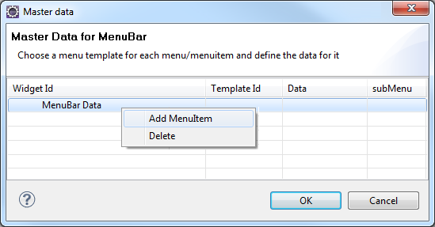
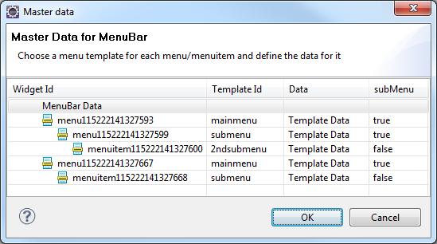

                              

MenuItem Templates
==================

> **_Note:_** MenuIterm Templates are supported only on Desktop Web platform.

What is a MenuItem Template
---------------------------

In Volt MX platform, a MenuIterm Template is a container which can hold widgets in it. You can customize the behavior and look and feel of the MenuIterm Template. The customized behavior is applied across the forms where the MenuIterm Templates are used.

To define a menu, the following widgets are used:

*   MenuContainer
*   MenuIterm

**MenuContainer:** It is a parent container which acts as a menu when a MenuIterm Template is mapped to it.

**MenuTemplate:** It is a container which holds widgets in it. You can define multiple templates to be used for menus and sub menus.

A MenuIterm Template currently allows you to drag and drop the following widgets:

*   HBox
*   VBox
*   Image
*   Label
*   Link

Where to use a MenuItem Template
--------------------------------

Menus are typically used to navigate to a particular form or perform an action.

The MenuIterm Templates are used to:

*   have uniform look and feel of the Menus.
*   have uniform look and feel when an item is focused in a MenuContainer.
*   perform an action on the event of an onclick of an item in the MenuContainer.
*   define uniform margins and padding's for the MenuItems.

Creating a MenuItem Template
----------------------------

You can create a multiple templates that can be used for menus and sub menus.

To create a template at the application-level, follow these steps:

1.  Go to **Applications View**.
2.  Expand the application for which you want to create a MenuIterm Template.
3.  Navigate to **templates > menus**, right-click **desktop** and select **New MenuIterm Template**. The **Create a New Menu** window appears.

> 1.  Enter a **Name** for the template.
> 2.  Click **Finish**. A new form is created.
> 3.  Drag and drop an HBox and then a VBox within an HBox.
>     
>     > **_Note:_** Only HBox and VBox are supported on the form. You can put other widgets within these widgets.
>     
> 4.  Drag and drop the required widgets onto the HBox/VBox. Set the properties of these widgets.
> 5.  A MenuIterm Template is created.

Using MenuItem Templates
------------------------

Always create multiple templates for menus, sub menus for better user experience.

To use MenuItem Template in an application, follow these steps:

1.  Go to **Applications view**.
2.  Expand the application for which you want to use Menus.
3.  Navigate to **forms > desktop**, right-click **desktop** and select **New Form**. The **Create a New Form** window appears.
4.  Enter a name for the form and click **Finish**. A new form is created.
5.  Drag-drop a **MenuContainer** on the form.
    
    > **_Note:_** The MenuContainer should not be placed at the bottom of the Form because the menu always expands downwards. If still want to place the menu at the bottom of the form, ensure that you have enough space to view the items when the menu is expanded.
    
6.  From the **Widget Properties** window, select **menuItemTemplate** and select the template what you have created. You can define different templates for menus and sub menus.
7.  To assign the template to menu container, follow the below steps:

> 1.  Select the **MenuContainer** and from the **Widget Properties** window and locate the property **menuItemTemplate**. Set the template from the drop down menu.
> 2.  Locate the property **data** and assign data to it. The following image illustrates the _Master Data for MenuBar_ window:  
>       
>     
> 3.  Right-click on the row MenuBar Data and select **Add MenuItem**. A row gets added. Select **Template ID**, click **Template Data** to update the values for the properties displayed.
> 4.  To add sub menu items, set the **subMenu** column **false/true** to the respective menu item. If the menu item is set to _true_ you can add sub menu items.
> 5.  To create a submenu item for a menu item, right-click on submenu item and select **Add MenuItem**. A row gets added.
> 6.  Select **Template ID**, click **Template Data** to update the values for the properties displayed.
> 7.  Once you are done, click **OK**. Following is the snapshot of a typical menu with sub menu items.  
>       
>     

