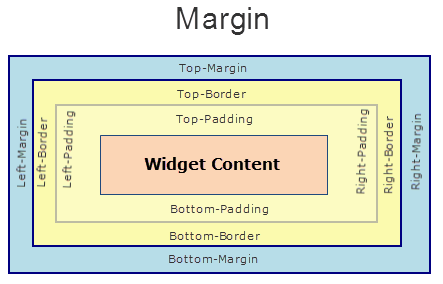
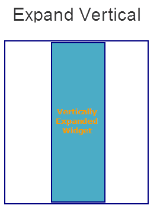

                                


Phone Properties
================

The properties for Phone widget are:

* * *


<details close markdown="block"><summary>accessibilityConfig Property</summary>

* * *

Enables you to control accessibility behavior and alternative text for the widget.

For more information on using accessibility features in your app, see the [Accessibility](../../../Iris/app_design_dev/Content/Accessibility_Overview.md) appendix in the Volt MX IrisUser Guide.

<b>Syntax</b>

```

accessibilityConfig
```

<b>Type</b>

Object

<b>Read/Write</b>

Read + Write

<b>Remarks</b>

*   The accessibilityConfig property is enabled for all the widgets which are supported under the Flex Layout.

> **_Note:_** From Volt MX Iris V9 SP2 GA version, you can provide i18n keys as values to all the attributes used inside the `accessibilityConfig` property. Values provided in the i18n keys take precedence over values provided in `a11yLabel`, `a11yValue`, and `a11yHint` fields.

The accessibilityConfig property is a JavaScript object which can contain the following key-value pairs.

  
| Key | Type | Description | ARIA Equivalent |
| --- | --- | --- | --- |
| a11yIndex | Integer with no floating or decimal number. | This is an optional parameter. Specifies the order in which the widgets are focused on a screen. | For all widgets, this parameter maps to the `aria-index`, `index`, or `taborder` properties. |
| a11yLabel | String | This is an optional parameter. Specifies alternate text to identify the widget. Generally the label should be the text that is displayed on the screen. | For all widgets, this parameter maps to the `aria-labelledby` property of ARIA in HTML. > **_Note:_** For the Image widget, this parameter maps to the **alt** attribute of ARIA in HTML. |
| a11yValue | String | This is an optional parameter. Specifies the descriptive text that explains the action associated with the widget. On the Android platform, the text specified for a11yValue is prefixed to the a11yHint. | This parameter is similar to the a11yLabel parameter. If the a11yValue is defined, the value of a11yValue is appended to the value of a11yLabel. These values are separated by a space. |
| a11yHint | String | This is an optional parameter. Specifies the descriptive text that explains the action associated with the widget. On the Android platform, the text specified for a11yValue is prefixed to the a11yHint. | For all widgets, this parameter maps to the `aria-describedby` property of ARIA in HTML. |
| a11yHidden | Boolean | This is an optional parameter. Specifies if the widget should be ignored by assistive technology. The default option is set to _false_. This option is supported on iOS 5.0 and above, Android 4.1 and above, and SPA | For all widgets, this parameter maps to the `aria-hidden` property of ARIA in HTML. |
| a11yARIA | Object | This is an optional parameter. For each widget, the key and value provided in this object are added as the attribute and value of the HTML tags respectively. Any values provided for attributes such as `aria-labelledby` and `aria-describedby` using this attribute, takes precedence over values given in `a11yLabel` and `a11yHint` fields. When a widget is provided with the following key value pair or attribute using the a11yARIA object, the tabIndex of the widget is automatically appended as zero.`{"role": "main"}``aria-label` | This parameter is only available on the Desktop Web platform. |

Android limitations

*   If the results of the concatenation of a11y fields result in an empty string, then `accessibilityConfig` is ignored and the text that is on widget is read out.
*   The soft keypad does not gain accessibility focus during the right/left swipe gesture when the keypad appears.

SPA/Desktop Web limitations

*   When `accessibilityConfig` property is configured for any widget, the `tabIndex` attribute is added automatically to the `accessibilityConfig` property.
*   The behavior of accessibility depends on the Web browser, Web browser version, Voice Over Assistant, and Voice Over Assistant version.
*   Currently SPA/Desktop web applications support only a few ARIA tags. To achieve more accessibility features, use the attribute a11yARIA. The corresponding tags will be added to the DOM as per these configurations.

<b>Example 1</b>

This example uses the button widget, but the principle remains the same for all widgets that have an accessibilityConfig property.

```
//This is a generic property that is applicable for various widgets.
//Here, we have shown how to use the accessibilityConfig Property for button widget.
/*You need to make a corresponding use of the accessibilityConfig property for other applicable widgets.*/

Form1.myButton.accessibilityConfig = {
    "a11yLabel": "Label",
    "a11yValue": "Value",
    "a11yHint": "Hint"    
};
```

<b>Example 2</b> 

This example uses the button widget to implement internationalization in `accessibilityConfig` property, but the principle remains the same for all widgets.

```
/*Sample code to implement internationalization in accessibilityConfig property in Native platform.*/

Form1.myButton.accessibilityConfig = {
    "a11yLabel": voltmx.i18n.getLocalizedString("key1")     
};  
/*Sample code to implement internationalization in accessibilityConfig property in Desktop Web platform.*/

Form1.myButton.accessibilityConfig = {
    "a11yLabel": "voltmx.i18n.getLocalizedString(\"key3\")"
};
```

<b>Platform Availability</b>

*   Available in the IDE
*   iOS, Android, SPA, and Desktop Web

* * *

</details>
<details close markdown="block"><summary>anchorPoint Property</summary>

* * *

Specifies the anchor point of the widget bounds rectangle using the widget's coordinate space.

<b>Syntax</b>

```

anchorPoint
```

<b>Type</b>

JSObject

<b>Read/Write</b>

Read + Write

<b>Remarks</b>

The value for this property is a JavaScript dictionary object with the keys "x" and "y". The values for the "x" and "y" keys are floating-point numbers ranging from 0 to 1. All geometric manipulations to the widget occur about the specified point. For example, applying a rotation transform to a widget with the default anchor point causes the widget to rotate around its center.

The default value for this property is center ( {"x":0.5, "y":0.5} ), that represents the center of the widgets bounds rectangle. The behavior is undefined if the values are outside the range zero (0) to one (1).

<b>Example</b>

```
Form1.widget1.anchorPoint = {
    "x": 0.5,
    "y": 0.5
};
```

<b>Platform Availability</b>

*   iOS, Android, Windows, and SPA

* * *

</details>
<details close markdown="block"><summary>bottom Property</summary>

* * *

This property determines the bottom edge of the widget and is measured from the bottom bounds of the parent container.

The bottom property determines the position of the bottom edge of the widget’s bounding box. The value may be set using DP (Device Independent Pixels), Percentage, or Pixels. In freeform layout, the distance is measured from the bottom edge of the parent container. In flow-vertical layout, the value is ignored. In flow-horizontal layout, the value is ignored.

The bottom property is used only if the Height property is not provided.

<b>Syntax</b>

```

bottom
```

<b>Type</b>

String

<b>Read/Write</b>

Read + Write

<b>Remarks</b>

The property determines the bottom edge of the widget and is measured from the bottom bounds of the parent container.

If the layoutType is set as voltmx.flex.FLOW\_VERTICAL, the bottom property is measured from the top edge of bottom sibling widget. The vertical space between two widgets is measured from bottom of the top sibling widget and the top of the bottom sibling widget.

<b>Example</b>

```
//Sample code to set the bottom property for widgets by using DP, Percentage and Pixels.
frmHome.widgetID.bottom = "50dp";

frmHome.widgetID.bottom = "10%";

frmHome.widgetID.bottom = "10px";
```

<b>Platform Availability</b>

*   Available in the IDE
*   iOS, Android, Windows, SPA , and Desktop Web

* * *

</details>
<details close markdown="block"><summary>centerX Property</summary>

* * *

This property determines the center of a widget measured from the left bounds of the parent container.

The centerX property determines the horizontal center of the widget’s bounding box. The value may be set using DP (Device Independent Pixels), Percentage, or Pixels. In freeform layout, the distance is measured from the left edge of the parent container. In flow-vertical layout, the distance is measured from the left edge of the parent container. In flow-horizontal layout, the distance is measured from the right edge of the previous sibling widget in the hierarchy.

<b>Syntax</b>

```

centerX
```

<b>Type</b>

String

<b>Read/Write</b>

Read + Write

<b>Remarks</b>

If the layoutType is set as voltmx.flex.FLOW\_HORIZONTAL, the centerX property is measured from right edge of the left sibling widget.

<b>Example</b>

```
//Sample code to set the centerX property for widgets by using DP, Percentage and Pixels.
frmHome.widgetID.centerX = "50dp";

frmHome.widgetID.centerX = "10%";

frmHome.widgetID.centerX = "10px";
```

<b>Platform Availability</b>

*   Available in the IDE
*   iOS, Android, Windows, SPA, and Desktop Web

* * *

</details>
<details close markdown="block"><summary>centerY Property</summary>

* * *

This property determines the center of a widget measured from the top bounds of the parent container.

The centerY property determines the vertical center of the widget’s bounding box. The value may be set using DP (Device Independent Pixels), Percentage, or Pixels. In freeform layout, the distance is measured from the top edge of the parent container. In flow-horizontal layout, the distance is measured from the top edge of the parent container. In flow-vertical layout, the distance is measured from the bottom edge of the previous sibling widget in the hierarchy.

<b>Syntax</b>

```

centerY
```

<b>Type</b>

String

<b>Read/Write</b>

Read + Write

<b>Remarks</b>

If the layoutType is set as voltmx.flex.FLOW\_VERTICAL, the centerY property is measured from bottom edge of the top sibling widget.

<b>Example</b>

```
//Sample code to set the centerY property for widgets by using DP, Percentage and Pixels.
frmHome.widgetID.centerY = "50dp";

frmHome.widgetID.centerY = "10%";

frmHome.widgetID.centerY = "10px";
```

<b>Platform Availability</b>

*   Available in the IDE
*   iOS, Android, Windows, SPA, and Desktop Web

* * *

</details>
<details close markdown="block"><summary>containerWeight Property</summary>

* * *

Specifies the percentage of the parent width that should allocated to the widget. The parent widget space is distributed to its child widgets based on this weight factor. All its child widgets should sum up to 100% of width except when placed in _voltmx.ui.ScrollBox_.

<b>Syntax</b>

```

containerWeight
```

<b>Type</b>

Number ( less than 100)

<b>Read/Write</b>

Read + Write

<b>Example</b>

```
//Writing containerWeight of flexScroll widget
Form1.flxScroll.containerWeight = 100; //This might work because of backward compatibility

//Creating the video widget.
var video = new voltmx.ui.Video(videoBasic, videoLayout, {});

//Reading containerWeight of a video widget
voltmx.print("Video containerWeight is ::" + video.containerWeight);
```

<b>Platform Availability</b>

Available on all platforms except on Desktop Web, Windows

* * *

</details>
<details close markdown="block"><summary>contentAlignment Property</summary>

* * *

Specifies the alignment of the text on the Phone with respect to its boundaries.

<b>Syntax</b>

```

contentAlignment
```


<b>Type</b>

Number

<b>Read/Write</b>

Read + Write

<b>Remarks</b>

A default value CONTENT\_ALIGN\_CENTER is assigned for all platforms. To choose another alignment, click the drop-down arrow and select the desired alignment. However, to change the default value on a particular platform, select the button next to the drop-down and select respective platform and choose the value.

**Default:**_CONTENT\_ALIGN\_CENTER_ (the default value for all platforms is center; content is aligned at the center of the widget)

The following are the available options:

*   CONTENT\_ALIGN\_TOP\_LEFT - Specifies the text should align at top left corner of the widget.
*   CONTENT\_ALIGN\_TOP\_CENTER - Specifies the text should align at top center of the widget.
*   CONTENT\_ALIGN\_TOP\_RIGHT- Specifies the text should align at top right of the widget.
*   CONTENT\_ALIGN\_MIDDLE\_LEFT- Specifies the text should align at middle left of the widget.
*   CONTENT\_ALIGN\_CENTER- Specifies the text should align at center of the widget.
*   CONTENT\_ALIGN\_MIDDLE\_RIGHT- Specifies the text should align at middle right of the widget.
*   CONTENT\_ALIGN\_BOTTOM\_LEFT- Specifies the text should align at bottom left of the widget.
*   CONTENT\_ALIGN\_BOTTOM\_CENTER- Specifies the text should align at bottom center of the widget.
*   CONTENT\_ALIGN\_BOTTOM\_RIGHT - Specifies the text should align at bottom right of the widget.

<b>Examples</b>

```
//Sample code to set the contentAlignment property of a Phone widget.  
  
frmPhone.myPhone.contentAlignment=constants.CONTENT_ALIGN_CENTER;
```

<b>Platform Availability</b>

Available in the IDE

Available on all platforms except on Desktop Web and Windows platforms.

* * *

</details>
<details close markdown="block"><summary>cursorType Property</summary>

* * *

In Desktop Web applications, when you hover the mouse over any widget, a mouse pointer appears. Using the cursorType property in Iris, you can specify the type of the mouse pointer.

<b>Syntax</b>

```

cursorType
```

<b>Type</b>

String.

You must provide valid CSS cursor value such as wait, grab, help, etc. to the cursorType property.

<b>Read/Write</b>

Read + Write

<b>Remarks</b>

To add the `cursorType` property using Volt MX Iris in a Desktop Web application, follow these steps.

1.  In Volt MX Iris, open the Desktop Web application. From the **Project** explorer, expand **Responsive Web/ Desktop**\> **Forms** and select the form to which you need to make the changes.
2.  On the canvas, select the widget for which you want to specify the cursor type. For example, button.
3.  From the **Properties** panel, navigate to the **Skin** tab > **Hover Skin** tab.  
    You will find that the details of the hover skin is not enabled here.
4.  Check the **Enable** option to add a hover skin to your widget.  
    The details and configurations of the hover skin is enabled.
5.  Under the **General** section, for the Platform option, click the ellipsis icon.  
    The **Fork Skin** window appears.
6.  In the **Fork Skin** window, for **Desktop**, check under **HTML5 SPA**.
7.  Click **Ok**. You have successfully forked your hover skin for Desktop Web application.  
    You can see that the **Cursor Type** property has been added under the **General** section.
8.  Select a value from the drop-down list to set the **Cursor Type** for the widget.

<b>Example</b>

```
 //This is a generic property and is applicable for many widgets.  
  
/*The example provided is for the Button widget. Make the required changes in the example while using other widgets.*/
  
frmButton.myButton.cursorType = "wait";

```

<b>Platform Availability</b>

*   Available in IDE
*   Desktop Web

* * *

</details>
<details close markdown="block"><summary>enable Property</summary>

* * *

The `enable` property is used to control the actionability of the widgets. In a scenario where you want to display a widget but not invoke any action on the widget, configure the `enable` property to false to achieve it.

This is a constructor level property and applicable for all widgets in Volt MX Iris.

<b>Syntax</b>

```

enable
```


<b>Type</b>

Boolean

<b>Read/Write</b>

Read + Write

<b>Remarks</b>

The default value of this property is true.

When `enable` property is configured to true, the action associated with a widget can be invoked by the user in the application.

When `enable` property is configured to false, the action associated with a widget cannot be invoked by the user in the application.

<b>Example</b>

```
//This is a generic property and is applicable for many widgets.  
  
/*The example provided is for the Button widget. Make the changes required in the example while using other widgets.*/
  
frmButton.myBtn.enable= true;
```

<b>Platform Availability</b>

*   Android, iOS, Windows, SPA, and Desktop web

 

* * *

</details>
<details close markdown="block"><summary>focusSkin Property</summary>

* * *

Specifies the look and feel of the Phone when in focus.

<b>Syntax</b>

```

focusSkin
```

<b>Type</b>

String

<b>Read/Write</b>

Read + Write  

<b>Example</b>

```
//Sample code to set the focusSkin property of a Phone widget.  
  
frmPhone.myPhone.focusSkin="PhoneFSkin";
```

<b>Platform Availability</b>

Available in the IDE

Available on all platforms except on Desktop Web and Windows platforms.

* * *

</details>
<details close markdown="block"><summary>height Property</summary>

* * *

It determines the height of the widget and measured along the y-axis.

The height property determines the height of the widget’s bounding box. The value may be set using DP (Device Independent Pixels), Percentage, or Pixels. For supported widgets, the height may be derived from either the widget or container’s contents by setting the height to “preferred”.

<b>Syntax</b>

```

height
```

<b>Type</b>

Number, String, and Constant

<b>Read/Write</b>

Read + Write

<b>Remarks</b>

Following are the available measurement options:

*   %: Specifies the values in percentage relative to the parent dimensions.
*   px: Specifies the values in terms of device hardware pixels.
*   dp: Specifies the values in terms of device independent pixels.
*   default: Specifies the default value of the widget.
*   voltmx.flex.USE\_PREFERED\_SIZE: When this option is specified, the layout uses preferred height of the widget as height and preferred size of the widget is determined by the widget and may varies between platforms.

**Example**

```
/*Sample code to set the height property for a Phone widget by using DP, Percentage and Pixels.*/
frmPhone.myPhone.height="50dp";

frmPhone.myPhone.height="10%";

frmPhone.myPhone.height="10px";

```

<b>Platform Availability</b>

*   Available in the IDE
*   iOS
*   Android
*   Windows
*   SPA

* * *

</details>
<details close markdown="block"><summary>hExpand</summary>

* * *

Specifies if the widget should occupy all the width available to it.

<b>Syntax</b>

```

hExpand
```

<b>Type</b>

Boolean

Read / Write

No

<b>Remarks</b>

Mobile Web does not support the Expand property. This is because a widget in a Mobile Web cannot expand or contract based on the neighboring widget (default behavior of a widget in a Mobile Web).

The default value for this property is true.

If set to _false,_ the widget occupies the preferred width. The preferred width of a widget is the sum of its contents width, padding and margin.

If set to _true,_ the widget ensures that the entire width available to it, is occupied.


<b>Example</b>

```
//Sample code to set the hExpand property for a Phone widget.
frmPhone.myPhone.hExpand=true;
```

<b>Platform Availability</b>

Available in the IDE

Available on all platforms except on Desktop Web, SPA, and Windows platforms.

* * *

</details>
<details close markdown="block"><summary>id Property</summary>

* * *

id is a unique identifier of a widget consisting of alpha numeric characters. Every widget should have a unique id within a Form.

<b>Syntax</b>

```

id
```

<b>Type</b>

String

<b>Read/Write</b>

Read only

<b>Example</b>

Setting the id property on widget creation.

```
var phone1 = new voltmx.ui.Phone({
    "id": "myPhone",
    "top": "19dp",
    "width": "200dp",
    "height": "150dp",
    "right": "23dp",
    "zIndex": 1,
    "isVisible": true,
    "clipBounds": true
});
```

<b>Platform Availability</b>

Available in the IDE

Available on all platforms

* * *

</details>
<details close markdown="block"><summary>isVisible Property</summary>

* * *

This property controls the visibility of a widget on the form.

<b>Syntax</b>

```

isVisible
```

<b>Type</b>

Boolean

<b>Read/Write</b>

Read + Write

<b>Remarks</b>

The default value for this property true.

If set to _false,_ the widget is not displayed.

If set to _true,_ the widget is displayed.

In addition, the visibility of the widget can be controlled using the setVisibility method.

This property is not applicable if the widget is placed in a [Segment](Segment.md). When the widget is placed in a Segment, the _Visibility_ of the widget is controlled by the data property of the segment.  

<b>Example</b>

```
//Sample code to set the isVisible property for a Phone widget.
frmPhone.myPhone.isVisible=true;
```

<b>Platform Availability</b>

Available in the IDE

Available on all platforms except on Desktop Web and Windows platforms.

* * *

</details>
<details close markdown="block"><summary>left Property</summary>

* * *

This property determines the lower left corner edge of the widget and is measured from the left bounds of the parent container.

The left property determines the position of the left edge of the widget’s bounding box. The value may be set using DP (Device Independent Pixels), Percentage, or Pixels. In freeform layout, the distance is measured from the left edge of the parent container. In flow-vertical layout, the distance is measured from the left edge of the parent container. In flow-horizontal layout, the distance is measured from the right edge of the previous sibling widget in the hierarchy.

<b>Syntax</b>

```

left
```


<b>Type</b>

String

<b>Read/Write</b>

Read + Write

<b>Remarks</b>

If the layoutType is set as voltmx.flex.FLOW\_HORIZONTAL, the left property is measured from right edge of the left sibling widget.

<b>Example</b>

```
//Sample code to set the left property for widgets by using DP, Percentage and Pixels.
frmHome.widgetID.left = "50dp";

frmHome.widgetID.left = "10%";

frmHome.widgetID.left = "10px";
```

<b>Platform Availability</b>

*   Available in the IDE
*   iOS, Android, Windows, SPA, and Desktop Web

* * *

</details>
<details close markdown="block"><summary>margin Property</summary>

* * *

Defines the space around a widget. You can use this option to define the left, top, right, and bottom distance between the widget and the next widget.

<b>Syntax</b>

```

margin
```

<b>Type</b>

Array of numbers

<b>Read/Write</b>

Read + Write

<b>Remarks</b>

To define the margin values for a platform, click the () button against the property to open the _Margin_ screen. Select the checkbox against the platform for which you want to define the margins and enter the top, left, right, and bottom margin values.

If you want to use the margin values set for a platform across other platforms, you can click the _Apply To_ button and select the platforms on which you want the margin values to be applied.

The following image illustrates the window to define the margins for platforms:

The following image illustrates a widget with a defined margin:



<b>Example</b>

```
//Sample code to set the margin property for a Phone widget.
frmPhone.myPhone.margin=[5, 5, 5, 5];
```

<b>Platform Availability</b>

Available in the IDE

Available on all platforms except on Desktop Web and Windows platforms.

* * *

</details>
<details close markdown="block"><summary>marginInPixel Property</summary>

* * *

Indicates if the margin is to be applied in pixels or in percentage.

<b>Syntax</b>

```

marginInPixel
```


<b>Type</b>

Boolean

<b>Read/Write</b>

No

<b>Example</b>

```
//Sample code to set the marginInPixel property for a Phone widget.
frmPhone.myPhone.marginInPixel=true;
```

<b>Platform Availability</b>

Available in the IDE

Available on all platforms except Windows

* * *

</details>
<details close markdown="block"><summary>maxHeight Property</summary>

* * *

This property specifies the maximum height of the widget and is applicable only when the height property is not specified.

The maxHeight property determines the maximum height of the widget’s bounding box. The value may be set using DP (Device Independent Pixels), Percentage, or Pixels. The maxHeight value overrides the preferred, or “autogrow” height, if the maxHeight is less than the derived content height of the widget.

<b>Syntax</b>

```

maxHeight
```

<b>Type</b>

Number

<b>Read/Write</b>

Read + Write

<b>Example</b>

```
//Sample code to set the maxHeight property for widgets by using DP, Percentage and Pixels.
frmHome.widgetID.maxHeight = "50dp";

frmHome.widgetID.maxHeight = "10%";

frmHome.widgetID.maxHeight = "10px";
```

<b>Platform Availability</b>

*   Available in the IDE
*   iOS, Android, Windows, SPA, and Desktop Web

* * *

</details>
<details close markdown="block"><summary>maxWidth Property</summary>

* * *

This property specifies the maximum width of the widget and is applicable only when the width property is not specified.

The Width property determines the maximum width of the widget’s bounding box. The value may be set using DP (Device Independent Pixels), Percentage, or Pixels. The maxWidth value overrides the preferred, or “autogrow” width, if the maxWidth is less than the derived content width of the widget.

<b>Syntax</b>

```

maxWidth
```

<b>Type</b>

Number

<b>Read/Write</b>

Read + Write

<b>Example</b>

```
//Sample code to set the maxWidth property for widgets by using DP, Percentage and Pixels.
frmHome.widgetID.maxWidth = "50dp";

frmHome.widgetID.maxWidth = "10%";

frmHome.widgetID.maxWidth = "10px";
```

<b>Platform Availability</b>

*   Available in the IDE
*   iOS, Android, Windows, SPA, and Desktop Web

* * *

</details>
<details close markdown="block"><summary>minHeight Property</summary>

* * *

This property specifies the minimum height of the widget and is applicable only when the height property is not specified.

The minHeight property determines the minimum height of the widget’s bounding box. The value may be set using DP (Device Independent Pixels), Percentage, or Pixels. The minHeight value overrides the preferred, or “autogrow” height, if the minHeight is larger than the derived content height of the widget.

<b>Syntax</b>

```

minHeight
```

<b>Type</b>

Number

<b>Read/Write</b>

Read + Write

<b>Example</b>

```
//Sample code to set the minHeight property for widgets by using DP, Percentage and Pixels.
frmHome.widgetID.minHeight = "50dp";

frmHome.widgetID.minHeight = "10%";

frmHome.widgetID.minHeight = "10px";
```

<b>Platform Availability</b>

*   Available in the IDE
*   iOS, Android, Windows, SPA, and Desktop Web

* * *

</details>
<details close markdown="block"><summary>minWidth Property</summary>

* * *

This property specifies the minimum width of the widget and is applicable only when the width property is not specified.

The minWidth property determines the minimum width of the widget’s bounding box. The value may be set using DP (Device Independent Pixels), Percentage, or Pixels. The minWidth value overrides the preferred, or “autogrow” width, if the minWidth is larger than the derived content width of the widget.

<b>Syntax</b>

```

minWidth
```

<b>Type</b>

Number

<b>Read/Write</b>

Read only

<b>Example</b>

```
//Sample code to set the minWidth property for widgets by using DP, Percentage and Pixels.
frmHome.widgetID.minWidth = "50dp";

frmHome.widgetID.minWidth = "10%";

frmHome.widgetID.minWidth = "10px";
```

<b>Platform Availability</b>

*   Available in the IDE
*   iOS, Android, Windows, SPA, and Desktop Web

* * *

</details>
<details close markdown="block"><summary>opacity Property</summary>

* * *

Specifies the opacity of the widget. The value of this property must be in the range 0.0 (transparent) to 1.0 (opaque). Any values outside this range are fixed to the nearest minimum or maximum value.

Specifies the opacity of the widget. Valid opacity values range from 0.0 (transparent), to 1.0 (opaque). Values set to less than zero will default to zero. Values more than 1.0 will default to 1. Interaction events set on a transparent widget will still be fired. To disable the events, also set the “isVisible” property to “false”.

<b>Syntax</b>

```

opacity
```

<b>Type</b>

Number

<b>Read/Write</b>

Read + Write

<b>Remarks</b>

> **_Note:_** This property has more priority compared to the values coming from the configured skin.

<b>Example</b>

```
//Sample code to make the widget transparent by using the opacity property.
frmHome.widgetID.opacity = 0;

//Sample code to make the widget opaque by using the opacity property.
frmHome.widgetID.opacity = 1;
```

<b>Platform Availability</b>

*   Not available in the IDE.
*   iOS, Android, Windows, SPA, and Desktop Web

* * *

</details>
<details close markdown="block"><summary>padding Property</summary>

* * *

Defines the space between the content of the widget and the widget boundaries. You can use this option to define the top, left, right, and bottom distance between the widget content and the widget boundary.

<b>Syntax</b>

```

padding
```

<b>Type</b>

Array of Numbers

<b>Read/Write</b>

Read + Write

<b>Remarks</b>

To define the padding values for a platform, click the () button against the property to open the _Padding_ screen. Select the checkbox against the platform for which you want to define the padding's and enter the top, left, right, and bottom padding values.

If you want to use the padding values set for a platform across other platforms, you can click the _Apply To_ button and select the platforms on which you want the padding values to be applied.

If no skin is applied to a Call, then Padding is not supported on iPhone. This is due to iOS Safari browser limitation. If you want the padding to be applied, apply a skin to the widget and then apply padding.

The following image illustrates the window to define the padding's for platforms:


<b>Example</b>

```
//Sample code to set the padding property for a Phone widget.
frmPhone.myPhone.padding=[5, 5, 5, 5];
```

<b>Platform Availability</b>

Available in the IDE

Available on all platforms except on Desktop Web and Windows platforms.

* * *

</details>
<details close markdown="block"><summary>paddingInPixel Property</summary>

* * *

Indicates if the padding is to be applied in pixels or in percentage.

<b>Syntax</b>

```

paddingInPixel
```

<b>Type</b>

Boolean

<b>Read/Write</b>

No

<b>Remarks</b>

The default value for this property is false.

If set to _true,_ the padding is applied in pixels.

If set to _false,_ the padding is applied as set in [padding](#padding) property.

This property can be set to _true_ or _false_ only for iPhone, iPad, and Android. On other platforms this property does not give any results even when set to _true_.

For backward compatibility on older projects, this property is will be made _true_ for iPhone, iPad, and Android and for other platforms it will be _false_.

<b>Example</b>

```
//Sample code to set the paddingInPixel property for a Phone widget.
frmPhone.myPhone.paddingInPixel=true;
```

<b>Platform Availability</b>

Available in the IDE

Available on all platforms except on Desktop Web and Windows platforms.

* * *

</details>
<details close markdown="block"><summary>parent Property</summary>

* * *

Helps you access the parent of the widget. If the widget is not part of the widget hierarchy, the parent property returns null.

<b>Syntax</b>

```

parent
```

<b>Read/Write</b>

Read only

<b>Remarks</b>

> **_Note:_** The property works for all the widgets inside a FlexForm, FlexContainer or FlexScrollContainer.

<b>Example</b>

```
function func() {

    voltmx.print("The parent of the widget" + JSON.stringify(Form1.widgetID.parent));

}
```

<b>Platform Availability</b>

*   Not available in the IDE
*   iOS, Android, Windows, SPA, and Desktop Web

* * *

</details>
<details close markdown="block"><summary>retainContentAlignment Property</summary>

* * *

This property is used to retain the content alignment property value, as it was defined.

> **_Note:_** Locale-level configurations take priority when invalid values are given to this property, or if it is not defined.

The mirroring widget layout properties should be defined as follows.

```
function getIsFlexPositionalShouldMirror(widgetRetainFlexPositionPropertiesValue) {
    return (isI18nLayoutConfigEnabled &&
    localeLayoutConfig[defaultLocale]
    ["mirrorFlexPositionalProperties"] == true &&
    !widgetRetainFlexPositionPropertiesValue);
}
```

The following table illustrates how widgets consider Local flag and Widget flag values.

  
| Properties | Local Flag Value | Widget Flag Value | Action |
| --- | --- | --- | --- |
| Mirror/retain FlexPositionProperties | true | true | Use the designed layout from widget for all locales. Widget layout overrides everything else. |
| Mirror/retain FlexPositionProperties | true | false | Use Mirror FlexPositionProperties since locale-level Mirror is true. |
| Mirror/retain FlexPositionProperties | true | not specified | Use Mirror FlexPositionProperties since locale-level Mirror is true. |
| Mirror/retain FlexPositionProperties | false | true | Use the designed layout from widget for all locales. Widget layout overrides everything else. |
| Mirror/retain FlexPositionProperties | false | false | Use the Design/Model-specific default layout. |
| Mirror/retain FlexPositionProperties | false | not specified | Use the Design/Model-specific default layout. |
| Mirror/retain FlexPositionProperties | not specified | true | Use the designed layout from widget for all locales. Widget layout overrides everything else. |
| Mirror/retain FlexPositionProperties | not specified | false | Use the Design/Model-specific default layout. |
| Mirror/retain FlexPositionProperties | not specified | not specified | Use the Design/Model-specific default layout. |

<b>Syntax</b>

```

retainContentAlignment
```

<b>Type</b>

Boolean

<b>Read/Write</b>

No (only during widget-construction time)

<b>Example</b>

```
//This is a generic property that is applicable for various widgets.
//Here, we have shown how to use the retainContentAlignment property for Button widget.
/*You need to make a corresponding use of the 
retainContentAlignment property for other applicable widgets.*/
var btn = new voltmx.ui.Button({
    "focusSkin": "defBtnFocus",
    "height": "50dp",
    "id": "myButton",
    "isVisible": true,
    "left": "0dp",
    "skin": "defBtnNormal",
    "text": "text always from top left",
    "top": "0dp",
    "width": "260dp",
    "zIndex": 1
}, {
    "contentAlignment": constants.CONTENT_ALIGN_TOP_LEFT,
    "displayText": true,
    "padding": [0, 0, 0, 0],
    "paddingInPixel": false,
    "retainFlexPositionProperties": false,
    "retainContentAlignment": true
}, {});
```

<b>Platform Availability</b>

*   Available in IDE
*   Windows, iOS, Android, and SPA

* * *

</details>
<details close markdown="block"><summary>retainFlexPositionProperties Property</summary>

* * *

This property is used to retain flex positional property values as they were defined. The flex positional properties are left, right, and padding.

> **_Note:_** Locale-level configurations take priority when invalid values are given to this property, or if it is not defined.

The mirroring widget layout properties should be defined as follows.

```
function getIsFlexPositionalShouldMirror(widgetRetainFlexPositionPropertiesValue) {
    return (isI18nLayoutConfigEnabled &&
    localeLayoutConfig[defaultLocale]
    ["mirrorFlexPositionalProperties"] == true &&
    !widgetRetainFlexPositionPropertiesValue);
}
```

The following table illustrates how widgets consider Local flag and Widget flag values.

  
| Properties | Local Flag Value | Widget Flag Value | Action |
| --- | --- | --- | --- |
| Mirror/retain FlexPositionProperties | true | true | Use the designed layout from widget for all locales. Widget layout overrides everything else. |
| Mirror/retain FlexPositionProperties | true | false | Use Mirror FlexPositionProperties since locale-level Mirror is true. |
| Mirror/retain FlexPositionProperties | true | not specified | Use Mirror FlexPositionProperties since locale-level Mirror is true. |
| Mirror/retain FlexPositionProperties | false | true | Use the designed layout from widget for all locales. Widget layout overrides everything else. |
| Mirror/retain FlexPositionProperties | false | false | Use the Design/Model-specific default layout. |
| Mirror/retain FlexPositionProperties | false | not specified | Use the Design/Model-specific default layout. |
| Mirror/retain FlexPositionProperties | not specified | true | Use the designed layout from widget for all locales. Widget layout overrides everything else. |
| Mirror/retain FlexPositionProperties | not specified | false | Use the Design/Model-specific default layout. |
| Mirror/retain FlexPositionProperties | not specified | not specified | Use the Design/Model-specific default layout. |

<b>Syntax</b>

```

retainFlexPositionProperties
```


<b>Type</b>

Boolean

<b>Read/Write</b>

No (only during widget-construction time)

<b>Example</b>

```
//This is a generic property that is applicable for various widgets.
//Here, we have shown how to use the retainFlexPositionProperties property for Button widget.
/*You need to make a corresponding use of the 
retainFlexPositionProperties property for other applicable widgets.*/
var btn = new voltmx.ui.Button({
    "focusSkin": "defBtnFocus",
    "height": "50dp",
    "id": "myButton",
    "isVisible": true,
    "left": "0dp",
    "skin": "defBtnNormal",
    "text": "always left",
    "top": "0dp",
    "width": "260dp",
    "zIndex": 1
}, {
    "contentAlignment": constants.CONTENT_ALIGN_CENTER,
    "displayText": true,
    "padding": [0, 0, 0, 0],
    "paddingInPixel": false,
    "retainFlexPositionProperties": true,
    "retainContentAlignment": false
}, {});
```

<b>Platform Availability</b>

*   Available in IDE
*   Windows, iOS, Android, and SPA

* * *

</details>
<details close markdown="block"><summary>retainFlowHorizontalAlignment Property</summary>

* * *

This property is used to convert Flow Horizontal Left to Flow Horizontal Right.

> **_Note:_** Locale-level configurations take priority when invalid values are given to this property, or if it is not defined.

The mirroring widget layout properties should be defined as follows.

```
function getIsFlexPositionalShouldMirror(widgetRetainFlexPositionPropertiesValue) {
    return (isI18nLayoutConfigEnabled &&
    localeLayoutConfig[defaultLocale]
    ["mirrorFlexPositionalProperties"] == true &&
    !widgetRetainFlexPositionPropertiesValue);
}
```

The following table illustrates how widgets consider Local flag and Widget flag values.

  
| Properties | Local Flag Value | Widget Flag Value | Action |
| --- | --- | --- | --- |
| Mirror/retain FlexPositionProperties | true | true | Use the designed layout from widget for all locales. Widget layout overrides everything else. |
| Mirror/retain FlexPositionProperties | true | false | Use Mirror FlexPositionProperties since locale-level Mirror is true. |
| Mirror/retain FlexPositionProperties | true | not specified | Use Mirror FlexPositionProperties since locale-level Mirror is true. |
| Mirror/retain FlexPositionProperties | false | true | Use the designed layout from widget for all locales. Widget layout overrides everything else. |
| Mirror/retain FlexPositionProperties | false | false | Use the Design/Model-specific default layout. |
| Mirror/retain FlexPositionProperties | false | not specified | Use the Design/Model-specific default layout. |
| Mirror/retain FlexPositionProperties | not specified | true | Use the designed layout from widget for all locales. Widget layout overrides everything else. |
| Mirror/retain FlexPositionProperties | not specified | false | Use the Design/Model-specific default layout. |
| Mirror/retain FlexPositionProperties | not specified | not specified | Use the Design/Model-specific default layout. |

<b>Syntax</b>

```

retainFlowHorizontalAlignment
```

<b>Type</b>

Boolean

<b>Read/Write</b>

No (only during widget-construction time)

<b>Example</b>

```
//This is a generic property that is applicable for various widgets.
//Here, we have shown how to use the retainFlowHorizontalAlignment property for Button widget.
/*You need to make a corresponding use of the 
retainFlowHorizontalAlignment property for other applicable widgets. */
var btn = new voltmx.ui.Button({
 "focusSkin": "defBtnFocus",
 "height": "50dp",
 "id": "myButton",
 "isVisible": true,
 "left": "0dp",
 "skin": "defBtnNormal",
 "text": "always left",
 "top": "0dp",
 "width": "260dp",
 "zIndex": 1
}, {
 "contentAlignment": constants.CONTENT_ALIGN_CENTER,
 "displayText": true,
 "padding": [0, 0, 0, 0],
 "paddingInPixel": false,
 "retainFlexPositionProperties": true,
 "retainContentAlignment": false,
 "retainFlowHorizontalAlignment ": false
}, {});
```

<b>Platform Availability</b>

*   Available in IDE
*   Windows, iOS, Android, and SPA

* * *

</details>
<details close markdown="block"><summary>right Property</summary>

* * *

This property determines the lower right corner of the widget and is measured from the right bounds of the parent container.

The right property determines the position of the right edge of the widget’s bounding box. The value may be set using DP (Device Independent Pixels), Percentage, or Pixels. In freeform layout, the distance is measured from the left edge of the parent container. In flow-vertical layout, value is ignored. In flow-horizontal layout, the value is ignored.

The right property is used only if the width property is not provided.

<b>Syntax</b>

```

right
```


<b>Type</b>

String

<b>Read/Write</b>

Read + Write

<b>Remarks</b>

If the layoutType is set as voltmx.flex.FLOW\_HORIZONTAL, the right property is measured from left edge of the right sibling widget. The horizontal space between two widgets is measured from right of the left sibling widget and left of the right sibling widget.

<b>Example</b>

```
//Sample code to set the right property for widgets by using DP, Percentage and Pixels.
frmHome.widgetID.right = "50dp";

frmHome.widgetID.right = "10%";

frmHome.widgetID.right = "10px";
```

<b>Platform Availability</b>

*   Available in the IDE
*   iOS, Android, Windows, SPA, and Desktop Web

* * *

</details>
<details close markdown="block"><summary>skin Property</summary>

* * *

Specifies the look and feel of the Phone when not in focus.

<b>Syntax</b>

```

skin
```

<b>Type</b>

String

<b>Read/Write</b>

Read + Write

<b>Example</b>

```
//Sample code to set the skin property for a Phone widget.
frmPhone.myPhone.skin="PhoneSkin";
```

<b>Platform Availability</b>

Available in the IDE

Available on all platforms except on Desktop Web and Windows platforms.

* * *

</details>
<details close markdown="block"><summary>text Property</summary>

* * *

Specifies a general or descriptive text for the Phone widget.

<b>Syntax</b>

```

text
```


<b>Type</b>

String

<b>Read/Write</b>

Read + Write

<b>Example</b>

```
//Sample code to set the text property for a Phone widget.
frmPhone.myPhone.text="Call reservation";
```

<b>Platform Availability</b>

Available in the IDE

Available on all platforms except on Desktop Web and Windows platforms.

* * *

</details>
<details close markdown="block"><summary>top Property</summary>

* * *

This property determines the top edge of the widget and measured from the top bounds of the parent container.

The top property determines the position of the top edge of the widget’s bounding box. The value may be set using DP (Device Independent Pixels), Percentage, or Pixels. In freeform layout, the distance is measured from the top edge of the parent container. In flow-vertical layout, the distance is measured from the bottom edge of the previous sibling widget in the hierarchy. In flow-horizontal layout, the distance is measured from the left edge of the parent container.

<b>Syntax</b>

```

top
```

<b>Type</b>

String

<b>Read/Write</b>

Read + Write

<b>Remarks</b>

If the layoutType is set as voltmx.flex.FLOW\_VERTICAL, the top property is measured from the bottom edge of the top sibling widget. The vertical space between two widgets is measured from bottom of the top sibling widget and top of the bottom sibling widget.

<b>Example</b>

```
//Sample code to set the top property for widgets by using DP, Percentage and Pixels.
frmHome.widgetID.top = "50dp";

frmHome.widgetID.top = "10%";

frmHome.widgetID.top = "10px";
```

<b>Platform Availability</b>

*   Available in the IDE
*   iOS, Android, Windows, SPA, and Desktop Web

* * *

</details>
<details close markdown="block"><summary>transform Property</summary>

* * *

Contains an animation transformation that can be used to animate the widget.

<b>Syntax</b>

```

transform
```

<b>Type</b>

JSObject

<b>Read/Write</b>

Read + Write

<b>Remarks</b>

This property is set to the identify transform by default. Any transformations applied to the widget occur relative to the widget's anchor point. The transformation contained in this property must be created using the [voltmx.ui.makeAffineTransform](../../../Iris/iris_api_dev_guide/content/voltmx.ui_functions.md#makeAffi) function.

<b>Example</b>

This example uses the button widget, but the principle remains the same for all widgets that have a transform property.

```
//Animation sample
var newTransform = voltmx.ui.makeAffineTransform();
newTransform.translate3D(223, 12, 56);

//translates by 223 xAxis,12 in yAxis,56 in zAxis
widget.transform = newTransform;
```

<b>Platform Availability</b>

*   iOS, Android, Windows, and SPA

* * *

</details>
<details close markdown="block"><summary>vExpand Property</summary>

* * *

Specifies if the widget has to occupy all the vertical space available to it.

<b>Syntax</b>

```

vExpand
```

<b>Type</b>

Boolean

<b>Read/Write</b>

No

<b>Remarks</b>

Mobile Web does not support the Expand property. This is because a widget in a Mobile Web cannot expand or contract based on the neighboring widget (default behavior of a widget in a Mobile Web).

The default value for this property is false.

If set to _true,_ the widget occupies the entire available height.

If set to _false,_ the widget occupies the preferred height.



<b>Example</b>

```
//Sample code to set the vExpand property for a Phone widget.
frmPhone.myPhone.vExpand=true;
```

<b>Platform Availability</b>

Available in the IDE

Available on all platforms except on Desktop Web and Windows platforms.

* * *

</details>
<details close markdown="block"><summary>widgetAlignment Property</summary>

* * *

Indicates how a widget is to be anchored with respect to its parent. Each of these below options have a horizontal alignment attribute and a vertical alignment attribute. For example, WIDGET\_ALIGN\_TOP\_LEFT specifies the vertical alignment as TOP and horizontal alignment as LEFT.

<b>Syntax</b>

```

widgetAlignment
```

<b>Type</b>

Number

<b>Read/Write</b>

No

<b>Remarks</b>

Horizontal alignment attributes are only applicable if [hExpand](#hExpand) is _false_. Similarly vertical alignment attributes are only applicable if [vExpand](#vExpand) is _false_.

Default: WIDGET\_ALIGN\_CENTER

The available options are:

*   WIDGET\_ALIGN\_TOP\_LEFT
*   WIDGET\_ALIGN\_TOP\_CENTER
*   WIDGET\_ALIGN\_TOP\_RIGHT
*   WIDGET\_ALIGN\_MIDDLE\_LEFT
*   WIDGET\_ALIGN\_CENTER
*   WIDGET\_ALIGN\_MIDDLE\_RIGHT
*   WIDGET\_ALIGN\_BOTTOM\_LEFT
*   WIDGET\_ALIGN\_BOTTOM\_CENTER
*   WIDGET\_ALIGN\_BOTTOM\_RIGHT

<b>Example</b>

```
//This is a generic property that is applicable for various widgets.
//Here, we have shown how to use the widgetAlignment property for Phone widget.
/*You need to make a corresponding use of the 
widgetAlignment property for other applicable widgets.*/
  
frmPhone.myPhone.widgetAlignment=constants.WIDGET_ALIGN_CENTER;
```

<b>Platform Availability</b>

Available in the IDE

Available on all platforms except on Desktop Web platform.

* * *

</details>
<details close markdown="block"><summary>width Property</summary>

* * *

This property determines the width of the widget and is measured along the x-axis.

The width property determines the width of the widget’s bounding box. The value may be set using DP (Device Independent Pixels), Percentage, or Pixels. For supported widgets, the width may be derived from either the widget or container’s contents by setting the width to “preferred”.

<b>Syntax</b>

```

width
```

<b>Type</b>

Number, String, and Constant

<b>Read/Write</b>

Read + Write

<b>Remarks</b>

Following are the options that can be used as units of width:

*   %: Specifies the values in percentage relative to the parent dimensions.
*   px: Specifies the values in terms of device hardware pixels.
*   dp: Specifies the values in terms of device independent pixels.
*   default: Specifies the default value of the widget.
*   voltmx.flex.USE\_PREFERED\_SIZE: When this option is specified, the layout uses preferred width of the widget as width and preferred size of the widget is determined by the widget and may varies between platforms.

<b>Example</b>

```
//Sample code to set the width property for widgets by using DP, Percentage and Pixels.
frmHome.widgetID.width = "50dp";

frmHome.widgetID.width = "10%";

frmHome.widgetID.width = "10px";
```

<b>Platform Availability</b>

*   Available in the IDE
*   iOS, Android, Windows, SPA, and Desktop Web

* * *

</details>
<details close markdown="block"><summary>zIndex Property</summary>

* * *

This property specifies the stack order of a widget. A widget with a higher zIndex is always in front of a widget with a lower zIndex.

The zIndex property is used to set the stack, or layer order of a widget. Widgets with higher values will appear “over”, or “on top of” widgets with lower values. Widgets layered over other widgets will override any interaction events tied to widgets beneath. Modifying the zIndex does not modify the order of the widgets in the Volt MX Iris hierarchy, inside of a flexContainer or form. The zIndex property accepts only positive values.

<b>Syntax</b>

```

zIndex
```


<b>Type</b>

Number

<b>Read/Write</b>

Read + Write

<b>Remarks</b>

The default value for this property is 1.

> **_Note:_** Modifying the zIndex does not modify the order of the widgets inside the FlexContainer. If zIndex is same for group of overlapping widgets then widget order decides the order of overlapping. The last added widget is displayed on top.

From Volt MX Iris V9 SP2 FP7, developers can configure the Z Index value for a Responsive Web app as **Auto** or **Custom**. When the selected Z Index value is **Auto**, the default Z Index value of 1 is applied. When the selected Z Index value is **Custom**, developers can specify a desired numeric value.

Prior to the V9 SP2 FP7 release, the default value for the Z Index was **1**. When developers imported any third-party libraries with the Z index set as **Auto**, content overflow was disabled as the value of Auto is less than 1.

> **_Note:_** The Z Index value Auto is supported only when the Enable JS Library mode is configured as unchecked.

For existing components, the value of the Z Index is configured as **1** for the Native channel. For the Responsive Web channel, the Z Index will be set as **Custom** with **1** as the value.

For new components, the value of the Z Index is configured as **1** for the Native channel. For the Responsive Web channel, the Z Index will be set as **Auto** or **1** based on the project level settings.

> **_Note:_** If ModalContainer property is set to true in any of the FlexContainer widget, the Z Index value of that container and all of its parent containers should be set to **Custom**.

**voltmx.flex.ZINDEX\_AUTO** : Constant to configure the Z Index value as **auto** programmatically.

```
//Sample code to set the ZIndex value to Auto  
 var flx = new voltmx.ui.FlexContainer({ 
  "id": "flx"
  "zIndex": voltmx.flex.ZINDEX_AUTO
});

```
```
//Sample code to set the ZIndex value to Auto
flx.zIndex = voltmx.flex.ZINDEX\_AUTO;

```

<b>Example</b>

```
//Sample code to set the zIndex property for widgets.  
frmHome.widgetID.zIndex = 300;
```

<b>Platform Availability</b>

*   Available in the IDE
*   iOS, Android, Windows, SPA, and Desktop Web

* * *

</details>

