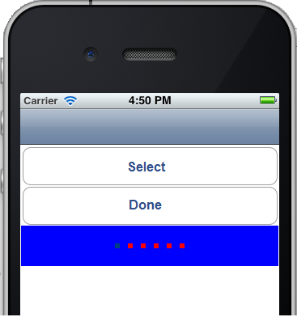

                                 


TabPane Properties
==================

The properties for TabPane widget are:

* * *


<details close markdown="block"><summary>activeFocusSkin Property</summary>

* * *

This is a skin property. This property specifies the skin that is to be applied when a TabPane is active and focused.

<b>Syntax</b>

```

activeFocusSkin
```

<b>Type</b>

String

<b>Read/Write</b>

Read + Write

<b>Example</b>

```
//Sample code to set the activeFocusSkin property of a TabPane widget.

frmTab.myTab.activeFocusSkin="aFSkin";
```

<b>Platform Availability</b>

*   Available in the IDE
*   Available on all platforms

* * *

</details>
<details close markdown="block"><summary>activeSkin Property</summary>

* * *

This is a skin property. Skin to be applied when a TabPane is active.

<b>Syntax</b>

```

activeSkin
```

<b>Type</b>

String

<b>Read/Write</b>

Read + Write

<b>Example</b>

```
//Sample code to set the activeSkin property of a TabPane widget.

frmTab.myTab.activeSkin="aSkin";
```

<b>Platform Availability</b>

*   Available in the IDE
*   Available on all platforms

* * *

</details>
<details close markdown="block"><summary>activeTabs Property</summary>

* * *

Indicates the selected Tabs indices. Index starts from 0. Specifies the Tab that must be displayed as the default open Tab.

<b>Syntax</b>

```

activeTabs
```

<b>Type</b>

Array

<b>Read/Write</b>

Read + Write

<b>Remarks</b>

The default value for this property is '1' (Tab 1 will be displayed as the Active Tab)

If you want to set another Tab as Active Tab, select that Tab in the drop-down list. Multiple indices in activeTabs is only appropriate for collapsible view currently. For all the remaining views,activeTabs always respects only one selected item i.e first element in the array.

<b>Example</b>

```
//Sample code to set the activeTabs property of a TabPane widget.

frmTab.myTab.activeTabs=[0, 1, 2, 3, 4];
```

<b>Platform Availability</b>

*   Available in the IDE
*   Available on all platforms

* * *

</details>
<details close markdown="block"><summary>autogrowMode Property</summary>

* * *

The `autogrowMode` property is used to set the height of the TabPane widget dynamically. The height of the TabPane widget will be the same as the height of the content inside the selected tab (including the height of the tab header).

This property is not applicable when the [viewType](#viewType) property has the value: `TABPANE_VIEW_TYPE_PAGEVIEW` .

<b>Syntax</b>

```

autogrowMode
```

<b>Type</b>

Constant

You can add any of the following constants to the autogrowMode property.

*   `voltmx.flex.AUTOGROW_NONE`: When the autogrowMode property is assigned this value, the height of the TabPane widget does not increase dynamically. The default value is applied using the values in [minHeight](#minHeigh) and [maxHeight](#maxHeigh) properties. This is the default value of this property.
*   `voltmx.flex.AUTOGROW_HEIGHT` : When the autogrowMode property is assigned this value, the height of the TabPane widget increases dynamically. The height of the TabPane widget is dependent on the height of the selected tab.

<b>Read/Write</b>

Read +Write

<b>Remarks</b>

> **_Note:_** If one or all the child widgets height or other properties such as centerY, top, bottom, minHeight or maxHeight are used in determining the height given in percentage (%), then the autogrowMode property will not work for the selected tab and the height of the TabPane widget falls back to the default configuration value (220 dp).

**Rules and priorities of autogrowMode property**

*   The autogrowMode property is ignored if the [height](#height) property of the TabPane widget has a value.
*   If the autogrowMode property is configured as voltmx.flex.AUTOGROW\_HEIGHT, then preferred Size (based on content in the selected tab ) is computed, and min/max constraints are applied.
*   In a TabPane widget with Collapsible view, when the value of the autogrowMode property is voltmx.flex.AUTOGROW\_HEIGHT,the height of the widget is the total height of all the expanded tabs.

<b>Example</b>

```
//Sample code to set the autogrowMode property of a TabPane widget.
//The TabPane widget will use the set height property to derive height
frmHome.myTab1.autogrowMode=voltmx.flex.AUTOGROW_NONE;

//The TabPane widget will use the height of the selected tab to derive height
frmHome.autogrow1.autogrowMode=voltmx.flex.AUTOGROW_HEIGHT;
```

<b>Platform Availability</b>

*   iOS, Android, SPA, and Desktop Web

* * *

</details>
<details close markdown="block"><summary>bottom Property</summary>

* * *

This property determines the bottom edge of the widget and is measured from the bottom bounds of the parent container.

The bottom property determines the position of the bottom edge of the widget’s bounding box. The value may be set using DP (Device Independent Pixels), Percentage, or Pixels. In freeform layout, the distance is measured from the bottom edge of the parent container. In flow-vertical layout, the value is ignored. In flow-horizontal layout, the value is ignored.

The bottom property is used only if the Height property is not provided.

<b>Syntax</b>

```

bottom
```

<b>Type</b>

String

<b>Read/Write</b>

Read + Write

<b>Remarks</b>

The property determines the bottom edge of the widget and is measured from the bottom bounds of the parent container.

If the layoutType is set as voltmx.flex.FLOW\_VERTICAL, the bottom property is measured from the top edge of bottom sibling widget. The vertical space between two widgets is measured from bottom of the top sibling widget and the top of the bottom sibling widget.

<b>Example</b>

```
//Sample code to set the bottom property for widgets by using DP, Percentage and Pixels.
frmHome.widgetID.bottom = "50dp";

frmHome.widgetID.bottom = "10%";

frmHome.widgetID.bottom = "10px";
```

<b>Platform Availability</b>

*   Available in the IDE
*   iOS, Android, Windows, SPA , and Desktop Web

* * *

</details>
<details close markdown="block"><summary>centerX Property</summary>

* * *

This property determines the center of a widget measured from the left bounds of the parent container.

The centerX property determines the horizontal center of the widget’s bounding box. The value may be set using DP (Device Independent Pixels), Percentage, or Pixels. In freeform layout, the distance is measured from the left edge of the parent container. In flow-vertical layout, the distance is measured from the left edge of the parent container. In flow-horizontal layout, the distance is measured from the right edge of the previous sibling widget in the hierarchy.

<b>Syntax</b>

```

centerX
```

<b>Type</b>

String

<b>Read/Write</b>

Read + Write

<b>Remarks</b>

If the layoutType is set as voltmx.flex.FLOW\_HORIZONTAL, the centerX property is measured from right edge of the left sibling widget.

<b>Example</b>

```
//Sample code to set the centerX property for widgets by using DP, Percentage and Pixels.
frmHome.widgetID.centerX = "50dp";

frmHome.widgetID.centerX = "10%";

frmHome.widgetID.centerX = "10px";
```

<b>Platform Availability</b>

*   Available in the IDE
*   iOS, Android, Windows, SPA, and Desktop Web

* * *

</details>
<details close markdown="block"><summary>centerY Property</summary>

* * *

This property determines the center of a widget measured from the top bounds of the parent container.

The centerY property determines the vertical center of the widget’s bounding box. The value may be set using DP (Device Independent Pixels), Percentage, or Pixels. In freeform layout, the distance is measured from the top edge of the parent container. In flow-horizontal layout, the distance is measured from the top edge of the parent container. In flow-vertical layout, the distance is measured from the bottom edge of the previous sibling widget in the hierarchy.

<b>Syntax</b>

```

centerY
```

<b>Type</b>

String

<b>Read/Write</b>

Read + Write

<b>Remarks</b>

If the layoutType is set as voltmx.flex.FLOW\_VERTICAL, the centerY property is measured from bottom edge of the top sibling widget.

<b>Example</b>

```
//Sample code to set the centerY property for widgets by using DP, Percentage and Pixels.
frmHome.widgetID.centerY = "50dp";

frmHome.widgetID.centerY = "10%";

frmHome.widgetID.centerY = "10px";
```

<b>Platform Availability</b>

*   Available in the IDE
*   iOS, Android, Windows, SPA, and Desktop Web

* * *

</details>
<details close markdown="block"><summary>cursorType Property</summary>

* * *

In Desktop Web applications, when you hover the mouse over any widget, a mouse pointer appears. Using the cursorType property in Iris, you can specify the type of the mouse pointer.

<b>Syntax</b>

```

cursorType
```

<b>Type</b>

String.

You must provide valid CSS cursor value such as wait, grab, help, etc. to the cursorType property.

<b>Read/Write</b>

Read + Write

<b>Remarks</b>

To add the `cursorType` property using Volt MX Iris in a Desktop Web application, follow these steps.

1.  In Volt MX Iris, open the Desktop Web application. From the **Project** explorer, expand **Responsive Web/ Desktop**\> **Forms** and select the form to which you need to make the changes.
2.  On the canvas, select the widget for which you want to specify the cursor type. For example, button.
3.  From the **Properties** panel, navigate to the **Skin** tab > **Hover Skin** tab.  
    You will find that the details of the hover skin is not enabled here.
4.  Check the **Enable** option to add a hover skin to your widget.  
    The details and configurations of the hover skin is enabled.
5.  Under the **General** section, for the Platform option, click the ellipsis icon.  
    The **Fork Skin** window appears.
6.  In the **Fork Skin** window, for **Desktop**, check under **HTML5 SPA**.
7.  Click **Ok**. You have successfully forked your hover skin for Desktop Web application.  
    You can see that the **Cursor Type** property has been added under the **General** section.
8.  Select a value from the drop-down list to set the **Cursor Type** for the widget.

<b>Example</b>

```
 //This is a generic property and is applicable for many widgets.  
  
/*The example provided is for the Button widget. Make the required changes in the example while using other widgets.*/
  
frmButton.myButton.cursorType = "wait";

```

<b>Platform Availability</b>

*   Available in IDE
*   Desktop Web

* * *

</details>
<details close markdown="block"><summary>enable Property</summary>

* * *

The `enable` property is used to control the actionability of the widgets. In a scenario where you want to display a widget but not invoke any action on the widget, configure the `enable` property to false to achieve it.

This is a constructor level property and applicable for all widgets in Volt MX Iris.

<b>Syntax</b>

```

enable
```

>b>Type</b>

Boolean

<b>Read/Write</b>

Read + Write

<b>Remarks</b>

The default value of this property is true.

When `enable` property is configured to true, the action associated with a widget can be invoked by the user in the application.

When `enable` property is configured to false, the action associated with a widget cannot be invoked by the user in the application.

<b>Example</b>

```
//This is a generic property and is applicable for many widgets.  
  
/*The example provided is for the Button widget. Make the changes required in the example while using other widgets.*/
  
frmButton.myBtn.enable= true;
```

<b>Platform Availability</b>

*   Android, iOS, Windows, SPA, and Desktop web

 

* * *

</details>
<details close markdown="block"><summary>enableCache Property</summary>

* * *

The property enables you to improve the performance of Positional Dimension Animations.

<b>Syntax</b>

```

enableCache
```

<b>Type</b>

Boolean

<b>Read/Write</b>

Read + Write

<b>Remarks</b>

The default value for this property is true.

> **_Note:_** When the property is used, application consumes more memory. The usage of the property enables tradeoff between performance and visual quality of the content. Use the property cautiously.

<b>Example</b>

```
Form1.widgetID.enableCache = true;
```

<b>Platform Availability</b>

*   Available in the IDE.
*   Windows

* * *

</details>
<details close markdown="block"><summary>height Property</summary>

* * *

It determines the height of the widget and measured along the y-axis.

The height property determines the height of the widget’s bounding box. The value may be set using DP (Device Independent Pixels), Percentage, or Pixels. For supported widgets, the height may be derived from either the widget or container’s contents by setting the height to “preferred”.

<b>Syntax</b>

```

height
```

<b>Type</b>

Number, String, and Constant

<b>Read/Write</b>

Read + Write

<b>Remarks</b>

Following are the available measurement options:

*   %: Specifies the values in percentage relative to the parent dimensions.
*   px: Specifies the values in terms of device hardware pixels.
*   dp: Specifies the values in terms of device independent pixels.
*   default: Specifies the default value of the widget.
*   voltmx.flex.USE\_PREFERED\_SIZE: When this option is specified, the layout uses preferred height of the widget as height and preferred size of the widget is determined by the widget and may varies between platforms.

<b>Example</b>

```
/*Sample code to set the height property for a TabPane widget by using DP, Percentage and Pixels.*/
frmTab.myTab.height="50dp";

frmTab.myTab.height="10%";

frmTab.myTab.height="10px";

```

<b>Platform Availability</b>

*   Available in the IDE
*   iOS
*   Android
*   Windows
*   SPA

* * *

</details>
<details close markdown="block"><summary>id Property</summary>

* * *

id is a unique identifier of a TabPane consisting of alpha numeric characters. Every TabPane should have a unique id within a Form.

<b>Syntax</b>

```

id
```

<b>Type</b>

String

<b>Read/Write</b>

Read only

<b>Example</b>

```
//Defining the properties for TabPane with id:"tPane"
var tabBasic = {
    id: "tPane",
    info: {
        key: "TabPane"
    },
    activeSkin: "aSkin",
    isVisible: true,
    activeFocusSkin: "aFSkin",
    selectedTabIndex: 0,
    viewType: constants.TABPANE_VIEW_TYPE_TABVIEW,
    screenLevelWidget: true,
    retainPositionInTab: true,
    needPageIndicator: true,
    inactiveSkin: "inActiveSkin"
};

var tabLayout = {
    padding: [5, 5, 5, 5],
    margin: [5, 5, 5, 5],
    paddingInPixel: true,
    marginInPixel: true,
    widgetAlignment: constants.WIDGET_ALIGN_TOP_LEFT,
    containerWeight: 70
};

var tabPSP = {};

//Creating the TabPane.
var tabPane = new voltmx.ui.TabPane(tabBasic, tabLayout, tabPSP);

//Reading id of the TabPane.
alert("TabPane id is ::" + tabPane.id);
```

<b>Platform Availability</b>

*   Available in the IDE
*   Available on all platforms

* * *

</details>
<details close markdown="block"><summary>inactiveSkin Property</summary>

* * *

Skin to be applied for all inactive tabs.

<b>Syntax</b>

```

inactiveSkin
```

<b>Type</b>

String

<b>Read/Write</b>

Read + Write

<b>Example</b>

```
//Sample code to set the inactiveSkin property for a TabPane widget.
frmTab.myTab.inactiveSkin="inActiveSkin";

```

<b>Platform Availability</b>

*   Available in the IDE
*   Available on all platforms

* * *

</details>
<details close markdown="block"><summary>info Property</summary>

* * *

A custom JS Object with the key value pairs that a developer can use to store the context with the widget.

<b>Syntax</b>

```

info
```

<b>Type</b>

JSObject

<b>Read/Write</b>

Read + Write

<b>Remarks</b>

This will help in avoiding the globals to most part of the programming.

This is a **non-Constructor property**. You cannot set this property through widget constructor. But you can always read and write data to it.  

Info property can hold any JSObject. After assigning the JSObject to info property, the JSObject should not be modified. For example,

```
var inf = {
    a: "hello"
};
widget.info = inf; //works

widget.info.a = "hello world";
//This will not update the widget info a property to hello world. 
//widget.info.a will have old value as hello.
```

<b>Example</b>

```
//Sample code to set info property of a TabPane widget.

frmTab.myTab.info = {
   key: "TabPane"
};

//Reading the info of the TabPane widget.
voltmx.print("TabPane widget info:" +frmTab.myTab.info);

```

<b>Platform Availability</b>

Available on all platforms

* * *

</details>
<details close markdown="block"><summary>isMaster Property</summary> 

* * *

Specifies whether the container is a master container.

<b>Syntax</b>

```

isMaster
```

<b>Type</b>

Boolean

<b>Read/Write</b>

Read Only after initialization.

<b>Remarks</b>

If the `isMaster` property is true, the current widget is a master container and all of the rules and limitations of master containers apply to it. For more information, please see [Masters](Masters.md) in the Overviews section of this guide, as well as [Using Masters](../../../Iris/iris_user_guide/Content/Introduction.md) in the Volt MX Iris [User Guide](../../../Iris/iris_user_guide/Content/Introduction.md).

Your app can set the `isMaster` property in this container's constructor. After that, this property is read-only.

<b>Example</b>

```

var isMasterContainer = tabPane1.isMaster;
```

* * *

</details>
<details close markdown="block"><summary>isVisible Property</summary>

* * *

This property controls the visibility of the TabPane on the form.

<b>Syntax</b>

```

isVisible
```

<b>Type</b>

Boolean

<b>Read/Write</b>

Read + Write

<b>Remarks</b>

The default value for this property is true.

If set to _false,_ the widget is not displayed.

If set to _true,_ the widget is displayed.

<b>Example</b>

```
//Sample code to set isVisible property of a TabPane widget.

frmTab.myTab.isVisible=true;
```

> **_Note:_** You can set the visibility of a widget dynamically from code using the setVisibility method.

<b>Platform Availability</b>

*   Available in the IDE
*   Available on all platforms

* * *

</details>
<details close markdown="block"><summary>layoutMeta Property</summary>

* * *

A custom Object with the key, value pairs that developer can use to provide the meta info about the grid layout.

<b>Syntax</b>

```

layoutMeta
```


<b>Type</b>

JSObject

<b>Remarks</b>

The following are the mandatory keys required to be part of the Meta. These are not visible PSPs in IDE. The data for layoutmeta data is set when you set grid layout view properties for rows and columns.

**rows :** no of grid rows

**cols** : no of grid cols

**colmeta**: \[{width:"width in %"}\]

The sum total of the % widths of each of the columns in the grid layout should add up to 100%

<b>Example</b>

```
//Sample code to set layoutMeta property of a TabPane widget.

frmTab.myTab.layoutMeta = {
 cols: 8,
 colmeta: ["15", "15", "15", "15", "15", "15", "5", "5"],
 rows: 4
};
```

Availability

*   Available in the IDE
*   Windows

* * *

</details>
<details close markdown="block"><summary>layoutType Property</summary>

* * *

Defines the type of the layout of widget. Layout type can be grid or normal.

<b>Syntax</b>

```

layoutType
```

<b>Type</b>

String

<b>Remarks</b>

Layout type is not visible as a property. It is set when the user applies XYLayout or Grid Layout on a form.

<b>Example</b>

```
//Sample code to set layoutType property of a TabPane widget.

frmTab.myTab.layoutType =constants.CONTAINER_LAYOUT_GRID;
```

Availability

*   Available in the IDE
*   Windows

* * *

</details>
<details close markdown="block"><summary>left Property</summary>

* * *

This property determines the lower left corner edge of the widget and is measured from the left bounds of the parent container.

The left property determines the position of the left edge of the widget’s bounding box. The value may be set using DP (Device Independent Pixels), Percentage, or Pixels. In freeform layout, the distance is measured from the left edge of the parent container. In flow-vertical layout, the distance is measured from the left edge of the parent container. In flow-horizontal layout, the distance is measured from the right edge of the previous sibling widget in the hierarchy.

<b>Syntax</b>

```

left
```

<b>Type</b>

String

<b>Read/Write</b>

Read + Write

<b>Remarks</b>

If the layoutType is set as voltmx.flex.FLOW\_HORIZONTAL, the left property is measured from right edge of the left sibling widget.

<b>Example</b>

```
//Sample code to set the left property for widgets by using DP, Percentage and Pixels.
frmHome.widgetID.left = "50dp";

frmHome.widgetID.left = "10%";

frmHome.widgetID.left = "10px";
```

<b>Platform Availability</b>

*   Available in the IDE
*   iOS, Android, Windows, SPA, and Desktop Web

* * *

</details>
<details close markdown="block"><summary>maxHeight Property</summary>

* * *

This property specifies the maximum height of the widget and is applicable only when the height property is not specified.

The maxHeight property determines the maximum height of the widget’s bounding box. The value may be set using DP (Device Independent Pixels), Percentage, or Pixels. The maxHeight value overrides the preferred, or “autogrow” height, if the maxHeight is less than the derived content height of the widget.

<b>Syntax</b>

```

maxHeight
```

<b>Type</b>

Number

<b>Read/Write</b>

Read + Write

<b>Example</b>

```
//Sample code to set the maxHeight property for widgets by using DP, Percentage and Pixels.
frmHome.widgetID.maxHeight = "50dp";

frmHome.widgetID.maxHeight = "10%";

frmHome.widgetID.maxHeight = "10px";
```

<b>Platform Availability</b>

*   Available in the IDE
*   iOS, Android, Windows, SPA, and Desktop Web

* * *

</details>
<details close markdown="block"><summary>maxWidth Property</summary>

* * *

This property specifies the maximum width of the widget and is applicable only when the width property is not specified.

The Width property determines the maximum width of the widget’s bounding box. The value may be set using DP (Device Independent Pixels), Percentage, or Pixels. The maxWidth value overrides the preferred, or “autogrow” width, if the maxWidth is less than the derived content width of the widget.

<b>Syntax</b>

```

maxWidth
```

<b>Type</b>

Number

<b>Read/Write</b>

Read + Write

<b>Example</b>

```
//Sample code to set the maxWidth property for widgets by using DP, Percentage and Pixels.
frmHome.widgetID.maxWidth = "50dp";

frmHome.widgetID.maxWidth = "10%";

frmHome.widgetID.maxWidth = "10px";
```

<b>Platform Availability</b>

*   Available in the IDE
*   iOS, Android, Windows, SPA, and Desktop Web

* * *

</details>
<details close markdown="block"><summary>minHeight Property</summary>

* * *

This property specifies the minimum height of the widget and is applicable only when the height property is not specified.

The minHeight property determines the minimum height of the widget’s bounding box. The value may be set using DP (Device Independent Pixels), Percentage, or Pixels. The minHeight value overrides the preferred, or “autogrow” height, if the minHeight is larger than the derived content height of the widget.

<b>Syntax</b>

```

minHeight
```

<b>Type</b>

Number

<b>Read/Write</b>

Read + Write

<b>Example</b>

```
//Sample code to set the minHeight property for widgets by using DP, Percentage and Pixels.
frmHome.widgetID.minHeight = "50dp";

frmHome.widgetID.minHeight = "10%";

frmHome.widgetID.minHeight = "10px";
```

<b>Platform Availability</b>

*   Available in the IDE
*   iOS, Android, Windows, SPA, and Desktop Web

* * *

</details>
<details close markdown="block"><summary>minWidth Property</summary>

* * *

This property specifies the minimum width of the widget and is applicable only when the width property is not specified.

The minWidth property determines the minimum width of the widget’s bounding box. The value may be set using DP (Device Independent Pixels), Percentage, or Pixels. The minWidth value overrides the preferred, or “autogrow” width, if the minWidth is larger than the derived content width of the widget.

<b>Syntax</b>

```

minWidth
```

<b>Type</b>

Number

<b>Read/Write</b>

Read only

<b>Example</b>

```
//Sample code to set the minWidth property for widgets by using DP, Percentage and Pixels.
frmHome.widgetID.minWidth = "50dp";

frmHome.widgetID.minWidth = "10%";

frmHome.widgetID.minWidth = "10px";
```

<b>Platform Availability</b>

*   Available in the IDE
*   iOS, Android, Windows, SPA, and Desktop Web

* * *

</details>
<details close markdown="block"><summary>pageSkin Property</summary>

* * *

Specifies the skin for page indicator.

<b>Syntax</b>

```

pageSkin
```

<b>Type</b>

String

<b>Read/Write</b>

Read + Write

<b>Remarks</b>

The default value for this property is Skin Defaults ( blue color strip is applied for the page indicator).

This property is applicable only when viewType is set as TABPANE\_VIEW\_TYPE\_PAGEVIEW and images are selected for pageOnDotImage and pageOffDotImage.



<b>Example</b>

```
//Sample code to set pageSkin property of a TabPane widget.

frmTab.myTab.pageSkin="pSkin";
```

<b>Platform Availability</b>

*   Available in the IDE
*   iPhone
*   iPad

* * *

</details>
<details close markdown="block"><summary>progressIndicatorColor Property</summary>

* * *

Specifies the color of the progress indicator as white or grey.

<b>Syntax</b>

```

progressIndicatorColor
```

<b>Type</b>

Number

<b>Remarks</b>

The default value for this property is PROGRESS\_INDICATOR\_COLOR\_WHITE.

The available options are:

*   PROGRESS\_INDICATOR\_COLOR\_WHITE: The progress indicator is white in color.
*   PROGRESS\_INDICATOR\_COLOR\_GREY: The progress indicator is grey in color.

To set the value through code, prefix the option with _constants._ such as _**constants.<option>**_.

<b>Example</b>

```
//Sample code to set progressIndicatorColor property of a TabPane widget.

frmTab.myTab.progressIndicatorColor=constants.PROGRESS_INDICATOR_COLOR_GREY;
```

<b>Platform Availability</b>

*   Available in the IDE
*   iPhone
*   iPad

* * *

</details>
<details close markdown="block"><summary>retainContentAlignment Property</summary>

* * *

This property is used to retain the content alignment property value, as it was defined.

> **_Note:_** Locale-level configurations take priority when invalid values are given to this property, or if it is not defined.

The mirroring widget layout properties should be defined as follows.

```
function getIsFlexPositionalShouldMirror(widgetRetainFlexPositionPropertiesValue) {
    return (isI18nLayoutConfigEnabled &&
    localeLayoutConfig[defaultLocale]
    ["mirrorFlexPositionalProperties"] == true &&
    !widgetRetainFlexPositionPropertiesValue);
}
```

The following table illustrates how widgets consider Local flag and Widget flag values.

  
| Properties | Local Flag Value | Widget Flag Value | Action |
| --- | --- | --- | --- |
| Mirror/retain FlexPositionProperties | true | true | Use the designed layout from widget for all locales. Widget layout overrides everything else. |
| Mirror/retain FlexPositionProperties | true | false | Use Mirror FlexPositionProperties since locale-level Mirror is true. |
| Mirror/retain FlexPositionProperties | true | not specified | Use Mirror FlexPositionProperties since locale-level Mirror is true. |
| Mirror/retain FlexPositionProperties | false | true | Use the designed layout from widget for all locales. Widget layout overrides everything else. |
| Mirror/retain FlexPositionProperties | false | false | Use the Design/Model-specific default layout. |
| Mirror/retain FlexPositionProperties | false | not specified | Use the Design/Model-specific default layout. |
| Mirror/retain FlexPositionProperties | not specified | true | Use the designed layout from widget for all locales. Widget layout overrides everything else. |
| Mirror/retain FlexPositionProperties | not specified | false | Use the Design/Model-specific default layout. |
| Mirror/retain FlexPositionProperties | not specified | not specified | Use the Design/Model-specific default layout. |

<b>Syntax</b>

```

retainContentAlignment
```

<b>Type</b>

Boolean

<b>Read/Write</b>

No (only during widget-construction time)

<b>Example</b>

```
//This is a generic property that is applicable for various widgets.
//Here, we have shown how to use the retainContentAlignment property for Button widget.
/*You need to make a corresponding use of the 
retainContentAlignment property for other applicable widgets.*/
var btn = new voltmx.ui.Button({
    "focusSkin": "defBtnFocus",
    "height": "50dp",
    "id": "myButton",
    "isVisible": true,
    "left": "0dp",
    "skin": "defBtnNormal",
    "text": "text always from top left",
    "top": "0dp",
    "width": "260dp",
    "zIndex": 1
}, {
    "contentAlignment": constants.CONTENT_ALIGN_TOP_LEFT,
    "displayText": true,
    "padding": [0, 0, 0, 0],
    "paddingInPixel": false,
    "retainFlexPositionProperties": false,
    "retainContentAlignment": true
}, {});
```

<b>Platform Availability</b>

*   Available in IDE
*   Windows, iOS, Android, and SPA

* * *

</details>
<details close markdown="block"><summary>retainFlexPositionProperties Property</summary>

* * *

This property is used to retain flex positional property values as they were defined. The flex positional properties are left, right, and padding.

> **_Note:_** Locale-level configurations take priority when invalid values are given to this property, or if it is not defined.

The mirroring widget layout properties should be defined as follows.

```
function getIsFlexPositionalShouldMirror(widgetRetainFlexPositionPropertiesValue) {
    return (isI18nLayoutConfigEnabled &&
    localeLayoutConfig[defaultLocale]
    ["mirrorFlexPositionalProperties"] == true &&
    !widgetRetainFlexPositionPropertiesValue);
}
```

The following table illustrates how widgets consider Local flag and Widget flag values.

  
| Properties | Local Flag Value | Widget Flag Value | Action |
| --- | --- | --- | --- |
| Mirror/retain FlexPositionProperties | true | true | Use the designed layout from widget for all locales. Widget layout overrides everything else. |
| Mirror/retain FlexPositionProperties | true | false | Use Mirror FlexPositionProperties since locale-level Mirror is true. |
| Mirror/retain FlexPositionProperties | true | not specified | Use Mirror FlexPositionProperties since locale-level Mirror is true. |
| Mirror/retain FlexPositionProperties | false | true | Use the designed layout from widget for all locales. Widget layout overrides everything else. |
| Mirror/retain FlexPositionProperties | false | false | Use the Design/Model-specific default layout. |
| Mirror/retain FlexPositionProperties | false | not specified | Use the Design/Model-specific default layout. |
| Mirror/retain FlexPositionProperties | not specified | true | Use the designed layout from widget for all locales. Widget layout overrides everything else. |
| Mirror/retain FlexPositionProperties | not specified | false | Use the Design/Model-specific default layout. |
| Mirror/retain FlexPositionProperties | not specified | not specified | Use the Design/Model-specific default layout. |

<b>Syntax</b>

```

retainFlexPositionProperties
```

<b>Type</b>

Boolean

<b>Read/Write</b>

No (only during widget-construction time)

<b>Example</b>

```
//This is a generic property that is applicable for various widgets.
//Here, we have shown how to use the retainFlexPositionProperties property for Button widget.
/*You need to make a corresponding use of the 
retainFlexPositionProperties property for other applicable widgets.*/
var btn = new voltmx.ui.Button({
    "focusSkin": "defBtnFocus",
    "height": "50dp",
    "id": "myButton",
    "isVisible": true,
    "left": "0dp",
    "skin": "defBtnNormal",
    "text": "always left",
    "top": "0dp",
    "width": "260dp",
    "zIndex": 1
}, {
    "contentAlignment": constants.CONTENT_ALIGN_CENTER,
    "displayText": true,
    "padding": [0, 0, 0, 0],
    "paddingInPixel": false,
    "retainFlexPositionProperties": true,
    "retainContentAlignment": false
}, {});
```

<b>Platform Availability</b>

*   Available in IDE
*   Windows, iOS, Android, and SPA

* * *

</details>
<details close markdown="block"><summary>retainFlowHorizontalAlignment Property</summary>

* * *

This property is used to convert Flow Horizontal Left to Flow Horizontal Right.

> **_Note:_** Locale-level configurations take priority when invalid values are given to this property, or if it is not defined.

The mirroring widget layout properties should be defined as follows.

```
function getIsFlexPositionalShouldMirror(widgetRetainFlexPositionPropertiesValue) {
    return (isI18nLayoutConfigEnabled &&
    localeLayoutConfig[defaultLocale]
    ["mirrorFlexPositionalProperties"] == true &&
    !widgetRetainFlexPositionPropertiesValue);
}
```

The following table illustrates how widgets consider Local flag and Widget flag values.

  
| Properties | Local Flag Value | Widget Flag Value | Action |
| --- | --- | --- | --- |
| Mirror/retain FlexPositionProperties | true | true | Use the designed layout from widget for all locales. Widget layout overrides everything else. |
| Mirror/retain FlexPositionProperties | true | false | Use Mirror FlexPositionProperties since locale-level Mirror is true. |
| Mirror/retain FlexPositionProperties | true | not specified | Use Mirror FlexPositionProperties since locale-level Mirror is true. |
| Mirror/retain FlexPositionProperties | false | true | Use the designed layout from widget for all locales. Widget layout overrides everything else. |
| Mirror/retain FlexPositionProperties | false | false | Use the Design/Model-specific default layout. |
| Mirror/retain FlexPositionProperties | false | not specified | Use the Design/Model-specific default layout. |
| Mirror/retain FlexPositionProperties | not specified | true | Use the designed layout from widget for all locales. Widget layout overrides everything else. |
| Mirror/retain FlexPositionProperties | not specified | false | Use the Design/Model-specific default layout. |
| Mirror/retain FlexPositionProperties | not specified | not specified | Use the Design/Model-specific default layout. |

<b>Syntax</b>

```

retainFlowHorizontalAlignment
```

<b>Type</b>

Boolean

<b>Read/Write</b>

No (only during widget-construction time)

<b>Example</b>

```
//This is a generic property that is applicable for various widgets.
//Here, we have shown how to use the retainFlowHorizontalAlignment property for Button widget.
/*You need to make a corresponding use of the 
retainFlowHorizontalAlignment property for other applicable widgets. */
var btn = new voltmx.ui.Button({
 "focusSkin": "defBtnFocus",
 "height": "50dp",
 "id": "myButton",
 "isVisible": true,
 "left": "0dp",
 "skin": "defBtnNormal",
 "text": "always left",
 "top": "0dp",
 "width": "260dp",
 "zIndex": 1
}, {
 "contentAlignment": constants.CONTENT_ALIGN_CENTER,
 "displayText": true,
 "padding": [0, 0, 0, 0],
 "paddingInPixel": false,
 "retainFlexPositionProperties": true,
 "retainContentAlignment": false,
 "retainFlowHorizontalAlignment ": false
}, {});
```

<b>Platform Availability</b>

*   Available in IDE
*   Windows, iOS, Android, and SPA

* * *

</details>
<details close markdown="block"><summary>retainPositionInTab Property</summary>

* * *

Indicates whether each individual tab should retain its scroll position when the TabPanes are switched over.

<b>Syntax</b>

```

retainPositionInTab
```

<b>Type</b>

Boolean

<b>Read/Write</b>

Read + Write

<b>Remarks</b>

The default value for this property is false.

<b>Example</b>

```
//Sample code to set the retainPositionInTab property of a TabPane widget.

frmTab.myTab.retainPositionInTab=true;
```

<b>Platform Availability</b>

*   Available in the IDE
*   Available on all platforms except Windows

* * *

</details>
<details close markdown="block"><summary>right Property</summary>

* * *

This property determines the lower right corner of the widget and is measured from the right bounds of the parent container.

The right property determines the position of the right edge of the widget’s bounding box. The value may be set using DP (Device Independent Pixels), Percentage, or Pixels. In freeform layout, the distance is measured from the left edge of the parent container. In flow-vertical layout, value is ignored. In flow-horizontal layout, the value is ignored.

The right property is used only if the width property is not provided.

<b>Syntax</b>

```

right
```

<b>Type</b>

String

<b>Read/Write</b>

Read + Write

<b>Remarks</b>

If the layoutType is set as voltmx.flex.FLOW\_HORIZONTAL, the right property is measured from left edge of the right sibling widget. The horizontal space between two widgets is measured from right of the left sibling widget and left of the right sibling widget.

<b>Example</b>

```
//Sample code to set the right property for widgets by using DP, Percentage and Pixels.
frmHome.widgetID.right = "50dp";

frmHome.widgetID.right = "10%";

frmHome.widgetID.right = "10px";
```

<b>Platform Availability</b>

*   Available in the IDE
*   iOS, Android, Windows, SPA, and Desktop Web

* * *

</details>
<details close markdown="block"><summary>screenLevelWidget Property</summary>

* * *

Specifies whether the widget should occupy the whole container or not.

<b>Syntax</b>

```

screenLevelWidget
```

<b>Type</b>

Boolean

<b>Remarks</b>

The default value for this property is false.

If set to _true,_ the widget occupies the whole container.

If set to _false,_ the widget does not occupy the whole container.

You cannot place more than one TabPane as a screen level widget inside a form. If you choose to make a TabPane a Screen Level Widget, place only one TabPane in the form and do not place any other widgets in the form.

Do not set the screen level widget property to true for more than one widget in the form. If you have multiple widgets with this property set as true, there may be issues with how information is displayed along with some scrolling issues.

<b>Example</b>

```
//Sample code to set the screenLevelWidget property of a TabPane widget.

frmTab.myTab.screenLevelWidget=true;
```

<b>Platform Availability</b>

*   Available in the IDE
*   Available on all platforms except Desktop Web.

* * *

</details>
<details close markdown="block"><summary>scrollsToTop Property</summary>

* * *

This property enables you to scroll the TabPane to top on tapping a device’s status bar.

<b>Syntax</b>

```

scrollsToTop
```

<b>Type</b>

Boolean

<b>Read/Write</b>

Read + Write

<b>Remarks</b>

The default value for this property is false.

If this property is true for more than one widget, then this property is not applied to any of the widgets.

<b>Example</b>

```
//Sample code to set the scrollsToTop property of a TabPane widget.

frmTab.myTab.scrollsToTop=true;
```

<b>Platform Availability</b>

*   iPhone
*   iPad

* * *

</details>
<details close markdown="block"><summary>showProgressIndicator Property</summary>

* * *

Specifies if the progress indicator must be displayed.

<b>Syntax</b>

```

showProgressIndicator
```

<b>Type</b>

Boolean

<b>Remarks</b>

The default value for this property is true.

If set to _false_, the progress indicator is not displayed on the widget.

If set to _true_, the progress indicator is displayed on the widget.

<b>Example</b>

```
//Sample code to set the showProgressIndicator property of a TabPane widget.

frmTab.myTab.showProgressIndicator=true;
```

<b>Platform Availability</b>

*   Available in the IDE
*   iPhone
*   iPad

* * *

</details>
<details close markdown="block"><summary>tabHeaderHeight Property</summary>

* * *

Specifies the height of the Tab header in pixels.

<b>Syntax</b>

```

tabHeaderHeight
```

<b>Type</b>

Number

<b>Read/Write</b>

Read + Write

<b>Remarks</b>

The default value of this property is 64.

This property is applicable only when the viewType is set as TABPANE\_VIEW\_TYPE\_TABVIEW.

<b>Example</b>

```
//Sample code to set the tabHeaderHeight property of a TabPane widget.

frmTab.myTab.tabHeaderHeight=64;
```

<b>Platform Availability</b>

*   Available in the IDE
*   This property is available on Android/Android Tablet platform

* * *

</details>
<details close markdown="block"><summary>tabHeaderTemplate Property</summary>

* * *

Accepts reference to a box widget which represents a UI template for a custom tab header. The box template is allowed to have only Label, Link, Richtext, Button and Image widgets.

<b>Syntax</b>

```

tabHeaderTemplate
```

<b>Type</b>

voltmx.ui.Box

<b>Read/Write</b>

Read + Write

<b>Platform Availability</b>

*   Available in the IDE
*   Available on Desktop Web

* * *

</details>
<details close markdown="block"><summary>top Property</summary>

* * *

This property determines the top edge of the widget and measured from the top bounds of the parent container.

The top property determines the position of the top edge of the widget’s bounding box. The value may be set using DP (Device Independent Pixels), Percentage, or Pixels. In freeform layout, the distance is measured from the top edge of the parent container. In flow-vertical layout, the distance is measured from the bottom edge of the previous sibling widget in the hierarchy. In flow-horizontal layout, the distance is measured from the left edge of the parent container.

<b>Syntax</b>

```

top
```

<b>Type</b>

String

<b>Read/Write</b>

Read + Write

<b>Remarks</b>

If the layoutType is set as voltmx.flex.FLOW\_VERTICAL, the top property is measured from the bottom edge of the top sibling widget. The vertical space between two widgets is measured from bottom of the top sibling widget and top of the bottom sibling widget.

<b>Example</b>

```
//Sample code to set the top property for widgets by using DP, Percentage and Pixels.
frmHome.widgetID.top = "50dp";

frmHome.widgetID.top = "10%";

frmHome.widgetID.top = "10px";
```

<b>Platform Availability</b>

*   Available in the IDE
*   iOS, Android, Windows, SPA, and Desktop Web

* * *

</details>
<details close markdown="block"><summary>viewConfig Property</summary>

* * *

The view configuration for different view types.

<b>Syntax</b>

```

viewConfig
```

<b>Type</b>

JSObject

<b>Read/Write</b>

Read + Write

<b>Remarks</b>

Below are the view configuration properties when the _viewType_ is set as:

TABPANE\_VIEW\_TYPE\_COLLAPSIBLEVIEW:

The viewConfig property accepts JSObject with the below key-value pairs:

*   **expandedImage:** String value or an image Object (voltmx.image) indicates the name of the image when the tab is expanded. You can create an image Object by using voltmx.image Namespace functions.
*   **collapsedImage:** String value or an image Object (voltmx.image) iindicates the name of the image when the tab is collapsed. You can create an image Object by using voltmx.image Namespace functions.
*   **imagePosition:** Specifies the position of the image on the tab. This can be set to TABPANE\_COLLAPSIBLE\_IMAGE\_POSITION\_LEFT or TABPANE\_COLLAPSIBLE\_IMAGE\_POSITION\_RIGHT.
*   **tabNameAlignment:** Specifies the alignment to the text on the tab. This can be set to TABPANE\_COLLAPSIBLE\_TABNAME\_ALIGNMENT\_LEFT or TABPANE\_COLLAPSIBLE\_TABNAME\_ALIGNMENT\_RIGHT.
*   **toggleTabs:** Boolean value indicates whether the content of a tab will still be displayed if you click on some other tab.

TABPANE\_VIEW\_TYPE\_PAGEVIEW:

The viewConfig property accepts a JSObject with the below key-value pairs.

*   **needPageIndicator** - Boolean value indicates whether the page indicator required or not.
*   **pageOnDotImage** - Name of the image. String identifier for a local resource or an image Object (voltmx.image). Valid only if needPageIndicator is true. You can create an image Object by using voltmx.image Namespace functions.
*   **pageOffDotImage** - Name of the image. String identifier for a local resource or an image Object (voltmx.image). Valid only if needPageIndicator is true. You can create an image Object by using voltmx.image Namespace functions.

TABPANE\_VIEW\_TYPE\_PANORAMAVIEW:

The viewConfig property accepts a JSObject with the below key-value pairs.

*   **panoramaTitle** - String value indicates the title of the panorama.
*   **panoramaTitleImage** - String value indicates the name of the image to be displayed in the title.
*   **panoramaImage** - String value indicates the name of the panorama image.

TABPANE\_VIEW\_TYPE\_TABVIEW:

The viewConfig property accepts JSObject with the below key-value pairs.

*   **headerPosition**: Specifies the position of the header.It can be set to :TAB\_HEADER\_POSITION\_TOP, TAB\_HEADER\_POSITION\_BOTTOM, TAB\_HEADER\_POSITION\_LEFT, and TAB\_HEADER\_POSITION\_RIGHT.
*   **headerContainerWeight:** Specifies percentage of width to be allocated to the header. Type: Number, Default: 50%.

<b>Example</b>

```
//Sample code to set the viewConfig property of a TabPane widget.

frmTab.myTab.viewConfig = {
 "panoramaTitle": "panorama",
 "panoramaTitleImage": "p.png",
 "panoramaImage": "par.png"
};
```

<b>Example using image objects:</b>

```

var imgobj1 = getImageFromLocalStorage("calbtn.png");
var imgobj2 = getImageFromLocalStorage("zoomout.png");
var viewConfig1 = {	
	"collapsibleViewConfig": {
		"collapsedImage": imgobj1,
		"collapsedimage": imgobj1,
		"expandedImage": imgobj2,
		"expandedimage": imgobj2,
		"imagePosition": constants.TABPANE_COLLAPSIBLE_IMAGE_POSITION_RIGHT,
		"imageposition": "right",
		"tabNameAlignment": constants.TABPANE_COLLAPSIBLE_TABNAME_ALIGNMENT_LEFT,
		"tabnamealignment": "left",
		"toggleTabs": false,
		"toggletabs": false
	},
	"pageViewConfig": {
		"needPageIndicator": true,
		"pageOffDotImage": imgobj1,
		"pageOnDotImage": imgobj2
	},
	"tabViewConfig": {
		"headerPosition": constants.TAB_HEADER_POSITION_TOP,
		"image1": imgobj1,
		"image2": imgobj2
	},
};					
```

<b>Platform Availability</b>

Available in the IDE

*   iOS
*   Android
*   Windows

* * *

</details>
<details close markdown="block"><summary>viewType Property</summary>

* * *

Specifies the view type the Tab Pane should display.

<b>Syntax</b>

```

viewType
```

<b>Type</b>

Number

<b>Read/Write</b>

Read + Write

<b>Remarks</b>

The default value for this property is TABPANE\_VIEW\_TYPE\_TABVIEW.

The available options are:

*   TABPANE\_VIEW\_TYPE\_TABVIEW
*   TABPANE\_VIEW\_TYPE\_COLLAPSIBLEVIEW
*   TABPANE\_VIEW\_TYPE\_PAGEVIEW (supported on iOS, Android, and Desktop Web only)
*   TABPANE\_VIEW\_TYPE\_PANORAMAVIEW (supported on Windows)
*   TABPPANE\_VIEW\_TYPE\_PIVOTVIEW (supported on Windows )

Sections are supported only when the viewType is set as TABPANE\_VIEW\_TYPE\_TABVIEW.

TABPANE\_VIEW\_TYPE\_PAGEVIEW is always screen level irrespective of whether the value for [screenLevelWidget](#screenLe) property is set to true or false.

<b>Example</b>

```
//Sample code to set the viewType property of a TabPane widget.

frmTab.myTab.viewType= constants.TABPANE_VIEW_TYPE_TABVIEW;
```

<b>Platform Availability</b>

*   Available in the IDE
*   Available on all platforms

* * *

</details>
<details close markdown="block"><summary>widgetSwipeMove Property</summary>

* * *

This property is used to enable and configure left or right swipe actions for a widget. The widgetSwipeMove Property can be used for all widgets . The most common use case is for implementing swipe action for individual rows in Segment.

<b>Syntax</b>

```

widgetSwipeMove
```

<b>Type</b>

String

<b>Read/Write</b>

Read + Write

Input Parameters

<table style="width: 100%;margin-left: 0;margin-right: auto;mc-table-style: url('Resources/TableStyles/2015DefinitiveBasicTable.css');" class="TableStyle-2015DefinitiveBasicTable" cellspacing="0"><colgroup><col class="TableStyle-2015DefinitiveBasicTable-Column-Column1" style="width: 80px;"> <col class="TableStyle-2015DefinitiveBasicTable-Column-Column1" style="width: 80px;"> <col class="TableStyle-2015DefinitiveBasicTable-Column-Column1" style="width: 184px;"> <col class="TableStyle-2015DefinitiveBasicTable-Column-Column1" style="width: 300px;"></colgroup><tbody><tr class="TableStyle-2015DefinitiveBasicTable-Body-Body1"><td class="TableStyle-2015DefinitiveBasicTable-BodyE-Column1-Body1" style="text-align: center;">Parameter Name</td><td class="TableStyle-2015DefinitiveBasicTable-BodyE-Column1-Body1">Type</td><td class="TableStyle-2015DefinitiveBasicTable-BodyE-Column1-Body1" style="text-align: center;">Default Value</td><td class="TableStyle-2015DefinitiveBasicTable-BodyD-Column1-Body1" style="text-align: center;">Description</td></tr><tr class="TableStyle-2015DefinitiveBasicTable-Body-Body1"><td class="TableStyle-2015DefinitiveBasicTable-BodyE-Column1-Body1">translate</td><td class="TableStyle-2015DefinitiveBasicTable-BodyE-Column1-Body1">Boolean</td><td class="TableStyle-2015DefinitiveBasicTable-BodyE-Column1-Body1">true</td><td class="TableStyle-2015DefinitiveBasicTable-BodyD-Column1-Body1">This is an optional parameter. When the value of this parameter is set as true, the widget moves along with the swipe in the same direction.</td></tr><tr class="TableStyle-2015DefinitiveBasicTable-Body-Body1"><td class="TableStyle-2015DefinitiveBasicTable-BodyE-Column1-Body1">Xboundaries</td><td class="TableStyle-2015DefinitiveBasicTable-BodyE-Column1-Body1">Array</td><td class="TableStyle-2015DefinitiveBasicTable-BodyE-Column1-Body1">Size of the current widget</td><td class="TableStyle-2015DefinitiveBasicTable-BodyD-Column1-Body1">This is an optional parameter and it defines the boundaries of the swipe in the X-axis.</td></tr><tr class="TableStyle-2015DefinitiveBasicTable-Body-Body1"><td class="TableStyle-2015DefinitiveBasicTable-BodyE-Column1-Body1">swipeLeft/swipeRight</td><td class="TableStyle-2015DefinitiveBasicTable-BodyE-Column1-Body1">JS Object</td><td class="TableStyle-2015DefinitiveBasicTable-BodyE-Column1-Body1">&nbsp;</td><td class="TableStyle-2015DefinitiveBasicTable-BodyD-Column1-Body1">This is an optional parameter and it is used to define the configuration of the widget while swiping to the left/ right. Each <i>swipeLeft</i> or <i>swipeRight</i>parameter is an array of configuration attributes containing <i>translateRange</i> , <i>callback</i> , <i>translatePos</i> , and <i>translate</i>. This JS&nbsp;Object defines the behavior of the widget during the swipe action.</td></tr><tr class="TableStyle-2015DefinitiveBasicTable-Body-Body1"><td class="TableStyle-2015DefinitiveBasicTable-BodyE-Column1-Body1">translateRange</td><td class="TableStyle-2015DefinitiveBasicTable-BodyE-Column1-Body1">Array</td><td class="TableStyle-2015DefinitiveBasicTable-BodyE-Column1-Body1">Size of the current widget</td><td class="TableStyle-2015DefinitiveBasicTable-BodyD-Column1-Body1">This is an optional parameter and it defines the sub-boundaries for the action when the swipe action ends.</td></tr><tr class="TableStyle-2015DefinitiveBasicTable-Body-Body1"><td class="TableStyle-2015DefinitiveBasicTable-BodyE-Column1-Body1">translatePos</td><td class="TableStyle-2015DefinitiveBasicTable-BodyE-Column1-Body1">Array</td><td class="TableStyle-2015DefinitiveBasicTable-BodyE-Column1-Body1">Previous position of the widget</td><td class="TableStyle-2015DefinitiveBasicTable-BodyD-Column1-Body1">This is an optional parameter and it determines the final translation position to be applied to the widget when the widget swipe reaches the <i>translateRange</i> value.</td></tr><tr class="TableStyle-2015DefinitiveBasicTable-Body-Body1"><td class="TableStyle-2015DefinitiveBasicTable-BodyB-Column1-Body1">callback</td><td class="TableStyle-2015DefinitiveBasicTable-BodyB-Column1-Body1">JS Object</td><td class="TableStyle-2015DefinitiveBasicTable-BodyB-Column1-Body1">null</td><td class="TableStyle-2015DefinitiveBasicTable-BodyA-Column1-Body1">This is an optional parameter and it defines the callback which needs to be triggered when the finger swipe reaches the sub boundary defined in <i>translateRange</i>. The attributes inside this parameter are described in the following table.</td></tr></tbody></table>

The following table consists of the parameters of the _callback_ parameter:

<table style="width: 100%;margin-left: 0;margin-right: auto;mc-table-style: url('Resources/TableStyles/2015DefinitiveBasicTable.css');" class="TableStyle-2015DefinitiveBasicTable" cellspacing="0"><colgroup><col class="TableStyle-2015DefinitiveBasicTable-Column-Column1" style="width: 111px;"> <col class="TableStyle-2015DefinitiveBasicTable-Column-Column1" style="width: 93px;"> <col class="TableStyle-2015DefinitiveBasicTable-Column-Column1"></colgroup><tbody><tr class="TableStyle-2015DefinitiveBasicTable-Body-Body1"><td class="TableStyle-2015DefinitiveBasicTable-BodyE-Column1-Body1" style="text-align: center;">Parameter Name</td><td class="TableStyle-2015DefinitiveBasicTable-BodyE-Column1-Body1">Type</td><td class="TableStyle-2015DefinitiveBasicTable-BodyD-Column1-Body1" style="text-align: center;">Description</td></tr><tr class="TableStyle-2015DefinitiveBasicTable-Body-Body1"><td class="TableStyle-2015DefinitiveBasicTable-BodyE-Column1-Body1">widgetHandle</td><td class="TableStyle-2015DefinitiveBasicTable-BodyE-Column1-Body1">&nbsp;</td><td class="TableStyle-2015DefinitiveBasicTable-BodyD-Column1-Body1">This parameter consists of the widget handle or ID of the widget on which the swipe action has been performed.</td></tr><tr class="TableStyle-2015DefinitiveBasicTable-Body-Body1"><td class="TableStyle-2015DefinitiveBasicTable-BodyE-Column1-Body1">context</td><td class="TableStyle-2015DefinitiveBasicTable-BodyE-Column1-Body1">JS Object</td><td class="TableStyle-2015DefinitiveBasicTable-BodyD-Column1-Body1">This is applicable only for widgets inside the Segment with row templates. Each context parameter consists of <i>rowIndex</i>, <i>sectionIndex</i> and <i>widgetref</i></td></tr><tr class="TableStyle-2015DefinitiveBasicTable-Body-Body1"><td class="TableStyle-2015DefinitiveBasicTable-BodyE-Column1-Body1">rowIndex</td><td class="TableStyle-2015DefinitiveBasicTable-BodyE-Column1-Body1">Number</td><td class="TableStyle-2015DefinitiveBasicTable-BodyD-Column1-Body1">This parameter stores the row index of the Segment containing the swiped widget.</td></tr><tr class="TableStyle-2015DefinitiveBasicTable-Body-Body1"><td class="TableStyle-2015DefinitiveBasicTable-BodyE-Column1-Body1">sectionIndex</td><td class="TableStyle-2015DefinitiveBasicTable-BodyE-Column1-Body1">Number</td><td class="TableStyle-2015DefinitiveBasicTable-BodyD-Column1-Body1">This parameter stores the section index of the Segment containing the swiped widget.</td></tr><tr class="TableStyle-2015DefinitiveBasicTable-Body-Body1"><td class="TableStyle-2015DefinitiveBasicTable-BodyB-Column1-Body1">widgetref</td><td class="TableStyle-2015DefinitiveBasicTable-BodyB-Column1-Body1">widgetHandle</td><td class="TableStyle-2015DefinitiveBasicTable-BodyA-Column1-Body1">This parameter stores the handle of the Segment containing the swiped widget.</td></tr></tbody></table>

<b>Remarks</b>

*   For a Segment, the **widgetSwipeMove** Property is configured while setting the data of the Segment.

> **_Note:_** It is not recommended to assign the widgetSwipeMove property on a top Flex container of the segment template widget.

Limitations

*   When a translation animation is applied to the same widget that has **widgetSwipeMove** already configured, the action which has been performed last takes precedence. For example, if you have set a translation animation on a FlexContainer and then set the _widgetSwipeMove_ property, the actions set in _widgetSwipeMove_ take precedence over the translation animation.
*   The state of the swipe transition of the widget is not retained.
*   In a Segment, the _widgetSwipeMove_ Property must be configured for the rows so that they reset to the previous position.

*   If the widgetSwipeMove property is configured on a top level Flex container of a segment template, the onRowClick event will not be triggered. - Applicable on iOS, Android, and SPA.
*   Android limitation: On Android devices, when the user lifts their finger, the transition occurs immediately.

<b>Example</b>

Following is a code snippet for a mail app. Here we have used a Segment for listing the mail and the _widgetSwipeMove_ Property has been configured for the _SwipeFlex_ FlexContainer.

```
//This is a generic property that is applicable for various widgets.  
//Here, we have shown how to use the widetSwipeMove property for Button widget.
/*You need to make a corresponding use of the 
widgetSwipeMove property for other applicable widgets.*/  
//Example of a swipe move configuration.  
var swipeMoveConfig = {
 "translate": true,
 "Xboundaries": ["-60%", "60%"],
 "swipeLeft": [{
  "translateRange": ["-60%", "0%"],
  "callback": null,
  "translatePos": "-60%",
  "translate": true
 }, {
  "translateRange": ["0%", "60%"],
  "callback": null,
  "translatePos": "0%",
  "translate": true
 }],
 "swipeRight": [{
  "translateRange": ["-60%", "0%"],
  "callback": null,
  "translatePos": "0%",
  "translate": true
 }, {
  "translateRange": ["0%", "60%"],
  "callback": this.onCallback1,
  "translatePos": "60%",
  "translate": true
 }]
};  
  
this.view.myButton.widgetSwipeMove=swipeMoveConfig;  

```

<b>Platform Availability</b>

*   Android, iOS, and SPA

* * *

</details>
<details close markdown="block"><summary>width Property</summary>

* * *

This property determines the width of the widget and is measured along the x-axis.

The width property determines the width of the widget’s bounding box. The value may be set using DP (Device Independent Pixels), Percentage, or Pixels. For supported widgets, the width may be derived from either the widget or container’s contents by setting the width to “preferred”.

<b>Syntax</b>

```

width
```

<b>Type</b>

Number, String, and Constant

<b>Read/Write</b>

Read + Write

<b>Remarks</b>

Following are the options that can be used as units of width:

*   %: Specifies the values in percentage relative to the parent dimensions.
*   px: Specifies the values in terms of device hardware pixels.
*   dp: Specifies the values in terms of device independent pixels.
*   default: Specifies the default value of the widget.
*   voltmx.flex.USE\_PREFERED\_SIZE: When this option is specified, the layout uses preferred width of the widget as width and preferred size of the widget is determined by the widget and may varies between platforms.

<b>Example</b>

```
//Sample code to set the width property for widgets by using DP, Percentage and Pixels.
frmHome.widgetID.width = "50dp";

frmHome.widgetID.width = "10%";

frmHome.widgetID.width = "10px";
```

<b>Platform Availability</b>

*   Available in the IDE
*   iOS, Android, Windows, SPA, and Desktop Web

* * *

</details>
<details close markdown="block"><summary>zIndex Property</summary>

* * *

This property specifies the stack order of a widget. A widget with a higher zIndex is always in front of a widget with a lower zIndex.

The zIndex property is used to set the stack, or layer order of a widget. Widgets with higher values will appear “over”, or “on top of” widgets with lower values. Widgets layered over other widgets will override any interaction events tied to widgets beneath. Modifying the zIndex does not modify the order of the widgets in the Volt MX Iris hierarchy, inside of a flexContainer or form. The zIndex property accepts only positive values.

<b>Syntax</b>

```

zIndex
```

<b>Type</b>

Number

<b>Read/Write</b>

Read + Write

<b>Remarks</b>

The default value for this property is 1.

> **_Note:_** Modifying the zIndex does not modify the order of the widgets inside the FlexContainer. If zIndex is same for group of overlapping widgets then widget order decides the order of overlapping. The last added widget is displayed on top.

From Volt MX Iris V9 SP2 FP7, developers can configure the Z Index value for a Responsive Web app as **Auto** or **Custom**. When the selected Z Index value is **Auto**, the default Z Index value of 1 is applied. When the selected Z Index value is **Custom**, developers can specify a desired numeric value.

Prior to the V9 SP2 FP7 release, the default value for the Z Index was **1**. When developers imported any third-party libraries with the Z index set as **Auto**, content overflow was disabled as the value of Auto is less than 1.

> **_Note:_** The Z Index value Auto is supported only when the Enable JS Library mode is configured as unchecked.

For existing components, the value of the Z Index is configured as **1** for the Native channel. For the Responsive Web channel, the Z Index will be set as **Custom** with **1** as the value.

For new components, the value of the Z Index is configured as **1** for the Native channel. For the Responsive Web channel, the Z Index will be set as **Auto** or **1** based on the project level settings.

> **_Note:_** If ModalContainer property is set to true in any of the FlexContainer widget, the Z Index value of that container and all of its parent containers should be set to **Custom**.

**voltmx.flex.ZINDEX\_AUTO** : Constant to configure the Z Index value as **auto** programmatically.

```
//Sample code to set the ZIndex value to Auto  
 var flx = new voltmx.ui.FlexContainer({ 
  "id": "flx"
  "zIndex": voltmx.flex.ZINDEX_AUTO
});

```
```
//Sample code to set the ZIndex value to Auto
flx.zIndex = voltmx.flex.ZINDEX\_AUTO;

```

<b>Example</b>

```
//Sample code to set the zIndex property for widgets.  
frmHome.widgetID.zIndex = 300;
```

Platform Availability

*   Available in the IDE
*   iOS, Android, Windows, SPA, and Desktop Web

* * *

</details>