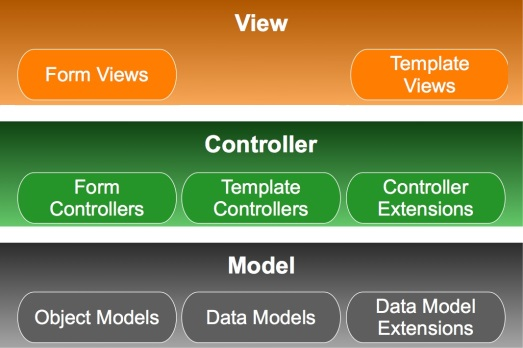
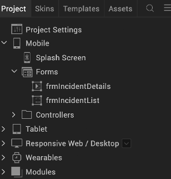
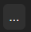
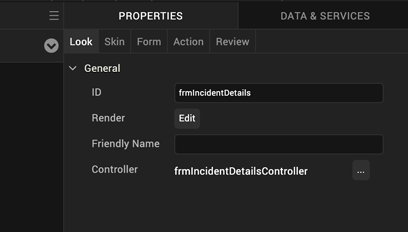
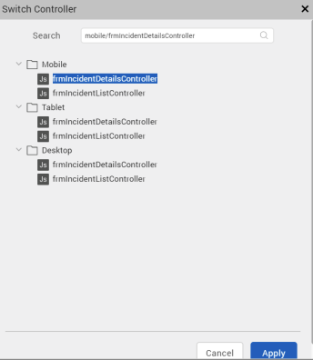
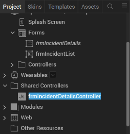

                        

[](http://docs.voltmx.com/9_x_PDFs/iris/voltmx_ref_arch_ap_internali.pdf)


A Deeper Look at Volt MX Reference Architecture
===============================================

This section provides a more detailed examination of how Volt MX Reference Architecture works.

The following diagram shows a detailed presentation of the MVC architecture used by Volt MX Reference Architecture.



In Volt MX Reference Architecture , the actual implementation of the MVC architecture generally uses forms, with their widgets, as the View. The Controller and the Model are JavaScript code modules that implement their respective functionality.

Both the Controller and the Model are JavaScript modules. Volt MX Iris has a default naming scheme for your app's objects and files. So if you create a form in Volt MX Iris and set its name to `frmLogin`, then the Controller for that form is called `formLoginController` and it will be stored in a file called `frmLoginController.js`. Likewise, the file for the Model is named `frmLoginModel.js`. You can change these names in Volt MX Iris if you want to.

The default naming scheme is important to keep in mind when you're using the [References](References.md) section of this SDK's documentation. For instance, the **References** section contains documentation for the following objects.

*   FormControllerObject
*   TemplateController Object

You will not actually find objects with these names in your code. Instead, under the default naming scheme, you will find names such as those used above. That is, if you name your form `frmLogin`, then the [FormController](FormController_Object.md) object for that form is called `frmLoginController`. And if you have a form called `frmMain`, then that form will have a FormController object called `frmMainController` that's stored in a file called `frmMainController.js`. All of your other FormController objects and TemplateController objects will be similarly named.

Note that there are some objects whose name is exactly what you see in the References section. These are as follows:

*   voltmx.Model.Exception Object
*   voltmx.Model.VoltMXApplicationContext Object
*   Navigation Object

Your code accesses these objects by using appropriate names.

Views
-----

Views in an app are provided by forms. Forms can be built using templates or components. Apps under Volt MX Reference Architecture must have at least one form that functions as a View. More typically, apps have several forms, each one containing a variety of widgets for displaying information and for enabling user interaction. You create your app’s forms in Volt MX Iris and add widgets as needed. 

Templates enable you to provide your app with a uniform user interface. For instance, you can create a template for all of the buttons your app displays to make them all have the same colors, fonts, and shapes. If you make changes to the template, the changes propagate to all of the buttons that you have applied the template to. 

Views are never global under Volt MX Reference Architecture . They can only be accessed by their Controllers. In fact, each View is stored in a member variable in the class of its Controller. 

Volt MX Iris stores the forms for your Views in the Forms folder under the respective channels that you’re developing your app for. So, for instance, forms for mobile devices are stored in a Forms folder under the Mobile channel.

Controllers
-----------

Every View requires an associated Controller. Therefore, your app’s code can have form Controllers, component Controllers, and template Controllers in it.  They are all implemented as JavaScript modules. Controllers contain the business logic of an app. They communicate with the data Model objects to retrieve, update, and process the app’s data. Controller can communicate with as many Models as needed. 

When Controllers operate on an app’s data, they also send the data to the View to be displayed in the corresponding form, template, or component. In this way, it updates the user interface whenever there is a change in the displayed data from the Model. 

In addition to form Controllers and template Controllers, Volt MX Reference Architecture also provides Controller extensions. You can write Controller extensions in JavaScript modules to provide specialized or enhanced functionality for components. For example, suppose that you create a component that encapsulates all of the functionality for logging onto your backend database. Imagine that you are creating a new app and you drop the login component into your new app. Now you want to add the ability to log in using Facebook. With a Controller extension, you can add the Facebook login functionality to your login componen without changing the base login componen itself. You just add in some new UI elements and add the new functionality for logging in with Facebook to a Controller extension that you write. That way, none of your new code impacts the standard login component that you’ve created and that you use in all of your apps. Each individual app can enhance the standard login component in any way you need without you having to modify the standard login component itself. 

 (There is no figure in the doc so hat line has to go) 
 (This doesn't exist in 8.4 or 9, it's a Look properties setting, so this has to go) 

Models
------

It's often the case that apps communicate with, retrieve data from, and update multiple data sources. Each data source is represented to the app as a Model. Models encapsulate data sources and make it possible for your app to access them in a standardized way. The data sources that Models encapsulate can be on the user's device or remotely accessible across the Internet.

Models are optional in your apps. Simple apps might not use them. For example, a calculator app would not need Models because the data it operates on is probably nothing more than a few variables containing some numbers.

Most enterprise-level apps use Models to interface to backend data sources. Typically, developers who create their apps with Volt MX Iris will also use VoltMX Foundry to create their server-side apps that provide access to their backend data sources. This is not required, it's just the easiest way to build your app. If you decide to use Volt MX Foundry for your backend app, you can get it to generate your Models for you. More specifically, you create your backend app by building object services with Volt MX Foundry . Utilizing the Volt MX Foundry console, you can then generate Models, called object Models, that provide your front-end Volt MX Iris app with access to your backend app's object services. After you generate your object Models for all of your backend data sources, Volt MX Iris downloads them into your front-end Volt MX Reference Architecture project that you are building in Volt MX Iris on your local development PC . The object Models provide your front-end app with code that enables the app to retrieve data from the backend object services, update, create, or delete the data, and save the changes to the backend object services.

One of the many advantages of using Models to represent your data sources is that designers and developers working on the front-end app don't have to wait until the backend Volt MX Foundry app is complete before they start their work. Developers on the front-end app can build objects that provide _mock services_ to the app. That is, developers can create Models to use in the front-end app that simulate the interaction that the front-end Volt MX Reference Architecture app will have with the backend Volt MX Foundry app when the backend app is complete. Using these mock services, both the front-end app and the backend app can be under development at the same time.

Volt MX  Reference Architecture also provides you with object Model extensions that you can put custom code into to enable your app to do data validation or process the data before it is displayed or saved. Volt MX Iris generates the object Model extension for you and includes them in your Volt MX Iris project.

Models are stored as a shared resource in your Volt MX Iris project.

Views and Controllers
---------------------

Forms under VoltMXReference Architecture work very similarly to the way they work in a [free form JavaScript app built with Volt MX Iris](../../../Iris/iris_user_guide/Content/Adding_Forms_to_a_New_Application.md). For example, whether you're building a VoltMXReference Architecture app or a free form JavaScript app, you can drag and drop forms, widgets, and so forth onto any form using the WYSIWYG editor in Volt MX Iris. You can use forms across multiple channels. That is, you can use the same form for Android phones, iOS phones, and so on, Or, if you prefer, you can use specific forms for specific channels.

The main difference between forms in Volt MX Reference Architecture and forms in a free form JavaScript application is that forms in Volt MX Reference Architecture have Controllers associated with them. Volt MX Iris automatically generates form Controllers for each form you add to your UI. When you [add actions](../../../Iris/iris_user_guide/Content/working_with_Action_Editor.md) to forms in Volt MX Reference Architecture , Volt MX Iris automatically generates action Controllers for them.

Views are only available from within the form's Controller. So only the form's Controller can update the form's data. Your app uses the [voltmx.mvc.Navigation](voltmx.mvc_Functions.md#Navigation) function to create a [Navigation object](Navigation_Object.md). It can then call the `Navigation` object's [navigate](Navigation_Object_Methods.md#navigate) function to move from form to form. Because access to a form only happens through the form's Controller, your app cannot call a form's [show](../../../Iris/iris_widget_prog_guide/Content/FlexForm_Methods.md#show) or [destroy](../../../Iris/iris_widget_prog_guide/Content/FlexForm_Methods.md#destroy) methods. Only a form's Controller can display the form on the screen. And if your app needs to destroy a form it calls [voltmx.application.destroyForm](../../../Iris/iris_api_dev_guide/content/voltmx.application_functions.md), which destroys the form, its Controller, all widgets it contains, and its children.

#### Add Actions

Volt MX  Iris enables you to add actions to your app's widgets. In fact, this is the way to add actions to your app's form Controllers. When you add actions to a widget, the `this` keyword inside the widget's callbacks refers to the form Controller. To add a function in a Controller as the event callback handler for a widget's event, your app uses code similar to the following.

btntest.onClick = Controller.AS\_Button\_OnClickEvent;

In the code snippet shown here, `btntest` is the name of a `Button` widget. This snippet sets the `Button` widget.'s `onClick` event. The event callback handler is the `AS_Button_OnClickEvent` function, which is a member of the `Controller` object. The `Controller` object is an object that Volt MX Iris generates for your form. The `AS_Button_OnClickEvent` function is written by you.

The following code sample demonstrates how an application might add an event callback handler to a button.

```
define('frmLogin', function() {
 return function(Controller) {
  function addWidgetsfrmLogin() {
   this.setDefaultUnit(voltmx.flex.DP);
   var btnSetIPAddress = new voltmx.ui.Button({
    "height": "55dp",
    "id": "btnSetIPAddress",
    "onClick": Controller.AS_Button_6c7c9d022bcc4a61a603aa3c89110efe,
    "skin": "buttonOnfrmLoginSkin",
    "text": "Set IPAddress",
    "width": "25%",
    "zIndex": 1
   }, {
    "contentAlignment": constants.CONTENT_ALIGN_CENTER,
    "displayText": true,
    "padding": [0, 0, 0, 0],
    "paddingInPixel": false
   }, {});
   this.add(btnSetIPAddress);
  };
  return [{
    "addWidgets": addWidgetsfrmLogin,
    "id": "frmLogin",
    "layoutType": voltmx.flex.FLOW_VERTICAL
   },
   {
    "displayOrientation": constants.FORM_DISPLAY_ORIENTATION_PORTRAIT,
   },
   {
    "retainScrollPosition": false,
    "titleBar": false
   }
  ]
 };
});
```

The example above adds a `Button` widget called `btnSetIPAddress` to a form called `frmLogin`, which is a form that is used to display a login screen. For the onClick event, the example sets a function called `AS_Button_6c7c9d022bcc4a61a603aa3c89110efe` as the event callback handler.

#### Share Controllers Between Forms

Typically, each form has its own Form Controller. However, you can assign a Controller to multiple forms if you choose to do so. If the forms that share the Controller are specific to a particular channel, such as iOS, Volt MX Iris automatically stores the shared Form Controller in a folder under that specific channel.

It is also possible for forms that are used across channels to share a single Form Controller. Let us suppose that your app has a set of three forms that are used on both the iPhone and Android phones. Furthermore, consider that all three of those forms share the same Controller. In such a scenario, the shared Form Controller can be found in a folder outside of the iOS and Android channels that is specifically for shared Controllers.

> **_Note:_** It is not possible to share the **ControllerActions** JavaScript file between multiple forms.

While developing your app, you can specialize existing forms for particular channels. This process is called _forking_ the form because Volt MX Iris actually creates a new version of the form for the specific channel. If you fork the form, it automatically forks its Controller. Forked forms cannot be shared.

**To share a Controller between forms, follow these steps**:

1.  In your [VoltMXReference Architecture project](../../../Iris/iris_user_guide/Content/CreateKRAProject.md), click the form with which you want to share a Controller. Here, **frmIncidentDetails** is the selected form in the Responsive Web channel.  
      
    
2.  Go to the **Properties** panel > **Look** tab.
3.  For the **Controller** field and beside the Form Controller name, click the Ellipsis Menu icon . Here, **frmIncidentDetailsController** is the Form Controller of the **frmIncidentDetails** form. The **Switch Controller** window appears, with the list of available Controllers in different channels and **frmIncidentDetailsController** in the Desktop (Responsive Web) channel selected by default.  
      
    
4.  Click the Controller that you want to share with the form. Here, we have selected **frmIncidentDetailsController** of the **frmIncidentDetails** Mobile form.  
      
    
5.  Click **Apply**. The **frmIncidentDetailsController** of the **frmIncidentDetails** Mobile form is shared with the **frmIncidentDetails** Responsive Web form. A new folder called **Shared Controllers** is also created in the Project Explorer, with **frmIncidentDetailsController** placed under it. When you write any code in the **frmIncidentDetailsController** JavaScript file, the code is shared with all the forms that this Controller is shared with.  
      
      
      
    

Models and Controllers
----------------------

Models encapsulate data storage locations and provide a standardized interface for creating data on those data storage locations, reading it into the app, updating it, and deleting it. The data storage locations can be on the user's device or remotely connected across a local network or the Internet. Wherever the data resides, the app uses Models as a standard way of accessing it.

In VoltMXReference Architecture , Controllers contain the app's business logic. Therefore, an app's Controllers use Models to perform operations on data storage locations, which are often referred to as _data sources_.
