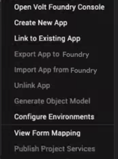
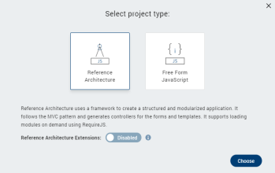
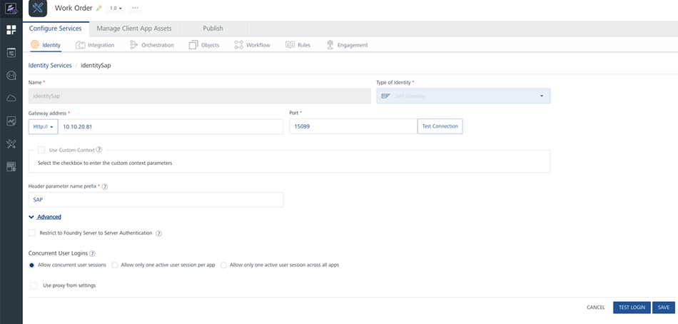
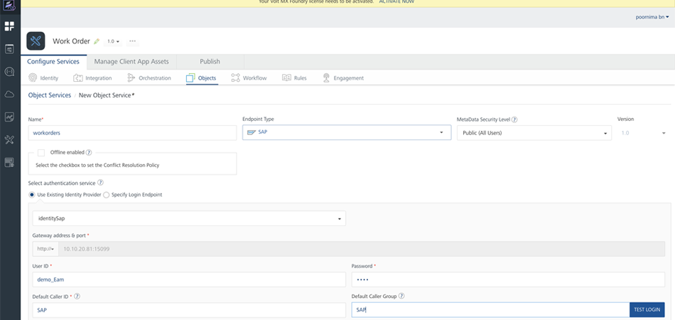
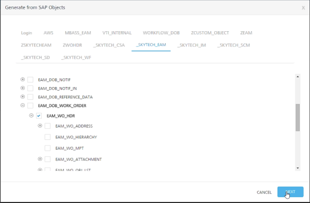

                        

[](http://docs.voltmx.com/9_x_PDFs/iris/voltmx_ref_arch_ap_internali.pdf)


Create an App with Volt MX Reference Architecture
=================================================

When you create an app with Volt MX Reference Architecture, you can start by building the app's data model in Volt MX Foundry Console. You can add various back-end services and operations that your front-end client app requires. You can then build your front-end client app with Volt MX Iris. Volt MX Iris provides you with a way to interface your front-end client app with your back-end Volt MX Foundry app, as described on Volt MX Iris [User Guide](../../../Iris/iris_user_guide/Content/Introduction.md) and in [VoltMX Foundry User Guide](../../../Foundry/voltmx_foundry_user_guide/Content/Introduction.md).

Build Your Front-End Client App
-------------------------------

After you have created your Object services by using Volt MX Foundry, you can build your front-end client app with Volt MX Iris.

You can connect your front-end client app to your back-end Volt MX Foundry app and the services it offers, and then generate the object model. To do so, on the **Data & Services** panel, click the hamburger menu near the **Refresh** button, and then click either **Create New App** or **Link to Existing App**.



You can select the channels for which you want to build your app, such as Desktop, Mobile, Android Wear, or Tablet. You can then design the user interface of your app by using various widgets available on Volt MX Iris.

For more information on channels, widgets, and API functions that are available on Volt MX Iris, refer [VoltMX Iris User Guide](../../../Iris/iris_user_guide/Content/Introduction.md), [VoltMX Iris Widget Programmer's Guide](../../../Iris/iris_widget_prog_guide/Content/Overview.md), and [VoltMX Iris API Programmer's Guide](../../../Iris/iris_api_dev_guide/content/introduction.md).

### Create a Volt MX Reference Architecture Project With Extensions

You must follow these steps to create a Volt MX Reference Architecture project with extensions on Volt MX Iris:

1.  On Volt MX Iris, click **File**, and then click **New Project**. Volt MX Iris displays the **What do you want to start with now?** dialog box with the types of apps that you can create.
2.  Select the type of app that you want to create. You can select either **Web App** or **Native App**, and click **Next**. Volt MX Iris again displays the **New Project** dialog box with the available project types. For more information about how to create a project in Volt MX Iris, click [here](../../../Iris/iris_user_guide/Content/CreateKRAProject.md).
3.  If you want Volt MX Iris to automatically create **Reference Architecture Extensions** in your project, from the **Project Name** window, select **Advanced Project Settings**. The **Select Project Type** dialog box appears.  
    
    > **_Important:_** The Reference Architecture Extensions are used in packaged applications to customize and extend the standard MVC architecture by adding extra layers. The Reference Architecture Extensions feature is not available for the Apple Watch channel.
    
      
    
4.  From the **Select Project Type** window, enable the option for **Reference Architecture Extensions** . You can hover over the info icon for more information about the reference architecture extensions.  
      
    
5.  Click **Choose**.
6.  Type the name of your project in the **Project Name** field. You must follow these guidelines while specifying the name of your project:
    *   The name must always start with an alphabet.
    *   The name should contain only alphabets and digits.
    *   Special characters and reserved words are not allowed.
    *   The name must contain more than three characters.
7.  Click **Create**. Volt MX Iris creates the project with the **Reference Architecture Extensions** node in the **Project Explorer**.

If you had not enabled the **Reference Architecture Extensions**option while creating your project, the **Reference Architecture Extensions** node will not be available in Project Explorer.

> **_Note:_** Prior to V9 SP2 version of Volt MX Iris, Reference Architecture Extensions option can be added to your project by setting the **enableMVCExtensions** flag to **true**. This flag must be provided in the following file at the installation folder of Volt MX Iris:

*   For Volt MX Iris: <installation folder>/install\_config.json  
    

### Application Group in Reference Architecture Extensions

Application groups are a collection of similar application elements and forms. You can create two types of Application groups under Reference Architecture Extensions. You can learn more about app groups [here](../../../Iris/iris_user_guide/Content/OrganizingAppElementsInGroups.md).

*   [UI Module](#ui-module)
*   [Manager](#manager)

> **_Note:_** If your application was created before Volt MX Iris V9 SP 2 version, after importing it to the latest version, you can view the controllers and build your application. The App Groups or controllers that were created in the previous versions does not support the options for Create/ Rename/ Delete in the context menu. When a new app group or controller is created, the latest method of App group creation is followed.

#### UI Module

A UI Module app group contains logic for the presentation layer of the Reference Architecture extension. It consists of two folders.

*   [Presentation Controller](#presentation-controller)
*   [Config](#config)

##### Presentation Controller

The **Presentation Controller** contains the view logic required to display content and the logic for the reaction to various user inputs or events. Presentation Controllers can also request for new data from Business controllers.

Presentation Controller consists of a **PresentationController.js** file in your Volt MX Reference Architecture project. You cannot rename or delete the **PresentationController.js** file.

You can open the **PresentationController.js** file to either view the default code or manually write new code. The **PresentationController.js** file contains the following generic code by default.

```
define([], function() {
    /**
     * User defined presentation controller
     * @constructor
     * @extends voltmx.mvc.Presentation.BasePresenter
     */
    function PresentationController() {
        voltmx.mvc.Presentation.BasePresenter.call(this);
    }

    inheritsFrom(PresentationController, voltmx.mvc.Presentation.BasePresenter);

    /**
     * Overridden Method of voltmx.mvc.Presentation.BasePresenter
     * This method gets called when presentation controller gets initialized
     * @method
     */
    PresentationController.prototype.initializePresentationController = function() {
        
    };

    return PresentationController;
});
```

##### Config

The **Config** folder by default has the `ModuleConfig.json` file. The main use of this file is to help you add any controller extensions to your application. When you have to add or customize the presentation controller of an application, you must set the path of the controller extensions using the `ControllerExtensions` key in the `ModuleConfig.json` file.

The `ModuleConfig.json` file contains the following generic code by default.

```
{
  "PresentationControllerConfig": {
    "Default": {
      "PresentationExtensions": [],
      "PresentationControllerClass": "AppGroup/PresentationControllers/PresentationController"
    }
  },
  "Forms": {},
  "ModuleType": "UIModule",
  "ModuleName": "AppGroup"
}
```

> **_Note:_** You must not modify the `ModuleType` key in the `ModuleConfig.json` file. For a UI Module App Group, the value of this key must be `"UIModule"`.

##### How to create a UI Module App Group

You can add an application group in the **Reference Architecture Extensions** node by following these steps:

1.  Open the application in Volt MX Iris.
2.  From the **Project** explorer, right-click on **Reference Architecture Extensions**. A context menu appears.
3.  Select **New**. A new context menu appears.  
      
    
4.  Select **UI Module**. A new folder, called AppGroup is added under the **Reference Architecture Extensions** node. The AppGroup, contains the **PresentationControllers** and **Config** folders.  
    

##### Creating a Channel-specific Presentation Controller

You can create a channel-specific (Mobile, Tablet, Desktop, and Android Wear) Presentation Controller. This feature is not available for the Apple Watch channel. You can add only one Presentation Controller for any specific channel.

To do so, follow these steps:

1.  Right-click the **PresentationControllers** node. A context menu appears.
2.  Hover the cursor of your mouse on **New Controller**. Volt MX Iris displays the list of available channels.
3.  Select the required channel. If you select the **Mobile** option, Volt MX Iris creates a **PresentationController\_Mobile.js** file under the **PresentationControllers** node. You can either open the **PresentationController\_Mobile.js** file and view the default code/manually write new code or delete the Presentation Controller file. You cannot, rename the Presentation Controller file.

##### Create an Extension for a Presentation Controller

You can create an extension for the **PresentationController.js** file or any of the channel-specific Presentation Controllers, if created.

To do so, follow these steps:

1.  Right-click the **PresentationControllers** node. A context menu appears.
2.  Hover the cursor of your mouse on **Create New Extension**. Volt MX Iris displays the list of available Presentation Controllers.
3.  Select the required Presentation Controller, whether the **PresentationController.js** file or any of the channel-specific Presentation Controllers that you created. Volt MX Iris creates an **Extension.js** file under the **PresentationControllers** node. You can create multiple Extensions for multiple Presentation Controllers.
4.  You can either open the **Extension.js** file and view the default code/manually write new code, rename, or delete the file.

#### Manager

Manager App group consists of the Business Controller layer. The business controller later contains the business logic of the application. Business Controller uses the delegate pattern to execute the logic provided in the controller.

Business Controller consists of a `BusinessController.js` file in your Volt MX Reference Architecture project. You cannot rename or delete the `BusinessController.js` file.

You can open the `BusinessController.js` file to either view the default code or manually write new code. The `BusinessController.js` file contains the following generic code by default.

```
define([], function() {
  /**
    * User defined business controller
    * @constructor
    * @extends voltmx.mvc.Business.Delegator
    */
  function BusinessController() {
    voltmx.mvc.Business.Delegator.call(this);
  }
  inheritsFrom(BusinessController, voltmx.mvc.Business.Delegator);
  return BusinessController;

});
```

##### How to create a Manager App Group

You can add an application group in the **Reference Architecture Extensions** node by following these steps:

1.  Open the application in Volt MX Iris.
2.  From the **Project** explorer, right-click on **Reference Architecture Extensions**. A context menu appears.
3.  Select **New**. A new context menu appears.  
      
    
4.  Select **Manager**. A new folder, called **AppGroup** is added under the **Reference Architecture Extensions** node. This AppGroup, contains the **BusinessControllers** folder.  
    

##### Create an Extension for a Business Controller

You can create an extension for the `BusinessController.js` file.

To do so, follow these steps:

1.  Right-click the **BusinessControllers** node. A context menu appears.
2.  Select **Create New Extension**. Volt MX Iris creates an **Extension.js** file under the **BusinessControllers** node.
3.  You can either open the **Extension.js** file and view the default code/manually write new code, rename, or delete the file.

### Locking Feature in Reference Architecture Extensions

You can "lock" module files and Reference Architecture Extensions files in MVC 2.0 projects, i.e., make the files as read-only. This is to ensure that certain files are non-editable for customers, while internal users can make changes to them. For all other projects such as non-MVC and MVC projects, this feature is not supported.

You can specify the read-only files from the **projectProperties.json** file. In the projectProperties.json file, assign the **readOnly** key to all the files that you want to make as read-only.

*   The structure for the readOnly key in the projectProperties.json file is as follows:  
    **"readOnly": \[ \]**
*   You must add the file paths in the readOnly key according to their respective file types, as shown here:  
    **"readOnly": \[ "mvcextensions/AppGroup/BusinessControllers/BusinessController.js",**  
    **"mvcextensions/AppGroup/BusinessControllers/command\_CommandHandler.js",**  
    **"modules/Module.js", "modules/require/Module.js",**  
    **"modules/Watch/Module.swift" \]**

#### Remarks

1.  Rename and delete operations for the read-only files are not supported.
2.  If you rename or delete the main AppGroup in which read-only files exist, the file information within the **readOnly** key is not updated.
3.  If any file is open on the Iris Canvas when you add the file path to the readOnly key in the projectProperties.json file, you must refresh the project and re-open the file again to make it read-only.
4.  You cannot make the ModuleConfig.json file as read-only.

### Build the App's User Interface

Your client app’s user interface displays one or more screens, also called views. Views can be forms or templates. Every view must have at least one of these. More typically, a view requires multiple forms or templates. The process of creating views is described in the [VoltMX Iris User Guide](../../../Iris/iris_user_guide/Content/Adding_Forms_to_a_New_Application.md).

After creating at least one screen for your app using forms, you can add widgets to the forms. Widgets provide your app with the user interface elements that it needs. These include buttons, menus, text labels, calendars, and more. They also give your app access to the functionality of the user's device through the use of a camera widget, a phone, widget, and so forth. The process of populating your app's forms with widgets is presented in the [VoltMX Iris User Guide](../../../Iris/iris_user_guide/Content/PopulatingWidgets.md).

### Add Functionality to Your App

Each time you add forms to your app, Volt MX Iris automatically adds a controller for each form and creates a folder in your project to put it in. You'll find the controllers for your forms in the project tree under the channel that you're developing the app for. So if you add a form called frmMain to your project and you're developing the app for Android and iOS, you'll find folders for the frmMainController in the Android and iOS branches of the project tree. Whenever you change the names of your forms and templates, Volt MX Iris automatically renames the controllers associated with them.

Likewise, when you add templates to your apps, Volt MX Iris adds the corresponding controller for each template. Renaming your template automatically renames its controller.

To add functionality to your app, you add your custom JavaScript code to the controllers in your app. The controller for a form or template is the only object that has access to the form or template. Only the controller can performs actions on it.

Your app may also contain models, one for each backend data source. The data sources can be local on the device or remote servers that are accessed across the network. If you need to, you can add custom code to your app's models to enhance or customize the model's functionality.

In addition, you can add actions to your forms just as you would with any other Volt MX Iris app. When you do, Volt MX Iris automatically creates an action controller for your actions. However, this is an autogenerated file and you should not make any changes to it. If you do, they will be overwritten the next time the file is regenerated.

Build Your App's Data Model
---------------------------

The steps required to build the data model of your app are as follows:

*   [Build a VoltMX Foundry app](#build-a-app)
*   [Configure Identity Services](#configure-identity-services)
*   [Create an Object Service](#create-an-object-service)
*   [Configure the Data Model](#configure-the-data-model)

### Build a VoltMX Foundry App

To integrate your front-end client app with the back-end services that you want the app to access through Volt MX Foundry, you must first create a Volt MX Foundry app by using Volt MX Foundry Console. For more details on how to do so, refer [VoltMX Foundry documentation](../../../Foundry/voltmx_foundry_user_guide/Content/Introduction.md).

In this walkthrough, we will create a simple service that integrates with SAP data in the back end. Although your data may reside in a different backend storage system, the basic workflow for building your app's data model will be very similar to what's shown here. In this walkthrough, we will assume that you have already created your Volt MX Foundry app.

For our example, the Volt MX Foundry app is called Work Order. The Work Order Volt MX Foundry app gets its data from SAP. In the Volt MX Foundry console, the results will resemble the following illustration.


### Configure Identity Services

1.  Select the app you just created. In this example, it's the Work Order app.
2.  Click the **Configure Services** tab.
3.  Choose **Identity Services**.
4.  Click the **Configure New** button.
5.  Set the identity's name.
6.  Select the **Type of Identity**. In this example, it will be Volt MX SAP Gateway.
7.  Set the address and port of the gateway server.
8.  Supply the remaining information such as the login credentials and so forth. You screen will resemble the following.  
    

### Create an Object Service

Next, you create an object service that will provide your front-end client app with access to the data in the data store. In this example, the client app on the device or desktop will access the work order data in the SAP database.

1.  In the **Configure Services** tab in the Volt MX Foundry console, click **Objects**.
2.  Select the **Configure New** button.
3.  Set the name and endpoint type. In this example, the endpoint type is SAP.
4.  Select **Existing Identity Provider** and enter the name of the identity service you create in Step 2. This example uses the name identitysap.
5.  Fill in the other information such as User ID, Password, and so forth.  
    
6.  Click the **Save & Configure** button.

### Configure the Data Model

At this point, you need to configure the data model your service will use.

1.  Continuing from #6 in Step 3, click the **Generate** button.
2.  In dialog box that appears, select the object service you want to use. The Volt MX Foundry console then displays a list of objects offered by the selected object service.
3.  Choose the object or objects that you want your client app to have access to. In this example, we will select only one object, as shown in the following figure.  
    
4.  Click **Next**.
5.  In the dialog box that appears, click **Generate**. Your data model is now generated automatically by the system.
6.  Click the **Publish** button to publish your Volt MX Foundry data service app.

Generate Controllers and Extensions
-----------------------------------

Collectively, the views, controllers, models, and model extensions are known as Reference Architecture artifacts. The Volt MX Foundry channel is not available on Volt MX Iris.

You can generate Reference Architecture models and model extensions by following these steps:

1.  Right-click the Volt MX Foundry node in the **Project** pane of Volt MX Iris Classic. A context menu appears.
2.  Click either the **Use Existing App** or the **Create New App**option. Volt MX Iris displays a **Sign In** dialog box requesting you to log on to Volt MX Foundry.
3.  Sign in to Volt MX Foundry by entering your login credentials. After you successfully sign in, Volt MX Foundry displays the list of created apps .
4.  Click **Associate** for the required app. Volt MX Foundry displays the details of the app.
5.  Click **Workspace** at the upper left corner of the screen. You are navigated back to Volt MX Iris.
6.  Right-click the Volt MX Foundry node and from the context menu that appears, click **Generate Object Model**. Volt MX Iris generates the object model and creates the **Models** node in the **Project** pane.
7.  a. For new projects, Volt MX Iris displays the generated object models for all project types (non-MVC, MVC, and MVC 2.0) under the **Models** node. To enable this hierarchical folder-structure, you must navigate to Project Properties of your app, create a new flag named **enableMVCExtensions**, and set the flag as **true**. All files are read-only and the structure of the **Model** folder is as follows:  
    Models  
    \>>>><Service-name>  
    \>>>>>>>>>>>>>>><Object-name>  
    \>>>>>>>>>>>>>>>>>>>>>>>>><Model.js  
    \>>>>>>>>>>>>>>>>>>>>>>>>><MF\_Config>  
    \>>>>>>>>>>>>>>>>>>>>>>>>><Repository.js>  
      
    b. For existing projects, where models already exist under the previous folder structure (**Modules** for non-MVC and **Models** for MVC), Volt MX Iris follows the older format and flat folder-structure even if you re-generate the models.

A Sample FormController
-----------------------

The following sample code shows the partial implementation of a `FormController` object. Note that the implementation is in RequireJS format, which is mandatory for Volt MX Reference Architecture applications.

```
define(
{
    onIPRecievedFromIPControl: function (masterController1, newtext) 
    {
        if (null != newtext) 
        {
            alert(newtext);
        }
    },

    AS_Button_6c7c9d022bcc4a61a603aa3c89110efe: function (eventobject) 
    {
        this.view.defaultAnimationEnabled = false;
        this.view.master1.onIPAddressSet = this.onIPRecievedFromIPControl;
        this.view.master1.IPAddress = "212.212.100.110";
    }
});		
```

> **_Note:_** In an MVC project, a top-level FlexContainer is added by default when you create a new template.
