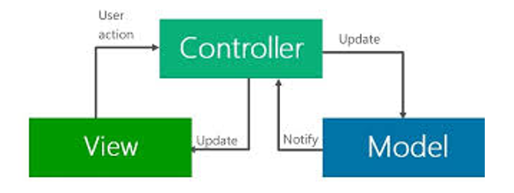

                         

You are here: Reference Architecture SDK API Programmers' Guide - Overviews

Overviews
=========

Earlier, Volt MX apps were developed only with the [Freeform JavaScript technique](../../../Iris/iris_user_guide/Content/CreateNewProject.md). JavaScript is a powerful language that provides developers with a lot of flexibility. It is an extremely accessible language that allows developers to start a project easily. However, all of these JavaScript features can create problems as a project grows in size and complexity. From Volt MX Iris 7.3 onwards, an MVC-based Reference Architecture has been integrated directly in to Volt MX Iris, which helps to improve the organization and consistency of the application code.

While developing applications by using the traditional Free form JavaScript approach, developers had to heavily customize applications. This customization helped to overcome issues such as the usage of a large number of forms in the application code, the presence of global functions, and a lack of separation between the business logic and UI components. The Volt MX Reference Architecture mechanism takes these customized approaches to the next level by providing a standard in-built architecture to create apps.

Volt MX  Reference Architecture allows you to create a separate Presentation layer. This Presentation layer enables a clear distinction between back-end objects, which model the perception of the real world, and presentation objects, which are the UI elements that appear on the screen. Furthermore, this separation helps you to avoid muddled dependencies and to keep a clear separation among app components.

While you develop apps by using Volt MX Iris and Volt MX Foundry, it is not mandatory to use Volt MX Reference Architecture. You can [create apps by using Freeform JavaScript](../../../Iris/iris_user_guide/Content/CreateNewProject.md). You can, however, also use [VoltMX Reference Architecture](../../../Iris/iris_user_guide/Content/CreateKRAProject.md) to develop apps, thereby [leveraging the numerous advantages that this framework provides](Advantages_of_Using_VoltMX_Reference_Architecture.md).

The following topics explain the overviews of Volt MX Reference Architecture:

*   [VoltMX Reference Architecture: Decoded](VoltMX_Reference_Architecture_Decoded.md)
*   [Advantages of Using Volt MX Reference Architecture](Advantages_of_Using_VoltMX_Reference_Architecture.md)
*   [A Deeper Look at Volt MX Reference Architecture](A_Deeper_Look_at_VoltMX_Reference_Architecture.md)
*   [Create an App with Volt MX Reference Architecture](Create_an_App_with_VoltMX_Reference_Architecture.md)
