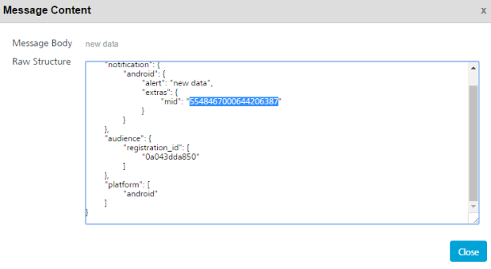

                            

Get Rich Content
================

The **Get Rich Content** API fetches rich content from the Volt MX Foundry Engagement server.

Use Case
--------

A user may need to retrive the rich push content of a push message to display the same in a custom built application. The Get Rich Content API requires pushId to retrieve the data.

You need to select the push ID from Settings > Status > Message Queue list view. Click the required message under the Message column to view the push ID. Here push ID is referred as mid.

**URL**
-------

The HTTP URL for **Get Rich Content** API is:

http://<host>:<port>/api/v1/messages/rich/<pushId>


Method
------

GET

Sample Response
---------------

.html>  
    <head>  
       <title></title>
    </head>
       <body>
         
<strong>eBay Rainy Season Sale 2016</strong>

         
&nbsp;
  
       </body>
<.html>


Response Status
---------------

  
| Code | Description |
| --- | --- |
| Status 200 | Rich content |
| Status 400 | Invalid push ID / providedPush did not associate with rich contentRich message is not associated with this push |
| Status 500 | Server failure to process request |

<table class="TableStyle-RevisionTable" cellspacing="0" style="margin-left: 0;margin-right: auto;mc-table-style: url('../Resources/TableStyles/RevisionTable.css');" data-mc-conditions="Default.HTML"><colgroup><col class="TableStyle-RevisionTable-Column-Column1"> <col class="TableStyle-RevisionTable-Column-Column1"> <col class="TableStyle-RevisionTable-Column-Column1"></colgroup><tbody><tr class="TableStyle-RevisionTable-Body-Body1"><td class="TableStyle-RevisionTable-BodyE-Column1-Body1">Rev</td><td class="TableStyle-RevisionTable-BodyE-Column1-Body1">Author</td><td class="TableStyle-RevisionTable-BodyD-Column1-Body1">Edits</td></tr><tr class="TableStyle-RevisionTable-Body-Body1"><td class="TableStyle-RevisionTable-BodyB-Column1-Body1">7.1</td><td class="TableStyle-RevisionTable-BodyB-Column1-Body1">AU</td><td class="TableStyle-RevisionTable-BodyA-Column1-Body1">AU</td></tr></tbody></table>
