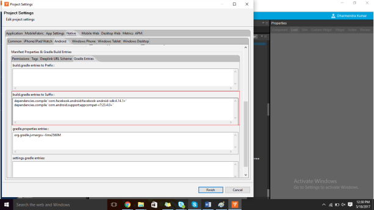

                          

Iris Support for Providing Gradle Entries
-----------------------------------------------

To add Gradle entries from the project settings of Volt MX Iris by navigating to Project Settings, do the following:

1.  Go to Iris, and click **Project Settings**.
2.  In the **Project Settings** dialog box, click Native -> Android.
3.  In the **Manifest Properties** section, click **Gradle Entries**.
    
    
    
4.  Add the required entries in the Prefix and Suffix text boxes.
5.  Click **Finish** to save the settings and close the dialog box.
