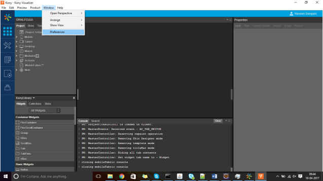
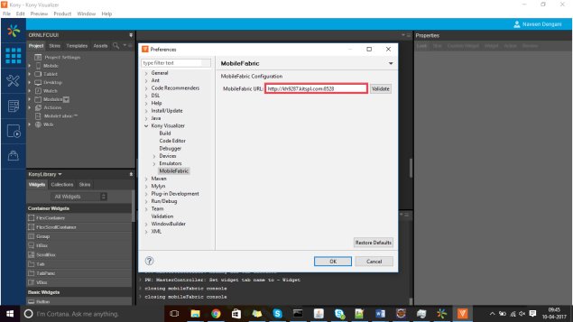
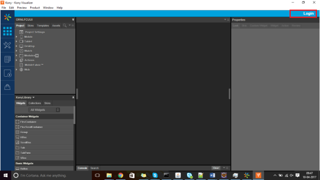
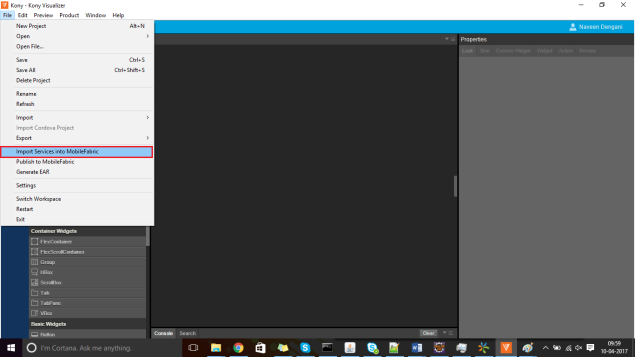
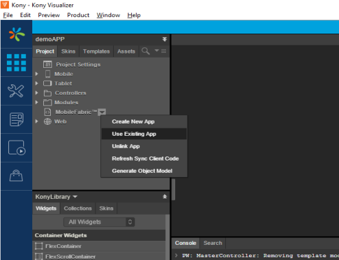
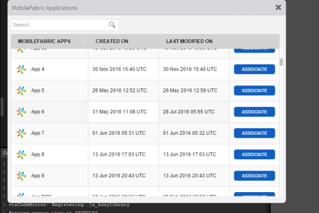
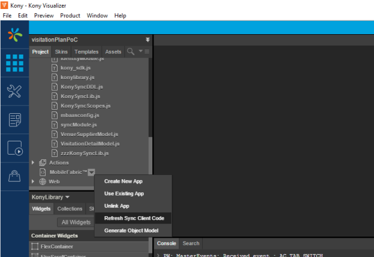

                          

Creating a Volt MX Foundry Application from Iris
--------------------------------------------------

1.  You must install Volt MX Foundry installed. You can use a Cloud trial for that by going to - [http://www.voltmx.com/products/VoltMXFoundry/trial](http://www.voltmx.com/products/mobilefoundry/trial)
    
    or
    
    You can use the easy-to-use Volt MX Foundry installer that is available at [http://community.hclvoltmx.com/downloads](http://community.hclvoltmx.com/downloads)
    

2.  Copy the following files into`<Iris 7.x workspace home>/<project name>`
    *   servicedef.xml: Servicedef.xml includes all services in the app.
    *   syncconfig.xml: The syncconfig.xml file contains sync definition (in case Sync is used).

3.  Create the following folders in`<Iris 7.x workspace home>/<project name>` and place the following file in the appropriate locations:
    *   dsl - The dsl folder contains one .properties file and .dsl files. The dsl folder is only for scraper services.  
        The name of the properties file should match the app name.
    *   files - The files folder contains .properties for SAP JCo/Siebel.
    *   lib - The lib folder contains the dependent jars required by an app
    *   wsdl - The wsdl folder contains the following additional files for SOAP services.
    *   mapping.json \- contains mapping file for wsdl source to operation names using that wsdl source (URL/file).
    *   // The following is a sample entry in the mapping file in JSON format.{
        "partner.wsdl": [
        "convertLead",   
        "create"    ],
        "http://wsf.cdyne.com/WeatherWS/Weather.asmx?wsdl": [
        "GetCityForecastByZIP",
        "GetCityWeatherByZIPtest"
         ]
        }  
        
        
    *   wsdl: contains wsdl files in the mapping entries mentioned earlier. The mapping entries refer to json entries present in the mapping.json file.

4.  Navigate to **Window -> Preferences -> Volt MX Iris -> Volt MX Foundry**.
    
    
    

5.  Provide the Volt MX Foundry Instance URL and validate it.
    
    
    

6.  Log on into Volt MX Foundry from Iris by clicking Login at the upper right corner.
    
    
    

7.  Import the services to Volt MX Foundry by selecting **File->Import Services into Volt MX Foundry**.
    
      This step creates the Volt MX Foundry application in the Volt MX Foundry workspace.
    
    
    
    > **_Important:_** A Volt MX Foundry application consists of services, and each service contains one or more operations. But in case of pre-7.x, an app contains only service names. So, in case of an Volt MX Foundry app that is created from pre-7.x (by following the earler steps), all the service names would become operation names. The service names are auto-generated. If you would like to know the old service name and how it is mapped to the new service name/operation name, you can refer the `<project name>_MWMappings.properties` file.
    
    The **Import services into Volt MX Foundry** step modifies the JS modules to use the new service names.
    
    Also, in case you are invoking any services from pre/post processors or Java services, you must pass the new Service ID wherever you are passing an app ID.
    

8.  Ensure that your application is linked to the newly created Volt MX Foundry app.
    
    
    
    
    
    You would see the **UNASSOCIATE** button against the Volt MX Foundry app that is linked to your application.
    
    If the application is using Sync, perform **Refresh Sync Client Code**, as follows:
    
    
