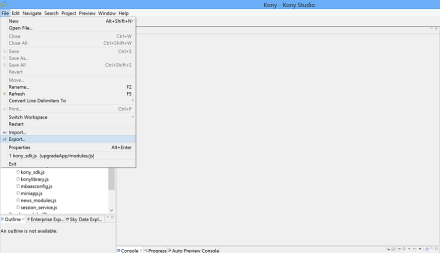
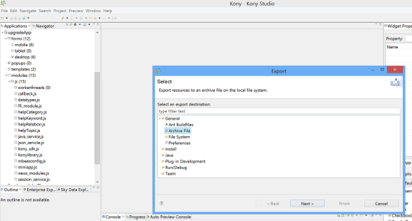
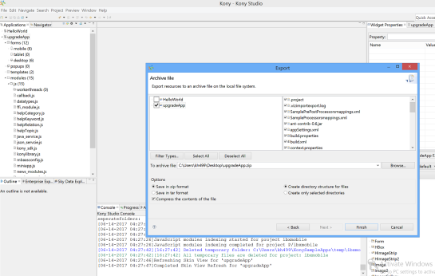

                          

Exporting the Application from Volt MX Studio 6.5.x version
--------------------------------------------------------

To export an application from Volt MX Studio, do the following:

1.  In Volt MX Studio 6.5, where your 6.5 project is available, go to **File -> Export.**
    
    
    

1.  Select **Archive File**.
    
    
    

1.  Enter the archive file name and click **Finish.**
    
    
