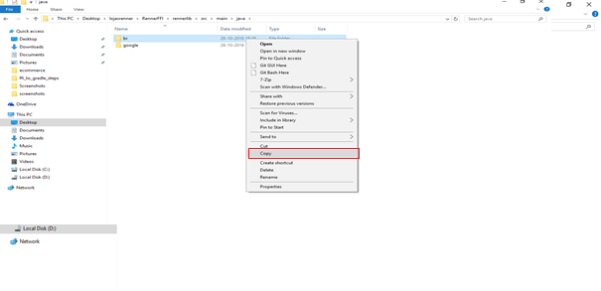
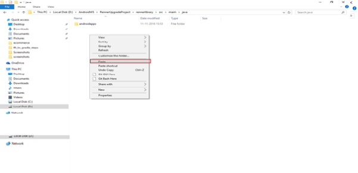
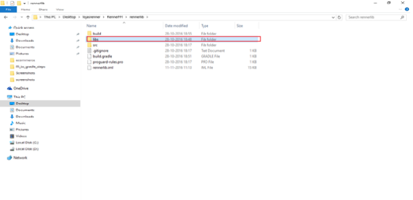
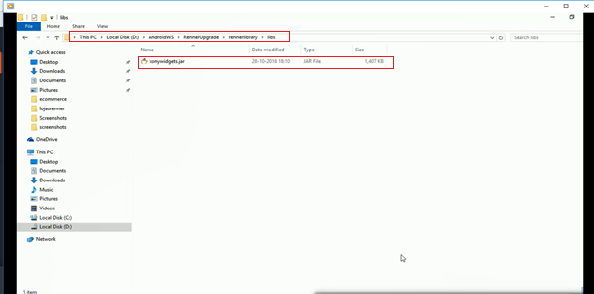
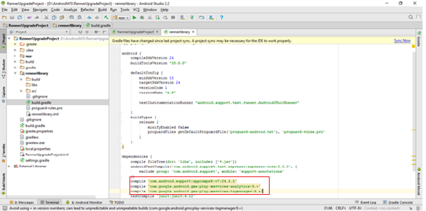
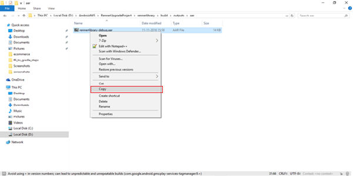
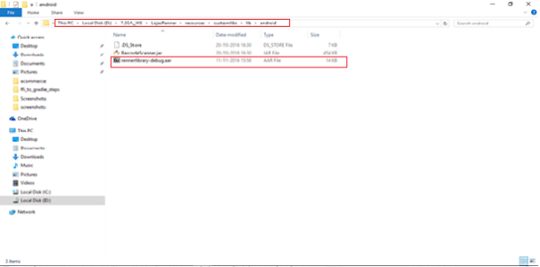

                          

Steps to create an .aar file
----------------------------

Prerequisites: Ensure that the gradle path in the environmental variables is supported by Android Studio.

1.  Launch Android Studio -> Create a new Android Studio Project -> Create new android library module.

1.  Open the source folder of FFI and copy the folder in which the FFI code is present.
    
    
    

1.  Paste the copied folder in the created Android Studio Library module.
    
    PATH: <Android Studio Workspace>/<Project Folder><Library folder Name>/src/main/java 
    
    
    

1.  Open the FFI source and copy the required libraries.
    
    
    
2.  Paste the previously copied libs required by your project in the **Libs** folder in Android Studio.
    
    Path: <Android Studio Workspace>/<Project Folder><Library Folder>/libs
    
    
    

1.  In the `build.gradle` file under the created library module, add the dependencies that are required for the project.
    
    
    

1.  Clean and build the project in Android Studio.
    
    After building the project, a .aar file will be generated in the following path:
    
    <Android Workspace>/<Project Folder>/<Library Folder>/build/outputs/aar
    

### Integrating the generated .aar into Volt MX Iris

1.  Copy the .aar file from the following path:
    
    <Android Workspace>/<Project Folder>/<Library Folder>/build/outputs/aar
    
    
    
2.  Paste it in the following path of the Volt MX project:
    
    <VoltMX Iris Workspace>/<Project Folder>/resources/customlibs/libs/android/
    
    
    
3.  Open the .aar file archive and remove the voltmxwidgets.jar file.
