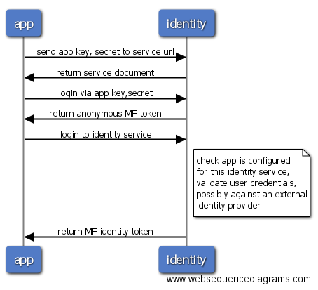
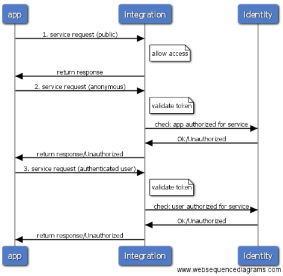

                          

Volt MX  Foundry
-----------

**The following section provides answers to frequently asked questions about upgrading to the latest Volt MX Foundry product:**

### For Business Needs

1.  **What kind of connectors are supported in Volt MX Foundry?**
    
    **Answer**: XML, JSON, java, SOAP are connectors supported in Volt MX Foundry.
    

In addition to these, you can use the following adapters in Volt MX Foundry 7.x:

Database, API Proxy, AWS API Gateway, Business Adapters, Salesforce, Volt MX SAP Gateway, and MuleSoft.

4.  **If I want to integrate the Metrics or Report module, do I need to purchase any extra license?**
    
    **Answer**: For Cloud, there is no need to pay any extra amount. For On-prem, the Metrics module comes along with the Volt MX Foundry license but you need to pay to procure Jasper license. You can purchase the Jasper license on your own or take VoltMX's help.
    
5.  **What is the importance of the generated App Key and App Secret when a Volt MX Foundry app is published?**
    
    **Answer**:
    
    **Authentication Flow**
    
    The client side app (built using Volt MX Foundry SDK, henceforth referred to as 'app') on start up sends its App Key and App Secret to its service URL, which is the identity server URL. Identity server validates the App Key, App Secret and returns the service document (which is a JSON document containing a list of services the app is allowed to access). The app also receives an Volt MX Foundry identity token. This token is a proof of authentication that it is a valid Volt MX Foundry app.
    
    Then the app may choose to log on to an Identity service. The app sends the user credentials and receives a new Volt MX Foundry identity token in response. This token is a proof of authentication for the app for the relevant user combination.
    
    
    
    **Authorization Flow**
    
    Subsequently, the app may invoke an Integration service. The Volt MX Foundry identity token is sent along with the request. Integration server includes a client library called 'gateway library' to validate the token and verify access to the requested service.
    
    The Integration service can be configured with three security levels: public, anonymous, and authenticated user. For public services, authorization checks are not performed. For anonymous security level, the token needs to be an Volt MX Foundry identity token issued for the app or for the user. For authenticated user security level, the token needs to be an Volt MX Foundry identity token issued on user authentication.
    
    
    
6.  **Will my existing app that has been developed in Volt MX Studio 6.5.x and prior will work with Volt MX Foundry 7.0?**
    
    **Answer**: The application developed in 6.5 should work with 7.0 version. For related information, refer to the steps mentioned in the Volt MX Foundry upgrade document.
    
7.  **If I have a valid license for an older studio version and I am using only Middleware and If I want to user other server components such as messaging, Engagements, logging service, and so on, do I need to pay any extra cost to obtain those modules?**
    
    **Answer**: For information on using other server components, contact the Volt MX Sales team.
    

### For Developers

1.  **What is the required software and hardware for setting up Volt MX Foundry?**

**Answer**: For information on required software and hardware, refer to the document

[Software and Hardware Requirements]({{ site.baseurl }}/docs/documentation/Foundry/voltmx_Foundry_deployment_guide/Content/Deployment.html)

4.  Does my App Key and App Secret change each time I publish the application?

**Answer**: No, the App Key and App Secret would change only when you unpublish and then publish the application.

6.  **Can I configure my own App Key and App Secret?**
    
    **Answer**: Yes. At the time of publishing the Volt MX Foundry app, there is a provision to provide the App Key and App Secret values.
    
7.  **Can I configure different base URLs for the services?**

**Answer**: Yes. You have the provision to configure different base URLs at the time of publishing the application

9.  **While building the project for SPA, the Webclient transfer to Volt MX Foundry failed. How can I rectify this issue?**
    
    **Answer**:
    
    *   Increase the max\_allowed\_packet size in MYSQL Configuration file (my.ini) as below.
        
    *   Open the C:\\ProgramData\\MySQL\\MySQL Server 5\\my.ini file.
        
    *   For example, set the following values:
        
        *   max\_allowed\_packet=64M
            
        
        *   innodb\_log\_file\_size=256M
            
10.  **In** servicedef.xml**, all the scrapper services  are defined as Java connectors. During services import to Volt MX Foundry, the migration tool does not recognize it as scrapper services and respective** dsl **files are not getting deployed  to the DB. How can I solve this problem?**

**Answer**:

When the app is imported to 7.x or above, the app ID will no longer be the app ID given to the app in Volt MX Studio; it will be changed to a new service name such as <AppName>Service<augen number>. So you have to place all dsl and scrapper properties files under the middleware\_home\\genericscrapper\\<AppName>Service<augen number> location.

13.  **I am not able to see the** appregistry **folder to view the** servicedef **file. Where can I see the service definitions in Volt MX Foundry 7.0?**
    
    **Answer**: These will be stored in the database in case of Volt MX Foundry.
    
14.  **Where to upload my custom jars?**

**Answer**: In Volt MX Foundry Console> API Management> Custom Code> Add New.

Then add the jar as a dependency to the Service (Select the Service> Advanced> Select Existing Jar, pick the jar from the list, and click **Save**.

17.  Where should I place the application-specific properties files that I used to keep in Middleware home?

**Answer**:

Similar to your existing setup, place the properties files at <middleware.home>\\middleware\\middleware-bootconfig

20.  **How do I know my** middleware.home**?**

**Answer**: middleware.home is a –D parameter for starting the web/app server. In case of tomcat, it can be found in the tomcat\\conf\\catalina.properties file.

22.  **I do not have DB previously, is it mandatory to have DB in Volt MX Foundry 7.0?**

**Answer**: DB is mandatory for Volt MX Foundry.

24.  **I am not using** Logdaemon/report/ metrics **in pre 7.x , is it mandatory in Volt MX Foundry 7.x?**
    

**Answer** : They are not mandatory. You can install metrics.ear if you need to generate reports.

26.  **We have only one service name until 6.0 but there are two names for Volt MX Foundry 7 (service name and operation name). How will it work?**
    

**Answer** : We have taken care of the backward compatibility. The existing apps will work without any issues. If you want to configure the new service and invoke the service, refer to the question **How to create new services after the Upgrade is successful?**

28.  **There is no URL provider option available in Volt MX Foundry console, how will my existing service work?**

**Answer**:

*   URL provider is still supported. You will not see it on Volt MX Foundry console but the runtime will respect your configuration. You can test this as a part of the runtime Admin Console as well.
*   URL provider is not applicable for the Volt MX Foundry version 6.5.
*   From 7.0 version of Volt MX Foundry onwards, you can use the URL provider option.
*   To configure a new URL provider, follow these steps as there is no UI in MobieFoundry Console to configure the new URL provider.
    
    *   Export the Volt MX Foundry application. Unzip the Volt MX Foundry zip file and navigate to
        
        Apps>\_integration> appId> <version>> Endpoints> default.xml
        
    *   Add the following entry in the file.
    <config>  
    <entry>  
    <key>urlprovider</key>  
    <value>com.voltmx.urltest.UpdateURL</value>  
    </entry>  
    </config>
    
    
    *   Save the file.
    
    *   Import the zip file to Volt MX Foundry and publish the application.

1.  **Is scraper service supported in 7.0?**
    

**Answer**: Scraper is supported as a part of 7.1 and above Volt MX Foundry version.

3.  **Should I make any changes to my existing application code related to network calls?**
    
    **Answer** : The upgrade process on Iris takes care of modifying the code so that the service invocations go through the Volt MX Foundry. As a result, in the client side code, you will see that the voltmx.net.invokeserviceAsync calls are replaced by a wrapper function that would ensure the service calls go through Volt MX Foundry. If you are using the appmiddlewareInvokerAsync function that was provided by Volt MX Studio, then you need not make any changes as this wrapper function also takes care of making the service calls via Volt MX Foundry.
    
4.  **What is the location of the** servicedef.XML **file on the server?**
    

**Answer**: If services have been migrated properly with jars and servicedefs, it will reside on workspace DB and, as a part of publishing, it will go to the server.

Also, all the jars are maintained in the database. If the user has modified the jar, they need to upload the jar from the console and publish again.

7.  **We cannot find all JAVA services under one root? How are these services categorized? We can understand the categorization of SOAP services based on WSDL but what about Java services?**

**Answer**: For Java services, the endpoint configuration will include java connector jar and dependent jars, if any, along with service name, etc. If the config is same for any two operations, they will get clubbed under one Volt MX Foundry service. Export the Volt MX Foundry app and look for Apps\_Integration<Service\_Name>\\Endpoints\\default.xml to examine the endpoint config XML.

9.  **Can we change the context path of services.war?**

**Answer**: Yes, we can change the context path of services.war file.

11.  **How to create new services after the upgrade is successful?**

**Answer**: Any new services must be added to the Volt MX Foundry application from Volt MX Foundry Console. You can open the Volt MX Foundry Console from Iris (by clicking Volt MX Foundry from the project explorer) and create the new services.

The way you use the services in the client side app is different for the newly created services. Here is the sample on how you can use the new services (Integration Service in the following example) from the client code:

Refer to the document for more details [Document]({{ site.baseurl }}/docs/documentation/Foundry/voltmx_foundry_user_guide/Content/VoltMXStudio/Installing_VoltMXJS_SDK.html)

> **_Note:_** HCLVoltMX Foundry is the Volt MX Foundry object that gets created at the application start up. HCLVoltMX Foundry is created only when you build your application by linking your Iris application to the Volt MX Foundry application.

// Sample code to fetch the integration service details  
var integrationClient = null;  
var serviceName = <your-service-name>;  
var operationName = <your-operation-name>;  
var params = { "your-input-keys" : "your-input-values"};  
var headers = {"your-header-keys" : "your-header-values"};//If there are no headers,pass null  
// options is an optional parameter helps in configuring the network layer.  
// To configure for a thin layer, use xmlHttpRequestOptions instead of httpRequestOptions.  
// Values for timeoutIntervalForRequest and timeoutIntervalForResource are in milliseconds.  
var options={"httpRequestOptions":  
{  
 "timeoutIntervalForRequest":60,  
 "timeoutIntervalForResource":600   
}}  
try{  
 integrationClient = HCLVoltMX Foundry.getIntegrationService(serviceName);  
}  
catch(exception){  
 voltmx.print("Exception" + exception.message);  
}  
integrationClient.invokeOperation(operationName, headers, params,  
function(result) {  
      voltmx.print("Integration Service Response is :" + JSON.stringify(response));  
},   
function(error) {  
      voltmx.print("Integration Service Failure :" + JSON.stringify(error));  
}, options  
);

