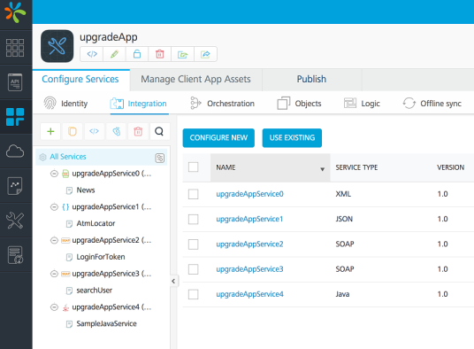
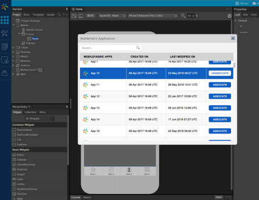

                           

Upgrade from Volt MX Server (middleware) to latest version of Foundry (now, Volt MX Foundry)
==========================================================================================

The following sections help you upgrade middleware/server from 6.5.x to Foundry 7.x:

1.  [Software and Hardware Requirements](#software-and-hardware-requirements)
2.  [Approaches to upgrade to latest Volt MX Foundry on-premises](#approaches-to-upgrade-to-latest-volt-mx-foundry-on-premises)
3.  [Post-installation Steps](#post-installation-steps)

Software and Hardware Requirements
----------------------------------

Refer to the [VoltMX Foundry Deployment Guide]({{ site.baseurl }}/docs/documentation/Foundry/voltmx_mobileFoundry_deployment_guide/Content/Deployment.html) for the software requirements and typical deployment topologies (development and production).

Approaches to upgrade to latest Volt MX Foundry on-premises
-------------------------------------------------------

1.  If you are using pre-6.5 versions of middleware or a non-Foundry version of 6.5 **for on-premises**, you need to install Foundry. The following are the available options to install Foundry.
    *   **Option 1**: Installation support from the Volt MX Installation Services team:
        
        The Volt MX Installation Services team provides support to set up Foundry for you at a nominal charge. Refer Cost for the Services Offered for more information.
        
    *   **Option 2**: Install Foundry on your own:
        1.  **If you are using Volt MX Server (middleware) but not VMS and Sync**, do the following:
            1.  Install Foundry using the Foundry installer. During installation, choose **New Installation**.  
                Please follow the installation steps from the provided links:
                *   Foundry Installer Guide - Windows: [Installing Volt MX Foundry on Windows]({{ site.baseurl }}/docs/documentation/Foundry/voltmx_foundry_windows_install_guide/Content/Introduction.html)
                *   Foundry Installer Guide - Linux: [Installing Volt MX Foundry on Linux]({{ site.baseurl }}/docs/documentation/Foundry/voltmx_foundry_linux_install_guide/Content/Installing_VoltMX_MobileFoundry_on_Linux.html)
                    
                    > **_Note:_** Volt MX recommends using the Foundry Installer for deploying Foundry 7.0 onwards. If you want to install Foundry manually due to your business rules and policies, please contact [support@voltmx.com](mailto:support@voltmx.com) for approval and to obtain access to the Foundry manual install artifacts. Manual installs not approved by Volt MX will not be supported.
                    
                    > **_Note:_** If you are installing Foundry on AIX, contact [support@voltmx.com](mailto:support@voltmx.com).
                    
        2.  If you are using Volt MX Server (middleware) with VMS or Sync, do the following:
            1.  If you are using VMS pre-6.5 (non-Foundry version of VMS), do the following:
                
                *   Raise a product support request for the DB scripts to be run to upgrade your current VMS schema to be compatible with flyway.
                    
                *   Once you receive the scripts from the product support team, run the scripts.
                    
                *   Rename the Volt MX Engagement Services (VMS) database to a name adhering to the format: <prefix>**vpnsdb**<suffix>. For example, **voltmxvpnsdb29**
                    
            2.  If you are using Sync pre-6.5 (non-Foundry version of Sync), you need to upgrade Sync manually as specified in the [Upgrade of Sync Server](UpgrdeHUB_Sync.html) section.
            3.  Install Foundry using the Foundry installer. During installation, choose **New Installation**. Follow the installation steps from the provided links:
                
                (In case you have VMS, when the system prompts you for prefix and suffix during the installation, use the same prefix and suffix as provided earlier).
                
                *   Foundry Installer Guide - Windows: [Installing Volt MX Foundry on Windows]({{ site.baseurl }}/docs/documentation/Foundry/voltmx_foundry_windows_install_guide/Content/Installing_VoltMX_MobileFoundry_on_Windows.html)
                *   Foundry Installer Guide - Linux: [Installing Volt MX Foundry on Linux]({{ site.baseurl }}/docs/documentation/Foundry/voltmx_foundry_linux_install_guide/Content/Installing_VoltMX_MobileFoundry_on_Linux.html)
            4.  Then, link the upgraded Sync server with the Foundry server. Refer [Linking VMS/Sync Server with Foundry](Link_Sync_with_MF.html) for more information.

1.  If you are using pre-6.5 versions of middleware or non-Foundry version of 6.5 (**On-premises pre-7.x server**) and want to migrate to **VoltMX Cloud**, refer [Migrating from On-premises pre-7.x Server to Cloud Foundry 7.x](MF_References.html#migrating-from-on-premises-pre-7-x-server-to-cloud-mobilefoundry-7-x)
2.  If you are using pre-7.x Cloud and want to migrate to 7.x Cloud, refer [Migrating from pre-7.x Cloud to 7.x Cloud](MF_References.html#migrating-from-pre-7-x-cloud-to-7-x-cloud)
3.  If you are using Foundry version of 6.5.2 middleware, do the following:
    1.  Install Foundry using the Foundry installer. During installation, select **Upgrade**.
    2.  After the upgrade is complete, republish your Foundry applications.
        
        > **_Note:_** For VMS: If you are currently using Volt MX Engagement Services pre-6.5 (non-Foundry version of VMS), then during the installation do not select **Engagement** as you need to upgrade VMS manually as specified in the section [Upgrade of Volt MX Engagement Server (VMS)](UpgrdeHUB_VMS.html)and then link to the Foundry Server. Refer to [Linking VMS/Sync Server with Foundry](Link_Sync_with_MF.html).
        
        > **_Note:_** For Sync: If you are currently using Sync pre-6.5 (non-Foundry version of Sync), then during the installation please do not select **Sync** as you need to upgrade Sync manually as specified the section [Upgrade of Sync Server](UpgrdeHUB_Sync.html), and then link to the Foundry Server. Refer to [Linking VMS/Sync Server with Foundry](Link_Sync_with_MF.html).
        

Post-installation Steps
-----------------------

1.  **If you are using custom servlets, filters, or listeners**: As 7.x does not support custom servlets or filters (for example, the classes that extend HttpServlet or implement ServletContextListener or Filter), you need to modify them. Refer [How to Use Custom Servlets, Filters, and Listeners]({{ site.baseurl }}/docs/documentation/Foundry/voltmx_foundry_user_guide/Content/UsingCustomServletsFiltersAndListeners.html) to make the changes and create the jar file.
    
    > **_Important:_** The **custom servlets, filters,** or **listeners** must be complied against the latest compatible **middleware-system.jar** file , which can be downloaded using the **Download** option from Admin Console.
    

1.  Create the Foundry application from Iris Enterprise by following the MADP Upgrade document. The created Foundry application is displayed in the Foundry console, as follows:
    
    
    
    The service names of your pre-7.x application would become operation names in the Foundry application. Your existing services are grouped based on their service type and the base URL and given an auto-generated service name. If you want to see how your existing services are grouped, you can see them in Foundry Console or you can refer `File <project name>_MWMappings.properties` in the Iris workspace.
    
2.  Ensure that your client application is linked to the Foundry app.
    
    If your client application is linked to Foundry app properly, you would see the following UI in the Iris when you click the **Project Explorer->Foundry->Use existing**, where it shows the **UNASSOCITATE** against the Foundry app to which you have linked your client app.
    
    
    
3.  Copy the custom application-specific properties files (if you have any) in the middleware home.
    
    > **_Note:_** How do I know the middleware home on my setup?  
      
    The middleware.home is passed as the `-D parameter` for the server startup. For example, for Tomcat you can see it in the `tomcat\conf\catalina.properties` file.
    
4.  Please note that all the properties from the pre-7.x middleware.properties file (located in `<middleware.home>\middleware\middleware-bootconfig`) are now made available as the entries in the DB in Foundry v 7.x Foundry. The properties are available in the `server_configuration` table of the **admindb** database. You can configure the properties in this table.
5.  If you have scrapper services in your application, refer the [Steps for Scraper services](MF_References.html#steps-for-scraper-services) section and perform the server-side changes, if applicable.

5.  Publish the Foundry application.
6.  If you are using Sync and using custom authentication, refer the [How to configure the custom authentication](MF_References.html#how-to-configure-custom-authentication-for-sync-console) section.
7.  Then, build the client side application and test it.
8.  For any services issues on the server side, refer the log files.
    
    ### How can I know the path of the log file?
    
    The log file path is in the `server_configuration` table of the **admindb** database. The **SERVER\_LOG\_LOCATION** is the property name whose value is taken as the log file path.
    
    Separate log files can be seen for each of the Foundry server components, as follows:
    
    *   middleware.log (Integration Server)
    *   vms.log (Engagement Server)
    *   syncservice.log (Sync Server)
    *   admin.log (Admin Console)
    *   authService.log (Identity Service)
    *   mbaasportal.log (Foundry Workspace)
    *   accountService.log (Accounts)
