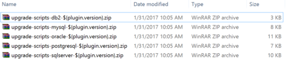
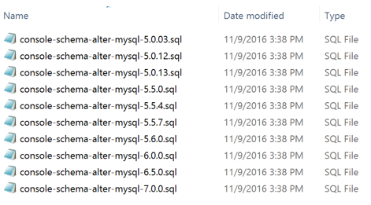

                           

Upgrade Sync Server from Pre-7.x to latest Volt MX Foundry
======================================================

The following steps help you upgrade Sync Server from 7.x to latest Volt MX Foundry:

> **_Note:_** Back up your database schema, syncconsole.war, and syncservice.war (from server) before proceeding for upgrade.

Upgrade of the Sync server involves the following four steps:

*   Download the Sync zip file
*   Upgrade the Database
*   Upgrade properties files
*   War Upgrade

1.  Step 1: Download the Sync zip file.
    
    Download the required 7.x version of Volt MX Sync Server (Sync-GA-<version>.zip) from the following location: [http://community.hclvoltmx.com/downloads/manual](http://community.hclvoltmx.com/downloads/manual).
    
2.  Step 2: Upgrade the Database.
    *   Extract the zip file to see a folder named ‘upgrade-scripts’ in the **Sync** folder.
        
    *   This folder would contain the zip files (as shown in the following screenshot) containing DB scripts (for all the supported databases) required to upgrade the database.
        
        
        
    *   Unzip the zip file relevant for your database. For example, if your DB is mysql, you need to unzip the `upgrade-scripts-mysql-${plugin.version}.zip` file to see the list of SQL scripts, as follows:
        
        
        
    *   Depending on your current version of Sync, run the db scripts sequentially in ascending order starting from the next version until the 7.0 version. For example, if your current version is 5.6, do the following:
        
        *   Run the scripts for 6.0 (console-schema-alter.-mysql-6.0.0.sql)
            
        *   Run the scripts for 6.5 (console-schema-alter.-mysql-6.0.5.sql)
            
        *   Run the scripts for 7.0 (console-schema-alter.-mysql-7.0.0.sql)
            
    *   Run the flyway scripts to upgrade the DB from 7.0 to the latest 7.x version. The flyway scripts are available in the installer artifacts folder. For example, the scripts for MySQL are available in the `syncconsole-mysql.zip` file.
        
        \[For more details, go to [Upgrade Volt MX Foundry Sync]({{ site.baseurl }}/docs/documentation/Foundry/vmf_sync_installation_tomcat/Content/UpgradingVoltMXSyncforTomcat7.0.xto7.1.x.html) and search for **Executing Upgrade Script Files**
        
        \[If you are using Oracle or DB2, go to [Upgrade Volt MX Foundry Sync]({{ site.baseurl }}/docs/documentation/Foundry/vmf_sync_installation_tomcat/Content/UpgradingVoltMXSyncforTomcat7.0.xto7.1.x.html) and search for **Creating a Table space**.
        
3.  Step 3: Upgrade properties files
    
    *   Extract the Properties zip file(properties-files.zip) from the installer-artifacts folder of the downloaded zip file.
    *   Navigate to your current `<sync.home>\conf` directory, and replace the existing property files with downloaded property files.
    
    > **_Note:_** Make sure you retain the property **syncservices.jndi.prefix** from the old **syncconsole.properties** file.
    
4.  Step 4: War Upgrade
    
    *   Deploy the syncconsole war file.
        
        In case of Tomcat, the `installer-artifacts/syncconsole-tomcat.war` is the war file of the syncconsole. So, rename it to syncconsole.war and deploy it on Tomcat.
        
        In case of other app servers, the `installer-artifacts/syncconsole.war` is the war file of the syncconsole. So, deploy syncconsole.war on other app servers(JBoss/WeLogic/WebSphere)
        
    
    *   Deploy the syncservice.war file.  
        
        The `installer-artifacts/syncservice_tomcat.war` is the war file of the syncservice for Tomcat server.
        
        The `installer-artifacts/syncservice.war` is the war file of the syncservice for web/application servers (WebLogic/WebSphere/JBoss).
        
    
    > **_Important:_** Currently, the upgrade process remains same for all the versions.
