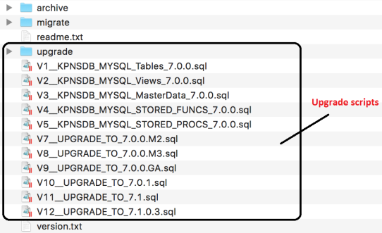

                           

Upgrade VMS (Engagement Server) from Pre-7.x to latest Volt MX Foundry
==================================================================

The following steps help you upgrade VMS from 6.5.x to latest Volt MX Foundry:

> **_Important:_** Back up your database schema and vpns.war file (from server) before proceeding with the upgrade.

Upgrading the VMS manually involves the following four steps:

*   Download the vms zip file
*   Database upgrade
*   War upgrade
*   Configure the properties files

1.  Step 1: Download the vms zip file.
    
    Download the required 7.x version of Volt MX Foundry Messaging (vms.zip) from the following location: [http://community.hclvoltmx.com/downloads/manual](http://community.hclvoltmx.com/downloads/manual).
    

1.  Step 2: Upgrade the database.
    
    Unzip vms.zip file to see the .tar file related to your database type. For example, mysql.tar.
    
    Extract the .tar file to see the following files and folders. \[There are .sql scripts are available in the Upgrade folder as well as under the extracted folder as highlighted in the following screenshot:
    
    
    
    Refer the [Database Upgrade for VMS]({{ site.baseurl }}/docs/documentation/Foundry/vms_console_installer_manual_guide-windows/Content/VPNS_Upgrade.html) section (go to the section based on your database) to run the .sql file in the order mentioned in the documentation.
    
    > **_Important:_** Database upgrade scripts are available until 7.1.0.3 in community portal. To upgrade VMS to 7.2 or later, you must raise a support ticket to get the scripts.
    
2.  Step 3: War Upgrade in Server.
    
    > **_Note:_** Back up your files before deleting/overwriting.
    
    1.  Deploy vpns war in Tomcat Server.
        
        To deploy Volt MX Foundry Engagement Services on Tomcat Server, copy the vpns.war (which is available in the extracted vpns.zip file) file to the following location: `<Tomcat installation directory>/webapps/`
        
    2.  Remove vpns folders from the following two paths and restart Tomcat server:
        
        `<Tomcat installation directory>/work/Catalina/<host>/`
        
        `<Tomcat installation directory>/webapps/`
        
    
    For other web servers or application servers, follow the deployment steps required by the respective server.
    
3.  Step 4: Configure the properties files.
    
    1.  Extract the vpns-resources.tar file (which is available in the extracted vpns.zip file) and place the files in a folder.
        
    2.  Modify the `configResource.properties`, `database.properties` and `vms-log4j2.xml` files based on your existing setup.
        
    3.  Provide the path of these files as a –D param with the param name `vpns.configLocation` param.
        
    4.  Refer the [Setup Volt MX Foundry Engagement Services]({{ site.baseurl }}/docs/documentation/Foundry/vms_console_installer_manual_guide-windows/Content/Setup_VPNS.html) section for more information.
        
    
    > **_Important:_** Currently, the upgrade process remains same for all the versions.
