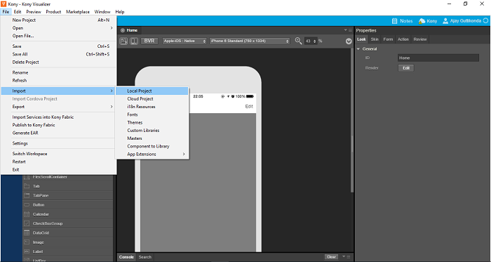

                           

Importing the Application to Volt MX Iris Enterprise V8 Version
------------------------------------------------------------------

1.  This step assumes that you have installed Volt MX Iris Enterprise edition on your system. 

2.  Using the **File** menu, select the **Import** option to import the exported zip file created in the previous step. Alternatively you can directly point to the 7.x project location for the import. Once selected, click **Finish**.  

> **_Note:_** Do not select the **Import services into Foundry** check box at this stage as you create the Foundry app in [Creating of Foundry app from Iris](MADPUpgradeDoc/Step_III_Creation_of_MF_app.html).

While you import the client application, the following tasks are performed in the background:

*   For projects imported from Volt MX Iris 7.x, all old widgets (Image, Segment, Image Gallery - all these widgets have a 2nd version and the app should use them) found in the upgrade process are deleted from the application.
*    Duplicate widgets are renamed automatically.
*    Duplicate skins are renamed automatically.
*    Reserved keywords are renamed automatically.
*    You can find all changes in a log file located in the project root folder. The name of the log file is `<ApplicationName>_upgradeLog.log`. If there are no upgrade changes, the log file is not created.
*    You must take necessary actions on any of the issues in the warning section in the log file.

### Importing the 7.x Project in Iris

To export an application Iris, do the following:

1.  Import the 7.x exported project to Iris Enterprise by using File -> Import -> Local Project.
    
    
    

1.  While importing the app, the system asks you whether you want to upgrade. Click **Upgrade**.  
    
    Now, Volt MX Iris 7.x project is imported to Iris V8.
