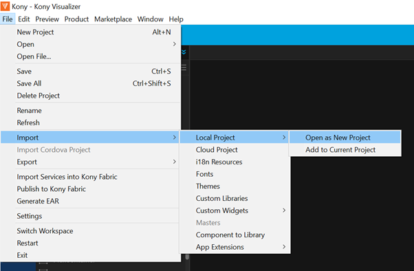
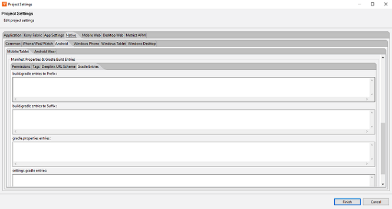
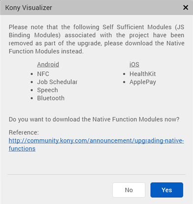
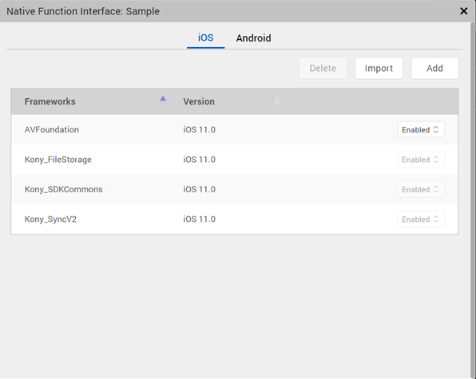
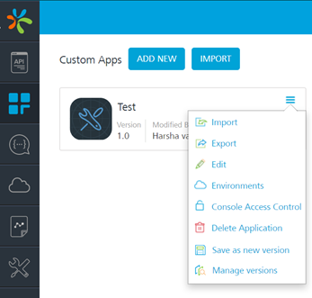
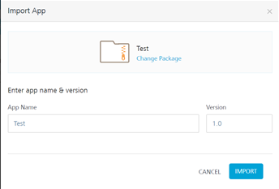
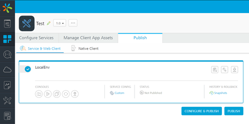
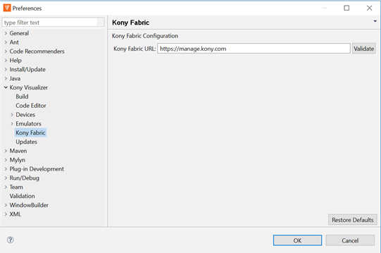
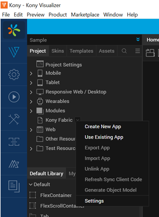
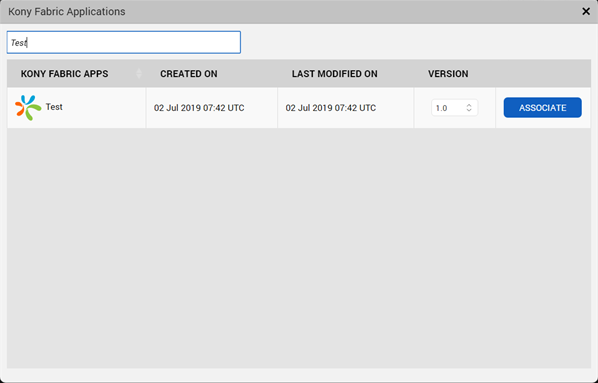

                       

You are here: Prerequisites

Upgrade Steps
=============

This section outlines the upgrade steps to be performed for upgrading the client application, assuming that you have installed Volt MX Iris Enterprise 8.x and Volt MX Foundry 8.x on your system.

Prerequisites
-------------

*   [VoltMX Iris Enterprise V8 or later](https://docs.voltmx.com/voltmxlibrary/iris/iris_enterprise_install_win/Content/Main Overview.html)
*   [VoltMX Foundry V8 or later]({{ site.baseurl }}/docs/documentation/Foundry/voltmx_foundry_windows_install_guide/Content/Introduction.html)

Iris Project Upgrade
--------------------------

To upgrade an application from Volt MX Iris Enterprise 7.x to 8.x, do the following:

1.  In Volt MX Iris Enterprise 7.x, where your 7.x project is available, go to **File -> Export-> Local Project**.
2.  Enter the name of the archive file and click **Save**. The file will be saved in your local folder.
3.  In Volt MX Iris Enterprise 8.x, import the 7.x zip file śaved in the previous step, by using File -> Import -> Local Project -> Open as New Project. Alternatively, you can directly open the file location of the 7.x project for the import.
    
    
    
4.  Clear the **Import services into Volt MX Foundry** check box.
5.  Click **Finish**.
6.  While importing the app, the system asks you whether you want to upgrade. Click **Upgrade**.  
    
    Now, Volt MX Iris 7.x project is imported to Iris V8.
    

### Additional Configurations

*   If you are using a custom **build.gradle** file in the project, add all the dependencies into the Project Settings of Volt MX Iris. To do so, perform the following steps:
    1.  Go to **Project Settings -> Native -> Android -> Mobile/Tablet**.
    2.  In the **Gradle Enteries** tab of the **Manifest Properties and Gradle Build Entries** section, add the dependencies mentioned in the custom **build.gradle** file.
    3.  Click **Finish**.  
        
    4.  Additionally, delete the custom **build.gradle** file from its root location.
    5.  From the `androidprecompiletask.xml` delete all the references of the custom **build.gradle** file.
*   If **Native function APIs** are enabled in the 7.x project, the following dialog box is displayed.
    
    
    
    Please make sure to add the frameworks that are used in the earlier project. To do so, perform the following steps:
    1.  Go to **Edit -> Manage Native Function API(s)**. The **Native Function Interface** window is displayed.
    2.  Click **Add**. Add all the required frameworks.
*   If the app uses NFI frameworks for iOS and the KAR extraction fails, you must delete the frameworks and add them again. To do so, perform the following steps:
    
    1.  Go to **Edit -> Manage Native Function API(s)**. The Native Function Interface window is displayed.
    2.  Select the enabled frameworks and then click **Delete**.
    3.  Click **Add**. Add the required frameworks.
    
    
    
    > **_Note:_** The KAR extraction fails when the Xcode version is not compatible with the existing frameworks in the project. When you delete the previous frameworks and add frameworks again, Volt MX Iris automatically adds the updated frameworks that are compatible with the latest Xcode version.
    

Foundry Application Upgrade
--------------------------------

To upgrade an application from Volt MX Foundry 7.x to Volt MX Foundry 8.x, do the following:

1.  In Volt MX Foundry 7.x, go to **Apps**.
2.  Click the contextual menu. A list of options appears. Select **Export**.
    
    
    
3.  In Volt MX Foundry 8.x console, go to **Apps** and click **Import**. Import the 7.x zip file created in the previous step.
    
    
    
4.  Click the newly imported application.
5.  Go to the **Publish > Service & Web Client** tab.
6.  Select the required **Environment** and click **Publish**.
    
    
    

Associate the upgraded Iris Project with the upgraded Foundry App
----------------------------------------------------------------------

1.  In Volt MX Iris 8.x, open the upgraded Iris project.
2.  Go to **Windows -> Preferences -> Volt MX Iris -> Volt MX Foundry**.
3.  Modify the **VoltMX Foundry URL** to the URL of the Volt MX Foundry 8.x Console. Click **OK**.
    
    
    
4.  From the Project Explorer, right-click **VoltMX Foundry**. A list appears. Select **Use Existing App**.
    
    
    
5.  A dialog box with a list of existing Volt MX Foundry apps is displayed. Type the name of the upgraded Volt MX Foundry app. Click **Associate**.
    
    
    

The Volt MX Iris app and Volt MX Foundry app upgrade is complete.
