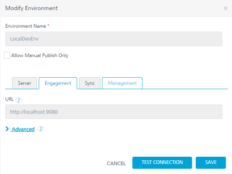
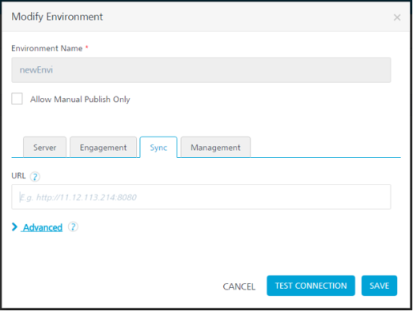

                           

Linking VMS or Sync Server with Foundry
============================================

1.  Log in to Foundry console and go to **Environments**
    
2.  If environment is already created, then click **MODIFY** and give Sync sever URL (http://<hostname>:<port>)
    
3.  Click **SAVE** button.
    
    *   The following is the Environments screen for VMS:
        
        
        
    *   The following is the Environments screen for Sync:
        
        
