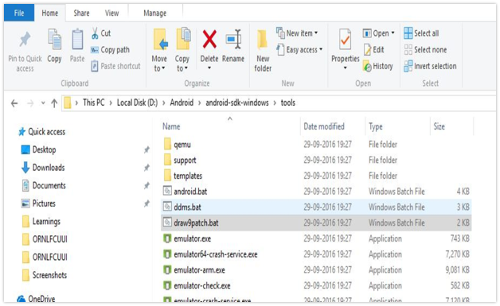
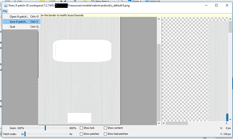

                          

Converting an image to a 9-patch image by using Android Tool
------------------------------------------------------------

Convert 9-patch (.9.png) images present in the **Resources** folder using the Android tool. Otherwise, you may encounter a **Crunching issue**during the build for Android platform.

1.  Use the **draw9patch** android tool from the mentioned location to convert images into nine-patch.
    
    
    

1.  Drag the image to be converted into the tool and click **File> Save 9-patch**.
    
    
