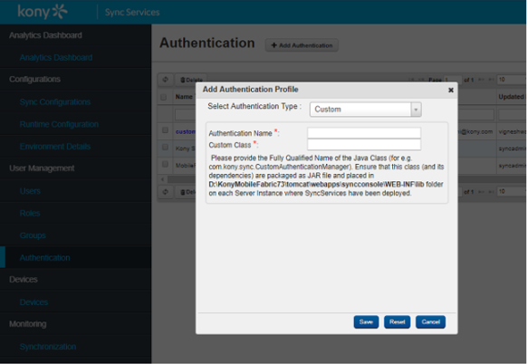
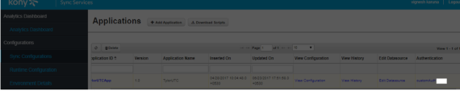

                           

Resources - Volt MX Foundry
=======================

Steps for Scraper services
--------------------------

If you are using Scrapper services and in the `servicedef.xml` you have the connector type as `ScraperConnector` (or) Service type is `javaConnector` and Service className is `com.voltmx.scrapper.gc.ScrapperJavaService`, then you no need to perform any specific steps for Scrapper services. The upgrade process (Foundry app creation step mentioned in the MADP upgrade document) takes care of creating Scrapper services in Foundry.

But, for the cases where you created Scrapper service by mentioning service type as `javaConnector` with a class name is different from `com.voltmx.scrapper.gc.ScrapperJavaService`, then you must perform the following steps on the server:

Steps at the server side:

1.  In the `genericscrapperof middleware home` folder, create a folder with the name as your Java service name (from FoundryApp).
    
    For example, folder name: `<middleware home>\genericscrapper`
    

2.  Add dsl and properties files into this new folder and rename the properties file to Java service name (Java service name as mentioned in step 1).

Migrating from On-premises pre-7.x Server to Cloud Foundry 7.x
-------------------------------------------------------------------

1.  Raise a Cloud support request for a Cloud account and get the Cloud account details
2.  Perform the steps 1, 2, and 3 from the [Post Installation Steps](UpgrdeHUB_F.html#post-installation-steps) section.
3.  If you have the custom properties file, do the following:
    1.  Bundle your properties files into the respective JAR files.
    2.  Modify your Java code (pre/postprocessors and Java services) to access the earlier properties files as resource. For example, using `getClass().getResourceAsStream`.
4.  Steps to perform if you are using Volt MX Engagement Services (VMS).
    
    > **_Note:_** The Volt MX Engagement Services (VMS) data need to be migrated to Cloud. For this, you need to open a product support ticket. The product support team would take it from there.
    
5.  Publish the Foundry application and build and test the client application.
    
    > **_Note:_** You need to have the existing middleware also up and running until the time you want to support the old version of the client app.
    

Migrating from pre-7.x Cloud to 7.x Cloud
-----------------------------------------

1.  Raise a Cloud support request to upgrade your Cloud instance.
2.  Publish your Foundry application.
3.  Build and test your client application.

How to Configure Custom Authentication for Sync Console
-------------------------------------------------------

*   1.  Step 1: Add authentication from Sync Console.
        
        1.  Open Sync console.
        2.  Click **Authentication**.
        3.  Click **Add Authentication** and enter the details of the authentication profile.
            
            
            
    2.  Step 2: Assign authentication.
        
        1.  In Sync Console, select the **Sync Configuration** option.
        2.  Select the authentication that was created in Step 1 for your application.
            
            
