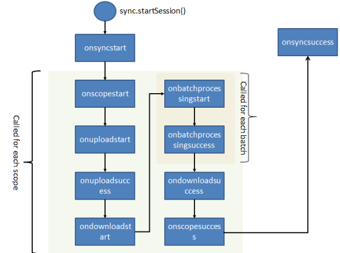
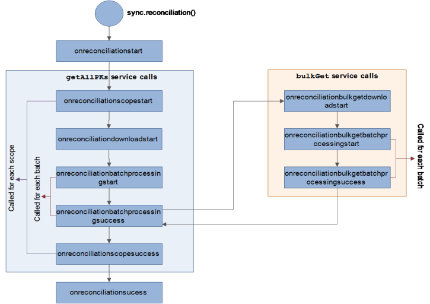

                            

Application Level
=================

This set of APIs help the developer to perform various ORM operations at Application level.

sync.init
---------

This function initializes the creation of device database as well sync environment. On successful sync init, the database structure without data (schema) gets created in the device database. Once the client database is created, subsequent calls to _sync.init_ just initialize the sync environment.

> **_Note:_** You should always call this function after application re-start and before you perform any Sync operation. You need to perform the _sync.init_ function only once in the life span of an application.

### Signature

_sync.init (**initSuccessCallback ,initFailCallback**)_

### Parameters

*   initSuccessCallback\[function\] - Optional
    
    Specifies the function that gets invoked on success
    
*   initFailCallback\[function\] - Optional
    
    Specifies the function that gets invoked on failure
    

### Platform Availability

Available on all platforms [mentioned](Overview.html#Supporte).

### Example

function syncInit(){
sync.init(initSuccessCallback , initFailCallback);
}

function initSuccessCallback(){
alert("Sync Initialized");
}
function initFailCallback(res){
alert("Sync Failed" + " with Error Code:" + res.errorCode + ", error message:"+ res.errorMessage + ", error information:" + JSON.stringify(res.errorInfo));
}



sync.startSession
-----------------

This function triggers the synchronization cycle. It receives a set of configuration as input that helps to fine tune the synchronization process to specific application needs.

### Client Side Lifecycle Events

### Configuration Parameters

  
| Parameter Name \[Mandatory/Optional\] | Parameter Type | Description |
| --- | --- | --- |
| user id \[Mandatory\] | String | Specifies the user identifier to use to authenticate the user for accessing the Volt MX Foundry Sync Services |
| password \[Mandatory\] | String | Specifies the password to use to authenticate the user to access the Volt MX Foundry Sync Services |
| appid \[Mandatory\] | String | Application identifier for which the data needs to be synchronized |
| serverhost \[Mandatory\] | String | Identifies the server on which the Volt MX Foundry Sync Services are deployed. Typically a DNS (For Example: sync.voltmx.net) or a String in IP Address format (10.10.10.4). The serverhost is 'undefined' by default. |
| issecure\[Optional\] | boolean | Identifies the protocol you should use to connect to server; http or https. If issecure is not specified, 'false' is taken by default and config.issecure is configured to 'false' by default. |
| serverport \[Optional\] | String | Identifies the port on which the Volt MX Foundry Sync Services are deployed. If port is not specified, port no: 80 is taken as default. |
| sessiontasks \[Optional\] | JSObject/table | You can specify various operations scope level using session tasks: 1. **doupload /dodownload**: Allows the user to control Sync Scopes that you should consider for upload and download. It typical follows the below structure. { syncscopename : {doupload:true, dodownload:true} } Setting dodownload to _true_ indicates that user wants to download the latest changes from the Volt MX Foundry Sync Server and vice-versa. Setting doupload to _true_ indicates that the user wants to upload the latest changes in the local tables to the Volt MX Foundry Sync Server and vice-versa. 2. **uploaderrorpolicy**: This indicates what should happen when error occurs while uploading changes to server. There are two options available:
abortonerror: Abort the upload and stop the sync process for that particular scope. continueonerror: Ignore the error, continue the upload and sync process for that particular scope.

It has to follow structure:{ syncscope1: {uploaderrorpolicy: "abortonerror"},syncscope2: {uploaderrorpolicy: "continueonerror"}, } |
| sessiontasks \[Optional\] | JSObject/table | For **Example 1**:config.sessiontasks = { Scope1 : { doupload : true, dodownload : true, uploaderrorpolicy : "continueonerror" }, Scope2 : { doupload : true, dodownload : true, uploaderrorpolicy : "abortonerror" } }; For **Example 2**: config.sessiontasks = { Scope1 : {doupload : true, dodownload : false, uploaderrorpolicy :"abortonerror"}, Scope2 : {doupload : true, dodownload : false, uploaderrorpolicy: "continueonerror"}} |
| batchsize | String | Indicates the number of rows that get downloaded in one batch from the server. By default, this value is set to 500. > **_Note:_** If you have more than one record with the same lastupdatetimestamp, then irrespective of the batchsize, all the records that have the same lastupdatetimestamp are downloaded in the same batch depending upon the batch cut time. |
| filterparams | JSObject/table | Indicates the filter params or values that are used to filter data for a specific user/device. This helps to ensure that only data relevant to a specific user is sent to the device and thus making the whole process more optimized. It typically follows the below structure {ScopeName : \[{ SyncObjectName : \[{ FilterName : "ProductName", Value1 : "" , Value2 : "" }\] }\] } **For Example**: config.filterparams = { PersistentSyncScope : \[ { Products : \[ { Name : "ProductName", Value1 : "%Cha%" } \] } \] } ; |
| removeafterupload\[Optional\] | JSObject/table | Indicates that you should delete specified records from local database after successful upload. **Usage**: Suppose that there are three scopes:

scope1 with two sync objects syncObject1 and syncObject2) scope2 with two sync objects syncObject3 and syncObject4 scope3 with three sync objects syncObject4, syncObject5, and syncObject6.

Now, we want to

Delete all records in all sync objects in scope1 after upload. Delete none of the records in sync objects in scope2 after upload. Delete only records of syncObject4 and syncObject6 in scope3 after upload.

We pass config param to syn.startsession like this: config.removeafterupload = {"scope1":\[ \],"scope3":\["syncObject4", "syncObject6"\]}; P.S. Currently it is not available at record level. |
| onscopestart \[Optional\] | Function | Indicates the callback that is called before synchronization for a specific scope is started. It is called for each Sync Scope defined in the application. It receives a context object parameter with the below keys: uploadurl \[String\] downloadurl \[String\] currentScope \[String\] lastsynctimestamp \[String\] uploadsequencenumber \[String\] |
| onuploadstart \[Optional\] | Function  | Indicates a callback that is called before starting the upload for a specific SyncScope. It is called for each SyncScope defined in the application (unless the specific scope is set, the property doupload=false or there is nothing to upload for that scope). It receives a context object with the below keys uploadurl \[String\] downloadurl \[String\] currentScope \[String\] lastsynctimestamp \[String\] uploadsequencenumber \[String\] uploadRequest \[JSObject/table\] |
| onuploadsuccess \[Optional\] | Function | Indicates a callback that is called after the changes for all the objects within a scope are uploaded to the Volt MX Foundry Sync Server. It receives a context object with the below keys: uploadurl \[String\] downloadurl \[String\] currentScope \[String\] lastsynctimestamp \[String\] uploadsequencenumber \[String\] uploadcontext \[JSObject/table\]

rowsuploaded \[Number\]\- total number of rows uploadedrowsinserted \[Number\] - number of rows inserted rowsupdated \[Number\] - number of rows updatedrowsdeleted \[Number\] - number of rows deletedoobjectlevelinfo \[JSObject/table\] - Contains following info for each sync object:syncobject \[JSObject/table\] : {rowsuploaded \[Number\],rowsinserted\[Number\],rowsupdated \[Number\],rowsdeleted\[Number\],rowsfailedtoupload\[Number\],

 |
| ondownloadstart \[Optional\] | Function | Indicates a callback that is called before downloading the data changes for a specific scope. It receives a context object populated with the below keys: uploadurl \[String\] downloadurl \[String\] currentScope \[String\] lastsynctimestamp \[String\] downloadRequest \[JSObject/table\] |
| onbatchprocessingstart \[Optional\] | Function | Indicates a callback that is called before downloading a batch of changes from the Volt MX Foundry Sync Server. It is called for each batch that the Server sends. uploadurl \[String\] downloadurl \[String\] currentScope \[String\] lastsynctimestamp \[String\] downloadRequest \[JSObject/table\] |
| onbatchprocessingsuccess \[Optional\] | Function | Indicates the callback that is called after the client processes the batch. It receives a context object with the below keys: uploadurl \[String\] downloadurl \[String\] currentScope \[String\] lastsynctimestamp \[String\]

batchcontext \[JSObject/table\]

batchrowsdownloaded \[Number\]-total number of rows uploaded rowsinserted \[Number\] - number of rows insertedrowsupdated \[Number\] - number of rows updated rowsdeleted \[Number\] - number of rows deleted objectlevelinfo \[JSObject/table\] - Contains following info for each sync object: syncobject \[JSObject/table\] : { rowsuploaded \[Number\], rowsinserted\[Number\], rowsupdated\[Number\], rowsdeleted\[Number\],rowsfailedtoupload\[Number\],

 |
| onbatchprocessingsuccess \[Optional\] | Function | \[Following are populated only for Scopes with Sync Strategy OTASync\] ackinsetedrows \[Number\], ackdeletedrows\[Number\], ackupdatedrows\[Number\], acktotalrows\[Number\], } acktotalrows \[Number\] - total number of rows acknowledged by the server. Are populated only for Scopes with Sync Strategy OTASync. ackinsertedrows \[Number\]\- number of inserted rows acknowledged by the server. Are populated only for Scopes with Sync Strategy OTASync. ackupdatedrows \[Number\] - number of updated rows acknowledged by the server. Are populated only for Scopes with Sync Strategy OTASync. |
| onscopesuccess \[Optional\] | Function | Indicates a callback that is called once a specific SyncScope is processed. It is called for each SyncScope defined in the application. It receives a context object with the below keys: uploadurl \[String\] downloadurl \[String\] currentScope \[String\] lastsynctimestamp \[String\] |
| onsyncsuccess \[Optional\] | Function | Indicates a callback that is called once all the Sync Scopes are successfully processed by the Sync client side libraries. It receives a context object with the below keys: uploadurl \[String\] downloadurl \[String\] currentScope \[String\] lastsynctimestamp \[String\] |
| onsyncerror \[Optional\] | Function | Indicates the callback that is called for in case the Sync process encounters an error in any of scopes. It receives a context object with the below keys: errorCode \[String\] – error Code errorMessage \[String\] - Message erroInfo \[JSObject/table/null\] – Further information about errors in various scopes |
| onscopecerror \[Optional\] | Function | Indicates the callback that is called for error occurred at each scope. It receives a context object with the below keys: errorCode \[String\] – error Code errorMessage \[String\] - Message erroInfo \[JSObject/table/null\] – Further information about error. |
| passwordhashalgo\[Optional\] | Function/String | Indicates the hashing algorithm to be used to encrypt password before sending it to server. By default, passwordhashalgo is configured to SHA256. Following are valid values:

If some hashing algorithm is to be used:

**sha1****sha224****sha256****sha384****sha512****md2****md4****md5**For example, config.passwordhashalgo = “sha256”;P.S. It purely depends upon the algorithms that Volt MX platform supports.

If plain password is to be sent: **none**For example, config.passwordhashalgo = “none”;

 |
| passwordhashalgo\[Optional\] | Function/String | If some user defined function is to be used to create hash: given function For example,config.passwordhashalgo = myHashalgofunction myHashalgo(plainText){//create Hashreturn hash;} |
| invokeservicefunction \[Optional\] | Function | To [Override Network Service Calls](Override Network Service Calls.html) |

> **_Note:_** For sync to work with iOS9.x, you need to modify value of the parameter, allow self signed certificates to _YES_ in the Xcode.

### Signature

**sync.startSession(config)**

### Parameters

*   config \[JSObject or table\] - Mandatory
    
    Specifies the table to set the configuration parameters.
    

### Platform Availability

Available on all [platforms](Overview.html#Supporte).

### Example

function syncStart() 
{
varconfig = {};

//onXXXXDemo is a function that is called on these callbacks
	config.onsyncstart = onsyncstartDemo;
	config.onscopestart = onscopestartDemo;
	config.onscopeerror = onscopeerrorDemo;
	config.onscopesuccess = onscopesuccessDemo;
	config.onuploadstart = onuploadstartDemo;
	config.onuploadsuccess = onuploadsuccessDemo;
	config.ondownloadstart = ondownloadstartDemo;
	config.ondownloadsuccess = ondownloadsuccessDemo;
	config.onbatchprocessingstart = onbatchprocessingstartDemo;
	config.onbatchprocessingsuccess = onbatchprocessingsuccessDemo;
	config.onsyncsuccess = onsyncsuccessDemo;
	config.onsyncerror = onsyncerrorDemo;

//Selected records need to be downloaded to the device database from the server.
config.filterparams = 
{
PerProv1 : \[{Categories : \[ { Name : "CategoryID", Value1 : "1,2"}\]}\] 
}

//Remove data in the specific tables after upload
	config.removeafterupload = {"scope1":\[\],"scope3":\["tab4", "tab6"\]};

//To achieve the below said 3 usecases, pass configparam to sync.startsession() as above

Example : scope1 (table 1, table 2), scope2 (table 3, table 4), scope3 (table 4, table 5, table 6)
1. delete all records in all tables in scope1 after upload
2. delete none of the records in tables in scope2 after upload
3. delete only records of table4  and table6 in scope3 after upload

//The below values can be passed by the developer
	config.userid= "syncadmin";
	config.password="SyncAdmin123";
	config.appid = "APPIDNorthwind";
	config.serverhost ="10.10.10.10";
	config.serverport = "8080";

//Configure the size of the batch to be downloaded
config.batchsize= "1000"// Default value is 500

-- Session level tasks to control at scopes
      -- These parameters help to configure Download or Upload only for a scope
	config.sessiontasks = 
	{
	Scope1 : {doupload : true, dodownload : true, uploaderrorpolicy:"continueonerror"}
	}

// The sync.startSession command after populating the config object
	sync.startSession(config);



sync.startReconciliation
------------------------

sync.startReconciliation API is used to compare primary keys present in backend with application database primary keys for all objects configured in input params. It involves 2 service calls:

1.  getAllPKs - Captures all corresponding object PKs from the backend.
2.  bulkGet - Retrieves the actual record for given PKs.

From SDK, the first service call is getAllPKs used to fetch the PK values for corresponding objects. SDK compares the PKs with application database. If any extra records are found in application database, the corresponding record will be deleted. If any record is missing, the actual record will be retrieved through bulkGet service call.

> **_Important:_** PK - Primary Key

### Workflow

The following diagram illustrates the end-to-end workflow of sync.startReconciliation API:

### Configuration Parameters

  
| Callbacks \[Mandatory/Optional\] | Type | Description |
| --- | --- | --- |
| reconciliationc\[Mandatory\] | \[JSObject/Table\] | List of scopes with array of object names which are reconcile. config.reconciliation = { "<scope1>": \["<object1>", "<object2>"\], "<scope2>": \[\] }; Reconciliation takes place for object1 and object2 in scope1 and all objects present in scope2 as the value is an empty array\[ \]. |
| reconciledownloadbatchsize \[Optional\] | Number | Batch size represents number of primary keys to be downloaded in each batch. > **_Note:_** Default value for Blackberry is 50 and for other platforms 500. > **_Note:_** Maximum number of parameters to be sent in RPC request for sql server is 2100.So we have to make sure that the reconciledownloadbatchsize given in config params should meet this condition. |
| reconcilebulkgetbatchsize \[Optional\] | Number | Batch size represents number of records(actual record) to be downloaded in each batch. Default value for Blackberry is 50 and for other platforms 500. > **_Note:_** Maximum number of parameters to be sent in RPC request for sql server is 2100.So we have to make sure that the reconcilebulkgetbatchsize given in config params should meet this condition. |
| onreconciliationscopestart \[Optional\] | Function | Indicates a callback that is called before starting the getAllPks service call (fetching all the Primary keys) for a specific SyncScope. It is called for each SyncScope defined in the application. It receives a context object with the below keys. JSON object with scope name as 'key' and value as arrays of objects which are going to be reconciled.{<scopename> : \["<object1>", "<object2>"\];} |
| onreconciliationscopesuccess \[Optional\] | Function | Indicates a callback that is called once a specific SyncScope is processed. It is called for each SyncScope defined in the application. It is just a hook if user wants to perform anything after each scope success. |
| onreconciliationscopeerror \[Optional\] | Function | Indicates a callback that is called for error occurred at each scope. It receives a context object with the below keys: errorCode \[String\] – error CodeerrorMessage \[String\] - MessageerrorInfo \[JSObject/table/null\] – Further information about error. |
| onreconciliationstart \[Optional\] | Function | Indicates a callback that is called before starting reconciliation process. It receives a context object which is configured in sync.startReconciliation API. |
| onreconciliationbatchprocessingstart \[Optional\] | Function | Indicates a callback that is called before downloading a batch of primary keys from Volt MX Foundry Sync Server. It is called for each batch that the Server sends:
downloadRequest \[JSObject/table\] filterContext\[JSObject/table\]: is a download request that has a list of objects with primary key columns.

 |
| onreconciliationbatchprocessingsuccess \[Optional\] | Function | Indicates a callback that is called after the client processes the batch. It receives a context object with the below keys. Specified number of records downloads / inserts / deletes for that corresponding batch.

reconcilebatchdownloads \[Number\] reconcilebatchinsertions \[Number\] reconcilebatchdeletions \[Number\]

 |
| onreconciliationsuccess \[Optional\] | Function | Indicates a callback that is called once all the Sync Scopes are successfully processed (getAllPks and bulkGet) by the Sync client side libraries. It receives a context object with the below keys: reconcileobjectlevelinfo\[JSObject/table\] - complete reconciled objects information with no of records downloaded / inserted / deleted. reconciletotaldownloads\[Number\] - Total no of records downloaded for that corresponding object and will be present in each object. reconciletotalinsertions\[Number\] - Total no of records inserted in app DB for that corresponding object and will be present in each object. reconciletotaldeletions\[Number\]- Total no of records deleted in app DBfor that corresponding object and will be present in each object. Pendingreconcilescopeswithhistorychanges\[Number\] - Scopes which are ignored because of pending changes resided in it for that corresponding object and will be present in each object. |
| onreconciliationerror \[Optional\] | Function | Indicates a callback that is called if the Sync process encounters an error in any of scopes. It receives a context object with the below keys: errorCode \[String\] – error Code errorMessage \[String\] - Message erroInfo \[JSObject/table/null\] – Further information about error. |
| onreconciliationdownloadstart \[Optional\] | Function | Indicates a callback that is called before downloading the PKs for a specific scope. It receives a context object populated and configured in sync.startReconciliation API. |
| onreconciliationbulkgetdownloadstart \[Optional\] | Function | Indicates a callback that is called before starting the bulkGet service call (fetching the actual data for missed primary keys). It receives a context object with the below keys.downloadRequest \[JSON/Table\]filterContext \[JSON\] : It is located inside the downloadRequest. It has the list of PK values that are to be downloaded. |
| onreconciliationbulkgetbatchprocessingstart \[Optional\] | Function | Indicates a callback that is called before downloading a batch bulkGet (fetching the actual data for missed primary keys) from the Volt MX Foundry Sync Server. It is called for each batch that the Server sends and receives a context object with the below keys. |
| onreconciliationbulkgetbatchprocessingsuccess \[Optional\] | Function | Indicates a callback that is called after the client processes the bulkGet batch. It receives a context object with the below keys:reconcilebatchinsertions\[Number\]: No. of records after processing the batch. |

**Limitation**: If there are any pending changes in any object, then corresponding scope will be ignored in reconciliation process.

> **_Note:_** If any error / failure occurs, reconciliation starts from the scratch and does not have an option to resume its process.

> **_Note:_** For parent child relationship in sync config, it is recommended that the order of passing object names in config.reconcile param of sync.startReconciliation is first the child object has to be passed and then the parent object .

> **_Note:_** getAllPKs is a new operation which is not supported in IDE, so customer needs to map the operation manually.

### Example

config.reconciliation = {
"scope1": \[{ "Account": {} },{"Contact": {}}, {"Opportunity": {}}\],
"scope2": \[{"Lead": {}}\]
};
 config.reconcilebulkgetbatchsize = "2"; // Used for bulkgetService
 config.reconciledownloadbatchsize = "100"; //Used for getAllPk service
	  
 //The below values can be passed by the developer
	config.userid= "syncadmin";
	config.password="SyncAdmin123";
	config.appid = "APPIDNorthwind";
	config.serverhost ="10.10.10.10";
	config.serverport = "8080";
  
	//User defined callbacks as per the requirement
	config.onreconciliationscopestart = onReconciliationScopeStartCallback;
	config.onreconciliationscopesuccess = onReconciliationScopeSuccessCallback;
	config.onreconciliationscopeerror = onEeconciliationScopeErrorCallback;
	config.onreconciliationstart = onReconciliationStartCallback;
	config.onreconciliationbatchprocessingstart = onReconciliationBatchProcessingStartCallback;
	config.onreconciliationbatchprocessingsuccess = onReconciliationBatchProcessingSuccessCallback;
	config.onreconciliationsuccess = onReconciliationSuccessCallback;
	config.onreconciliationerror = onRconciliationErrorCallback;
	config.onreconciliationdownloadstart = onreconciliationdownloadstart;
   	config.onreconciliationbulkgetdownloadstart = onreconciliationbulkgetdownloadstart;
    	config.onreconciliationbulkgetbatchprocessingstart = onreconciliationbulkgetbatchprocessingstart;
config.onreconciliationbulkgetbatchprocessingsuccess = onreconciliationbulkgetbatchprocessingsuccess



sync.stopSession
----------------

You can stop the sync process using the sync.stopSession API. If you perform sync.stopsession and then sync.startsession, sync starts from where it stopped before.

### Signature

**sync.stopSession(callback)**

### Platform Availability

The Stop Sync API is supported on the following platforms:

*   iOS
*   Android
*   Windows

### Example

sync.stopSession( function ()   
{   
alert(“Sync has been stopped”);   
});


Following illustration shows the end-to-end workflow for the stop sync API: 

### Requirements

Following are some of the key requirements that need to be enabled for the stop sync process: 

*   You must be able to call sync.stopSession to cancel any in progress sync.
*   If the network call is in progress, stop sync will not cancel the process right away. Instead it will wait for the network call to complete and stops triggering further sync calls (next batches or scopes).
*   If you call the sync.stopSession API multiple times, an error `Session is in Progress` appears and the sync continues.
    
*   If you call the sync.stopSession API when sync is not in progress, a sync cycle is triggered and makes network calls in background.
    
*   After the sync is stopped first the pending callbacks (like onbatchsuccess, onscopesuccess will get called before invoking the stop callback).

sync.reset
----------

This method resets the device database by removing all the data and restoring it to a state after first sync.init.

### Signature

**sync.reset(successCallback, errorCallback)**

### Parameters

*   successCallback\[function\] - Optional
    
    Specifies the function that gets invoked on success
    

*   errorCallback\[function\] - Optional
    
    Specifies the function that gets invoked on error
    

### Platform Availability

Available on all platforms [mentioned](Overview.html#Supporte).

### Example

function syncReset(){
sync.reset(resetSuccessCallback,resetFailCallback );
}

function resetSuccessCallback(){
alert("Sync reset successfully.");
}

function resetFailCallback(res){
alert("Sync reset failed" + " with Error Code:" + res.errorCode + ", error message:"+ res.errorMessage + ", error information:" + JSON.stringify(res.errorInfo));
}



sync.rollbackPendingLocalChanges
--------------------------------

This method resets the data to last synchronized state. You can use this method to undo the all the client side changes.

### Signature

**sync.rollbackPendingLocalChanges(successCallback, errorCallback)**

### Parameters

*   successCallback**\[function\]** - **Optional**
    
    Specifies the function that gets invoked on success
    

*   errorCallback**\[function\]** \- **Optional**
    
    Specifies the function that gets invoked on error
    

### Platform Availability

Available on all platforms [mentioned](Overview.html#Supporte).

### Example

function syncRollBack(){
sync.rollbackPendingLocalChanges(rollbackSuccessCallback,rollbackFailCallback);
}

function rollbackSuccessCallback(){
alert("All recent changes rollbacked successfully");
}

function rollbackFailCallback(res)
{
alert("Problem occurred in rollbacking recent changes." + " with Error Code:" + res.errorCode + ", 
error message:"+ res.errorMessage + ", error information:" + JSON.stringify(res.errorInfo));
}



sync.getPendingAcknowledgement
------------------------------

This method retrieves all the rows across all the SyncObjects that are waiting for acknowledgement from the Sync Server. You use the method for persistent sync strategy.

> **_Note:_** For OTA strategy, sync.getPendingAcknowledgement API always returns _0_.

### Signature

**sync.getPendingAcknowledgement**_(successCallback, errorCallback)_

### Parameters

*   successCallback\[function\] - Optional
    
    Specifies the function that gets invoked on success
    

*   errorCallback\[function\] - Optional
    
    Specifies the function that gets invoked on error
    

### Platform Availability

Available on all platforms [mentioned](Overview.html#Supporte).

### Example

function fetchPendingAcknowledgement(){
sync.getPendingAcknowledgement(ackSuccessCallback ,ackFailCallback)
}

function ackSuccessCallback(res){
/\* res contains all information regarding the Pending Acknowledgements. 
It contains the total number of Pending Acknowledgements and information regarding the tables whose Acknowledgment is pending \*/
     alert(“Total Number of Pending Acknowledgements: ” + res. totalCount);
     alert(“Data Regarding Tables waiting for Acknowledgement:“     
     +res.totalData);
alert("Sync Pending Acknowledgement Success");
}

function ackFailCallback(res){
alert("Sync Pending Acknowledgement Failed" + " with Error Code:" + res.errorCode + ", error message:"+ res.errorMessage + ", error information:" + JSON.stringify(res.errorInfo));
}



sync.getPendingUpload
---------------------

This method retrieves all the rows across all the SyncObjects that are pending to be uploaded to the Volt MX Foundry SyncServer.

### Signature

**sync.getPendingUpload**_(successCallback, errorCallback)_

### Parameters

*   successCallback**\[function\]** - **Optional**
    
    Specifies the function that gets invoked on success
    

*   errorCallback**\[function\]** - **Optional**
    
    Specifies the function that gets invoked on error
    

### Platform Availability

Available on all platforms [mentioned](Overview.html#Supporte).

### Example

function fetchPendingUpload(){
sync.getPendingUpload(pendingUploadSuccessCallback, pendingUploadFailCallback)
}

function pendingUploadSuccessCallback(res){
     /\* res contains all information regarding the Pending Uploads. It contains the total number of Pending Uploads and information regarding the tables whose upload is pending \*/
     alert(“Total Number of Pending uploads: ” + res. totalCount);
     alert(“Data Regarding Tables waiting to get uploaded:“ +res.totalData);
     alert("Sync Pending Upload Success");
}

function pendingUploadFailCallback(res){
alert("Sync Pending Upload Failed" + " with Error Code:" + res.errorCode + ", error message:"+ res.errorMessage + ", error information:" + JSON.stringify(res.errorInfo));
}



sync.getDeferredUpload
----------------------

This ORM API helps to retrieve the list of rows that are set for hold at sync level.

### Signature

**sync.getDeferredUpload**_(successCallback, errorCallback)_

### Parameters

*   successCallback**\[function\]** - **Optional**
    
    Specifies the function that gets invoked on success
    

*   errorCallback**\[function\]** - **Optional**
    
    Specifies the function that gets invoked on error
    

### Platform Availability

Available on all platforms [mentioned](Overview.html#Supporte).

### Example

function GetDeferredUpload()
{
sync.getDeferredUpload(deferredUploadSuccessCallback, deferredUploadFailCallback)
}

function deferredUploadSuccessCallback(res)
{    
 /\* res contains all information regarding the deferred Uploads. It contains the total number of Deferred Uploads and information regarding the tables whose upload is deferred \*/
     alert(“Total Number of Deferred Uploads: ” + res. totalCount);
     alert(“Data Regarding Tables whose upload is deferred:“ +res.totalData);
     alert("Deferred Upload Success");
}

function deferredUploadFailCallback(res){
alert("Deferred Upload Failed" + " with Error Code:" + res.errorCode + ", error message:"+ res.errorMessage + ", error information:" + JSON.stringify(res.errorInfo));
}



<table style="margin-left: 0;margin-right: auto;" data-mc-conditions="Default.HTML5 Only"><colgroup><col> <col> <col></colgroup><tbody><tr><td>Rev</td><td>Author</td><td>Edits</td></tr><tr><td>7.0</td><td>GS</td><td>GS</td></tr></tbody></table>
