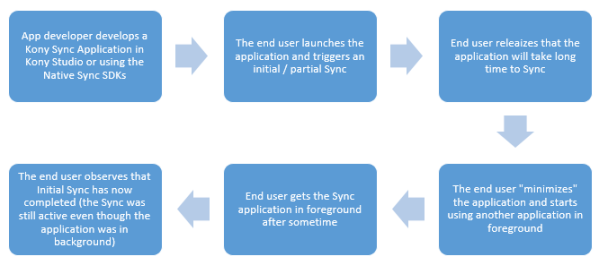
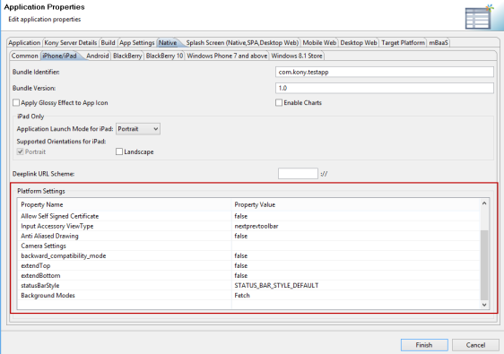
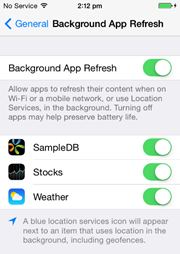

                          

Background Sync
===============

Introduction
------------

In Volt MX Sync (5.6.x) if the application goes to background, any network calls or JavaScript execution is stopped. Here you have to ensure that the application is in the foreground if the sync is in progress. If you trigger an initial sync that takes minutes then you have no choice but to observe the progress.

With the Background Sync feature, you can switch to other apps and can expect the sync to progress even when the application is in background. In iOS 7, a background sync feature is added. Refer to the following URL for more information on the background capabilities added in iOS.

[https://developer.apple.com/library/ios/documentation/iPhone/Conceptual/iPhoneOSProgrammingGuide/BackgroundExecution/BackgroundExecution.html](https://developer.apple.com/library/ios/documentation/iPhone/Conceptual/iPhoneOSProgrammingGuide/BackgroundExecution/BackgroundExecution.html)

Following are the supported platforms for Background Sync: 

*   iOS 7, iOS 8 and iOS 9 (VoltMX Iris Enterprise and Native SDK)
*   Android 4.x and above (VoltMX Iris Enterprise and Native SDK)

NSURLSession API
----------------

The main component of background transfers in iOS 7 is the `NSURLSession` API.

The `NSURLSession` API allows you to:

*   Transfer content through network and device interruptions.
*   Upload and download large files (Background Transfer Service).

The `NSURLSession` API is a powerful API for transferring content over the network. It provides a set of tools to handle the transfer of data through network interruptions and changes in application state.

The `NSURLSession` API creates one or more sessions, that calls tasks to shuttle blocks of related data across the network. Refer to the following links for more information on NSURLSession:

*   [https://developer.apple.com/library/ios/documentation/Cocoa/Conceptual/URLLoadingSystem/Articles/UsingNSURLSession.html](https://developer.apple.com/library/ios/documentation/Cocoa/Conceptual/URLLoadingSystem/Articles/UsingNSURLSession.html)
*   [https://developer.apple.com/library/ios/documentation/Cocoa/Conceptual/URLLoadingSystem/NSURLSessionConcepts/NSURLSessionConcepts.html#//apple\_ref/doc/uid/10000165i-CH2-SW1](https://developer.apple.com/library/ios/documentation/Cocoa/Conceptual/URLLoadingSystem/NSURLSessionConcepts/NSURLSessionConcepts.html#//apple_ref/doc/uid/10000165i-CH2-SW1)

Following illustration shows the background sync process:

Key Scenarios
-------------

The Background Sync capability enables the following scenarios if the application is in background:

### sync.startsession Continues to Execute

If you move the application to background, any current network calls made through `sync.startSession` are terminated. With the background sync capability, you must observe that the application continues to download or upload data even if the application is background.

### Trigger a Sync Periodically (for iOS 7)

The need to refresh the sync data in background even if the app is not launched or is in background can be achieved using Timer API. The Timer API keeps executing even if the application is in background.

Even though iOS 7 provides a Background Fetch APIs there are several limitations to it. It limits the amount of time the app needs to execute (approximately ten minutes).

### Enabling Periodic Sync

You can enable periodic sync using the `voltmx.backgroundjob.registerBackgroundFetch` API. The developer can override the existing syncStartSession generated from IDE as shown in the following code snippet.

function startsSyncCallback()   
{   
startsSync();   
var completionStatus = constants.BACKGROUND\_TASK\_STATUS\_NO\_NEW\_DATA  
}   
var fetchInterval = 50;   
voltmx.backgroundjob.registerBackgroundFetch(startsSyncCallback,fetchInterval);


Fetch Interval is an optional parameter with the default value `constants.BACKGROUND_TASK_FETCH_INTERVAL_MINIMUM`, which indicates that the system decides the fetch interval depending on the usage prediction for the app. It is advised to provide a Fetch interval, as decisions made by operating systems are unpredictable.

`voltmx.backgroundjob.setBackgroundFetchCompletionStatus` API must be called mandatorily for background fetch. This method intimates the system of the completion status of the background fetch job that is scheduled. Executing this call tells the system that it can move the app back to the suspended state and evaluate its power usage.

The `completionStatus` can have three possible values:

1.  constants.BACKGROUND\_TASK\_STATUS\_NEW\_DATA

This tells the system that the fetch was successful and internally the system updates the apps user interface (if the fetch resulted in user interface change) in the background. This new user interface is presented after the user brings the app into foreground. The snapshot of the new user interface is also presented when the user tries to switch apps using the app switcher.

3.  constants.BACKGROUND\_TASK\_STATUS\_FAILED

This tells the system that the fetch was unsuccessful. User interface is not updated and the task will be run later based on the available system resources.

5.  constants.BACKGROUND\_TASK\_STATUS\_NO\_NEW\_DATA

This intimates the system that the fetch did not result in any new data, user interface is not updated and the job is run after any point later in time but not before fetchInterval.

The reason for using `constants.BACKGROUND_TASK_STATUS_NO_NEW_DATA` instead of `constants.BACKGROUND_TASK_STATUS_NEW_DATA` is: 

1.  The Background Transfer API for long running network calls is asynchronous and the API returns before the callback is completed, hence the network call works anomalously.
2.  The background fetch allows only thirty seconds of execution time as specified by iOS documentation. Hence by using no new data you are basically completing the callback in less than thirty seconds and allowing the long running network call (triggered by background transfer to run independently).

This solves two problems, first sync cycle is fired periodically depending on the scheduling frequency decided by the operating system, second the long running network call runs independently of the background fetch allowing the user to view data while sync is in progress.

#### Steps to Enable Periodic Sync

To enable periodic sync when the application is in background, following steps must be configured: 

1.  [VoltMX Iris Project Settings](#volt-mx-iris-project-settings)
2.  [Device Settings](#Device_Settings)

##### Volt MX Iris Project Settings

Before building the application, right-click on the application select **Properties > Select Native Tab > Under Native select iPhone/iPad**. Under **Platform Settings**, in **Background Modes** option select **Fetch**. (Default is Disabled)

##### Device Settings

In iOS 7 and above, go to **Settings > General > BackgroundAppRefresh** and enable the option.

This is required for background fetch to work, as the apps listed under **BackgroundAppRefresh** will be able to use background fetch API.

Limitations
-----------

In iOS, the scheduling of the background jobs is determined by the operating system. Depending upon the execution history, the background jobs can get scheduled. You may observe unusual delays in sync process when running in background. The scheduling of these calls is determined by the operating systems and the nature is unpredictable.

Following are some observations while performing integration testing on the device: 

*   Background fetch will only invoke the app when it is background, if the app is in foreground it does not fire.
*   When the app is used for first time on a device, the time taken to fire background fetch is unknown (depends on the operating system) but it is a significant amount of time. Frequency of successive fetches fired from the app is decided by the operating system.
*   **Time it takes to complete the entire Sync**: When the application is background the NSURLSession API (as defined in iOS 7.x) is used to ensure that network calls are not disconnected when the app moves to background.
    
    *   However in background it is the operating system's privilege to schedule the network calls. Depending upon the operating system or device you can see that sync running in background takes hours of time to complete (the same will take few minutes when running in foreground). The operating system also looks at historical data to schedule the network calls requested by the application.
        
*   **Network timeout is not triggered when running in background**: When the network call times out when running in background the operating system does not raise a notification until you get the app in foreground.
*   **iOS 8.1 and network caveats**: In general, if network is turned off while a network call is in progress the operating system does not notify of an error in iOS. From the application's perspective the application seems to be stuck and no error is thrown back the user.
