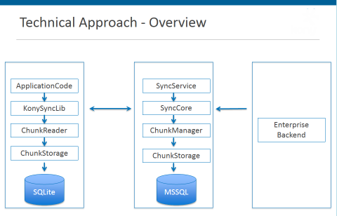

                           

Chunking Mechanism
==================

Chunking mechanism enables to support data downloads from Enterprise Datasource to device without interruption on low bandwidth, on / off and toggling between the networks, especially when data is huge.

You can configure the below parameters depending on the environment and requirements along with already existing Volt MX Foundry Sync configuration parameters in _sync.startSession_ API.

1.  **chunksize** (**Type**: **Number**): To configure the size of chunk while downloading data. If batchsize configured is more than the chunksize, Sync changes to chunking mode else, the data downloads normally without chunking.
    
    1.  For example, batchsize = 500 (Records) = 2048 KB, chunksize = 512 (KB), Sync divides the batch into four chunks and is downloaded independently to client, and finally consolidates and stores into device database.
    2.  For example, batchsize = 500 (Records) = 256 KB, chunksize = 512 (KB), Sync happens normally without chunking and you can download the whole batch to client, in one call and store into device database
    
    Example to set chunksize: _config.chunksize = 512_. This sets the chunksize to 512 KB.
    
    > **_Note:_** This parameter is a mandatory attribute for chunking.
    
2.  **onchunkstart** (**Type**: **callback**)
    
    This is a parameter that has reference to the callback that is called when each chunking call starts. This parameter is optional.
    
    _Input parameters:_ A map is passed to the function that has the following keys:
    
    1.  chunkcount
    2.  payloadid
    3.  scopename
    4.  chunkid
    5.  chunkrequest
    
    For example,
    
    config.onchunkstart = chunkstartfn;
    function chunkstartfn(res){
    voltmx.print("Chunk started for " + res.chunkid + " where total number of chunks are : " 
    + res.chunkcount);
    }
    
    
    
    > **_Note:_** This parameter is optional.
    
3.  **onchunksuccess** (**Type**: **callback**)
    
    This is a parameter that has reference to the callback that is called when a chunking call completes successfully.
    
    _Input parameters_: A map is passed to the function that has the following keys:
    
    1.  chunkcount
    2.  payloadid
    3.  scopename
    4.  chunkid
    5.  pendingchunks
    6.  chunksdownloaded
    
    For example:
    
    config.onchunksuccess = chunksuccessfn;
    
    function chunksuccessfn(res){
    voltmx.print("Chunk with " + res.chunkid + " is successfully downloaded where pending chunks are " + res.pendingchunks);
    }
    
    
    
    > **_Note:_** This parameter is optional.
    
4.  **onchunkerror** (**Type**: **callback**)
    
    This is a parameter that has reference to the callback that is called when a chunking call is not successful.
    
    _Input parameters_: A map is passed to the function that has the following keys:
    
    1.  chunkcount
    2.  payloadid
    3.  scopename
    4.  chunkid
    5.  pendingchunks
    6.  chunksdownloaded
    7.  errorCode
    8.  errorMessage
    
    For example:
    
    config.onchunkerror = chunkerrorfn;
    function chunkerrorfn(res){
    voltmx.print("Error occurred while downloading Chunk with" + res.chunkid + "Error Code :" + res.errorCode + " and Error Message : " + res.errorMessage);
    }
    
    
    
    > **_Note:_** This parameter is optional.
    
5.  **onretry** (**Type**: **callback**)
    
    This is a parameter that has reference to the callback that is called for each retry and is optional.
    
    _Input parameters_: A map is passed to the function that has the following keys:
    
    1.  request
    2.  errorResponse
    3.  retryCount
    
    For example:
    
    config.onretry = function(res){
    voltmx.print("Error occurred while making " + JSON.stringify (res.request) + ":" + 
    JSON.stringify(res.errorResponse) );
    voltmx.print("retrying for " + res.retryCount + " times");
    }
    
    
    
    > **_Note:_** This parameter is optional.
    
6.  **retryerrorcodes** (**Type**: **vector**/**array**)  
    Specify for which errorcodes, the application should retry.
    
    For example:
    
    **config.retryerrorcodes** = \[**1000**, **1013**, **1015**\]
    
    > **_Note:_** This is an optional parameter, if you do not pass, the error codes, 1000, 1013, 1014 and 1015 are used for retry.  
    
7.  **numberofretryattempts** (**Type**: **Number)**  
    
    Configure this parameter to specify the number of attempts that application should retry to make a call successful in case of some specific error codes related to network issues that are specified by retryerrorcodes parameter mentioned above.
    
    For example:
    
    **config.numberofretryattempts = 10**
    
    > **_Note:_** This parameter is a mandatory attribute for retry.  
    
8.  **retrywaittime** (**Type** : **Number)**  
    
    Specify the wait time (in seconds) to retry after a network error has occurred. This is optional,
    
    default is 1 second.
    
    For example:
    
    **config.retrywaittime = 5**
    
    > **_Note:_** This is an optional parameter.  
    
9.  **networktimeout** (**Type**: **Number)**  
    
    Configure this parameter to set the network time out while application is waiting for response from the server. This is in seconds. This is an optional parameter, and the default value depends upon the underlying channel
    
    For example:
    
    **config.networktimeout = 1800**; (that is 30 minutes)
    
    > **_Note:_** This is an optional parameter.  
    

Technical Architecture Overview
-------------------------------

#### Technical Approach Details

Client Side:

*   **ChunkReader** first assembles the data before passing the same to the Data layer
*   Chunks are also stored in SQLite to take care of network interruptions when reading the chunks
*   Incase of network interruptions, the client resumes from the point it failed when downloading chunks.

Server Side:

The **ChunkManager**

*   Splits the JSON into chunks less than the size of the **transfer buffer size** (chunksize) specified by the developer
*   Stores the chunks offline to take of **network interruptions** as the chunks are downloaded by the device
*   Deletes also any chunks that are processed by the Client.

Working with High Chunk Sizes
-----------------------------

While working with chunk sizes, make sure the specified chunk size is less than the network packet size of Syncconsole DB. Else, increase the size of the network packet size accordingly as below,

### For MySQL Server

In MySQL, max\_allowed\_packet is the attribute for specifying the network packet size. By default, the value is 4 MB and the maximum allowed for this parameter is 100 GB. For increasing max allowed packet size, edit <MySQL installation directory>/my.ini file and increase the max\_allowed\_packet value greater than your chunk size and restart the MySQL server.

### For MS SQL Server

In MS SQL Server, set the network packet size by increasing its value. By default, the value is 4096 bytes. The maximum value allowed for this parameter is 32767 bytes.

We can set this by using SQL Server Management Studio as below:

*   In **Object Explorer** (left side pane), right-click on the required server and select **Properties**.
*   Click the **Advanced** node (on left side pane).
*   On the right side pane under **Network**, select the value of “Network Packet Size” box to 32767.
*   Click **OK** to confirm.

### For Oracle

Set the following in listener.ora file

LISTENER= (DESCRIPTION= (ADDRESS= (PROTOCOL=tcp) (HOST=voltmxdb\_server) (PORT=1521)
(SEND\_BUF\_SIZE=32767)(RECV\_BUF\_SIZE=32767)))



Set the following in sqlnet.ora file

RECV\_BUF\_SIZE=32767
SEND\_BUF\_SIZE=32767

