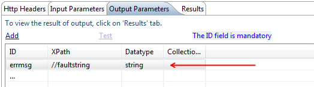

                            

Handling Errors
===============

Volt MX  Foundry Sync Framework handles error handling through error codes. All the ORMs take errorCallback as a parameter that is called if any error occurs in that particular ORM. All ORMs return error parameter in errorCallback that is mapped and contains the following keys:

1.  **errorCode\[number\]**: Each error is assigned a specific error code.
    
2.  **errorMessage\[String\]**: Description of the error scenario.
    
3.  **errorInfo\[JSObject\]**:Other information about error. It may also contain intermediate errors.
    

Volt MX  Foundry Sync Client Error Codes
-----------------------------------

Following table describes various client error codes and corresponding error messages:

<table style="width: 100%;mc-table-style: url('Resources/TableStyles/Basic.css');margin-left: 0;margin-right: auto;" class="TableStyle-Basic" cellspacing="0"><colgroup><col style="width: 95px;" class="TableStyle-Basic-Column-Column1"> <col style="width: 277px;" class="TableStyle-Basic-Column-Column1"> <col style="width: 643px;" class="TableStyle-Basic-Column-Column1"></colgroup><tbody><tr class="TableStyle-Basic-Body-Body1"><th class="TableStyle-Basic-BodyE-Column1-Body1">Error Code</th><th class="TableStyle-Basic-BodyE-Column1-Body1">Error Scenario</th><th class="TableStyle-Basic-BodyD-Column1-Body1">Error Message</th></tr><tr class="TableStyle-Basic-Body-Body1"><td class="TableStyle-Basic-BodyE-Column1-Body1">7001</td><td class="TableStyle-Basic-BodyE-Column1-Body1">Invalid data type passed for some ORM</td><td class="TableStyle-Basic-BodyD-Column1-Body1">Invalid data type for the attribute <i>&lt;attribute global name&gt;</i> in <i>&lt;Sync Object globalname&gt;</i>. Expected: <i>&lt;expected Type&gt;</i> Actual:<i>&lt;actual Type&gt;</i></td></tr><tr class="TableStyle-Basic-Body-Body1"><td class="TableStyle-Basic-BodyE-Column1-Body1">7002</td><td class="TableStyle-Basic-BodyE-Column1-Body1">Mandatory Attribute Missing in the Sync Object</td><td class="TableStyle-Basic-BodyD-Column1-Body1">Mandatory Attribute <i>&lt;attribute global name&gt;</i> missing in the Sync Object<i> &lt;Sync Object globalname&gt;</i></td></tr><tr class="TableStyle-Basic-Body-Body1"><td class="TableStyle-Basic-BodyE-Column1-Body1">7003</td><td class="TableStyle-Basic-BodyE-Column1-Body1">Primary Key not specified in updating an item in Sync Object</td><td class="TableStyle-Basic-BodyD-Column1-Body1">Primary Key <i>&lt;primaryKey&gt;</i> not specified in updating an item in <i>&lt;Sync Object globalname&gt;</i>.</td></tr><tr class="TableStyle-Basic-Body-Body1"><td class="TableStyle-Basic-BodyE-Column1-Body1">7004</td><td class="TableStyle-Basic-BodyE-Column1-Body1">Scopes loading failed</td><td class="TableStyle-Basic-BodyD-Column1-Body1">Scopes loading failed.</td></tr><tr class="TableStyle-Basic-Body-Body1"><td class="TableStyle-Basic-BodyE-Column1-Body1">7005</td><td class="TableStyle-Basic-BodyE-Column1-Body1">Sync Reset failed</td><td class="TableStyle-Basic-BodyD-Column1-Body1">Sync Reset failed.</td></tr><tr class="TableStyle-Basic-Body-Body1"><td class="TableStyle-Basic-BodyE-Column1-Body1">7006</td><td class="TableStyle-Basic-BodyE-Column1-Body1">Register device failed</td><td class="TableStyle-Basic-BodyD-Column1-Body1">Register device failed.</td></tr><tr class="TableStyle-Basic-Body-Body1"><td class="TableStyle-Basic-BodyE-Column1-Body1">7007</td><td class="TableStyle-Basic-BodyE-Column1-Body1">Session breaks because of some scope failure</td><td class="TableStyle-Basic-BodyD-Column1-Body1">Session breaks since user scope failure.</td></tr><tr class="TableStyle-Basic-Body-Body1"><td class="TableStyle-Basic-BodyE-Column1-Body1">7008</td><td class="TableStyle-Basic-BodyE-Column1-Body1">Session in progress</td><td class="TableStyle-Basic-BodyD-Column1-Body1">Session in progress.</td></tr><tr class="TableStyle-Basic-Body-Body1"><td class="TableStyle-Basic-BodyE-Column1-Body1">7009</td><td class="TableStyle-Basic-BodyE-Column1-Body1">No data with specified primary key found in local database while doing performing some operation on a Sync Object</td><td class="TableStyle-Basic-BodyD-Column1-Body1">No data with specified primary key found in <i>&lt;Sync Object globalname&gt;</i>.</td></tr><tr class="TableStyle-Basic-Body-Body1"><td class="TableStyle-Basic-BodyE-Column1-Body1">7010</td><td class="TableStyle-Basic-BodyE-Column1-Body1">Transaction failed to open</td><td class="TableStyle-Basic-BodyD-Column1-Body1">Transaction failed</td></tr><tr class="TableStyle-Basic-Body-Body1"><td class="TableStyle-Basic-BodyE-Column1-Body1">7011</td><td class="TableStyle-Basic-BodyE-Column1-Body1">Error occurred while establishing a Database connection.</td><td class="TableStyle-Basic-BodyD-Column1-Body1">Error occurred while establishing a Database connection.</td></tr><tr class="TableStyle-Basic-Body-Body1"><td class="TableStyle-Basic-BodyE-Column1-Body1">7012</td><td class="TableStyle-Basic-BodyE-Column1-Body1">If some record is created with markforupload=false, you should update it with markforupload=false only, else updates go to server for some non-existent server record and merge fails</td><td class="TableStyle-Basic-BodyD-Column1-Body1">Record does not exist on server, mark it for upload before updating/deleting it.</td></tr><tr class="TableStyle-Basic-Body-Body1"><td class="TableStyle-Basic-BodyE-Column1-Body1">7013</td><td class="TableStyle-Basic-BodyE-Column1-Body1">Error during Deferred Upload Transaction</td><td class="TableStyle-Basic-BodyD-Column1-Body1">Error during Deferred Upload Transaction</td></tr><tr class="TableStyle-Basic-Body-Body1"><td class="TableStyle-Basic-BodyE-Column1-Body1">7014</td><td class="TableStyle-Basic-BodyE-Column1-Body1">Referential Integrity Constraints Violation</td><td class="TableStyle-Basic-BodyD-Column1-Body1">Referential Integrity Constraints Violation: <i>&lt;Target Attribute&gt; = &lt; Target Value&gt;</i> does not exists in <i>&lt;Target Object&gt;</i>.</td></tr><tr class="TableStyle-Basic-Body-Body1"><td class="TableStyle-Basic-BodyE-Column1-Body1">7015</td><td class="TableStyle-Basic-BodyE-Column1-Body1">Length exceeds specified limit while creating/updating a record</td><td class="TableStyle-Basic-BodyD-Column1-Body1">Length exceeds the limit for the attribute<i> &lt;attribute global name&gt;</i> in <i>&lt;Sync Object globalname&gt;</i>. Expected: <i>&lt;Expected Length&gt;</i> Actual:<i> &lt;Actual Length&gt;</i></td></tr><tr class="TableStyle-Basic-Body-Body1"><td class="TableStyle-Basic-BodyE-Column1-Body1">7016</td><td class="TableStyle-Basic-BodyE-Column1-Body1">If user tries to create a record with already existing primary key.</td><td class="TableStyle-Basic-BodyD-Column1-Body1">Primary Key<i> &lt;attribute global name&gt;</i> already exists in table <i>&lt;Sync Object globalname&gt;</i>. Please give different value of primary key.</td></tr><tr class="TableStyle-Basic-Body-Body1"><td class="TableStyle-Basic-BodyE-Column1-Body1">7018</td><td class="TableStyle-Basic-BodyE-Column1-Body1">Some malicious values like positive/negative infinities, NaN is passed in some create/update operation</td><td class="TableStyle-Basic-BodyD-Column1-Body1">Malicious value <i>&lt;value&gt;</i> given for attribute <i>&lt;attribute global name&gt;</i>.</td></tr><tr class="TableStyle-Basic-Body-Body1"><td class="TableStyle-Basic-BodyE-Column1-Body1">7019</td><td class="TableStyle-Basic-BodyE-Column1-Body1">Some error occurs while executing SQL statement</td><td class="TableStyle-Basic-BodyD-Column1-Body1">Some error occurred in executing SQL statement</td></tr><tr class="TableStyle-Basic-Body-Body1"><td class="TableStyle-Basic-BodyE-Column1-Body1">7020</td><td class="TableStyle-Basic-BodyE-Column1-Body1">Error occurred while Uploading changes to Server</td><td class="TableStyle-Basic-BodyD-Column1-Body1">Error occurred in Uploading changes to Server</td></tr><tr class="TableStyle-Basic-Body-Body1"><td class="TableStyle-Basic-BodyE-Column1-Body1">7021</td><td class="TableStyle-Basic-BodyE-Column1-Body1">Error occurs while Downloading changes from Sever</td><td class="TableStyle-Basic-BodyD-Column1-Body1">Error occurred in Downloading changes from Sever</td></tr><tr class="TableStyle-Basic-Body-Body1"><td class="TableStyle-Basic-BodyE-Column1-Body1">7022</td><td class="TableStyle-Basic-BodyE-Column1-Body1">Error occurs while syncing one or more scopes</td><td class="TableStyle-Basic-BodyD-Column1-Body1">Error occurred while syncing one or more scopes</td></tr><tr class="TableStyle-Basic-Body-Body1"><td class="TableStyle-Basic-BodyE-Column1-Body1">7028</td><td class="TableStyle-Basic-BodyE-Column1-Body1">Error occurs if markforUpload value is set to true.</td><td class="TableStyle-Basic-BodyD-Column1-Body1">markforUpload value can not be made true if the object is created with mark for upload as false. If the user tries to change an object with markForUpload value from false to true using update or updateByPK APIs, the following error is occurred.</td></tr><tr class="TableStyle-Basic-Body-Body1"><td class="TableStyle-Basic-BodyE-Column1-Body1">7777</td><td class="TableStyle-Basic-BodyE-Column1-Body1">Some random error</td><td class="TableStyle-Basic-BodyD-Column1-Body1">The following error occurred while performing <i>&lt;operation Name&gt; : &lt;error&gt;</i>. Possible reasons can be sync.init may not have been invoked.[This comes for random error]</td></tr><tr class="TableStyle-Basic-Body-Body1"><td class="TableStyle-Basic-BodyE-Column1-Body1">8888</td><td class="TableStyle-Basic-BodyE-Column1-Body1">Unknown error from server</td><td class="TableStyle-Basic-BodyD-Column1-Body1">Unknown error from server</td></tr><tr class="TableStyle-Basic-Body-Body1"><td class="TableStyle-Basic-BodyE-Column1-Body1">1000</td><td class="TableStyle-Basic-BodyE-Column1-Body1">&nbsp;</td><td class="TableStyle-Basic-BodyD-Column1-Body1">Unknown Error while connecting (If the platform cannot differentiate between the various kinds of network errors, the platform reports this error code by default)</td></tr><tr class="TableStyle-Basic-Body-Body1"><td class="TableStyle-Basic-BodyE-Column1-Body1">1011</td><td class="TableStyle-Basic-BodyE-Column1-Body1">&nbsp;</td><td class="TableStyle-Basic-BodyD-Column1-Body1">Device has no WIFI or mobile connectivity. Please try the operation after establishing connectivity.</td></tr><tr class="TableStyle-Basic-Body-Body1"><td class="TableStyle-Basic-BodyE-Column1-Body1">1012</td><td class="TableStyle-Basic-BodyE-Column1-Body1">&nbsp;</td><td class="TableStyle-Basic-BodyD-Column1-Body1">Request Failed</td></tr><tr class="TableStyle-Basic-Body-Body1"><td class="TableStyle-Basic-BodyE-Column1-Body1">1013</td><td class="TableStyle-Basic-BodyE-Column1-Body1">&nbsp;</td><td class="TableStyle-Basic-BodyD-Column1-Body1">Middleware returned invalid JSON string</td></tr><tr class="TableStyle-Basic-Body-Body1"><td class="TableStyle-Basic-BodyE-Column1-Body1">1014</td><td class="TableStyle-Basic-BodyE-Column1-Body1">&nbsp;</td><td class="TableStyle-Basic-BodyD-Column1-Body1">Request Timed out</td></tr><tr class="TableStyle-Basic-Body-Body1"><td class="TableStyle-Basic-BodyE-Column1-Body1">1015</td><td class="TableStyle-Basic-BodyE-Column1-Body1">&nbsp;</td><td class="TableStyle-Basic-BodyD-Column1-Body1">Cannot find host</td></tr><tr class="TableStyle-Basic-Body-Body1"><td class="TableStyle-Basic-BodyE-Column1-Body1">1016</td><td class="TableStyle-Basic-BodyE-Column1-Body1">&nbsp;</td><td class="TableStyle-Basic-BodyD-Column1-Body1">Cannot connect to host</td></tr><tr class="TableStyle-Basic-Body-Body1"><td class="TableStyle-Basic-BodyE-Column1-Body1">1022</td><td class="TableStyle-Basic-BodyE-Column1-Body1">&nbsp;</td><td class="TableStyle-Basic-BodyD-Column1-Body1">Service call is canceled. You can customize the behavior of the application if a service call is canceled.</td></tr><tr class="TableStyle-Basic-Body-Body1"><td class="TableStyle-Basic-BodyB-Column1-Body1">1200</td><td class="TableStyle-Basic-BodyB-Column1-Body1">&nbsp;</td><td class="TableStyle-Basic-BodyA-Column1-Body1">SSL - Certificate related error codes.</td></tr></tbody></table>

> **_Note:_** **7022** is a generic error from client side which will be shown for different scenarios as described in [Sync Server Error Codes](#volt-mx-foundry-sync-server-error-codes) section.

Volt MX  Foundry Sync Server Error Codes
-----------------------------------

Following table describes various server error codes and corresponding error messages:

  
| Error Code | Error Scenario | Error Message |
| --- | --- | --- |
| 1001 | User credentials are incorrect | Invalid userID or password. |
| 1002 | Not an authorized user for the application. A user is not assigned to the application. | Application not authorized to the user. |
| 1003 | A user's deviceId is invalid or does not exist in a registered device list at the Volt MX Foundry Sync server. | Invalid deviceID. |
| 1004 | SyncConfig xml corresponding to applicationID not found at the Volt MX Foundry Sync Server. | Unknown applicationID. |
| 1005 | A userID does not exist in a registered device list at the Volt MX Foundry Sync Server. | Unknown userID. |
| 1006 | A user is not registered to the Volt MX Foundry Sync Server with this deviceID | A device is not assigned to a user. |
| 1008 | Empty deviceID in the request. | Empty deviceID. |
| 1010 | Other authentication errors not already listed | Unknown error occurred, error message : _<errMsg>_. |
| SY3001E | The current client app is built on an old sync config. | An application with version _<app version>_ for application ID _<applicationId>_ is not the latest one. Please upgrade the application. |
| SY3002E | A sync config on which the client is built is not uploaded to the Volt MX Foundry Sync Server or overridden with the new version. | An application with version _<app version>_ for application ID _<applicationId>_ was not found in the application history. |
| SY3003E | A client app version sent from the device is null or empty. | A client application version for applicationID _<applicationId>_ is null or empty. |
| SY3004E | A server app version in sync config that is uploaded is null or empty. | A server application version for applicationID _<applicationId>_ is null or Empty. |
| SY3005E | The sync config that is uploaded to Sync Server differs from the sync config on which app is built on. | The client application version _<Client App version>_ for applicationID _<applicationId>_ is not matching to server application version _<Server App version>_. |
| SY0000E | There are two scenarios, 1. After a successful sync, you delete the device using the sync console and repeat the sync operation. 2. Re-install the Sync Console DB, and upload SyncConfig.xml call sync.startsession() without reset() | DeviceID _<deviceID>_ does not exist. |
|   | Different strategies selected for client and server ( app is built on the sync config that has a different strategy from the uploaded sync config ). | Strategy mismatch server = _<strategy-defined in syncconfig>,_ client = _<client strategy>_. |
|   | During the sync download, chunk packets are corrupted due to network interruptions. | CheckSum not matched with the server calculated checksum for the payload _<payloadId>_ |
|   | When the Volt MX Foundry Sync Server processes the request, the HTTP session times out. | Request failed due to session timeout |
|   | It is a safe measure to protect the illegal access | Found invalid Application ID for this session |
|   | It is a safe measure for the format issues in the dynamic schema upgrade. | Invalid selected sync object format |
|   | It is a safe measure for the client context format coming from device. | Invalid client context |
|   | Batch size passed must be greater than zero. | Invalid batch size : _<batch size>_ must be greater than zero. |
|   | Replica database version and the sync config uploaded to the Volt MX Foundry Sync Server are not the same. (Make sure that the persistent database is created with the latest sync config). | Replica version mismatch with server-side. |
|   | Sync strategy is from client is not OTA and persistent. | Unknown sync strategy |
|   | UserID and password combination is incorrect. | Authentication failed with given userID and password. |
|   | It is a safe measure to protect the illegal access | Found invalid ApplicationID for this session |
|   | It is a safe measure to protect the illegal access | Found invalid UserID for this session |
|   | It is a safe measure to protect the illegal access | Found invalid DeviceID for this session |
|   | sync.home is not set properly or syncservice.properties not found in the sync.home location | Cannot find the properties file syncservice.properties. Please set a valid sync.home to continue. |
|   | sync.home is not set properly. syncservice.properties not found in the sync.home location, or the file may be corrupted. | Failed to create instance for ServicesConfigProperties in context initialization. |
|   | sync.home is not set to properly. syncservice.properties not found in the sync.home location, or the file may be corrupted. | Error occurs while reading syncservice.properties file. |

Volt MX  Foundry Sync Error Callbacks
--------------------------------

Volt MX  Foundry Sync Error Callbacks (both Upload and Download) provide exact messages of the error that occur at Volt MX Foundry Sync Server during the synchronization. You can use these error messages to display on the device application for the end user for further debugging. For the developer, the whole java stack trace is available in the response for debugging.

### Example

Upload failed: Error occurred while upload on SyncObject 'Contact' : Unable to create/update fields: Name. Check the security settings of this field and verify that it is read/write for your profile or permission set.

Handling SOAP Fault Error
-------------------------

Volt MX  Foundry Sync Server will by default raise an error if it encounters a SOAP Fault element in the Web Service response. A typical SOAP Fault element looks like,

<?xml version='1.0' encoding='UTF-8'?>  
<SOAP-ENV:Envelope  
xmlns:SOAP-ENV="http://schemas.xmlsoap.org/soap/envelope/"  
xmlns:xsi="http://www.w3.org/1999/XMLSchema-instance"  
xmlns:xsd="http://www.w3.org/1999/XMLSchema">  
<SOAP-ENV:Body>  
<SOAP-ENV:Fault>  
<faultcode xsi:type="xsd:string">SOAP-ENV:Client</faultcode>  
<faultstring xsi:type="xsd:string">
Failed to locate method ….
</faultstring>  
</SOAP-ENV:Fault>  
</SOAP-ENV:Body>  
</SOAP-ENV:Envelope>


If the Web Service returns error using standard SOA Body element, then the developer can still raise errors providing an XPATH (or relevant extraction expression) for the attribute 'errmsg'.

### Example:

Handling Timeout Error
----------------------

When backend services are taking more time to respond during download batch files, we can pass the following optional context variables from client side to handle the timeouts between the device and Volt MX Foundry Sync server:

1.  **BATCH\_TIMEOUT**: (The value in passed in milliseconds) indicates to Volt MX Foundry Sync server to forcefully respond back to device with the response data retrieved from backend datasource within this time. For example, if the http timeout between device and Volt MX Foundry Sync server is 60 seconds, then you may set this value as 50 seconds assuming 10 seconds is network delay between device and Volt MX Foundry Sync server.
    
    > **_Note:_** Network delay between device and Volt MX Foundry Sync server is not considered in this timeout value.
    
2.  **BATCH\_SERVICE\_COUNT\_LIMIT**: Numeric value indicating the maximum number of backend datasource calls allowed in a download batch. If this value is 'n' then Volt MX Foundry Sync server will make maximum of 'n' calls in a download batch.

### Example

function ondownloadstartCallback(outputparams){
showSyncLoadingScreen("Download Started")
var req = outputparams.downloadRequest;
if(req.clientcontext===undefined){
req.clientcontext = {};
}
req.clientcontext.BATCH\_SERVICE\_COUNT\_LIMIT = 3;
req.clientcontext.BATCH\_TIMEOUT = 50000;
return req;
}

