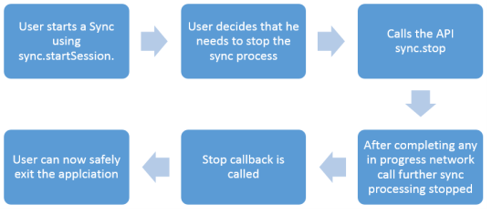

                          

Stop Sync
=========

You can stop the sync process using the sync.stop API.

stop.sync
---------

### Signature

**sync.stop(callback)**

### Platform Availability

The Stop Sync API is supported on the following platforms:

*   iOS
*   Android
*   Windows

### Example

sync.stop( function ()   
{   
alert(“Sync has been stopped”);   
});


Following illustration shows the end-to-end workflow for the stop sync API: 

Requirements
------------

Following are some of the key requirements that need to be enabled for the stop sync process: 

*   You must be able to call sync.stop to cancel any in progress sync.
*   If the network call is in progress, stop sync will not cancel the process right away. Instead it will wait for the network call to complete and stops triggering further sync calls (next batches or scopes).
*   If you call the stop.sync API multiple times, an error `Session is in Progress` appears and the sync continues.
    
*   If you call the stop.sync API when sync is not in progress, a sync cycle is triggered and makes network calls in background.
    
*   After the sync is stopped first the pending callbacks (like onbatchsucess, onscopesuccess will get called before invoking the stop callback).
