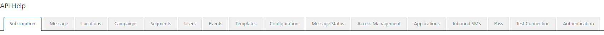

                           

Configuration
=============

The configuration API allows you to develop, deploy, and manage application configuration data by using a single programming interface. You can use the configuration API to develop and modify complete configurations.

From the **Settings** section, click **API Help** from the left panel. The API Access page appears with sixteen tabs: **Subscription**,**Message**, **Locations**, **Campaigns**,**Segments**, **Users**, **Events**, **Templates**, **Configuration**, **Message Status**, **Access Management**, **Applications**, **Inbound SMS**, **Pass**, **Test Connection** and **Authentication**. By default, the **Subscription** tab is set to active.

To view **Configuration** details, click the **Configuration** tab in the **API Help** screen. The Configuration tab displays following sections:

*   Get Basic Details
*   Create Basic Details
*   Get All Event Types
*   Get Event Type by ID
*   Create Event Type
*   Modify Event Type
*   Delete Event Type by ID
*   Get All Campaign Types
*   Get Campaign Type by ID
*   Create Campaign Type
*   Modify Campaign Type
*   Delete Campaign Type by ID
*   Get Email Configuration Details
*   Update Email Configuration
*   Get SMS Configuration Details
*   Update SMS Configuration
*   Get Pass Configuration Details
*   Update Pass Configuration
