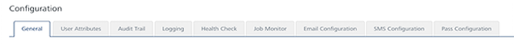

                            

Configuration
=============

The **Configuration** section enables you to configure various components for Volt MX Foundry Engagement Services.

From the **Settings** section, click **Configuration** from the left panel. The **Configuration** page appears with nine tabs including **General**, **User Attributes**, **Audit Trail**, **Logging** , **Health Check**, **Job Monitor**, **Email Configuration**, **SMS Configuration**, and **Pass Configuration**. By default, the **General** page is set to active.

Click a link in the list to view specific tab details:

*   [General](General - Settings.html)
*   [User Attribute](Administration/Audience_Attribute_tab.html)
*   [Audit Trail](Administration/Audit_Trail_tab.html)
*   [Logging](Logging/Logging.html)
*   [Health Check](Administration/Health_Check_tab.html)
*   [Job Monitor](Administration/Job_Monitor_tab.html)
*   [Email Configuration](Administration/Email_Configuration.html)
*   [SMS Configuration](Administration/SMS_Configuration.html)
*   [Pass Configuration](Administration/Pass_Configuration.html)
