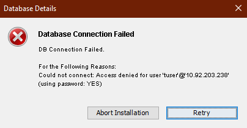

                             

FAQs and Troubleshooting
========================

This section lists the troubleshooting tips to resolve problems that you may encounter during installation, and post installation.

*   **Issue**: When you setup Volt MX Foundry (On-Premises) on WebSphere Liberty Profile using the Command Line Installer (CLI) the Storage DB feature fails. The failure occurs because the storage database type is a case-sensitive field which accepts only lowercase inputs. For example: oracle, mysql, mssql and mariadb. Whereas the CLI sets the database name in uppercase.
    
    **Workaround**
    
    Change the database name in the following sets of schemas and tables:
    
    *   **Schema**: ADMINDB
         <br> 
         **Table**: SERVER\_CONFIGURATION
         <br> 
        **Field / value**: storage\_database\_type = oracle / mysql / mssql / mariadb
        
    *   **Schema**: ACCOUNTS
    <br> 
        **Table**: FEATURES
        <br> 
        **Field / value**: {"storagedatabasetype":"oracle / mysql / mssql / mariadb","serverdatabasetype":"oracle / mysql / mssql / mariadb"}
        

*   **Issue**
    <br>
    The upgrade installation is rolling back with Validate failed from 8.2.1.3
    <br>
    Workaround
    <br>
    Before Upgrade, execute below SQL statement from admin database
    
    ```
    For **MySQL**  
    ------------  
    delete from <admindb>.schema\_version where script = 'V62.1\_\_voltmxadmin-mysql-8.2.0.0.sql';  
      
    For **SQLServer**  
    ---------------  
    delete from <admindb>.schema\_version where script = 'V62.1\_\_voltmxadmin-sqlserver-8.2.0.0.sql';  
      
    For **Oracle**  
    ----------  
    delete from <admindb>.schema\_version where script = 'V62.1\_\_voltmxadmin-oracle-8.2.0.0.sql';  
     ``` 
    

*   **Issue**
    <br>
    If you upgrade the integration service or install on new server using the existing database but with a different server details like fully qualified URL port, and when you publish an app, the app publish fails.
    <br>
    Workaround
    <br>
    You must update management server details in the `server_configuration` table in admin database.
    

*   **Issue**
    <br>
    If your service provider's certificate is not configured, the system displays an error - "peer not authenticated."
    <br>
    Workaround
    <br>
    For trusted certification issues, refer to [Service Provider's Certificate Issues](Post-Installation_Tasks.html#Service_Provider's_Certificate_Issues).
    

*   Issue - During design time of your app, the system throws errors due to several reasons.
    <br>
    For example:
    <br>
    Caused by: com.mysql.jdbc.exceptions.jdbc4.MySQLSyntaxErrorException: The size of BLOB/TEXT data inserted in one transaction is greater than 10% of redo log size. Increase the redo log size using innodb\_log\_file\_size.
    <br>
    Workaround
    <br>
    Increase the innodb\_log\_file\_size. For more details, refer to [Increase innodb\_log\_file\_size in the my.ini file.](Database_Prerequsites.html#increase-innodb-log-file-size-in-my-ini-file-for-engagement-services)
    

*   **Issue**
    <br>
    When customer wants to install Volt MX Foundry with Oracle as database type, the system throws the error: `Invalid Data Type SDO_GEOMENTRY`
    <br>
    Workaround
    <br>
    Install Oracle locator, which is required for Volt MX Foundry installation. For more details, refer to [Pre-installation Tasks > Create Locator Component for Oracle Database](Pre-installation_Tasks_JBoss.html#create-locator-component-for-oracle-database)
    

*   **Issue**
    <br>
    Admin health-check fails as access to reporting and storage Database is failing on JBoss with MariaDB.
    <br>
    Workaround
    <br>
    1.  Add the MySQL Connector jar in the  `admin.war/WEB-INF/lib` folder.
    2.  Add the MySQL Connector jar in the `services.war` for the Runtime RDBMS and storage services to work.
    
    > **_Note:_** This is applicable for JBoss multi-node and pre-configured JBoss, but not for the bundled JBoss.
    

*   **Issue**
    <br>
    After entering Database details the DB connection fails with the following error:
    <br>
    
    <br>
    Workaround
    <br>
    The password used for the Database must not contain exclamation marks (!).
    <br>

*   **Issue**
    <br>
    On Oracle Database, the following error occurs while upgrading the Volt MX Foundry Installer to version 8.2 or above from earlier versions:
    <br>
    `Invalid Column Type 16`
    <br>
    Workaround
    <br>
    Update the `authService.properties` with **Oracle10gDialect** as follows:
    
    `hibernate.dialect=org.hibernate.dialect.Oracle10gDialect`
    
*   **Issue**
    <br>
    If you are using any lower versions of MySQL 5.7 such as v5.7.12 or lower during installation, you may encounter an error due to which the installation rolls back. This error occurs due to a bug in the MySQL database.
    <br>
    For more information, refer [MySQL Bugs](https://bugs.mysql.com/bug.php?id=79286)
    <br>
    Following are the error details:
    <br>
    *   **Error**: Migration V810\_27\_01\_\_DeleteDuplicateAcsUserIdProviderGuidRowsAddUniqueConstraint.sql failed
    *   **SQL State**: HY000
    *   **Error Code**: 1093
    *   **Error Message**: You can't specify target table 'users' for update in FROM clause
    *   **Location**: <Location where the installation is done>
    <br>
    Workaround
    <br>
    To resolve this issue, refer [Prerequisites for Volt MX Foundry with MySQL- Applicable for Identity Services](Database_Prerequsites.html#applicable-for-identity-services).
    

Hostname/Port changes for Tomcat Application Server
---------------------------------------------------

Volt MX  Foundry On-Premises Installer provides a script to change the Hostname or Port of the installed Volt MX Foundry instance. In your installed Tomcat Application Server, you must also perform the following changes:

In `//tomcat/webapps/apiportal/WEB-INF/classes/config.properties`, replace the existing URL with the new URL in the following fields:

*   `VOLTMX_ACCOUNT_API_BASE_URL=`
*   `VOLTMX_DEVELOPER_PORTAL_BASE_URL=`

In `//tomcat/webapps/mfconsole/WEB-INF/classes/config.properties`, replace the existing URL with the new URL in the `VOLTMX_ACCOUNT_API_BASE_URL=` field.

In `//tomcat/conf/server.xml`, replace the port number with the new port number in the `<Connector server="VoltMX" port=` field.

In `//tomcat/webapps/accounts/WEB-INF/classes/accounts.properties`, replace the port number with the new port number in the following fields:

*   `VOLTMX_INTEGRATION_SERVICE_PORT=`
*   `VOLTMX_MESSAGING_SERVICE_PORT=`

How to Configure JBoss Cluster
------------------------------

*   Refer to [https://access.redhat.com/solutions/218053](https://access.redhat.com/solutions/218053) to setup EAP in Domain mode.
*   Refer to [https://docs.jboss.org/mod\_cluster/1.1.0.html/Quick\_Start\_Guide.html](https://docs.jboss.org/mod_cluster/1.1.0.html/Quick_Start_Guide.html) to configure the mod\_cluster.
    *   Refer to [https://access.redhat.com/solutions/2332111](https://access.redhat.com/solutions/2332111) to integrate the mod\_cluster with JBoss.

How to Configure Volt MX Foundry Behind a Reverse Proxy
------------------------------------------------------

If you want to access everything via a proxy URL, including Volt MX Foundry Console (for example, design time for your app developers) and authService, and integration services (for example, runtime from users using your apps), follow these steps:

1.  Install Volt MX Foundry with internal details like your internal IP and HTTP port.
2.  After installation, stop Volt MX Foundry Console (without configuring authservice details) and update the below properties files:
    1.  In the  `accounts.war/WEB-INF/classes`  folder, open the `accounts.properties`  file and update the below properties with a public URL instead of the private URL. By default, the private URL is set during installation:
        
        `WAAS_BASE_URL=<PUBLIC_URL_OF_YOUR_APACHE>/workspace`
        
        Examples of proxy URLs:
        
        * `WAAS_BASE_URL=http://test.voltmx.com/workspace`
        * `WAAS_BASE_URL=https://test.voltmx.com:8443/workspace`
        * `WAAS_BASE_URL=http://test.voltmx.com:8080/workspace`

    2.  Following are the changes to be made in the war for each App Server:
        * **Tomcat**: In `mfconsole.war/WEB-INF/classes`, open the `config.properties` file, and update the `` `VOLTMX_ACCOUNT_API_BASE_URL=&lt;PUBLIC_URL_OF_YOUR_APACHE&gt;/accounts/api/v1_0/` ``property with a public URL instead of the private URL that was generated during installation.
        * **JBoss** **\-** **Standalone (Bundled JBoss)**: In `` `Standalone/deployments/mfconsole.war` ``, open the `config.properties` file, and update the `VOLTMX_ACCOUNT_API_BASE_URL=&lt;PUBLIC_URL_OF_YOUR_APACHE&gt;/accounts/api/v1_0/` property with a public URL instead of the private URL that was generated during installation.
        * **JBoss - Pre-configured and Domain mode**: Take a backup of the existing war. Undeploy `mfconsole.war`. In `mfconsole.war/WEB-INF/classes`, open the `config.properties` file, update the `VOLTMX_ACCOUNT_API_BASE_URL=&lt;PUBLIC_URL_OF_YOUR_APACHE&gt;/accounts/api/v1_0/` property with a public URL instead of the private URL that was generated during installation, and re-deploy the war file.
3.  Start Volt MX Foundry Console.
4.  Launch your Volt MX Foundry Console in the browser by using `<PUBLIC_URL_OF_YOUR_APACHE>/mfconsole`. The auth setup page appears.
5.  Enter the auth URL with public URL like `<PUBLIC_URL_OF_YOUR_APACHE>/authService`. If you provide an internal IP here, appconfig will show internal IPs.
6.  Also after log in to Volt MX Foundry Console, while registering server, provide the `PUBLIC_URL` to register integration server. Now all the URLs will have the public hostnames.
    
    If you want to give public access only to runtime services like authservice and integration services you can skip step 2 and step 3 from the above procedure. This will make sure service document will have all public URLs.
    
    > **_Note:_** Proxy configuration should have preserver host directive for Volt MX Foundry to work correctly after start up.  
      
    For example, in case of apache proxy, use `` `ProxyPreserveHost On`  
    ``and in case of NGINX, use `` `proxy_set_header Host $host;` ``(For more information, refer [Passing request headers](https://docs.nginx.com/nginx/admin-guide/web-server/reverse-proxy#passing-request-headers))
    

How to Configure Frontend HTTPS to Tomcat HTTP Redirection
----------------------------------------------------------

If you are installing Volt MX Foundry on Tomcat on HTTP and wants to route requests via HTTPS apache or load balancer, add a connector in the `tomcat/server.xml` with the following attributes:

proxyName="<ProxyHost>" proxyPort="<ProxyPort>" scheme="https" secure="true"

**Example**:
```
<Connector server="VoltMXTEST" port="8080" protocol="HTTP/1.1" proxyName="mbaastest10.hcl.net" proxyPort="443" scheme="https" secure="true" maxHttpHeaderSize="8192" maxThreads="150" enableLookups="false" acceptCount="25" disableUploadTimeout="true" tcpNoDelay="true" compression="on" compressableMimeType="text/css,text/javascript,text.html" connectionTimeout="20000" URIEncoding="UTF-8"/>
```

How to Change Log Levels
------------------------

Refer to [How to Change Log Levels](Change_Log_Levels.html).

Also, refer to [Accessing Logs in Volt MX Foundry On-Premise Install](http://community.hclvoltmx.com/blogs/mobilefoundry/accessing-logs-volt-mx-mobilefoundry-premise-install).
