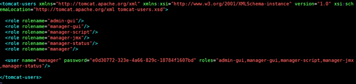

                           

Known Issues in Volt MX Foundry V9
=================================

Analytics
---------

*   Download of a report in the excel format fails due to a colon (: ) in the name of the report.
    
    For more information about this feature, click [here]({{ site.baseurl }}/docs/documentation/Foundry/custom_metrics_and_reports/Content/Saving_Custom_Reports_and_Ad_Hoc_Views.html).
    

Engagement
----------

*   It is not possible to add a title for Rich Push Template even though the option to save Rich Push Template with title is provided.

Identity
--------

*   OAuth Provider type is not displayed under **Data Panel** > **Project Services**.
*   In the **Manage App Store Users** window, the **App Store** link navigates to the wrong link.
*   It is not possible to import more than 100 different groups via CSV import of users.

Volt MX  Foundry SDK
------------------

*   An invalid SSO error occurs and the login fails even after providing the correct user ID and password.

Console
-------

*   **Issue with GET verb mapping and its variant mappings for SDO Object Services**
    
    In case of SDO Object Services, in the GET verb mapping the user can also configure extra variant mappings like `getByPk`, `getbatch`, etc.
    
    In Foundry V7.x or Foundry V8.x:
    
    *   Any changes made in the GET verb mapping override the changes made in the individual variant verbs like `getByPk` and `getbatch`.
    *   While generating the service definition during publish, the mappings made in the variant verbs are ignored and are instead stamped with the mapping of the GET Verb.
    
    When you upgrade from Foundry V7.x or Foundry V8.x to Volt MX Foundry V9:
    
    *   Any changes made in the GET verb mapping do not override the changes made in the individual variant verbs like `getByPk` and `getbatch`.
    *   While generating the service definition during publish to runtime, the mappings made in the variant verbs are respected and are stamped.
    
    Check the following post the V9-GA upgrade:
    
    *   Verify the individual GET Variant mappings on the Visual Editor / XML definition and validate them.
    

Installer
---------

<ul>
<li>

<b>Issue:</b> On certain system display resolutions, the Windows Installer UI may get distorted and you may face difficulties in proceeding with the installation.

 

<b>Workaround:</b> You must lower the scaling factor and/or resolution of your system and restart the installer.

 
</li>
<li>

<b>Issue:</b> Upgrade from 8.2.1.3 GA to V9.x gets reverted.

 

<b>Workaround:</b> Before the upgrade, execute the following SQL statement from admin database

 

For <b>MySQL</b>

———— delete from &lt; admindb&gt;.schema_version where script = ‘V62.1__voltmxadmin-mysql-8.2.0.0.sql’;

 

For <b>SQLServer</b>

———— delete from &lt; admindb&gt;.schema_version where script = ‘V62.1__voltmxadmin-sqlserver-8.2.0.0.sql’;

 

For <b>Oracle</b>

———— delete from &lt; admindb&gt;.schema_version where script = ‘V62.1__voltmxadmin-oracle-8.2.0.0.sql’;

 
</li>
<li>

<b>Issue:</b> While upgrading from Foundry 7.3 to Volt MX Foundry V9 and then upgrading to a version after V9, the upgrade fails due to the following error:”java.sql.SQLSyntaxErrorException: Table ‘prefixidglobaldbsuffix.schema_version’ doesn’t exist”.

 

<b>Workaround:</b> To avoid this issue, perform the following step:

<ul>
<li>Delete the idglobaldb schema before upgrading to the version later than V9.</li>
</ul>
</li>
<li>

<b>Issue:</b> When you setup Volt MX Foundry (On-Premises) on WebSphere Liberty Profile using the Command Line Installer (CLI) the publish of the Storage application fails. The failure occurs when you enter the database type input in upper or mixed casing. The storage database type is a case-sensitive field which accepts only lowercase inputs. For example: oracle, mysql, mssql and mariadb.

 

<b>Workaround:</b> Change the database name in the following sets of schemas and tables:

<ul>
<li><b>Schema:</b> ADMINDB <b>Table</b>: SERVER_CONFIGURATION <b>Field / value</b>: storage_database_type = oracle / mysql / mssql / mariadb</li>
<li><b>Schema:</b> ACCOUNTS <b>Table</b>: FEATURES <b>Field / value</b>: {“storagedatabasetype”:”oracle / mysql / mssql / mariadb”,”serverdatabasetype”:”oracle / mysql / mssql / mariadb”}</li>
</ul>
</li>
<li>

<b>Issue:</b> The publishing of a Storage application fails on an environment that uses the SQLServer with Windows authentication.

 

<b>Workaround:</b> In the <code>server_configuration</code> table of the Integration database(admindb) insert the key <code>VOLTMX_SERVER_IS_WINDOWS_AUTHENTICATION_ENABLED</code> with value set to <b>true</b>. Restart the application server.

 
</li>
<li>

<b>Issue:</b> On a Volt MX Foundry environment installed on Apache Tomcat the attempt to publish a web application fails with a 403 error. This error occurs due to the increased strictness of the ordering of tags within the <code>tomcat-users.xml</code> file that comes with the Installer bundled Tomcat v9.0.33. 

 

<b>Workaround:</b> Update the tomcat-users.xml file located at <em>&lt;TOMCAT_HOME&gt;</em>&#47;conf&#47;and ensure all the <b>&lt;role&gt;</b> tags precede the all the <b>&lt;user&gt;</b> tags.

Example configuration:

 
</li>
<li>

<b>Issue:</b> While upgrading Identity from Foundry 7.0/7.1 to Volt MX Foundry V9.x with the selected database as MSSQL, the upgrade fails due to the following errors that occur due to the Flyway tool version upgraded from 3.x to 4.x:

<ul>
<li>Failed to DROP INDEX “”.”schema_version_ir_idx”</li>
<li>Failed to DROP INDEX “”.”schema_version_vr_idx”</li>
</ul>

<b>Workaround:</b> To avoid this issue, perform the following steps:

Remove the version_rank column from the schema_version table in the authglobaldb by following queries before the upgrade.

<figure class="highlight">
<pre><code class="language-voltmx" data-lang="voltmx">DROP INDEX schema_version_ir_idx ON dbo.schema_version
GO
DROP INDEX schema_version_vr_idx ON dbo.schema_version
GO
ALTER TABLE dbo.schema_version DROP CONSTRAINT schema_version_pk
GO
ALTER TABLE dbo.schema_version DROP COLUMN version_rank
GO
ALTER TABLE dbo.schema_version ADD CONSTRAINT schema_version_pk PRIMARY KEY CLUSTERED (installed_rank)
GO
ALTER TABLE dbo.schema_version ALTER COLUMN version nvarchar(50) NULL
GO  
</code></pre>
</figure>
</li>
</ul>
