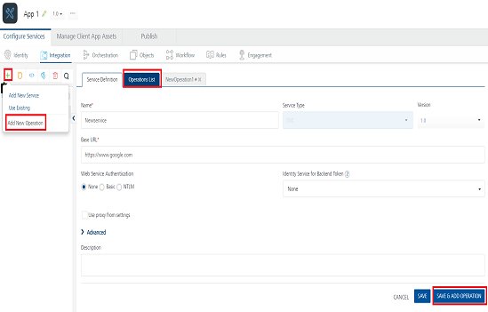

                                

User Guide: [Integration](Services.html#integration) \> [Configure the Integration Service](ConfigureIntegrationService.html) > API Proxy Adapter

API Proxy Adapter
-----------------

With Volt MX Foundry API Proxy (pass-through proxy) integration service, you can forward the request and response without intermediate transformation (without affecting the actual request and response.)

**For example**:

If an organization has an existing set of APIs already exposed and wants to secure and throttle the APIs, it can use the API Proxy adapter. By enabling API Proxy, the input (body and headers) of a client's input request is forwarded to the back end and the output response from the back end is forwarded to the device with no changes in the input request and output response.

If your APIs are documented using an Open API Specification file (Swagger file), you can create a new API Proxy service and import the OAS(Swagger) file to automatically create Volt MX Foundry Operations.

You can configure API Proxy integration service for the following endpoints:

*   XML
    
*   JSON

### Configure API Proxy Endpoint Adapter

To configure API Proxy service in the **[Integration Service Definition](ConfigureIntegrationService.html)** tab, follow these steps:

1.  In the **Name** field, provide a unique name for your service.
2.  From the **Service Type** list, select **API Proxy**.  
    
3.  Provide the following details in the API Proxy service definition:  
    

  
| Field | Description |
| --- | --- |
| Base URL Configuration | **Base URL** - Type the URL (provide the format and explain the URL parameters) **Upload Open API file** - Click Upload File, the system allows you to upload an OAS (Swagger) file. Navigate to the swagger file from your local system, and click Open. The system uploads the selected swagger file. The operations for your API proxy service are created based on the resources defined in OAS (Swagger) file. |
| Web Service Authentication | Web Service Authentication Select one of the following modes: **None**\- Select this option if you do not want to provide any authentication for the service. **Basic**\- Provide User ID and Password if the external Web service requires a form or basic authentication. **NTLM**\- Your service follows the NT LAN Manager authentication process. You are required to provide the User ID, Password, NTLM Host, and NTLM Domain. |
| Identity Service for Backend Token | Select the Identity service associated with your app if this service needs backend token like access\_token from that Identity service to access the backend server. |

  
6.  

For additional configuration of your service definition, provide the following details in the **Advanced** section:

    
      
    | Field | Description |
    | --- | --- |
    | Custom Code | Custom Code enables you to specify dependent JAR. To specify dependent JAR, select the JAR containing preprocessor or postprocessor libraries from the drop-down list, or click **Upload New** to browse the JAR file from your local system. This step allows you to further filter the data sent to the back end.> **_Important:_** Make sure that you upload a custom JAR file that is built on the same JDK version used for installing Volt MX Foundry Integration. For example, if the JDK version on the machine where Volt MX Foundry Integration is installed is 1.6, you must use the same JDK version to build your custom jar files. If the JDK version is different, an unsupported class version error will appear when a service is used from a device. |
    | Throttling | API throttling enables you to limit the number of request calls within a minute. If an API exceeds the throttling limit, it will not return the service response. **To specify throttling in Volt MX Foundry Console, follow these steps:**
    In the **Total Rate Limit** text box, enter a required value. With this value, you can limit the number of requests configured in your Volt MX Foundry console in terms of Total Rate Limit. In the **Rate Limit Per IP** text box, enter a required value. With this value, you can limit the number of IP address requests configured in your Volt MX Foundry console in terms of Per IP Rate Limit.
    
    **To override throttling in App Services Console, refer to** [Override API Throttling Configuration](API_Throttling_Override.html#override-api-throttling-configuration). > **_Note:_** In case of On-premises, the number of nodes in a clustered environment is set by configuring the `VOLTMX_SERVER_NUMBER_OF_NODES` property in the Admin Console. This property indicates the number of nodes configured in the cluster. The default value is 1.Refer to [The Runtime Configuration tab on the Settings screen of App Services]({{ site.baseurl }}/docs/documentation/Foundry/vmf_integrationservice_admin_console_userguide/Content/Runtime_Configuration.html).The total limit set in the Volt MX Foundry Console will be divided by the number of configured nodes. For example, a throttling limit of 600 requests/minute with three nodes will be calculated to be 200 requests/minute per node.This is applicable for Cloud and On-premises. |
    | URL Provider Class | Enter the qualified name of the URL Provider Class. For more information, refer [URL Provider Support for XML, JSON, SOAP, and API Proxy](URL_Provider_Support_for_XML__JSON__SOAP_and_API_Proxy.html). |
    
    > **_Note:_** All options in the Advanced section are optional.
    
7.  In the **Description** field, provide a suitable description for the service.
8.  To enable the proxy, select the **Use proxy from settings** check box. By default, the check box is cleared. The Use proxy from settings check box dims when no proxy is configured under the **[Settings > Proxy](Settings.html#proxy)**.
    
9.  Click **Save** to save your service definition.

### Create Operations for API Proxy

The **Operations List** tab appears only after the service definition is saved.

> **_Note:_** Click **Operations List** tab > **Configure Operation**. The **Configured Operations** list appears.

> **_Important:_** If you have imported an OAS (Swagger) file, the operations for your API proxy service are created automatically from that OAS (Swagger) file. The endpoint URL is also auto-generated based on the Swagger file. The auto-generated operations for a proxy service will not have request/response parameters.

1.  Click **SAVE & ADD OPERATION** in your service definition page to save your service definition and display the **NewOperation** tab for adding operations.  
                        OR  
    Click **Add Operation** to add a new operation or from the tree in the left pane, click **Add > Add New Operation**.  
    
    

Click to View image

    
    
    
    > **_Note:_** To use an existing integration service, refer to [How to Use an Existing Integration Service](Manage_Existing_Integration_Services_1.html#how-to-use-an-existing-integration-service).
    

1.  To create an operation, provide the following details:  
    

  
| Field | Description |
| --- | --- |
| Name | Enter a unique name for your operation. |
| Operation Security Level | It specifies how a client must authenticate to invoke this operation.

Select one of the following security operations in the **Operation Security Level** field.
 

**Authenticated App User** – It restricts the access to clients who have successfully authenticated using an Identity Service associated with the app. **Anonymous App User** – It allows the access from trusted clients that have the required App Key and App Secret. Authentication through an Identity Service is not required. **Public** – It allows any client to invoke this operation without any authentication. This setting does not provide any security to invoke this operation and you should avoid this authentication type if possible. **Private** - It blocks the access to this operation from any external client. It allows invocation either from an Orchestration/Object Service, or from the custom code in the same run-time environment.

 |
| Front End HTTP Method | Select a HTTP method that you want to invoke on the integration server. By default, the field is set to **Post** method. > **_Note:_** The front-end HTTP methods are used for all non-SDK clients such as API Management users. Invoking a service from an SDK will continue to use the POST method for operations. > **_Note:_** From SP3 onwards, the **Front End HTTP Method** is called as **Resource Method**. You can configure the **Resource Method** in the [**Advanced**\> **Front End API** section](FrontEndAPI.html). |
| Target HTTP Method | Select a HTTP method that you want to invoke on the back-end service from integration server. |
| Operation Path | Modify the path if required. > **_Note:_** If you provide incorrect Salesforce endpoint details, the **Object** list will contain only _\_Login_ object. |
| Base URL and Target URL | The **Target URL** field is prepopulated with the URL that you provided at the **Base URL** field. You can add the suffix, if required. For example, to the base URL, you can add suffix such as `/latest`  or `/sports` to get latest news or sports news: ``http://feeds.foxnews.com/foxnews`/latest` `` ``http://feeds.foxnews.com/foxnews`/sports` `` |

  
4.  

 response operations, provide the following details in the **Advanced** section:

    
      
    | Field | Description |
    | --- | --- |
    | Custom Code Invocation | You can add pre and post processing logic to services to modify the request inputs. When you test, the services details of various stages in the service execution are presented to you for better debugging. All options in the Advanced section are optional. For more details, refer to [Preprocessor and Postprocessor](Java_Preprocessor_Postprocessor_.html). |
    | Properties | [Additional configuration properties (timeout, cachable, unescape embedded xml in response, response encoding, number of connection retries](Java_Preprocessor_Postprocessor_.html#timeout_cachable) allows you to configure service call time out cache response |
    | Front End API | It allows you map your endpoint/back-end URL of an operation to a [front-end URL](FrontEndAPI.html). |
    | Server Events | Using Server Events you can configure this service to trigger or process server side events. For detailed information, refer [Server Events](ServerEvents.html). |
    
    > **_Note:_** All options in the Advanced section are optional.
    
5.  Click **Save** to save the operation.

### Limitations for API Proxy Adapter

*   API Proxy service operations and operations for which pass-through (inputs, headers, and outputs) is enabled cannot be used in orchestration services.  
    For example, when you create an integration service with an API Proxy type or the operations of XML, SOAP, or JSON endpoints with pass-through enabled, the system does not show the services and operations while configuring orchestration operations.
*   Using the MBaaS Client SDK with API Proxy integration service is not supported.

### How to Enable Pass-through Proxy for Operations

You can also configure the following pass-through proxy flags in operations for adapters such as [XML](XML.html#Adding), [SOAP](SOAP.html#Adding2), and [JSON](JSON.html#Adding3):

*   Under the **Request Input> Body** tab, select the **Enable pass-through input body** check box to forward the body of a client's request to the back end.
*   Under the **Request Input****\>****Header** tab, select the **Enable pass-through input header** check box to forward headers of a client's request to the backend.
*   Under the **Response Output** tab, select the **Enable pass-through output body** check box to forward the response from the backend to a client.
