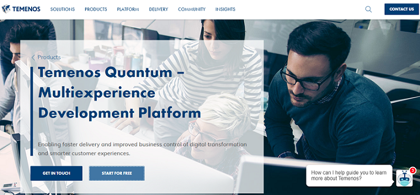
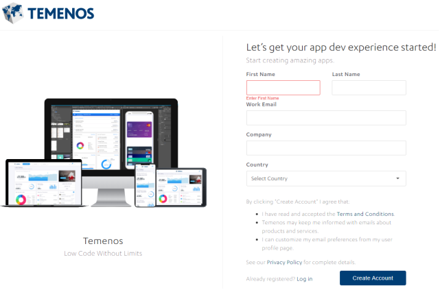
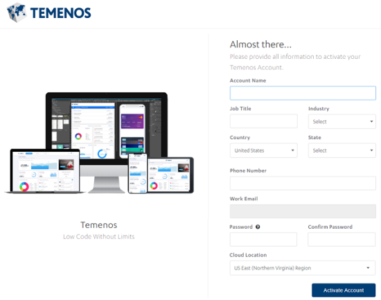
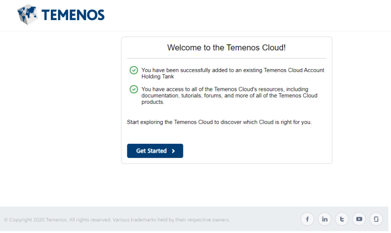
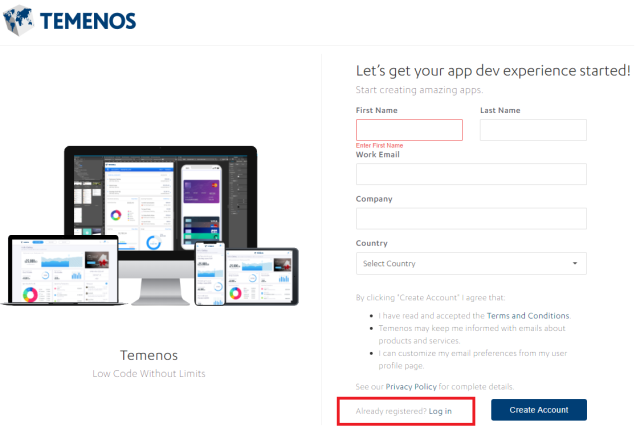
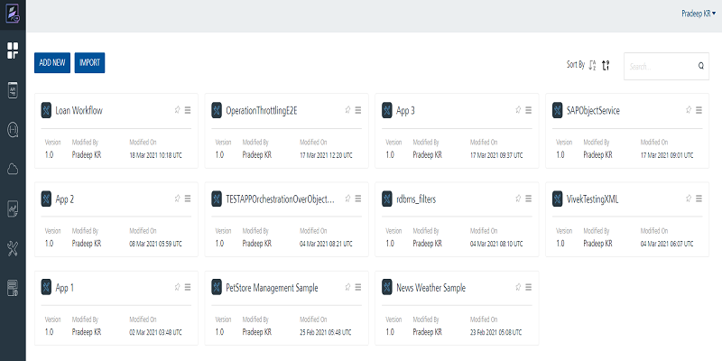

                              

User Guide: Create a Volt MX Foundry Account

Accessing Volt MX Foundry Console - Cloud
========================================

Before you use various Volt MX Foundry services, you must register with Volt MX.

To access Volt MX Foundry, follow these steps:

1.  [Create a Volt MX Foundry Account](#create-a-foundry-account)
2.  [Access Volt MX Foundry Portal](#access-foundry-portal)

Create a Volt MX Foundry Account
-------------------------------

If you do not have a Volt MX account, follow these steps to create a Volt MX Foundry account:

1.  Go to [HCL VoltMX](https://www.hcl.com/products/voltmx/), and then click **START FOR FREE** button.
    
    
    
    The **Let’s get your app dev experience started!** page is displayed.
    
    
    
2.  Provide the required details.
3.  Click **Create Account**.
4.  An email is sent to your registered email ID an activation link. Click the link, or copy the link on the browser. The **Activate Your Account** page appears.
    
    
    
5.  Complete the required details in the activation page to create a Volt MX Foundry cloud account.
6.  Click **Activate Account**.
    
    Welcome to the Volt MX Cloud! page appears.
    
    
    
7.  Click **Get Started**.
8.  Enter details in the **Sign in to your Account** page.
9.  Click **SIGN IN**.

If you have a Volt MX Account, follow these steps for creating a Volt MX Foundry cloud account:

1.  Go to [HCL VoltMX](https://www.hcl.com/products/voltmx/), and then click **Start for free** from the top menu.
    
    
    
    The **Let's get your app dev experience started!** page is displayed.
    
    
    
2.  Click on **Already registered? Log in.**
3.  Enter details in the **Sign in to your Account** page.
4.  Click **SIGN IN**.

Access Volt MX Foundry Portal
----------------------------

To access your cloud account, follow these steps:

1.  Go to [https://manage.hclvoltmx.com](https://manage.hclvoltmx.com/).
2.  Provide your Volt MX account login credentials, and then click **Sign in**.
3.  After validating your credentials, you are directed to your Volt MX Foundry account (VoltMX Cloud).
    
    
    
    From Volt MX Foundry Console, you can navigate to the following:
    
    *   **Apps**: For more information on **Applications**, refer to [Adding Applications](Adding_Applications.html).
        *   The **Iris Previews** page lists the test live previews that you performed in a particular Cloud account. Volt MX Iris supports the **Run Live Preview** option that you can use to preview a prototype of your Iris application.  
            For more information on How to user Live Preview in Volt MX Iris, refer [Live Preview]({{ site.baseurl }}/docs/documentation/Iris/iris_user_guide/Content/LivePreview.html)
            
        *   The **Iris Projects** page lists the projects that you published to a particular Cloud. The Project tab in Volt MX Iris contains the **Export > Cloud Project** option.  
            For more information on How to share a project on the Cloud, refer [Publish your project to the cloud]({{ site.baseurl }}/docs/documentation/Iris/iris_user_guide/Content/ShareProjectOnTheCloud.html)  
            
    *   [API Management](API_Management.html): Configure and manage (create, edit, and delete) app services (identity, integration, and orchestration) without linking or configuring them within an app.
    *   [Developer Portal](VoltMXDevPortal.html): Allows you to create a Portal for exposing APIs created using Volt MX Foundry. Developers from internal and external partner teams can access the portal created to explore and test the APIs.
    *   **Clouds (Environments)**: For more information on Cloud/Environments (VoltMX Cloud), refer to [Environments - Volt MX Cloud](Environments-Cloud.html).
    *   **Reports**: For more information on **Reports**, refer to [Custom metrics and reports]({{ site.baseurl }}/docs/documentation/Foundry/custom_metrics_and_reports/Content/Custom_Metrics_and_Reports_Guide.html).
    *   **Settings**: Allows you to invite users associated with account roles such as admin, billing, and member.
    *   **Support**: Displays links to the latest tutorials and articles and Developer resources from Base Camp Library. [Click here for more information](Support.html).
    
    > **_Note:_** The release version of a console is displayed at the bottom left corner in the console menu pane. The release version is in the following format:  
    `<Major_version> <servicepack> <hotfix> <DEV/QA>`  
    For example: `V8 SP1 HF4 DEV`
    

Accessing Volt MX Foundry Standard
---------------------------------

Volt MX  introduces a Foundry Standard edition which is a subset of Volt MX Foundry runtimes made available at a lower cost.

**To access Volt MX Foundry Standard, follow these steps:**

1.  You need to contact the Volt MX sales representative to enable a plan.
    *   Volt MX sales representative discusses regarding the suitable plan and the plan information will be passed to the Volt MX Accounts team.
    *   Accounts team will create the cloud plan JSON with free SKU (i.e. access to Volt MX Foundry Workspace) and links the same to the customer’s account.
        
2.  On selecting the Volt MX Foundry Standard edition, customers can access the following:
    *   [Accessing Volt MX Foundry Workspace/Console](#foundry-workspace-console) and
    *   [VoltMX Foundry Standard](#foundry-standard)

### Volt MX Foundry Workspace/Console

Volt MX  Foundry Workspace/Console is available as a part of Volt MX Foundry Standard edition but no environments are available. Links to use the trial version or to purchase the SKU are displayed. You can view, create apps and use all the features of Volt MX Foundry Console except the features that involve runtime.

### Volt MX Foundry Standard

The standard SKU of Volt MX Foundry Standard excludes the following features:

*   Integration (VoltMX LOB Adapters are not available i.e Salesforce and SAP adapter)
*   Sync
*   Engagement
*   Analytics (custom)
*   App Management
*   IoT Services

Following features are available to access in Volt MX Foundry Standard:

*   [Identity](Identity.html) (All Providers)
*   [Integration](Services.html) (Tech Adapters only)
*   [Orchestration](Orchestration.html)
*   [Object Services](Objectservices.html)
*   [API Management](API_Management.html)
*   [Analytics]({{ site.baseurl }}/docs/documentation/Foundry/standard_metrics_reports_guide/Content/standard_metrics_reports_guide.html) (Standard Reports only)
*   [Node.js runtime]({{ site.baseurl }}/docs/documentation/Foundry/voltmx_foundry_user_guide/Content/Logic.html)

> **_Note:_** Be default, a customer having access to Standard SKU cannot view the custom reports.  
If a customer has the provision to access two cloud environments, one with the Enterprise SKU and the other with the standard SKU, they can view/access the custom reports.

### Error Messages

If a customer tries to access the features that are not available, following error messages are displayed,

*   If you try to access the features which are not available, the following message is displayed during the publish time "**Your application contains sky services that are not supported by the type of environment you have selected. Please select a different environment or contact support**".
    
*   If the server is not provisioned for the feature accessed, the following error message is displayed “**Server Connection failed**”.
