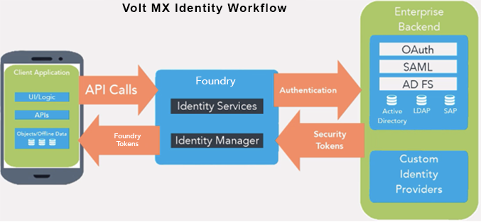

                               

User Guide: Benefits of using Volt MX Identity

Identity
========

Volt MX  Foundry identity services help you secure your application by adding an authentication layer.

You can set up an identity service based on the type of the users who are allowed to access your application. To restrict access to your company's internal audience, use Microsoft Active Directory authentication. To allow access of your application to a larger audience, you can use enterprise identity providers (Microsoft Active Directory, Volt MX SAP Gateway, Open LDAP, OAuth 2.0, Salesforce, Custom Identity Service, SAML 2.0, Siteminder ) and social identity providers (Google, Linkedin, Instagram, Amazon, Microsoft, Yahoo, BOX, Facebook.)

Benefits of using Volt MX Identity
----------------------------------

*   Volt MX Foundry’s Identity Service User Interface eliminates coding backend authentication mechanisms into your app.
*   All the auth token handling is done at Volt MX Foundry layer to make applications more secure.

Workflow of Volt MX Identity Services
-------------------------------------

The following workflow describes the various stages of Identity services:

Supported Identity Providers
----------------------------

Volt MX  Foundry Identity Services support connectivity to the following different identity providers.

  
| Enterprise Identity Providers | Social Identity Providers (OAuth 2.0) |
| --- | --- |
| [Microsoft Active Directory](Identity2_MS_AD.html#microsoft-active-directory-identity-service)   [Salesforce](Identity3_Salesforce.html#salesforce-identity-service)   [Open LDAP](Identity4_LDAP.html#open-ldap-identity-service)   [SAML 2.0](Identity5_SAML.html#saml-2-0-identity-service)   [Siteminder](Identity6_SiteMinder.html#siteminder-identity-service)   [VoltMX SAP Gateway](Identity7_VoltMX_SAP.html#sap-gateway-identity-service)   [VoltMX User Repository (User Store)](Identity12_VoltMXUR.html#user-repository-identity-service)  (Support is deprecated from V8 SP4 AprilFP onwards) (The Volt MX User Repository identity service is available in every Volt MX Foundry account by default. You are allocated only a single instance of the Volt MX User Repository for a single Volt MX Foundry account. Volt MX User Repository stores meta-data of all users in the account, such as Email, First Name, Last Name, and Password, and Groups.)   [User Repository Identity Service](UserRepositoryIdentityService.html)  (You are allocated to create multiple instances in a one Volt MX Foundry Account. User Repository stores meta-data of users in the account, such as Email, First Name, Last Name, and Password, and Groups.)   [VoltMX Custom Identity Service](Identity8_VoltMX_Custom.html#custom-identity-service)   [Facebook](Identity9_Facebook.html#facebook-identity-service)   [VoltMX Foundry OAuth 2.0](Identity10_VoltMX_OAuth2.html#foundry-oauth-2-0-identity-service)   [OAuth Provider](Identity11_OAuth.html#oauth-provider-identity-service)   [Application SSO](Overview_AppSSO.html#AppSSOoverview) | [Social identity providers](Identity13_Social.html#social-identity-providers), including:   Google   Linkedin   Instagram   Amazon   Microsoft   Yahoo   BOX   Facebook |
