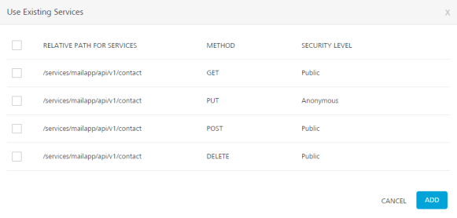
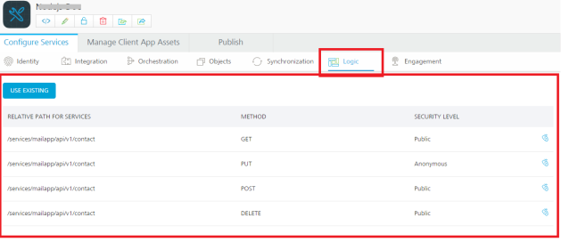
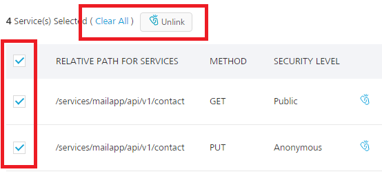
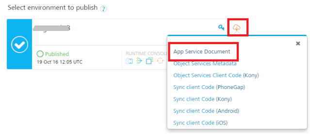
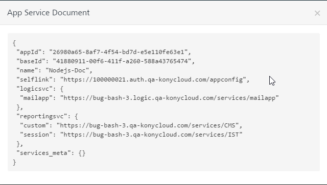

                              

User Guide: [APIs in API Management](API_Management.html) > [Logic in API Management](Logic.html) > [Node.js Services Integration in Foundry](Logic.html#node-js-services-integration-in-foundry) > How to Integrate Node.js Services into Foundry Apps

### How to Integrate Node.js Services into Volt MX Foundry Apps

After you import a Node.js package into Volt MX Foundry and publish the package to the Node.js Runtime Server in the **[API Management > Logic](Logic.html#CreatingLogic)** tab, you can now integrate the Node.js services to Volt MX Foundry apps.

To integrate Node.js services into Volt MX Foundry app, follow these steps:

1.  After you [create an application](Adding_Applications.html), in the **Configure Services** tab, click the **Logic** services tab.
2.  Click **Use Existing**.
    
    The **Use Existing Services** screen appears with the list of services that you imported from the Node.js package.  
    The following fields are displayed for the imported services.
    
    *   **RELATIVE PATH FOR SERVICES**:
    *   **METHOD:**
    *   **SECURITY LEVEL**: Displays the security level set for this service. You can change the security level in **API Management** > **Logic** tab, if required.
        
        
        
3.  Select check box for required services and then click **ADD**. After the services are added into Volt MX Foundry app successfully, the services are listed in the **Logic** page of your app.
    
    > **_Note:_**  If a service is part of a published app, you can delete that service only after you unlink the service from all the published apps.
    
    
    
    **Unlink**: Allows you remove the service from the **Logic** list page of an app. When a service is unlinked, it is disassociated from a particular app.
    
    > **_Note:_** You can also unlink multiple services from the **Logic** list page. To unlink multiple services, select the required check boxes. The quick access bar for the selected services appears with actions (such as Clear All and Unlink). Click **Unlink**.  
      
    **\-  Clear All**: Allows you to clear the one or more check boxes for the services.  
      
    \-  **Unlink**:  Allows you remove the service from the **Logic** list of an app. When a service is unlinked, it is disassociated from a particular app.  
      
      
    
4.  Publish the app. For information about publishing a Volt MX Foundry app, refer to [Publish](Publish.html).
    
    Once the app is published, you can view the app publish details by clicking the **Download** button > **App Service Document** link.
    
    
    
    The **App Service Document** dialog appears with logic services.
    
    
    

<table style="margin-left: 0;margin-right: auto;" data-mc-conditions="Default.HTML5 Only"><colgroup><col> <col> <col></colgroup><tbody><tr><td>Rev</td><td>Author</td><td>Edits</td></tr><tr><td>7.2</td><td>SD</td><td>SD</td></tr></tbody></table>
