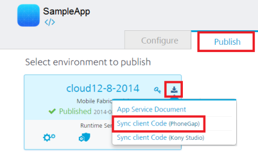

                             

User Guide: [SDKs](../Foundry_SDKs.html) > [Cordova (PhoneGap) SDK](Installing_PhoneGap_SDK.html) > Invoking a Sync Service

Invoking a Sync Service
=======================

Prerequisites
-------------

Download the required Volt MX Foundry Sync JS files for Cordova, and perform Init and relevant Sync operations.

To download Volt MX Foundry Sync JS files, follow these steps:

1.  In your **VoltMX Foundry** portal > **Apps** > **Publish** tab, navigate to your **published app**.
2.  Click **Download**, and then click **Sync client Code (PhoneGap)** shown below:
    
    
    
    The system prompts you to save the zip (for example, Sync\_voltmx.zip) file into your local system.
    
3.  Extract the zip file that you just downloaded. The zip file contains `VoltMXSyncDDL.js`  and  `VoltMXSyncScopes.js`, and respective model files that are specific to an application.
    
4.  Include these JS files in your app by using the following script tag. For example: 
    //say the files are VoltMXSyncDDL.js and VoltMXSyncScopes.js that are placed in a folder called "js"
    
    < script type = "text/javascript"
    src = "js/VoltMXSyncDDL.js" < /script>
    
    
    

Use the following code for instantiating sync object to call sync related APIs.

 
//Sample code to instantiate sync services

syncObj = voltmxSDKObj.getSyncService();


The syncObj can call sync related APIs, as shown below:

Init
----

This method creates backend mobile SQLite database.

 syncObj.init (syncInitSuccessCallback, syncInitFailureCallback);


For more information, refer to [Sync Framework Documentation > sync.init.]({{ site.baseurl }}/docs/documentation/Foundry/vmf_sync_orm_api_guide/Content/Application_Level.html#sync.init)

startSession
------------

This method initiates bi-directional sync between a server and mobile clientInformation.

 syncObj.startSession(config);


**Config**: a JavaScript object containing various callbacks and parameters, and is required for every sync process. For more information, refer to [Sync Framework Documentation > sync.startSession.]({{ site.baseurl }}/docs/documentation/Foundry/vmf_sync_orm_api_guide/Content/Application_Level.html#sync.startSession)

For other sync APIs, refer to [Sync Framework Documentation]({{ site.baseurl }}/docs/documentation/Foundry/vmf_sync_orm_api_guide/Content/homepage.html).

To perform database operations, there are ORM APIs, which are exposed by Sync framework. For more details, click [Sync Services ORM APIs.]({{ site.baseurl }}/docs/documentation/Foundry/vmf_sync_orm_api_guide/Content/homepage.html)
