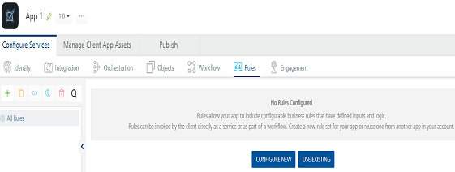
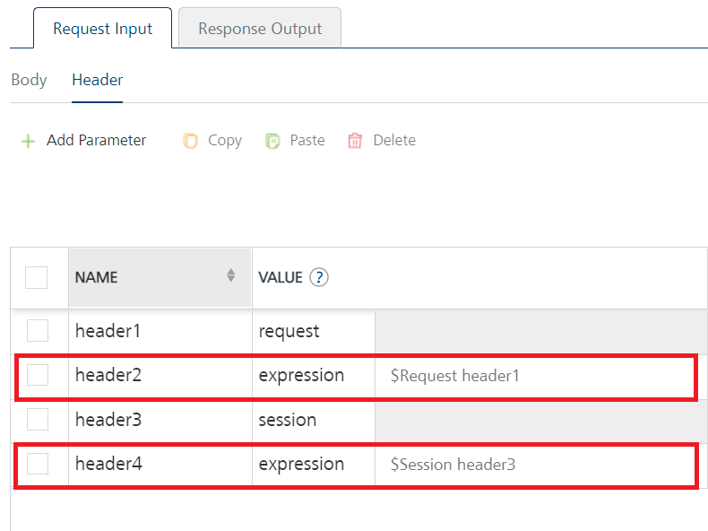

                                

User Guide: How Rules as Service Works

Rules as a Service
------------------

Volt MX Foundry provides the ability to write business rules in a simplified text form by using the Rules-as-a-Service feature. The Rules service makes defining business logic closer to human language and is built using [MVEL](http://mvel.documentnode.com/ "MVEL is an expression language based on Java-syntax, with some marked differences specific to MVEL.  Unlike Java however, MVEL is dynamically typed (with optional typing), meaning type qualification is not required in the source. "). Instead of embedding rules within Foundry integration services, with Rules as a first-class service, the business logic and conditions are externalized and can be managed separately. For example, let’s say in a Banking app there could be certain business rules defined to control whether a customer is eligible for a loan. However, these business rules for loan eligibility (like credit score and income level) might vary from time to time based on market conditions, bank’s promotional offers, and regulatory changes. In such cases, Foundry Rules-as-a-Service provides the ideal design to abstract these business rules from other application logic and manage them separately. This also provides Rules-as-a-Service all the capability of any Foundry service including versioning, export, import across Foundry apps, API management.

You can use the **Rules** service tab to define and store your business logic as a set of rules. A collection of rules defined in a Rules service are stored in a Ruleset. For example, a Loan Ruleset can have multiple rules such as Home Loan Rule, Education Loan Rule, Vehicle Loan Rule and so on. Similar to how any Foundry service operation can be protected by Operation security levels, rules in a Ruleset can also be protected by Rule Security Level. These are: [Authenticated App Users, Anonymous App Users, Public, and Private.\- Authenticated App Users restricts access to clients who have successfully authenticated using an Identity Service associated with the app. - Anonymous App Users allows access from trusted clients that have the required App Key and App Secret. - Authentication via an Identity Service is not required.Public (All Users) allows any client to invoke this rule without any authentication. This setting provides no security for invoking this rule and should be avoided if possible. - Private (Internal Server only) blocks access to this rule from any external client. It allows invocations only from within the same runtime environment either from an Orchestration/Object Service, or from custom code.](javascript:void(0);)

**How Rules as Service Works**

Rules in a Rules service are not dependent on any back-end system and are executed within the Volt MX App Server. So, rules defined as a service are dependent between a client app and a Foundry app. The rules can be changed for a particular app and republish the app as required. Based on request input parameters in a request sent to a Foundry app, a set of conditions in a particular rule will be evaluated and the corresponding action will be performed whenever the condition matches. And, then Volt MX App Server sends the response to the client.

**Why and When to Use Rules-as-a-service**

When you are creating an application that has a significant portion of business logic/rules that need to be managed/modified from time to time, define those business logic as separate rules service in your Foundry application. The following are some of the sample use cases where you can use Rules-as-a-service: 

*   For Banks and financial institutions when they want to develop lending apps – to abstract Rules determining Loan eligibility
*   For Retail and e-commerce institutions when they want to separate out promotional campaigns – which can then be modified seasonally
*   For Insurance providers when they evaluate if a potential new customer meets eligibility requirements

**Use Case:**

A bank app with a set of rules defined as a Rules service in a Foundry app is published. A user of this client app sends request to the app to check loan eligibility. The request may contain input params, which can be used to evaluate the condition in Rules, for example, the condition is: `Credit Rating between 300 and 669, credit length less than 5`. Volt MX App Server executes the logic defined in the rules service in the app based on the input params (`creditRating`and `creditLengthInYears`), and then sends the desired response.

The following table details client requests and Foundry Server responses executed based on a sample rule.

  
| Step 1  Client App A user sends requests with Input Params to the **published Foundry app** as follows: | Step 2 **Foundry App** with Rules Service published to **Volt MX App Server** ||
| --- | --- | --- |
| a. Volt MX App Server executes the logic defined in the Rules service | b. Volt MX App Server sends the Response to the client app |
| --- | --- |
| creditRating = 300 or 669 creditLengthInYears = 5 | **Sample rule** name: "Credit Rating between 300 and 669, credit length less than 5 " description: "Credit Rating between 300 and 669, credit length less than 5 " condition: "creditRating >= 300 && creditRating <= 669 && creditLengthInYears <= 5" actions: - "results.addParam(\\"status\\", \\"Reject\\")"---name: "Credit Rating between 300 and 669, credit greater than 5 " description: "Credit Rating between 300 and 669, credit greater than 5 " condition: "creditRating >= 300 && creditRating <= 669 && creditLengthInYears > 5 " actions: - "results.addParam(\\"status\\", \\"Review\\")"---name: "Credit Rating between 670 and 750, credit length less than 5 " description: "Credit Rating between 670 and 750, credit length less than 5 " condition: "creditRating >= 670 && creditRating < 750 && creditLengthInYears <= 5 " actions: - "results.addParam(\\"status\\", \\"Approve\\")" - "results.addParam(\\"interestRate\\", \\"10\\")"---name: "Credit Rating greater than 750, credit greater than 5 " description: "Credit Rating greater than 750, credit greater than 5 "condition: creditRating >= 750 && creditLengthInYears > 5actions:- "results.addParam(\\"status\\", \\"Approve\\")"- "results.addParam(\\"interestRate\\", \\"5\\")" | {"opstatus":0,"status" : "Reject"} |
| creditRating = 300 or 669 creditLengthInYears = 6 |^^| {"opstatus":0,"status" : "Review"} |
| creditRating = 670 or 740 creditLengthInYears = 5 or 6 |^^| {"interestRate": "10""opstatus":0,"status" : "Approve"} |
| creditRating = 750 or 880 creditLengthInYears = 5 or 6 |^^| {"interestRate": "5""opstatus":0,"status" : "Approve"} |

**What is the Structure of Rules**: Rules have a structure in the form of statements, as shown in the following table:

| Sample Rules Structure |
| --- |
| name: "<Name of the rule>" description: "<Description of the rule>" priority: <Priority of the rule> condition: "<Condition to evaluate>" actions: - "<Set of actions to execute>" |
| Description of Rules Structure |
| **Name:** A unique name of the rule. This is a mandatory field. **Description:** A description for the rule. **Priority**: An integer value that represents the order to execute the rule. The bigger the value, the higher the priority. **Condition**: An expression that is evaluated by the Rules engine. When the condition evaluates to True, the engine executes a set of actions. This is a mandatory field. For example, `response != null` can be used to check whether the back-end response is empty. **Action**: A set of statements that are executed when the condition evaluates to True. This is a mandatory field. For example, `statusCode = 200` sets status code to 200. |

### _How to Create a Rules Service_

To go to the **Rules** service tab from the Volt MX Foundry Console dashboard, click **Add New** or select any existing Volt MX Foundry app, and click the **Rules** tab. The Rules tab landing page appears. Creating a rules service involves two stages, a ruleset and rules. Rules defined in a Rules service are stored in a rules-set. A Ruleset is a collection of rules.

1.  Create the**Service definition** for a **Rules** service.
    1.  Click **CONFIGURE NEW** to create a ruleset. The following details are displayed in the Rules service designer.
        
        
        
    2.  In the **Name** field, provide a unique name for your ruleset.
    3.  

For additional configuration of your ruleset definition, provide the following details in the Advanced section:

        
        | Field | Description |
        | --- | --- |
        | Throttling | API throttling enables you to limit the number of request calls within a minute. If an API exceeds the throttling limit, it will not return the service response. **To specify throttling in Volt MX Foundry Console, follow these steps:** In the **Total Rate Limit** text box, enter a required value. With this value, you can limit the number of requests configured in your Volt MX Foundry console in terms of Total Rate Limit.In the **Rate Limit Per IP** text box, enter a required value. With this value, you can limit the number of IP address requests configured in your Volt MX Foundry console in terms of Per IP Rate Limit. **To override throttling in App Services Console, refer to** [Override API Throttling Configuration](API_Throttling_Override.html#override-api-throttling-configuration). |

        

        
        > **_Note:_** All options in the Advanced section are optional.
        
    4.  Click **SAVE & ADD RULE** to save the rules definition (rules-set). A **Rule List** tab appears.

2.  Create **Rules** in a Ruleset.
    1.  In the **Rules List**, click **ADD RULE** to add a new, if required.  
        
    2.  Provide the following details to create a Rule:
        
        | Field | Description |
        | --- | --- |
        | Name | The rule name appears in the Name field. You can modify the name, if required. |
        | Rule Security Level | The Rule Security Level specifies how the client must authenticate for invoking this rule |
        
        

Select one of the following security operations in the **Rule Security Level** field.

        
        *  **Authenticated App Users** restricts access to clients who have successfully authenticated using an Identity Service associated with the app.
        *  **Anonymous App Users** allows access from trusted clients that have the required App Key and App Secret. Authentication via an Identity Service is not required.
        *  **Public (All Users)** allows any client to invoke this rule without any authentication. This setting provides no security for invoking this rule and should be avoided if possible.
        *  **Private (Internal Server only)** blocks access to this rule from any external client. It allows invocations only from within the same runtime environment either from an Orchestration/Object Service, or from custom code.

        

        > **_Note:_** The field is set to Authenticated App User, by default.
        
    3.  Configure your business rules logic in the **Rule Logic** text field. This field contains sample MVEL rule logic. You can modify as per your business requirement.
    4.  

 response rules, provide the following details in the Advanced section.

        
        <table style="width: 100%;margin-left: 0;margin-right: auto;mc-table-style: url('../Resources/TableStyles/Basic.css');" class="TableStyle-Basic" cellspacing="0"><colgroup><col class="TableStyle-Basic-Column-Column1" style="width: 174px;"><col class="TableStyle-Basic-Column-Column1"></colgroup><tbody><tr class="TableStyle-Basic-Body-Body1"><td class="TableStyle-Basic-BodyE-Column1-Body1">Additional Configuration Properties</td><td class="TableStyle-Basic-BodyD-Column1-Body1">Additional Configuration Properties allows you to configure service call time out cache response. For information on different types of configuration properties, refer <a href="Java_Preprocessor_Postprocessor_.html#timeout_cachable" target="_blank">Properties</a>.</td></tr><tr class="TableStyle-Basic-Body-Body1"><td class="TableStyle-Basic-BodyE-Column1-Body1">Front-end API</td><td class="TableStyle-Basic-BodyD-Column1-Body1">Front-end API allows you map your endpoint (or) backend URL of an operation to a front-end URL. For detailed information, refer Custom <a href="FrontEndAPI.html" target="_blank">Front-end URL</a>.</td></tr><tr class="TableStyle-Basic-Body-Body1"><td class="TableStyle-Basic-BodyB-Column1-Body1">Server Events</td><td class="TableStyle-Basic-BodyA-Column1-Body1">Using Server Events you can configure this service to trigger or process server side events. For detailed information, refer <a href="ServerEvents.html">Server Events</a>.</td></tr></tbody></table>
        
        

        > **_Note:_** All options in the **Advanced** section for operations are optional.
        
    5.  Enter the **Description** for the operation.
    6.  Click **SAVE RULE**. Now, you can configure input request and response output for your rule. The following sections detail how to create input and output operations for rules.

### Configure Request for a Rule

1.  In the **Request Input > Body** tab, do the following:
    1.  Click **Add Parameter** button to create new entries for the input.
        
        > **_Note:_** \- To make duplicate entries, select the check box for the entry, click Copy, and then click Paste.  
          
        \- To delete an entry, select the check box for an entry, and then click the Delete button.
        
    2.  Configure parameters in the client's body, do the following:
        
        | Field | Description |
        | --- | --- |
        | Name | It Contains a Unique Identifier. Change the name if required. |
        | Value | Select Request or Session. It is set to **Request** by default. **Request** indicates that the value must be retrieved from the HTTP request received from the mobile device.**Session** indicates that the value must be retrieved from the HTTP session stored on Volt MX Foundry.**Identity**: If this is selected, you can filter the request parameters based on the response from the identity provider. For more details to configure identity filters, refer to [Enhanced Identity Filters - Integration Services](Identity_Filters_Integration.html). |
        | TEST VALUE | Enter a value. A test value is used for testing the service. |
        | DEFAULT VALUE | Enter the value, if required. The default value will be used if the test value is empty. |
        | Datatype | --- |
        | Encode | Select the check box to enable encoding of an input parameter. For example, the name New York Times would be encoded as _New_York_Times_ when the encoding is set to True. The encoding must also adhere to the HTML URL encoding standards. |
        | Description | Provide a suitable description. |

        

Select one of the following data types.

        *  **String** - A combination of alpha-numeric and special characters. Supports all formats including UTF-8 and UTF-16 with no maximum size limit
        *  **Date** - 
        *  **Boolean** - A value that can be true or false.
        *  **Number** - An integer or a floating number.
        *  **Collection** - A group of data, also referred as data set.
        

        

1.  In the **Request Input > Header** tab, do the following:
    1.  Click **Add Parameter** button to create new entries for the input.
        
        > **_Note:_** \- To make duplicate entries, select the check box for the entry, click Copy, and then click Paste.  
          
        \- To delete an entry, select the check box for an entry, and then click the Delete button.
        
    2.  Configure parameters in the client's header, do the following:
        
        | Field | Description |
        | --- | --- |
        | Name | It Contains a Unique Identifier. Change the name if required. |
        | Value | Select Request or Session. It is set to **Request** by default. By default, this field is set to **Request.** Five different options are available in Volt MX Foundry under **Request Input > Headers** > **VALUE** during configuration of any operation. When you start editing this field, dependent identity services are auto populated. These options primarily determine the source of the value of the header**.****Request**: If this option is selected, the Integration Server picks the value pairs from the client's request during run time and forwards the same to the back-end.User has the option to configure the default value. This default value is taken if the request does not have the header.**Session**: If this option is selected, the value of header is picked from session context based on the user configuration.**Constant**: Constant is used to configure the value that is picked and sent to back-end by the Integration Server during the run-time.**Expression**: Select this option to configure the velocity template expressions for the header values.You cannot edit the default value for expression.**Identity**: If this is selected, you can filter the request parameters based on the response from the identity provider. For more details to configure identity filters, refer to [Enhanced Identity Filters - Integration Services](Identity_Filters_Integration.html).> **_Note:_** If the header value is scoped as a **Request** (or) **Session** and the same header is accessed under the **Expression** header value, then the expression must be represented as $request.header (or) $session.header.**Example**: If a header 1 value is a request and header 2 value is an expression, then the value of the expression must be $Request.header1. |
        | TEST VALUE | Enter a value. A test value is used for testing the service. |
        | DEFAULT VALUE | Enter the value, if required. The default value will be used if the test value is empty. |
        | Datatype | --- |
        | Description | Provide a suitable description. |

        

Select one of the following data types.

        
        *  **String** - A combination of alpha-numeric and special characters. Supports all formats including UTF-8 and UTF-16 with no maximum size limit.
        *  **Boolean** - A value that can be true or false.
        *  **Number** - An integer or a floating number.
        *  **Collection** - A group of data, also referred as data set.

        

        
2.  Click **SAVE RULE** to save the rule. The system updates the rule's definition.

### Create Response for a Rule

1.  Click the **Response Output** tab, and enter the values for required fields such as name, path, scope, data type, collection ID, record ID, format, format value, and description.
    
    > **_Note:_** If you define parameters inside a record as the session, the session scope will not get reflected for the parameters.
    
2.  Click **SAVE RULE** to save the rule. The system updates the rule definition.
    
    If you click **Cancel**, the **Edit Service Parameters** window will close without saving any information.
    
    > **_Note:_** You can view the service in the Data Panel feature of Volt MX Iris. By using the Data Panel, you can link back-end data services to your application UI elements seamlessly with low-code to no code. For more information on Data Panel, click [here]({{ site.baseurl }}/docs/documentation/Iris/iris_user_guide/Content/DataPanel.html#top).
    
    > **_Note:_** By using Iris SDKs, you can invoke the Rules in a Ruleset, similar to integration services. For more details on Foundry Integration Service SDKs, refer to [Iris SDK > Invoking an Integration Service]({{ site.baseurl }}/docs/documentation/Foundry/voltmx_foundry_user_guide/Content/VoltMXStudio/Invoking_Integration_Service_Iris.html)
    

### Built-in Objects

The following objects help you to write rules in Volt MX Foundry.

  
| Objects | Description |
| --- | --- |
| "configurationParameters" | Used to access the Server and Client App parameters that are set by the developer in the App Services console. This is equivalent to using [ConfigurableParameters]({{ site.baseurl }}/java_docs_apis/MiddlewareAPI/com/hcl/middleware/api/ConfigurableParametersHelper.html) in Java. |
| "customMetrics" | This is used to access custom metrics. For more details to create custom reports and Metrics, refer [Custom Reporting – Metrics, Reports, and Dashboard Guide]({{ site.baseurl }}/docs/documentation/Foundry/custom_metrics_and_reports/Content/Custom_Metrics_and_Reports_Guide.html) |
| “deviceHeadersMap” | Used to set headers that are passed to the client and is equivalent to using [setDeviceHeaders]({{ site.baseurl }}/java_docs_apis/MiddlewareAPI/com/hcl/middleware/controller/DataControllerResponse.html) in Java. |
| "headerMap" | Used to access the header map of a request. A client can directly access the header map or the individual key-value pairs of the header map. |
| “identityHandler" | Used to access the identity attributes when a service is protected by an identity service. |
| "inputMap" | Used to access the input map of a request. A client can directly access the input map or the individual key-value pairs of the input map. |
| "logger" | Used to add a log statement with the appropriate level. |
| "response" | Used to modify the response body and is equivalent to using [setResponse]({{ site.baseurl }}/java_docs_apis/MiddlewareAPI/com/hcl/middleware/controller/DataControllerResponse.html) in Java. |
| "results" | Used to modify the results. The Result is a collection of Params, Data-sets, and Records. For more details, refer [Result]({{ site.baseurl }}/java_docs_apis/MiddlewareAPI/com/hcl/middleware/dataobject/Result.html). |
| "resultCache" | Used to perfom read/write in the cache. This is equivalent to using [ResultCache]({{ site.baseurl }}/java_docs_apis/MiddlewareAPI/com/hcl/middleware/ehcache/ResultCache.html) in Java. |
| "servicesManager" | Used to invoke any service with the specified service id, operation id and version. |
| "session" | Used to modify the session that is associated with the request. For more details, refer [Session]({{ site.baseurl }}/java_docs_apis/MiddlewareAPI/com/hcl/middleware/session/Session.html) A client can access values from the session and the individual attributes of the session. |
| “statusCode” | Used to set the status code of the response and is equivalent to using setStatusCode in Java. |
| "ua" | Used to access the User Agent Header of the request. |

### Built-in Functions

The following functions help you to write rules in Volt MX Foundry.

  
| Functions | Description |
| --- | --- |
| "Check.isWithin" | Checks if an element is in a specified range. It will return true if the element present in the specified range, otherwise false. Signature: `isWithin(double fromInclusive, double toInclusive, double elementToFind)` ExampleCheck.isWithin(100, 300, 250) = true Check.isWithin(100, 300, 350) = false |
| "Check.isEmpty" | Checks if a CharSequence is empty ("") or null. Signature: `isEmpty(final CharSequence cs)` ExampleCheck.isEmpty(null) = trueCheck.isEmpty("") = true Check.isEmpty(" ") = false Check.isEmpty("xyz") = false Check.isEmpty(" abc ") = false |
| "Check.isNotEmpty" | Checks if a CharSequence is not empty ("") and not null. Signature: `isNotEmpty(final CharSequence cs)` ExampleCheck.isNotEmpty(null) = falseCheck.isNotEmpty("") = false Check.isNotEmpty(" ") = true Check.isNotEmpty("xyz") = true Check.isNotEmpty(" abc ") = true |
| "Check.isBlank" | Checks if a CharSequence is empty (""), null or white-space only. Signature: `isBlank(final CharSequence cs)` ExampleCheck.isBlank(null) = true Check.isBlank("") = true Check.isBlank(" ") = true Check.isBlank("xyz") = false Check.isBlank(" abc ") = false |
| "Check.isNotBlank" | Checks if a CharSequence is not empty (""), not null and not white-space only. Signature: `isNotBlank(final CharSequence cs)` ExampleCheck.isNotBlank(null) = false Check.isNotBlank("") = false Check.isNotBlank(" ") = false Check.isNotBlank("xyz") = true Check.isNotBlank(" abc ") = true |
| "Check.isEqualTo" | Compares two CharSequences, returning true if they represent equal sequences of characters. Signature: `isEqualTo(final CharSequence cs1, final CharSequence cs2)` ExampleCheck.isEqualTo(null, null) = true Check.isEqualTo(null, "abc") = false Check.isEqualTo("abc", null) = false Check.isEqualTo("abc", "abc") = true Check.isEqualTo("abc", "ABC") = false |
| "Check.isEqualToIgnoringCase" | Compares two CharSequences, returning true if they represent equal sequences of characters, ignoring case. Signature: `isEqualToIgnoringCase(final CharSequence str1, final CharSequence str2)` ExampleCheck.isEqualToIgnoringCase(null, null) = true Check.isEqualToIgnoringCase(null, "abc") = false Check.isEqualToIgnoringCase("abc", null) = false Check.isEqualToIgnoringCase("abc", "abc") = true Check.isEqualToIgnoringCase("abc", "ABC") = true |

### Sample Rules

Modify request input 

<table class="TableStyle-Basic" cellspacing="0" style="mc-table-style: url('Resources/TableStyles/Basic.css');width: 820px;"><colgroup><col class="TableStyle-Basic-Column-Column1" style="width: 113px;"> <col class="TableStyle-Basic-Column-Column1"></colgroup><tbody><tr class="TableStyle-Basic-Body-Body1"><td class="TableStyle-Basic-BodyE-Column1-Body1" style="font-weight: bold;text-align: center;">Use Case</td><td class="TableStyle-Basic-BodyD-Column1-Body1">Changing request input before evaluating the rules. For example, you can map the account type received from the request to an account code.</td></tr><tr class="TableStyle-Basic-Body-Body1"><td class="TableStyle-Basic-BodyB-Column1-Body1" style="font-weight: bold;text-align: center;">Rule</td><td class="TableStyle-Basic-BodyA-Column1-Body1"><input type="button" id="button" class="btn" style="float: right;" value="Copy" onclick="var codeSnippet = this.parentNode.textContent; copyFunction(codeSnippet, this);">name: "Convert account type to account code in pre-processor" description: "Rule to convert account type to account code" condition: "AccountType == \"Loan Account\"" actions: - "inputMap.AccountCode = 1" - "inputMap.Message = \"This is a loan account\"" The given sample rules above checks the account type, if the account type is Loan Account, then the associated account code is set to 1. The <code class="codefirst">inputMap</code> object is used to access the parameters in the request that comes from the device.</td></tr></tbody></table>

Modify result

<table class="TableStyle-Basic" cellspacing="0" style="mc-table-style: url('Resources/TableStyles/Basic.css');width: 820px;"><colgroup><col class="TableStyle-Basic-Column-Column1" style="width: 112px;"> <col class="TableStyle-Basic-Column-Column1"></colgroup><tbody><tr class="TableStyle-Basic-Body-Body1"><td class="TableStyle-Basic-BodyE-Column1-Body1" style="font-weight: bold;text-align: center;">Use Case</td><td class="TableStyle-Basic-BodyD-Column1-Body1">Modifying the result of an operation. For example, you can add the account type in the result depending upon the account code.</td></tr><tr class="TableStyle-Basic-Body-Body1"><td class="TableStyle-Basic-BodyB-Column1-Body1" style="font-weight: bold;text-align: center;">Rule</td><td class="TableStyle-Basic-BodyA-Column1-Body1"><input type="button" id="button" class="btn" style="float: right;" value="Copy" onclick="var codeSnippet = this.parentNode.textContent; copyFunction(codeSnippet, this);">name: "Add parameter in result"description: "Add a parameter in result for a specific account type" condition: "AccountCode == 1" actions: - "results.addParam(\"AccountType\", \"Loan Account\")" The given sample rule checks the account code, if the account code is equal to 1, then the account type parameter is set as Loan Account. The <code class="codefirst">results</code> object is used to modify the result of an operation.</td></tr></tbody></table>

Modify response, status code and headers sent to a device

<table class="TableStyle-Basic" cellspacing="0" style="mc-table-style: url('Resources/TableStyles/Basic.css');width: 820px;"><colgroup><col class="TableStyle-Basic-Column-Column1" style="width: 111px;"> <col class="TableStyle-Basic-Column-Column1"></colgroup><tbody><tr class="TableStyle-Basic-Body-Body1"><td class="TableStyle-Basic-BodyE-Column1-Body1" style="font-weight: bold;text-align: center;">Use Case</td><td class="TableStyle-Basic-BodyD-Column1-Body1">Changing the response body, status code, and headers that are sent to the device. For example, you can categorize the customer based on the quarterly average balance and send specific headers to the device to render appropriate UX of client application.</td></tr><tr class="TableStyle-Basic-Body-Body1"><td class="TableStyle-Basic-BodyB-Column1-Body1" style="font-weight: bold;text-align: center;">Rule</td><td class="TableStyle-Basic-BodyA-Column1-Body1"><input type="button" id="button" class="btn" style="float: right;" value="Copy" onclick="var codeSnippet = this.parentNode.textContent; copyFunction(codeSnippet, this);">name: "Modify response in rules."description: "Set response message, status code and headers sent to device." condition: "quarterlyAvgBalance &gt;= 100000" actions: - "response = \"{\\\"category\\\": \\\"Preferred customer\\\"}\"" - "statusCode = 200" - "deviceHeadersMap.put(\"X-VoltMX-Preferred-Customer\", \"true\")" The given sample rule checks the quarterlyAvgBalance parameter. If the parameter is greater than or equal to 100000, then the response body, status code and headers sent to the device are changed. The <code class="codefirst">response</code> object is used to modify the response body. The <code class="codefirst">statusCode</code> object is used to set the status code. The <code class="codefirst">deviceHeadersMap</code> object is used to modify headers that are sent to the device.</td></tr></tbody></table>

Access cache

<table class="TableStyle-Basic" cellspacing="0" style="mc-table-style: url('Resources/TableStyles/Basic.css');width: 820px;"><colgroup><col class="TableStyle-Basic-Column-Column1" style="width: 109px;"> <col class="TableStyle-Basic-Column-Column1"></colgroup><tbody><tr class="TableStyle-Basic-Body-Body1"><td class="TableStyle-Basic-BodyE-Column1-Body1" style="font-weight: bold;">Use case</td><td class="TableStyle-Basic-BodyD-Column1-Body1">Accessing data from the cache. For example, you can populate a country code in the cache if it is not present.</td></tr><tr class="TableStyle-Basic-Body-Body1"><td class="TableStyle-Basic-BodyB-Column1-Body1" style="font-weight: bold;">Rule</td><td class="TableStyle-Basic-BodyA-Column1-Body1"><input type="button" id="button" class="btn" style="float: right;" value="Copy" onclick="var codeSnippet = this.parentNode.textContent; copyFunction(codeSnippet, this);">name: "Access cache in rules"description: "Checks if country code for India is present in cache, if not it will store in the cache"priority: 1condition: "resultCache.retrieveFromCache(\"india\") == null"actions: - "resultCache.insertIntoCache(\"india \", \"+91\")" The given sample rule checks the stored value in the cache. If the cache is empty, then the country code is added to the cache. The <code class="codefirst">resultCache</code> object is used to access the cache.</td></tr></tbody></table>

Invoke service

<table class="TableStyle-Basic" cellspacing="0" style="mc-table-style: url('Resources/TableStyles/Basic.css');width: 820px;"><colgroup><col class="TableStyle-Basic-Column-Column1" style="width: 107px;"> <col class="TableStyle-Basic-Column-Column1"></colgroup><tbody><tr class="TableStyle-Basic-Body-Body1"><td class="TableStyle-Basic-BodyE-Column1-Body1" style="font-weight: bold;">Use case</td><td class="TableStyle-Basic-BodyD-Column1-Body1">Invoking any service inside a Rule. For example, you can invoke an SMS or email service based on a request parameter.</td></tr><tr class="TableStyle-Basic-Body-Body1"><td class="TableStyle-Basic-BodyB-Column1-Body1" style="font-weight: bold;">Rule</td><td class="TableStyle-Basic-BodyA-Column1-Body1"><input type="button" id="button" class="btn" style="float: right;" value="Copy" onclick="var codeSnippet = this.parentNode.textContent; copyFunction(codeSnippet, this);">--- name: "Invoke send email integration service" description: "Execute a service to send email if sendEmail is true in input map." priority: 1 condition: "inputMap.get(\"sendEmail\") == \"true\"" actions: - servicesManager.invokeIntegration("RulesIntegrationService", "SendEmail") --- name: "Invoke send SMS integration service" description: "Execute integration service to send SMS if sendSms is true in input map" priority: 1 condition: "inputMap.get(\"sendSms\") == \"true\"" actions: - servicesManager.invokeIntegration("RulesIntegrationService", "SendSms") In the sample, based on the parameters sent from the device, we are invoking services either to send an SMS or email or both. The <code class="codefirst">servicesManager</code> object is used to invoke any service from a rule.</td></tr></tbody></table>

Access Identity data

<table class="TableStyle-Basic" cellspacing="0" style="mc-table-style: url('Resources/TableStyles/Basic.css');width: 820px;"><colgroup><col class="TableStyle-Basic-Column-Column1" style="width: 107px;"> <col class="TableStyle-Basic-Column-Column1"></colgroup><tbody><tr class="TableStyle-Basic-Body-Body1"><td class="TableStyle-Basic-BodyE-Column1-Body1" style="font-weight: bold;">Use case</td><td class="TableStyle-Basic-BodyD-Column1-Body1">Accessing the Identity data. For example, you can access the Identity data such as the app id and the user profile for the request.</td></tr><tr class="TableStyle-Basic-Body-Body1"><td class="TableStyle-Basic-BodyB-Column1-Body1" style="font-weight: bold;">Rule</td><td class="TableStyle-Basic-BodyA-Column1-Body1"><input type="button" id="button" class="btn" style="float: right;" value="Copy" onclick="var codeSnippet = this.parentNode.textContent; copyFunction(codeSnippet, this);">name: "Access Identity Info"description: "Accesses identity info like first name, last name, email id, and app id in rules" priority: 1 condition: "setIdentityDetails == true" actions: - "results.addParam(\"FirstName\", identityHandler.getUserProfile().getFirstName())"&nbsp;&nbsp;&nbsp;&nbsp;- "results.addParam(\"LastName\", identityHandler.getUserProfile().getLastName())" &nbsp;&nbsp;&nbsp;&nbsp;- "results.addParam(\"Email\", identityHandler.getUserProfile().getEmailId())" &nbsp;&nbsp;&nbsp;&nbsp;- "results.addParam(\"AppId\", identityHandler.getAppId())" The given sample rule accesses the identity information such as first name, last name, email id, and app id and sends it to the device. The <code class="codefirst">identityHandler</code> object is used to access identity information.</td></tr></tbody></table>

Access session

<table class="TableStyle-Basic" cellspacing="0" style="mc-table-style: url('Resources/TableStyles/Basic.css');width: 820px;"><colgroup><col class="TableStyle-Basic-Column-Column1" style="width: 105px;"> <col class="TableStyle-Basic-Column-Column1"></colgroup><tbody><tr class="TableStyle-Basic-Body-Body1"><td class="TableStyle-Basic-BodyE-Column1-Body1" style="font-weight: bold;">Use case</td><td class="TableStyle-Basic-BodyD-Column1-Body1">Accessing data from the session. For example, user can check user type from the value inserted in session if user is preferred one and set interest rate accordingly.</td></tr><tr class="TableStyle-Basic-Body-Body1"><td class="TableStyle-Basic-BodyB-Column1-Body1" style="font-weight: bold;">Rule</td><td class="TableStyle-Basic-BodyA-Column1-Body1"><input type="button" id="button" class="btn" style="float: right;" value="Copy" onclick="var codeSnippet = this.parentNode.textContent; copyFunction(codeSnippet, this);">name: "Access session data"description: "Check if authorization token is present in session then set the same in header"priority: 1condition: "session.containsKey("\isPreferredBankingSession\")"actions: - "results.addParam(\"interestRate"\, \"2\"); The given sample rule checks for if isPreferredBankingSession attribute is available in session and sets interest rate accordingly. The <code class="codefirst">session</code> object is used to access the session data.</td></tr></tbody></table>

Access Configurable Parameters defined in App Services

<table class="TableStyle-Basic" cellspacing="0" style="mc-table-style: url('Resources/TableStyles/Basic.css');width: 820px;"><colgroup><col class="TableStyle-Basic-Column-Column1" style="width: 105px;"> <col class="TableStyle-Basic-Column-Column1"></colgroup><tbody><tr class="TableStyle-Basic-Body-Body1"><td class="TableStyle-Basic-BodyE-Column1-Body1" style="font-weight: bold;">Use case</td><td class="TableStyle-Basic-BodyD-Column1-Body1">Accessing the Configurable Parameters defined in App Services.</td></tr><tr class="TableStyle-Basic-Body-Body1"><td class="TableStyle-Basic-BodyB-Column1-Body1" style="font-weight: bold;">Rule</td><td class="TableStyle-Basic-BodyA-Column1-Body1"><input type="button" id="button" class="btn" style="float: right;" value="Copy" onclick="var codeSnippet = this.parentNode.textContent; copyFunction(codeSnippet, this);">name: "Access configuration properties"description: "Check if encryption enabled in client properties then set encryption key in input map."priority: 1condition: "configurationParameters.getClientAppProperty(\"encrypt\") == \"true\""actions: - "inputMap.encryptionKey = configurationParameters.getServerProperty(\"encryptionKey\")" The given sample rule checks the encrypt property. If the encrypt property is enabled in the client properties, then the code fetches the encryption key from server properties and adds the key to the request. The <code class="codefirst">configurationParameters</code> object is used to access the properties that are defined in App Services.</td></tr></tbody></table>

Access custom metrics

<table class="TableStyle-Basic" cellspacing="0" style="mc-table-style: url('Resources/TableStyles/Basic.css');width: 820px;"><colgroup><col class="TableStyle-Basic-Column-Column1" style="width: 105px;"> <col class="TableStyle-Basic-Column-Column1"></colgroup><tbody><tr class="TableStyle-Basic-Body-Body1"><td class="TableStyle-Basic-BodyE-Column1-Body1" style="font-weight: bold;">Use case</td><td class="TableStyle-Basic-BodyD-Column1-Body1">Accessing custom metrics.</td></tr><tr class="TableStyle-Basic-Body-Body1"><td class="TableStyle-Basic-BodyB-Column1-Body1" style="font-weight: bold;">Rule</td><td class="TableStyle-Basic-BodyA-Column1-Body1"><input type="button" id="button" class="btn" style="float: right;" value="Copy" onclick="var codeSnippet = this.parentNode.textContent; copyFunction(codeSnippet, this);">name: "Access custom metrics in rules"description: "Set custom metrics of product if enabled in request." priority: 1 condition: "enableCustomMetrics == true" actions: - "VoltMXCustomMetricsDataSet metricsDataset = new VoltMXCustomMetricsDataSet();" - "metricsDataset.setMetricsString(\"Product Name\", \"VoltMX VoltMX\");" - "metricsDataset.setMetricsBoolean(\"Is Released\", true);" - "metricsDataset.setMetricsTimestamp(\"Release date\", \"2019-03-12\", \"yyyy-MM-dd\");" - "customMetrics.addCustomMetrics(metricsDataset);" The given sample rule assigns values to the custom metrics. The <code class="codefirst">customMetrics</code> object is used to access custom metrics.</td></tr></tbody></table>

Multiple rules in same Rule 

<table class="TableStyle-Basic" cellspacing="0" style="mc-table-style: url('Resources/TableStyles/Basic.css');width: 820px;"><colgroup><col class="TableStyle-Basic-Column-Column1" style="width: 100px;"> <col class="TableStyle-Basic-Column-Column1"></colgroup><tbody><tr class="TableStyle-Basic-Body-Body1"><td class="TableStyle-Basic-BodyE-Column1-Body1" style="font-weight: bold;">Use case</td><td class="TableStyle-Basic-BodyD-Column1-Body1">You can write multiple rules in the same rule by using <code class="codefirst">--- (three hyphens)</code> as the separator. <b><i>Note: </i></b>Please do not give separator after last rule.</td></tr><tr class="TableStyle-Basic-Body-Body1"><td class="TableStyle-Basic-BodyB-Column1-Body1" style="font-weight: bold;">Rule</td><td class="TableStyle-Basic-BodyA-Column1-Body1"><input type="button" id="button" class="btn" style="float: right;" value="Copy" onclick="var codeSnippet = this.parentNode.textContent; copyFunction(codeSnippet, this);">--- name: "Convert account code to type for loan account" description: "Rule for loan account to convert account type to code and add message in result" condition: "AccountCode == 1" actions: - "results.addParam(\"AccountType\", \"Loan Account\")" - "results.addParam(\"Message\", \"This is a Loan Account\")" --- name: "Convert account code to type for saving account" description: "Rule for saving account to convert account type to code and add message in result" condition: "AccountCode == 2" actions: - "results.addParam(\"AccountType\", \"Saving Account\")" - "results.addParam(\"Message\", \"This is a Saving Account\")" --- name: "Convert account code to type for current account" description: "Rule for current account to convert account type to code and add message in result" condition: "AccountCode == 3" actions: - "results.addParam(\"AccountType\", \"Current Account\")" - "results.addParam(\"Message\", \"This is a Current Account\")" The given sample rule invokes multiple rules.</td></tr></tbody></table>

Iterate over a set of values

<table class="TableStyle-Basic" cellspacing="0" style="mc-table-style: url('Resources/TableStyles/Basic.css');width: 820px;"><colgroup><col class="TableStyle-Basic-Column-Column1" style="width: 105px;"> <col class="TableStyle-Basic-Column-Column1"></colgroup><tbody><tr class="TableStyle-Basic-Body-Body1"><td class="TableStyle-Basic-BodyE-Column1-Body1" style="font-weight: bold;">Use case</td><td class="TableStyle-Basic-BodyD-Column1-Body1">Iterating over a set of values.</td></tr><tr class="TableStyle-Basic-Body-Body1"><td class="TableStyle-Basic-BodyB-Column1-Body1" style="font-weight: bold;">Rules</td><td class="TableStyle-Basic-BodyA-Column1-Body1"><input type="button" id="button" class="btn" style="float: right;" value="Copy" onclick="var codeSnippet = this.parentNode.textContent; copyFunction(codeSnippet, this);">name: "Iterate over records using for loop in rules."description: "Add 80% of price as discounted price of book." condition: "\"giveDiscount\" == true" actions: - "for (Record record : results.getDatasetById(\"books\").getAllRecords()) { Record bookRecord = record.getRecordById(\"book\"); double price = Double.parseDouble(bookRecord.getParamValueByName(\"price\")); bookRecord.addParam(\"discountedPrice\", price * 0.8); }" The given sample rule iterates a books dataset and adds discounted prices for each book in the dataset.</td></tr></tbody></table>

